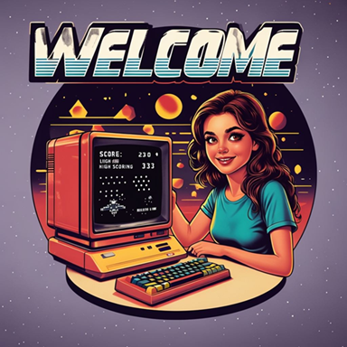

# Accueil

  

    

      
L'informatique, une discipline scientifique

    

    

      
    

  

  

    <h3>🎓 Première</h3>
    
Fondements: algorithmique, représentations, logique

    <a href="premiere/Algorithmique/1.algo/">Explorer →</a>
  

  
  

    <h3>🚀 Terminale</h3>
    
Structures de données, paradigmes, calculabilité

    <a href="terminale/algorithmes/trifusion/">Explorer →</a>
  

  
  

    <h3>💻 Projets</h3>
    
Applications concrètes des concepts

    <a href="projets/intro-pyxel-nopoo/">Explorer →</a>
  

  
  

    <h3>🔧 Outils</h3>
    
Environnement de développement professionnel

    <a href="les-outils/0.votreordi/">Explorer →</a>
  

  

    <h3>💭 Hal Abelson, 1986</h3>
    <blockquote>
      
Computer science is not really about computers -- and it's not about computers in the same sense that physics is not really about particle accelerators, and biology is not about microscopes and Petri dishes...and geometry isn't really about using surveying instruments. Now the reason that we think computer science is about computers is pretty much the same reason that the Egyptians thought geometry was about surveying instruments: when some field is just getting started and you don't really understand it very well, it's very easy to confuse the essence of what you're doing with the tools that you use.

    </blockquote>
  

  
  

    <h3>📚 À propos de ce site</h3>
    
Ce site évolue constamment. Certaines sections servent en classe. D'autres vont plus loin. Vous trouverez aussi des sujets hors programme que j'estime utiles. Les contenus sont régulièrement mis à jour. Certaines pages sont finalisées. D'autres sont en construction.

    

      
<strong>⚠️ Ce site n'est PAS un manuel clé en main</strong>

      
Ces ressources s'inscrivent dans une progression pédagogique spécifique et nécessitent une compréhension approfondie des concepts enseignés. Elles ne sont pas conçues pour être utilisées de manière isolée.

    

  

