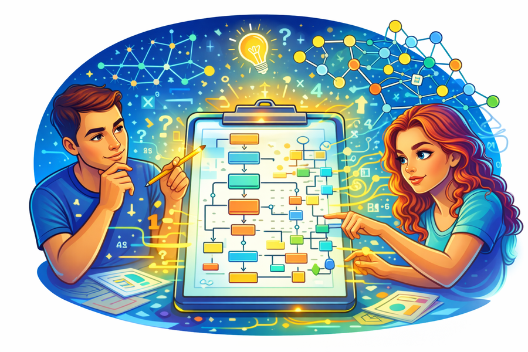
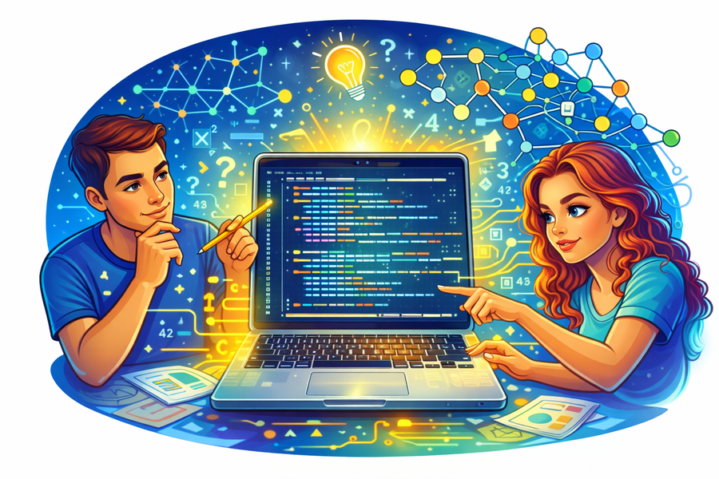

# Accueil

  
  

#### Hal Abelson, 1986

> Computer science is not really about computers — and it's not about computers in the same sense that physics is not really about particle accelerators, and biology is not about microscopes and Petri dishes... and geometry isn't really about using surveying instruments.
>
> Now the reason that we think computer science is about computers is pretty much the same reason that the Egyptians thought geometry was about surveying instruments: when some field is just getting started and you don't really understand it very well, it's very easy to confuse the essence of what you're doing with the tools that you use.

## L'informatique, une discipline scientifique

L'informatique **n'est pas** une simple pratique d'outils numériques.

C'est une science bâtie sur deux seules valeurs: **Vrai** et **Faux**, et pourtant capable de modéliser le monde entier.

C'est une science du **raisonnement**, de la **modélisation** et de la **formalisation de solutions exécutables**.

On y apprend par exemple à:

- **Expliquer à un processeur comment additionner deux nombres en n'utilisant que des 0 et des 1.** Un octet représente un entier d'une façon précise, et 256 + 1 ne donne pas 257 : ça déborde silencieusement.
- **Organiser un million de contacts pour que la recherche d'un nom prenne autant de temps que d'en chercher un parmi dix.** C'est ce que permet un arbre binaire de recherche.
- **Faire communiquer deux ordinateurs à l'autre bout du monde sans que personne au milieu ne puisse lire le message.** Le chiffrement asymétrique et le découpage TCP en paquets numérotés ne sont pas des boîtes noires.
- **Concevoir une base de données où supprimer un client ne supprime pas accidentellement toutes ses commandes.** L'intégrité référentielle n'est pas un détail.
- **Choisir entre deux programmes qui font théoriquement la même chose, dont l'un met une seconde et l'autre six heures et même parfois des milliards d'années.** La complexité algorithmique se mesure avant d'exécuter.
- **Comprendre ce qui se passe réellement quand on clique sur un bouton
  d'une page web.** Une requête quitte l'ordinateur, traverse des routeurs,
  arrive sur un serveur, déclenche une réponse — et tout cela en moins
  d'une seconde, grâce à des protocoles que les humains ont conçus et que
  les machines suivent à la lettre.

Ces raisonnements (invisibles à l'écran, mais décisifs en coulisses) font de l'informatique une science à part entière.

L'intelligence artificielle est aujourd'hui capable de produire du code rapidement et efficacement, comme une calculatrice produit des résultats numériques. Mais cette automatisation ne supprime pas le besoin de comprendre, de concevoir et de vérifier.

Sans culture dans un domaine, on ne sait pas quoi demander et on ne sait pas non plus si ce que répond l'IA est juste.

On peut très bien demander à une IA de faire ça :

!!! prompt "Prompt"
    Génère un fichier Terraform qui provisionne un VPC sur AWS avec deux subnets (un public et un privé), un internet gateway attaché au public, une NAT gateway dans le public pour le privé, et deux security groups distincts : l'un qui autorise le trafic entrant HTTP/HTTPS depuis 0.0.0.0/0, l'autre qui n'autorise que le trafic entrant depuis le premier security group sur le port 5432.

Le code n'est que la traduction d'un besoin formulé à la machine. Encore faut-il savoir le formuler.

!!! prompt "Prompt"
    Implémente une fonction qui trouve les k plus proches voisins dans une liste de n points 2D, sans calculer toutes les distances deux à deux. Utilise un k-d tree pour ramener la complexité de O(n²) à O(n log n) en construction et O(log n) par requête.

Sans cette seconde requête, l'IA produit du code correct, qui passe en production et qui s'effondre sous la charge.

L'IA est un exécutant rapide et relativement fiable pour qui sait challenger ses réponses. Mais elle attend des ordres, et donner le bon ordre suppose de maîtriser le métier.

Il est par ailleurs **fondamentalement démontré** qu'aucun système automatique (IA comprise) ne peut garantir de manière générale la correction, la sécurité ou l'optimalité de tous les programmes[^5]. Un système probabiliste peut proposer des solutions plausibles, mais ne fournit pas de garanties universelles.

On ne lance pas une fusée dans l'espace sur la base d'une estimation probabiliste.

En entreprise, cette part de risque devient rapidement inacceptable. **C'est pourquoi, malgré l'IA, apprendre à raisonner, à programmer et à analyser les algorithmes reste nécessaire.** L'IA transforme la manière de coder, elle ne remplace pas l'ingénierie informatique. Le code reste le **fondement opérationnel de la discipline** : l'outil par lequel les idées sont rendues précises, testables et vérifiables.

[^5]: Turing, A. M. (1936). On computable numbers, with an application to the Entscheidungsproblem. *Proceedings of the London Mathematical Society*, 2(42), 230–265. Ce travail démontre l'indécidabilité du problème de l'arrêt. Rice, H. G. (1953). Classes of recursively enumerable sets and their decision problems. *Transactions of the American Mathematical Society*, 74(2), 358–366. Le théorème de Rice en généralise le résultat : aucune propriété sémantique non triviale d'un programme n'est décidable.

#### À propos de ce site

Ce site rassemble des ressources pour l'enseignement de la spécialité NSI.

Certaines pages sont utilisées directement en classe.
D'autres approfondissent les notions, proposent des projets ou explorent des concepts hors programme.

Les contenus évoluent régulièrement : certaines sections sont finalisées, d'autres en construction.

**Ce site n'est pas un manuel clé en main**

Ces ressources s'inscrivent dans une progression pédagogique précise et supposent une maîtrise des concepts abordés.
Elles ne sont pas conçues pour être utilisées isolément.

---

## La fabrique à idiots — Micode

La question de ce que l'IA fait à notre façon d'apprendre et de penser ne concerne pas que l'école. Cette vidéo l'explore avec le recul et la précision qu'elle mérite.

<iframe src="https://www.youtube.com/embed/4xq6bVbS-Pw" title="La fabrique à idiots — Micode" frameborder="0" allow="accelerometer; autoplay; clipboard-write; encrypted-media; gyroscope; picture-in-picture" allowfullscreen></iframe>

---

## Organisation des contenus

- **Première** — algorithmique, représentations, logique
- **Terminale** — structures de données, graphes, complexité, calculabilité
- **Projets** — applications concrètes des concepts
- **Outils** — environnements et bonnes pratiques de développement
