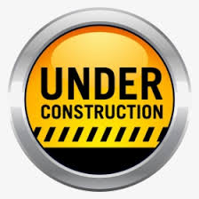

# Accueil

## L'informatique, une discipline scientifique (à l'ère de l'IA)

L'informatique **n'est pas** une simple pratique d'outils numériques.

C'est une science du **raisonnement**, de la **modélisation** et de la **formalisation de solutions exécutables**.

L'intelligence artificielle est aujourd'hui capable de produire du code rapidement et efficacement, comme une calculatrice produit des résultats numériques.

Mais cette automatisation ne supprime pas le besoin de comprendre, de concevoir et de vérifier.

Il est **fondamentalement démontré** qu'aucun système automatique — IA comprise — ne peut garantir de manière générale la correction, la sécurité ou l'optimalité de tous les programmes (limites théoriques de la calculabilité et de la vérification)[^5].

Un système probabiliste peut proposer des solutions plausibles, mais ne peut pas fournir de garanties universelles.

On ne lance pas une fusée dans l'espace parce qu'une IA estime qu'il est simplement probable qu'elle n'explose pas en vol.

**À l'échelle individuelle, cette part de risque peut parfois être acceptée ; à l'échelle d'une organisation professionnelle, où les enjeux sont élevés, elle devient rapidement inacceptable et source de défaillances.**

**C'est pourquoi il est toujours nécessaire, malgré l'IA, d'apprendre à raisonner, à programmer et à analyser les algorithmes.**
Ainsi, l'IA transforme la manière de coder, mais ne remplace pas l'ingénierie informatique.
Le code reste le **fondement opérationnel de la discipline** : l'outil par lequel les idées humaines sont rendues précises, testables et vérifiables humainement.

??? example "Le précédent de la calculatrice"

    L'histoire des mathématiques en offre un précédent éclairant : l'avènement de la calculatrice dans les années 1970-80[^3] a profondément transformé l'enseignement, en libérant les élèves du calcul mental fastidieux.
    Pourtant, des décennies plus tard, de nombreux systèmes éducatifs reviennent sur cet usage, constatant que l'automatisation précoce du calcul avait fragilisé la compréhension des structures arithmétiques et la capacité à estimer, à vérifier, à raisonner sur les nombres[^4] — le Royaume-Uni a interdit les calculatrices aux examens nationaux du primaire dès 2014[^1], et la réforme française des programmes 2025 impose un minimum quotidien de calcul mental dès le CP[^2].
    Ce retour en arrière n'est pas une nostalgie du passé : c'est la reconnaissance que certaines compétences cognitives ne se développent qu'en pratiquant soi-même, sans déléguer trop tôt à la machine.

    En classe de première, on le constate concrètement : beaucoup d'élèves ne se représentent plus ce que signifie une division — ni ce qu'est un quotient, ni ce qu'est un reste. L'opération a été exécutée si longtemps par la machine qu'elle a perdu tout sens. Il faut parfois revenir à l'histoire des bonbons à répartir dans des sacs pour que la notion redevienne tangible — non par manque d'intelligence, mais parce que personne n'avait eu à y réfléchir sans filet.

[^1]: Goulding, M. et al. (2014). [Banning calculators in primary schools a 'backward step', academics warn](https://www.education.ox.ac.uk/news/banning-calculators-in-primary-schools-a-backward-step-academics-warn/). University of Oxford, Department of Education.
[^2]: Ministère de l'Éducation nationale (2025). Nouveaux programmes de mathématiques du cycle 2 — calcul mental obligatoire, minimum 15 minutes par jour dès le CP.
[^3]: La première calculatrice de poche grand public (Texas Instruments TI-2500) date de 1972. Le NCTM (*National Council of Teachers of Mathematics*) recommande officiellement leur usage scolaire dès 1974, puis dans *An Agenda for Action* (1980).
[^4]: Hembree, R. & Dessart, D. J. (1986). Effects of hand-held calculators in precollege mathematics education: a meta-analysis. *Journal for Research in Mathematics Education*, 17(2), 83–99. — méta-analyse de 79 études montrant que l'usage précoce de la calculatrice nuit à la maîtrise du calcul mental et à la compréhension des opérations.
[^5]: Turing, A. M. (1936). On computable numbers, with an application to the Entscheidungsproblem. *Proceedings of the London Mathematical Society*, 2(42), 230–265. — démontre l'indécidabilité du problème de l'arrêt. Rice, H. G. (1953). Classes of recursively enumerable sets and their decision problems. *Transactions of the American Mathematical Society*, 74(2), 358–366. — le théorème de Rice généralise ce résultat : aucune propriété sémantique non triviale d'un programme n'est décidable.

#### Hal Abelson, 1986

> Computer science is not really about computers — and it's not about computers in the same sense that physics is not really about particle accelerators, and biology is not about microscopes and Petri dishes... and geometry isn't really about using surveying instruments.
>
> Now the reason that we think computer science is about computers is pretty much the same reason that the Egyptians thought geometry was about surveying instruments: when some field is just getting started and you don't really understand it very well, it's very easy to confuse the essence of what you're doing with the tools that you use.

#### À propos de ce site

Ce site rassemble des ressources pour l'enseignement de la spécialité NSI.

Certaines pages sont utilisées directement en classe.
D'autres approfondissent les notions, proposent des projets ou explorent des concepts hors programme.

Les contenus évoluent régulièrement : certaines sections sont finalisées, d'autres en construction.

**⚠️ Ce site n'est pas un manuel clé en main**

Ces ressources s'inscrivent dans une progression pédagogique précise et supposent une maîtrise des concepts abordés.
Elles ne sont pas conçues pour être utilisées isolément.

---

## La fabrique à idiots — Micode

La question de ce que l'IA fait à notre façon d'apprendre et de penser ne concerne pas que l'école. Cette vidéo l'explore avec le recul et la précision qu'elle mérite.

<iframe src="https://www.youtube.com/embed/4xq6bVbS-Pw" title="La fabrique à idiots — Micode" frameborder="0" allow="accelerometer; autoplay; clipboard-write; encrypted-media; gyroscope; picture-in-picture" allowfullscreen></iframe>

---

## Organisation des contenus

- **Première** — algorithmique, représentations, logique
- **Terminale** — structures de données, graphes, complexité, calculabilité
- **Projets** — applications concrètes des concepts
- **Outils** — environnements et bonnes pratiques de développement
