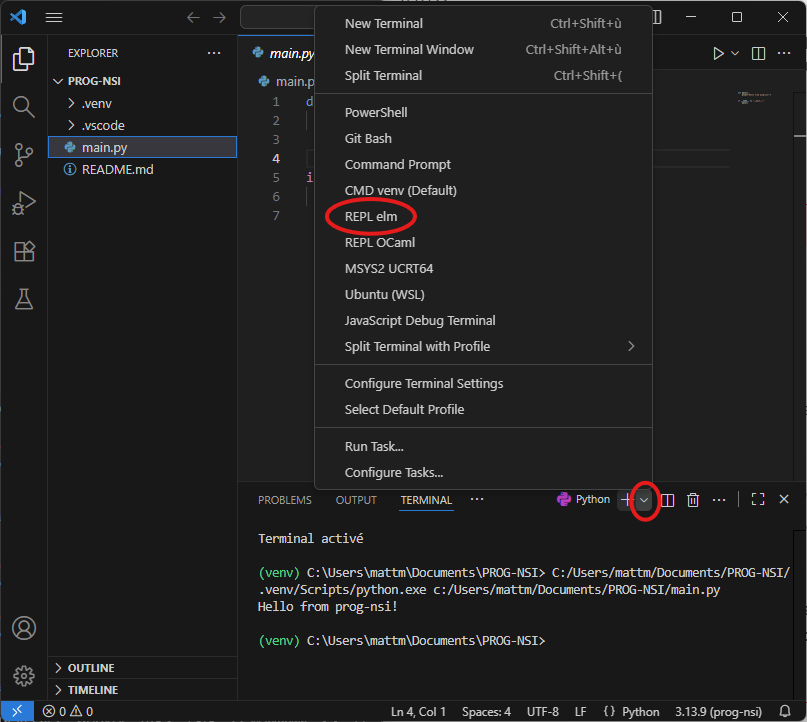

# Elm

Elm a été choisi pour vous introdure à la récursivité et aux structures de données récursives (Listes, Arbres)

Il est facile à installer, ne prend pas beaoucoup de place, est simple à prendre en main, et c'est un langage fonctionnel pur dont la syntaxe est extrêmement proche de celle des mastodontes de l'industrie comme `OCaml` ou `Haskell`.

!!! danger "Installer Elm"
    **pré-requis:**
    
    - MSYS2 est installé et à jour.
    - VSCode est fermé.

    **Etapes:**
    
    1. Sur votre clé USB, double cliquez sur `install-elm.bat`
    2. Attendez la fin de l'install
    3. Ouvrez VSCode
    4. Ouvrez un REPL Elm grâce au terminal comme sur l'image ci-dessous

    
    
