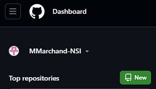
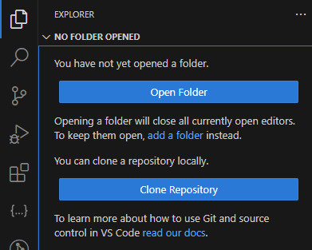

# Git et Github

!!! danger "Pré-requis" 
    - Avoir créé un compte Github
    - Avoir installé Git comme indiqué.

# Créer un repository

Le repository, c'est votre nouvelle clé USB.

Cliquez sur new.

Donnez un nom à votre repo

Dites que vous voulez ignorer les fichers techniques générés par python.
Ces fichiers sont de toute façon générés par votre code à votre insue quand il y en a besoin, vous n'avez pas besoin de les stocker.

Ignorez les autres champs et cliquez sur 

# Cloner un repository

Lorsque vous n'avez aucun folder d'ouvert, VSCode vous propose ceci:

La première fois que vous vous connectez à github depuis vscode, 
VSCode enclenche une communication avec votre navigateur internet pour s'y authentifier à github. 
Dites oui partout et autorisez tout à chaque fois.
Une fois ce processus terminé, vous pourrez choisir votre repository dans une liste déroulante.

