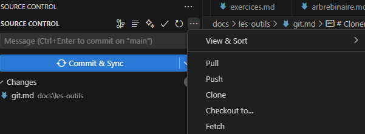

# Git et Github

Les fonctionnalités de Git et de Github sont pléthoriques.
Nous n'utiliserons que 2 fonctionnalités de base.

!!! danger "Pré-requis" 
    - Avoir créé un compte Github
    - Avoir installé Git comme indiqué.

# C'est quoi un repository?

Il faut considérer que c'est un répertoire distant.

# Créer un repository

Sur github

Cliquez sur new.

Donnez un nom à votre repo

Dites que vous voulez ignorer les fichers techniques générés par python.
Ces fichiers sont de toute façon générés par votre code à votre insue quand il y en a besoin, vous n'avez pas besoin de les stocker.

Ignorez les autres champs et cliquez sur 

# Cloner un repository

Lorsque vous n'avez aucun folder d'ouvert, VSCode vous propose ceci:

La première fois que vous vous connectez à github depuis vscode, 
VSCode enclenche une communication avec votre navigateur internet pour s'y authentifier à github. 
Dites oui partout et autorisez tout à chaque fois.
Une fois ce processus terminé, vous pourrez choisir votre repository dans une liste déroulante.

VSCode veut maintenant savoir où vous voulez le cloner.

Par exemple, j'ai toujours un répertoire github où je clone tous mes repos.

Sélectionnez un répertoire et validez.

Dites oui pour que VSCode ouvre ce répertoire cloné.

# Travailler avec Git

Travaillez normalement, mais **au début de chaque session de travail, faites un Pull**

**A la fin d'une session de travail, faite un Commit & Sync**.
Git oblige à faire un commentaire Lorsqu'on fait Commit & Sync.
Il faut remplir le champ message juste au dessus du bouton bleu avec quelques mots descriptifs du travail réalisé.

# Au quotidien

- Je travaille chez moi, je pull mes modifs du lycée, je bosse, je sync.

- J'arrive au lycée, je pull mes modifs de chez moi, je bosse, je sync.

Plus besoin de clé USB

