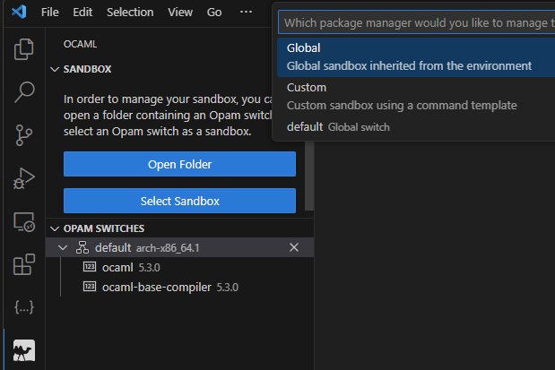

# OCaml


## OPAM

Tout comme nous avons installé miniforge pour gérer les environnements python, nous pouvons installer OPAM.

Opam gère des switchs (équivalents d'environnements) sur lesquels on travaille avec une version spécifique d'OCaml.

## Installation Linux/WSL

Si vous voulez rester sous windows, utilisez WSL. N'utilisez pas la version windows, c'est long, ça bug à la longue.

La commande suivante est pour Debian et dérivés (Ubuntu...):
```bash
sudo apt install opam
```

### Si vous êtes sous WSL ou sur une machine virtuelle:
```bash
opam init --compiler=5.2.0 --disable-sandboxing
```

### Si vous n'êtes PAS sous WSL ni sur une machine virtuelle:
```bash
opam init --compiler=5.2.0
```

Tout le reste est valable sous n'importe quel OS sur lequel vous avez installé opam.

En langage Opam, un "switch" c'est un peu comme un environnement conda. On a créé le switch 5.2.0 en initialisant opam.

On peut voir ça comme l'environnement portant la version 5.2.0 d'OCaml

On va installer les packages de base dessus:

```bash
opam install --switch=5.2.0 ocaml-lsp-server odoc ocamlformat utop ppx_jane
```


## VSCode

- Installer l'extension `OCaml Platform`. 

- Ouvrir un répertoire vide dans VSCode qui contiendra tous vos projets OCaml

- Sélectionner le switch que vous avez créé à l'aide du bouton "Select Sandbox"



- Dans l'extension OCaml, cliquer sur `Open sandboxed terminal`
    - Ceci vous ouvre un terminal avec votre switch activé

### Créer un projet

```bash
dune init proj structures
```

ceci créé un répertoire monprojet avec tous les fichiers nécessaires et un petit bout de code.

On se place TOUJOURS dans le projet pour y travailler

```bash
cd structures
```

### Build un projet
```bash 
dune build
```

### Exécuter un projet
```bash
dune exec structures
```

## Explications de base

```ocaml
let () = ...
```

Cette fonction est le point d'entrée de l'application.

C'est ce qui sera exécuté lorsque le programme démarrera.

## Programmes exemple

### main.ml

```ocaml

```

### liste.ml

```ocaml

```