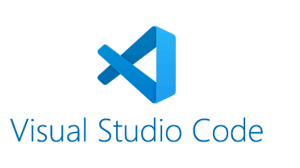
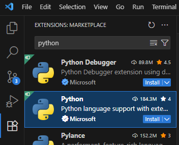
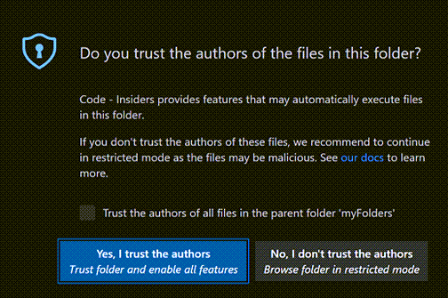
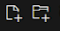
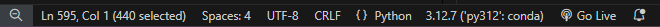
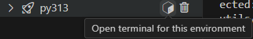

{ align=right }

# Setup VSCode

Un IDE (environnement de développement intégré) est un logiciel qui aide les programmeurs à développer.

VSCode est de loin l'IDE le plus utilisé (73,6% des développeurs et 77% des étudiants du monde entier en 2024 d'après la célèbre enquête annuelle de stackoverflow)

## Pré-requis

Vous avez installé les outils 

- VSCode
- UV

## Configurer VSCode pour développer en python.

Cliquez sur l'icône des extensions 

Recherchez `python` dans la petite barre de recherche.
Cliquez sur le petit bouton bleu "install" à côté de l'extension python



Ca-y-est, VSCode sait maintenant travailler avec Python.

A l'heure où j'écris ces lignes, on voit que l'extension a été téléchargée 184 millions de fois dans le monde. Vous pouvez remarquer la popularité à la fois de VSCode et de python dans le monde.

## Comment travailler avec VSCode?

!!! danger "Attention, sinon ça ne fonctionnera pas"
    __Dans VSCode, on ouvre TOUJOURS un répertoire, JAMAIS un fichier.__

    File > Open Folder
    
    Quand vous rouvrez VSCode, vous retrouvez tout comme vous l'avez laissé la dernière fois que vous l'avez ouvert.


Lorsque vous ouvrez un répertoire pour la première fois, VSCode vous demande s'il peut avoir confiance en ce répertoire. Cochez la case et cliquez sur le bouton bleu, "Yes i trust". Il ne vous le redemandera plus pour ce répertoire ni pour le répertoire parent.




### Gérer les fichiers du répertoire.

Vous pouvez directement créer des fichiers et des dossiers dans L'explorer de VSCode à l'aide de ces boutons 


### Gérer Python

UV va nous permettre de gérer nous même l'installation de Python.

**Ouvrez un terminal** Menu Terminal > new Terminal

Le terminal s'ouvre **dans votre répertoire**

#### Initialiser le répertoire ouvert

Ceci n'est à faire qu'une seule fois. Si vous l'avez fait au lycée ça n'est plus nécessaire.

Exécutez ces 3 commandes **dans votre répertoire**

```bash
uv python pin 3.13
uv init --bare
uv sync
```

Pour les terminales, simplement faire `uv init`

!!! danger "Troubleshooting"

    **En cas de problème**, supprimez le répertoire `.venv`

    exécutez la commande:

    ```bash
    uv sync
    ```

    Toutes les informations nécessaires à la création et au maintient de votre environnement sont dans les fichiers uv.lock, .python-version, pyproject.toml

    uv va lire ces fichiers, et télécharger tout ce dont il a besoin.

### Programmer en Python

VSCode doit savoir quel environnement python utiliser pour exécuter vos programme, étant donné qu'il peut en exister plusieurs.

Lorsque vous avez un fichier python ouvert, il faut cliquer sur la barre d'état en bas à droite. Une liste déroulante va alors s'afficher où vous pourrez sélectionner votre environnement.
Si c'est la première fois que vous ouvrez VS code, vous verrez peut-être un bouton "Select interpreter" à la place.




### Ajouter des modules python

Lorsque vous voulez installer un module python, il faut ouvrir un terminal configuré pour votre environnement.
Ca se fait directement en appuyant sur le petit cube de l'image ci-dessous. (La poubelle vous permet de supprimer l'environnement)



Imaginons que vous vouliez installer le module pyxel, vous pouvez alors y exécuter cette commande:

`pip install pyxel`

Ca y est, vous pouvez maintenant écrire `import pyxel` dans vos programmes.


!!! tip "Au quotidien"
    Une fois que tout ça est fait, au quotidien, il faut juste s'assurer qu'on est sur le bon environnement en bas à droite de VSCode, écrire ses programmes et les exécuter avec le bouton play en haut à droite de l'écran.
