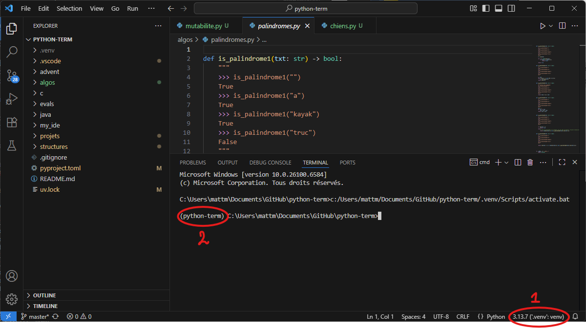

{ align=right }

# Setup VSCode

Un IDE (environnement de développement intégré) est un logiciel qui aide les programmeurs à développer.

VSCode est de loin l'IDE le plus utilisé (73,6% des développeurs et 77% des étudiants du monde entier en 2024 d'après la célèbre enquête annuelle de stackoverflow)

## Pré-requis

Vous avez installé les outils 

- VSCode
- UV

!!! hint Configurer VSCode pour développer en python.

    Cliquez sur l'icône des extensions 

    Recherchez `python` dans la petite barre de recherche.
    Cliquez sur le petit bouton bleu "install" à côté de l'extension python

    

    Ca-y-est, VSCode sait maintenant travailler avec Python.

    A l'heure où j'écris ces lignes, on voit que l'extension a été téléchargée 184 millions de fois dans le monde. Vous pouvez remarquer la popularité à la fois de VSCode et de python dans le monde.


!!! danger "Attention, sinon ça ne fonctionnera pas"
    __Dans VSCode, on ouvre TOUJOURS un répertoire, JAMAIS un fichier.__

    File > Open Folder
    
    Quand vous rouvrez VSCode, vous retrouvez tout comme vous l'avez laissé la dernière fois que vous l'avez ouvert.


    Lorsque vous ouvrez un répertoire pour la première fois, VSCode vous demande s'il peut avoir confiance en ce répertoire. Cochez la case et cliquez sur le bouton bleu, "Yes i trust". Il ne vous le redemandera plus pour ce répertoire ni pour le répertoire parent.

    


!!! danger "Configuration initiale de UV"
    **Ceci n'est à réaliser qu'une seule fois, il ne faut plus le faire chez vous.**

    1. Ouvrez dans VSCode votre répertoire de programmation.
    2. **Ouvrez un terminal** Menu Terminal > new Terminal

    Exécutez ces 3 commandes dans le terminal:

    ```bash
    uv python pin 3.13
    uv init --bare
    uv sync
    ```
    

!!! hint Vérifier que tout est ok
    **Lorsque vous avez un fichier python ouvert**, l'image suivante montre une bonne configuration:

    1. Vous devez avoir votre venv sélectionné, en bas à droite de VSCode, comme indiqué sur l'image ci-dessous. Si votre venv n'est pas sélectionné, cliquez sur la barre d'état (1 sur l'image) et sélectionnez votre venv dans la liste déroulante.

    2. Quand vous ouvrez un terminal, le nom du répertoire doit apparaître comme sur l'image ci-dessous. (2)


    


!!! danger "Troubleshooting"

    **En cas de problème**, supprimez le répertoire `.venv`

    exécutez les 2 commandes l'une après l'autre:

    ```bash
    uv python install 3.13
    uv sync
    ```

    - La première s'assure que python 3.13 est installé et l'installe si nécessaire.
    - La deuxième remet votre venv bien comme il faut.


### Ajouter des modules python

Lorsque vous voulez installer un module python, il faut ouvrir un terminal dans VSCode, en prenant garde à ce que le venv soit bien sélectionné en bas à droite.


Imaginons que vous vouliez installer le module pyxel, vous pouvez alors y exécuter cette commande:

`uv add pyxel`

Ca y est, vous pouvez maintenant écrire `import pyxel` dans vos programmes.


!!! tip "Au quotidien"
    Une fois que tout ça est fait, au quotidien, il faut juste s'assurer qu'on est sur le bon environnement en bas à droite de VSCode, écrire ses programmes et les exécuter avec le bouton play en haut à droite de l'écran.
