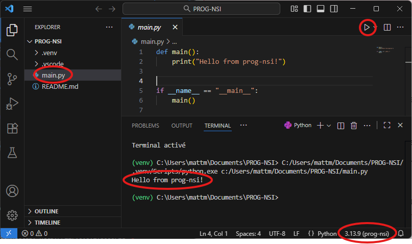

# Environnement de travail

{ align=right }

## Intro

VSCode est de loin l'IDE le plus utilisé (73,6% des développeurs et 77% des étudiants du monde entier en 2024 d'après la célèbre enquête annuelle de stackoverflow)

## Installer vos utilitaires sur clé USB

!!! danger "Actions simples à réaliser DANS L'ORDRE"

    1. Branchez votre clé USB
    2. Télécharger le fichier [`NSI-SCRIPTS.exe`](NSI-SCRIPTS.exe) .
    3. Le mettre **à la racine** de votre clé USB
    4. Double-cliquer dessus.
    5. Dans la petite fenêtre qui s'affiche, appuyer sur extraire

    **Je vérifie que tout est OK:**

    - Un répertoire `NSI-SCRIPTS` apparaît à la racine votre clé USB
    - 2 fichiers `NSI-sauver.bat` et `NSI-importer.bat` sont aussi présents à la racine

    Ces fichiers automatisent l'installation des composants nécessaires.

    **N'exécutez aucun de ces scripts sans y avoir été invités. Certains représentent des installations de composants lourds. Si vous êtes curieux, c'est bien, mais posez-moi la question**

    Vous pouvez supprimer `NSI-SCRIPTS.exe`

---

## Installer La base

!!! danger "VSCode et Python"
    
    - **Dans le répertoire NSI-SCRIPTS, double-cliquez sur `1.INSTALL-VSCODE-UV.bat`**

    Une fenêtre s'ouvre et installe les composants requis.
    A l'issue de l'installation, VSCode s'ouvre dans votre répertoire de développement, et python est prêt à fonctionner.

    Lorsque vous ouvrez un répertoire pour la première fois, VSCode vous demande s'il peut avoir confiance en ce répertoire. Cochez la case et cliquez sur le bouton bleu, "Yes i trust".

    

    **Je vérifie que tout est OK:**

    1. Dans VSCode, j'ouvre le fichier main.py
    2. J'appuie sur la flèche en haut à droite pour exécuter le fichier
    3. Un terminal s'ouvre, et on voit le résultat du print.
    4. En bas à droite, on voit la version de python utilisée (3.13)

    

---

## Installer MSYS2

!!! danger "Installation et mise à jour de MSYS2"
    1. Dans le répertoire `NSI-SCRIPTS`, double-cliquer sur `2.INSTALL-MSYS2.bat`
    2. Lorsque c'est terminé, Double-cliquez sur `3.MAJ-MSYS2.bat`
    3. Répétez la dernière opération jusqu'à ce que le script dise qu'il n'y a plus rien à faire.

    **Explication:** `MAJ-MSYS2.bat` sert à mettre MSYS2 à jour. Ca se fait parfois en plusieurs temps. Il faut donc le faire jusqu'à ce que MSYS2 dise qu'il n'y a plus rien à faire. 

    Parfois ça plante à cause du réseau, ça n'est pas grave, il faut juste relancer.

---

## Utilisation au quotidien et règles d'or

Tout repose sur la synchronisation d'un répertoire `PROG-NSI` dans votre répertoire Documents et sur votre clé USB, que ce soit au lycée ou chez vous.

**Il ne faut pas changer ni le nom ni la localisation de ces répertoires.**

VSCode s'ouvrira automatiquement dans votre répertoire.

- Lorsque vous voulez sauver votre travail sur votre clé (maison ou lycée):
    - Double-cliquez sur `NSI-sauver.bat`
- Lorsque vous voulez importer le contenu de votre clé sur votre ordi (maison ou lycée)
    - Double cliquez sur `NSI-importer.bat`

---

## **TROUBLESHOOTING**

En cas de problème, ou pour repartir propre:

!!! danger "Méthode efficace"

    Ici, on considère que votre PC dispose de vos dernières modifs.

    1. Dans votre répertoire Documents, renommez votre répertoire PROG-NSI en PROG-NSI-OLD
    2. Recommencez les étapes d'installation `1.INSTALL-VSCODE.bat` et `3.MAJ-MSYS2.bat`
    4. Copiez vos fichiers de code seulement de `PROG-NSI-OLD` à `PROG-NSI`
    5. Double cliquez sur `NSI-sauver.bat` afin d'initialiser votre clé USB

    il faudra refaire les `uv add`.
    Par exemple `uv add pyxel`

