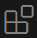

{ align=right }

# Setup de VSCode

Un IDE (environnement de développement intégré) est un logiciel qui aide les programmeurs à développer.

VSCode est de loin l'IDE le plus utilisé (73,6% des développeurs et 77% des étudiants du monde entier en 2024 d'après la célèbre enquête annuelle de stackoverflow)

## Pré-requis

Vous avez installé les outils recommandés avec winget

## Configurer VSCode pour développer en python.

Cliquez sur l'icône des extensions 

Recherchez `nsi-dev` dans la petite barre de recherche.
Cliquez sur le petit bouton bleu "install"

Ca-y-est, c'est configuré.

## Comment travailler avec VSCode?

!!! danger "Attention, sinon ça ne fonctionnera pas"
    __Dans VSCode, on ouvre TOUJOURS un répertoire, JAMAIS un fichier.__

    File > Open Folder
    
    Quand vous rouvrez VSCode, vous retrouvez tout comme vous l'avez laissé la dernière fois que vous l'avez ouvert.

Lorsque vous ouvrez un répertoire pour la première fois, VSCode vous demande s'il peut avoir confiance en ce répertoire. Cochez la case et cliquez sur le bouton bleu, "Yes i trust". Il ne vous le redemandera plus pour ce répertoire ni pour le répertoire parent.

### Gérer les fichiers du répertoire.

Vous pouvez directement créer des fichiers et des dossiers dans L'explorer de VSCode à l'aide de ces boutons 

### Gérer vos environnements Python

L'extension NSI-DEV vous fournit une manière simplifiée de gérer vos environnements python. Il ne faut pas que vous ayez installé python sur votre machine, c'est miniforge qui va se charger de faire coexister une ou pusieurs installations de python.

Sur l'image ci-dessus, on voit 2 environnements python utilisables que j'ai appelé py312 (pour la version 12 de python) et py313 (pour la version 13 de python).

Lorsque vous l'utiliserez pour la première fois, il n'y en aura pas, il faudra en créer un en appuyant sur le bouton +

On vous demandera alors de valider une version de python pour votre environnement, puis un nom.

A l'heure où j'écris ces lignes, je vous conseille de demander la version 3.13 et d'appeler cet environnement py313.

Après quelques instants (ça peut être un peu long), vous verrez apparaître votre environnement.

### Programmer en Python

VSCode doit savoir quel environnement python utiliser pour exécuter vos programme, étant donné qu'il peut en exister plusieurs.

Lorsque vous avez un fichier python ouvert, il faut cliquer sur la barre d'état en bas à droite, à l'emplacement où vous voyez sur l'image 3.12.7('py312': conda). Une liste déroulante va alors s'afficher où vous pourrez sélectionner votre environnement.
Si c'est la première fois que vous ouvrez VS code, vous verrez peut-être un bouton "Select interpreter" à la place.

!!! warning "Jamais dans base"
    Il existe un environnement par défaut qui s'appelle base. L'extension le masque volontairement. N'utilisez jamais cet environnement.

### Ajouter des modules python

Lorsque vous voulez installer un module python, il faut ouvrir un terminal configuré pour votre environnement.
Ca se fait directement en appuyant sur le petit cube de l'image ci-dessous. (La poubelle vous permet de supprimer l'environnement)

Un terminal MSYS2 apparaît.

Imaginons que vous vouliez installer le module pyxel, vous pouvez alors y exécuter cette commande:

`pip install pyxel`

Ca y est, vous pouvez maintenant écrire `import pyxel` dans vos programmes.

!!! tip "Au quotidien"
    Une fois que tout ça est fait, au quotidien, il faut juste s'assurer qu'on est sur le bon environnement en bas à droite de VSCode, écrire ses programmes et les exécuter avec le bouton play en haut à droite de l'écran.
