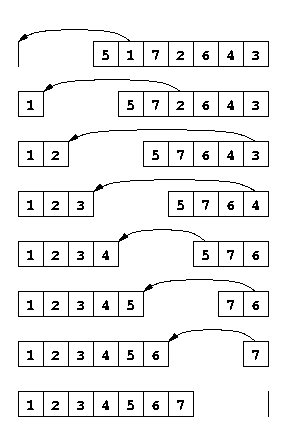

# Tri par sélection

## L'idée avec des cartes

!!! abstract "Algorithme imagé"
    Je veux trier des cartes.

    - Dans ma **main droite**, j'ai toutes les cartes dans le désordre.
    - Je cherche la plus petite carte de ma main droite et je la **déplace** dans ma main gauche.
    - Je recommence jusqu'à ce que ma main droite soit vide.
    - À la fin, ma main gauche contient toutes les cartes, triées.

    

À chaque tour, la main gauche grandit d'une carte, et cette carte est toujours plus grande que toutes celles déjà dans la main gauche.

!!! question "Exercice 1 - Comprendre l'idée"
    Vous avez les cartes `[8, 3, 6, 1, 5]` dans la main droite et la main gauche vide.

    1. Quelle carte prenez-vous en premier ?
    2. Quelle carte prenez-vous en deuxième ?
    3. Dans quel ordre les cartes arrivent-elles dans la main gauche ?

??? success "Correction"
    1. La plus petite carte de la main droite : **1**.
    2. La plus petite des cartes restantes `[8, 3, 6, 5]` : **3**.
    3. Les cartes arrivent dans l'ordre : **1, 3, 5, 6, 8**. La main gauche est triée.

---

## L'algorithme

En pratique, on ne travaille pas avec deux mains mais avec un seul tableau. À chaque étape `i`, le tableau est découpé en deux zones séparées par la frontière à l'indice `i` :

```
T = [ éléments triés | éléments non triés ]
      T[0..i)            T[i..n)
```

- **`T[0..i)`** : zone triée — tous ces éléments sont à leur place définitive et sont inférieurs ou égaux à tous les éléments de la zone droite.
- **`T[i..n)`** : zone non triée — ces éléments n'ont pas encore été placés.

À chaque étape, on cherche le minimum de `T[i..n)` et on l'échange avec `T[i]`, ce qui fait avancer la frontière d'une case vers la droite.

```markdown
Entrée : un tableau T de taille n
Sortie : T trié

1. Pour i allant de 0 à n-2 :
2.     imin ← indice du minimum de T[i..n-1]
3.     Échanger T[i] et T[imin]
```

---

## Exemple tracé pas à pas

Tableau de départ : `[5, 3, 8, 1, 4]`

| Étape | Tableau | Action |
|-------|---------|--------|
| Départ | `[5, 3, 8, 1, 4]` | |
| i = 0 | `[**1**, 3, 8, 5, 4]` | min = 1 (indice 3), échange avec T[0] |
| i = 1 | `[1, **3**, 8, 5, 4]` | min = 3 (indice 1), déjà en place |
| i = 2 | `[1, 3, **4**, 5, 8]` | min = 4 (indice 4), échange avec T[2] |
| i = 3 | `[1, 3, 4, **5**, 8]` | min = 5 (indice 3), déjà en place |
| Fin | `[1, 3, 4, 5, 8]` | Trié ! |

On peut se convaincre que ça marche : à chaque étape, le plus petit élément restant va se placer au bon endroit, et on ne revient jamais en arrière sur la zone triée.

!!! question "Exercice 2 - Identifier l'état intermédiaire"
    Après 2 étapes du tri par sélection sur `[5, 3, 8, 1, 4]`, quel est l'état du tableau ?
    Quelle est la zone triée ? Quelle est la zone non triée ?

??? success "Correction"
    Après i=0 : `[1, 3, 8, 5, 4]` — échange de 1 (indice 3) avec T[0].

    Après i=1 : `[1, 3, 8, 5, 4]` — 3 est déjà à sa place, pas d'échange.

    Zone triée : `[1, 3]` (indices 0 et 1).
    Zone non triée : `[8, 5, 4]` (indices 2 à 4).

---

## Complexité

Pour un tableau de taille $n$ :

- À l'étape $i=0$, on cherche le minimum parmi $n$ éléments → $n$ comparaisons.
- À l'étape $i=1$, on cherche le minimum parmi $n-1$ éléments → $n-1$ comparaisons.
- ...
- À la dernière étape, 1 comparaison.

Total : $n + (n-1) + \ldots + 1 = \dfrac{n(n+1)}{2}$ comparaisons, ce qui est de l'ordre de $n^2$.

La complexité du tri par sélection est **quadratique** : $\mathcal{O}(n^2)$.

Conséquence : si le tableau est 10 fois plus grand, l'algorithme prend environ 100 fois plus de temps.

!!! question "Exercice 3 - Tracer le tri par sélection"
    Tracer pas à pas le tri par sélection pour le tableau `[6, 2, 9, 4, 7, 1]`.
    Indiquer à chaque étape quel échange est effectué.

??? success "Correction"
    | Étape | Tableau | Action |
    |-------|---------|--------|
    | Départ | `[6, 2, 9, 4, 7, 1]` | |
    | i = 0 | `[1, 2, 9, 4, 7, 6]` | min = 1 (indice 5), échange avec T[0] |
    | i = 1 | `[1, 2, 9, 4, 7, 6]` | min = 2 (indice 1), déjà en place |
    | i = 2 | `[1, 2, 4, 9, 7, 6]` | min = 4 (indice 3), échange avec T[2] |
    | i = 3 | `[1, 2, 4, 6, 7, 9]` | min = 6 (indice 5), échange avec T[3] |
    | i = 4 | `[1, 2, 4, 6, 7, 9]` | min = 7 (indice 4), déjà en place |
    | Fin | `[1, 2, 4, 6, 7, 9]` | Trié ! |

!!! question "Exercice 4 - Complexité concrète"
    Pour un tableau de taille $n = 5$, combien d'étapes (comparaisons) le tri par sélection effectue-t-il au total ?
    Vérifier avec la formule $\dfrac{n(n+1)}{2}$.

??? success "Correction"
    - i=0 : 5 comparaisons
    - i=1 : 4 comparaisons
    - i=2 : 3 comparaisons
    - i=3 : 2 comparaisons
    - Total : 5+4+3+2 = **14 comparaisons**

    Formule : $\dfrac{5 \times 6}{2} = 15$. (Le léger écart vient du fait qu'à la dernière étape i=n-2=3, il reste 2 éléments à comparer, pas 1.)
