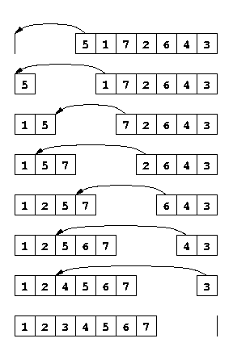

# Tri par insertion

!!! abstract "Algorithme imagé"
    
    Je veux trier des cartes

    - Dans ma main gauche, j'ai **une carte**. 
    - Dans ma main droite, j'ai **le reste des cartes**.
    - Je **déplace** successivement dans ma main gauche chaque carte de la main droite en l'**insérant à la bonne position** pour que la main gauche soit triée.
    - À l'arrivée, ma main gauche est triée et ma main droite est vide

    

Autrement dit:

```markdown
1. Pour i allant de 1 à n-1 faire :
2.      INSERER_BONNE_PLACE(T, i)
3. Retourner T
```

L'algorithme `INSERER_BONNE_PLACE(T, i)` place correctement l'élément $T[i]$ dans le sous-tableau trié $T[0:i)$ afin que $T[0:i+1)$ soit trié et que le tableau résultat soit une permutation du tableau initial.

**Prouvons la correction du tri par insertion en supposant existant et totalement correct l'algorithme `INSERER_BONNE_PLACE`.**

!!! hint "Notations"

    Rappel : nous utilisons la notation des intervalles semi-ouverts :
    
    - $T[i:j)$ représente le sous-tableau de $T$ de l'indice $i$ inclus à l'indice $j$ exclu
    - Si $i \geq j$, alors il s'agit du tableau vide
    - $T[0:n)$ représente le tableau entier
    - La taille de $T[i:j)$ est $j - i$
    - Cette notation est cohérente avec Python : `T[i:j]` en Python correspond à $T[i:j)$

**FORMULATION DE L'INVARIANT**

L'**invariant** avant l'itération $i$ est: 

- $T[0:i)$ est trié
- $T[0:n)$ est une permutation du tableau initial

**INITIALISATION**

Si le tableau est vide ou ne contient qu'un élément, la boucle ne s'exécute pas et le tableau est inchangé. Donc l'algorithme termine correctement.

Sinon, avant de rentrer la première fois dans la boucle pour $i=1$ :

- $T[0:1)$ contient uniquement $T[0]$, qui est trivialement trié
- $T[0:n)$ est une permutation de lui-même

Donc l'invariant est vrai au début.

**CONSERVATION**

Supposons l'invariant vrai au début de l'itération $i$ :

**Hypothèse (avant itération i) :**

1. $T[0:i)$ est trié
2. $T[0:n)$ est une permutation du tableau initial

Nous voulons montrer qu'à l'issue de la boucle transformant $T$ en $T'$ :

- $T'[0:i+1)$ est trié
- $T'[0:n)$ est une permutation du tableau initial

Or `INSERER_BONNE_PLACE(T, i)` nous assure exactement cela : il insère $T[i]$ à la bonne position dans le sous-tableau trié $T[0:i)$ pour que $T'[0:i+1)$ soit trié, tout en préservant la permutation (on déplace uniquement des éléments sans en créer ni en supprimer).

L'invariant est donc conservé.

**TERMINAISON**

**Variant de boucle :** À chaque itération, $i$ augmente de 1, et on a $i \in [1, n)$. La boucle itère exactement $n-1$ fois et termine nécessairement.

À l'issue du programme, après la dernière itération pour $i=n-1$, la conservation de l'invariant nous assure que :

- $T[0:n)$ est trié
- $T[0:n)$ est une permutation du tableau initial

Donc le tableau complet est une permutation triée du tableau initial.

**L'algorithme est totalement correct.** $\square$

---

Il nous faut maintenant créer l'algorithme `INSERER_BONNE_PLACE`.

!!! question "Insérer à la bonne place"
    Créer l'algorithme qui permette d'insérer un élément d'un tableau à la bonne place, en considérant que le sous-tableau précédent soit trié.

    Par exemple pour un tableau trié jusqu'à l'indice 2 inclus (soit $T[0:3)$ trié), voici ce que doit donner la séquence suivante:

    1. $T=[1, 2, 3, 1.5, 0]$ — $T[0:3)$ est trié
    2. on exécute `INSERER_BONNE_PLACE(T, 3)`
    3. on doit avoir $T=[1, 1.5, 2, 3, 0]$ — $T[0:4)$ est maintenant trié
    4. on exécute `INSERER_BONNE_PLACE(T, 4)`
    5. on doit avoir $T=[0, 1, 1.5, 2, 3]$ — $T[0:5)$ est maintenant trié

    **Indice:** On utilisera un indice $j$, initialement valorisé à $j \leftarrow i$ et on descendra progressivement jusqu'à trouver la bonne place en décalant les éléments vers la droite.

??? warning "Solution"

    ```markdown
    # Algorithme INSERER_BONNE_PLACE(T, i)
    1. a_deplacer ← T[i]
    2. j ← i
    3. TANT QUE j > 0 et T[j-1] > a_deplacer
    4.    T[j] ← T[j-1]
    5.    j ← j - 1
    6. T[j] ← a_deplacer 
    ```
    
    **Invariant de la boucle TANT QUE :**
    
    Au début de chaque itération où $j \in [0, i]$ :
    
    1. $T[0:j)$ est trié et contient les éléments originaux de $T[0:j)$
    2. $T[j:i+1)$ est trié et contient les éléments originaux de $T[j-1:i)$
    3. Tous les éléments de $T[j:i+1)$ sont $> a\_deplacer$
    4. $T[0:i+1)$ est une permutation du tableau initial
    
    **Correction :** Lorsque la boucle termine, soit $j=0$ soit $T[j-1] \leq a\_deplacer$. Dans les deux cas, insérer $a\_deplacer$ à la position $j$ maintient $T[0:i+1)$ trié.

## Preuve formelle de INSERER_BONNE_PLACE

**Précondition :** $T[0:i)$ est trié

**Postcondition :** $T[0:i+1)$ est trié et est une permutation de l'entrée initiale

**Invariant de boucle :** Au début de chaque itération où $j \in [0, i]$ :

1. $T[j+1:i+1)$ contient les éléments de $T[j:i)$ de l'entrée, décalés d'une position à droite
2. Tous les éléments de $T[j+1:i+1)$ sont strictement supérieurs à $a\_deplacer$
3. $T[0:j)$ est trié et inchangé par rapport à l'entrée
4. Le tableau reste une permutation de l'entrée

**Initialisation ($j = i$) :**

- $T[j+1:i+1) = T[i+1:i+1) = \emptyset$ : trivialement vrai
- $T[0:i)$ est trié par précondition
- Aucune modification n'a été faite

**Conservation :** Si $j > 0$ et $T[j-1] > a\_deplacer$ :

- On copie $T[j-1]$ vers $T[j]$ : les éléments de $T[j:i+1)$ sont décalés
- On décrémente $j$
- Les propriétés restent vraies pour le nouveau $j$

**Terminaison :** La boucle termine car $j$ décroît strictement et $j \geq 0$

Lorsque la boucle se termine :

- Soit $j = 0$ : on insère $a\_deplacer$ en première position
- Soit $T[j-1] \leq a\_deplacer$ : on insère $a\_deplacer$ à la position $j$

Dans les deux cas, $T[0:i+1)$ est trié et reste une permutation. $\square$


## Algorithme final animé

<iframe width="315" height="560"
src="https://www.youtube.com/embed/0GQoqfyIgdA"
title="YouTube video player"
frameborder="0"
allow="accelerometer; autoplay; clipboard-write; encrypted-media; gyroscope; picture-in-picture; web-share"
allowfullscreen></iframe>