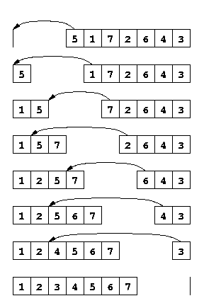

# Tri par insertion

## L'idée avec des cartes

!!! abstract "Algorithme imagé"
    Je veux trier des cartes.

    - Dans ma **main gauche**, j'ai une seule carte pour commencer.
    - Dans ma **main droite**, j'ai le reste des cartes dans le désordre.
    - Je prends la première carte de ma main droite et je **l'insère à la bonne place** dans ma main gauche pour qu'elle reste triée.
    - Je recommence jusqu'à ce que ma main droite soit vide.
    - À la fin, ma main gauche contient toutes les cartes, triées.

    

C'est exactement ce qu'on fait naturellement quand on trie des cartes à jouer dans sa main.

!!! question "Exercice 1 - Comprendre l'insertion"
    Votre main gauche contient `[2, 5, 9]` (triée). Vous prenez la carte **4** dans la main droite.

    1. Où insérez-vous le 4 ?
    2. Combien de cartes avez-vous décalé ?
    3. Quelle est votre main gauche après insertion ?

??? success "Correction"
    1. Entre le 2 et le 5, car 2 < 4 < 5.
    2. On décale 5 et 9 d'une place vers la droite : **2 cartes** décalées.
    3. Main gauche : `[2, 4, 5, 9]`.

---

## L'algorithme

```markdown
Entrée : un tableau T de taille n
Sortie : T trié

1. Pour i allant de 1 à n-1 :
2.     Insérer T[i] à sa bonne place dans T[0..i]
```

L'insertion consiste à décaler les éléments plus grands d'une case vers la droite, jusqu'à trouver la bonne position.

```markdown
INSERER(T, i) :
1. cle ← T[i]
2. j ← i - 1
3. Tant que j >= 0 et T[j] > cle :
4.     T[j+1] ← T[j]
5.     j ← j - 1
6. T[j+1] ← cle
```

---

## Exemple tracé pas à pas

Tableau de départ : `[5, 3, 8, 1, 4]`

| Étape | Tableau | Action |
|-------|---------|--------|
| Départ | `[5 | 3, 8, 1, 4]` | Main gauche : [5], main droite : [3,8,1,4] |
| i = 1 | `[3, 5 | 8, 1, 4]` | On insère 3 : il est plus petit que 5, on le place avant |
| i = 2 | `[3, 5, 8 | 1, 4]` | On insère 8 : il est plus grand que 5, il reste en place |
| i = 3 | `[1, 3, 5, 8 | 4]` | On insère 1 : il est plus petit que tout, il va au début |
| i = 4 | `[1, 3, 4, 5, 8]` | On insère 4 : il se place entre 3 et 5 |

On peut se convaincre que ça marche : à chaque étape, la partie gauche est triée et contient tous les éléments déjà vus. On insère le nouvel élément au bon endroit sans perturber l'ordre existant.

!!! question "Exercice 2 - Tracer le tri par insertion"
    Tracer pas à pas le tri par insertion pour le tableau `[4, 2, 7, 1, 5]`.
    À chaque étape, indiquer l'élément inséré et sa position finale.

??? success "Correction"
    | Étape | Tableau | Action |
    |-------|---------|--------|
    | Départ | `[4 \| 2, 7, 1, 5]` | Main gauche : [4] |
    | i = 1 | `[2, 4 \| 7, 1, 5]` | Insère 2 avant 4 |
    | i = 2 | `[2, 4, 7 \| 1, 5]` | Insère 7 après 4 (déjà en place) |
    | i = 3 | `[1, 2, 4, 7 \| 5]` | Insère 1 au tout début |
    | i = 4 | `[1, 2, 4, 5, 7]` | Insère 5 entre 4 et 7 |

---

## Comparaison avec le tri par sélection

| | Tri par sélection | Tri par insertion |
|--|--|--|
| Idée | Cherche le min et le place | Insère chaque élément au bon endroit |
| Complexité | $\mathcal{O}(n^2)$ | $\mathcal{O}(n^2)$ |
| Cas favorable | Aucun avantage | Très rapide si le tableau est déjà presque trié |

Les deux algorithmes ont la même complexité quadratique dans le pire des cas. Mais le tri par insertion est bien plus rapide en pratique sur des tableaux presque triés, car les insertions sont alors très courtes.

!!! question "Exercice 3 - Cas favorable"
    On dit que le tri par insertion est rapide sur les tableaux "presque triés".

    Combien d'insertions nécessitent un décalage pour le tableau `[1, 2, 4, 3, 5]` ?
    Comparer avec le tableau `[5, 4, 3, 2, 1]`.

??? success "Correction"
    **`[1, 2, 4, 3, 5]`** (presque trié) :

    - i=1 : insère 2 après 1 → pas de décalage
    - i=2 : insère 4 après 2 → pas de décalage
    - i=3 : insère 3 entre 2 et 4 → **1 décalage** (on décale le 4)
    - i=4 : insère 5 après 4 → pas de décalage

    Total : **1 décalage** seulement.

    **`[5, 4, 3, 2, 1]`** (trié à l'envers, pire des cas) :

    - i=1 : insère 4 → 1 décalage
    - i=2 : insère 3 → 2 décalages
    - i=3 : insère 2 → 3 décalages
    - i=4 : insère 1 → 4 décalages

    Total : **10 décalages**. C'est bien plus coûteux !
