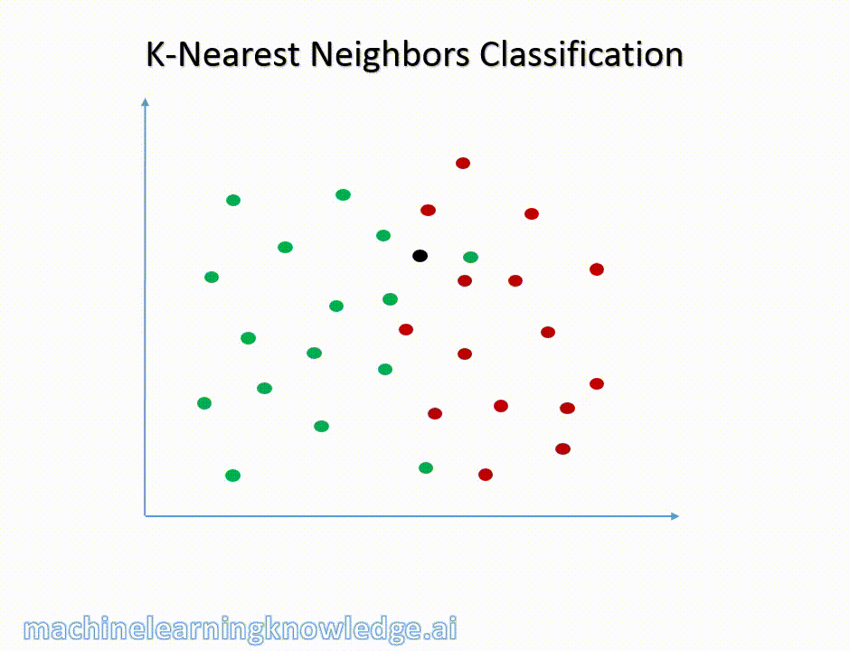

# Algorithme des k plus proches voisins (KNN)

Il s'agit ici de découvrir un algorithme de classification du domaine de l'apprentissage supervisé.

Du point de vue de la programmation, il s'agit de s'approprier l'utilisation des fonctions d'ordre supérieur afin de rester au plus près du problème posé.

## Objectif
D'après des données connues, deviner une propriété inconnue d'une nouvelle donnée.

## Problème de classification

Un problème de classification s'exprime dans le contexte suivant:

- On a un ensemble $C$ de classes (ex: $\{Setosa, Versicolor, Virginica\}$)
- On a un ensemble $E$ d'éléments (ex: points $(x,y)$ du plan, ensemble de fleurs)
- Chaque élément $e$ de $E$ est associé à exactement une classe $c(e)$ de $C$ (ex: pour chaque fleur, on sait à quelle classe elle appartient)

L'objectif est alors de produire un algorithme qui, pour chaque élément de $E$ détermine sa classe $c(e)$

L'algorithme s'applique quand:

- On n'a pas de manière efficace (raisonnable en temps et en espace humain) de calculer exactement $c(e)$
- On dispose d'une table $T$ d'associations correcte entre des éléments $e$ et leur classe $c(e)$
- On dispose d'une notion de distance sur l'ensemble $E$, c'est à dire d'une fonction qui à une paire d'éléments de $E$ associe un nombre réel positif ou nul mesurant la dissimilarité entre les deux éléments (La fonction doit donner des valeurs proches de 0 si les deux éléments sont peu dissimilaires, et de grandes valeurs s'ils sont très dissimilaires)

## Les k plus proches voisins

Ce que nous voulons, c'est que, si on donne les coordonnées d'un nouvel Iris, la machine soit capable de dire de quelle variété il s'agit, sur le principe de ce gif animé:




Voici donc l'algorithme permettant cette sorcellerie:

1. Chercher parmi les éléments présents dans la table $T$ les $k$ éléments ayant la plus faible distance à e
2. Collecter les classes associées à ces $k$ éléments
3. Déterminer la classe la plus souvent présente parmi les classes retenues.

L'algorithme est dit **supervisé** car il nécessite l'intervention d'un humain qui doit **choisir k à l'avance**. Nous ne nous intéresserons pas au choix de $k$. Il sera donné.


## Réalisation


### Lecture du fichier csv:

```python
import csv
from functools import partial

# Nous assimilons une fleur à un dictionnaire.
type Fleur = dict

liste_fleurs: list[Fleur] = []

with open('iris.csv', newline='', encoding='utf-8') as csvfile:
    lecteur = csv.DictReader(csvfile)
    for ligne in lecteur:
        donnees.append(ligne)
```

Nous cherchons à savoir de quelle espèce est la fleur que nous avons ramassée et mesurée:

```python
fleur_mystere: fleur = {
    'SepalLength': 5.7,
    'SepalWidth': 3.0,
    'PetalLength': 4.2,
    'PetalWidth': 1.2
}
```

### Fonction de distance:

Nous utiliserons la distance euclidienne à travers la distance de Minkowski:

```python
def dist_minkowski(keys: list, p: float, a: dict, b: dict) -> float:
    """
    Distance de Minkowski d'ordre p entre deux objets modélisés 
    par des dictionnaires à clés indiquées en paramètre.
    """
    return sum([abs(b[key]-a[key])**p for key in keys])**(1/p)
```

### Etape 1 - Tri et sélection des k plus proches voisins

**TODO  Virer partial et faire une fonction comme ils ont déjà vu**


```python
# intéressons nous aux 5 plus proches voisins
k=5

knn: list[fleurs] = sorted(liste_fleurs, 
             reversed = True,
             key = partial(dist_minkowski, fleurs[0].keys(), 2, fleur_mystere)
      )[:k]
```

### Etape 2 - Collecte des classes

Calcul des fréquences absolues par espèce. Vous avez déjà vu cet algorithme de comptage.

```python
frequences: dict[str, int] = {}
for fleur in knn:
    espece = fleur['Species']
    if espece in frequences:
        frequences[espece] += 1
    else:
        frequences[espece] = 1
```

### Etape 3 - Prédiction

Il suffit de renvoyer la clé qui correspond à la plus grande fréquence.

```python
pred = max(frequences.keys(), key=frequences.get)

print(pred)
```

## Le choixpeau magique


Il s'agit d'une application directe pour la distance de Manhattan.

Vous disposez du fichier poudlard.csv contenant une liste d'élèves de Poudlard et leur maison associées. Le choixpeau magique utilise les 7 plus proches voisins pour distribuer les élèves dans les différentes maisons, en utilisant la distance de Manhattan sur 4 dimensions (Courage, Loyauté, Sagesse et Malice).

1. Quelle maison va-t-il assigner aux élèves suivants? 
2. Le choixpeau hésite plus ou moins à l'affectation des élèves dans leur maison. Proposez une manière de rendre compte du degré d'hésitation du choixpeau magique pour chaque prédiction.

|Nom|Courage|Loyauté|Sagesse|Malice
|--|--|--|--|--|
|Hermione|8|6|6|6|
|Drago|6|6|5|8|
|Cho|7|6|9|6|
|Cédric|7|10|5|6|

