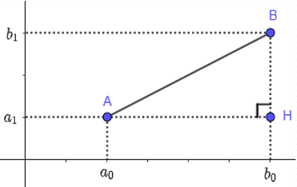
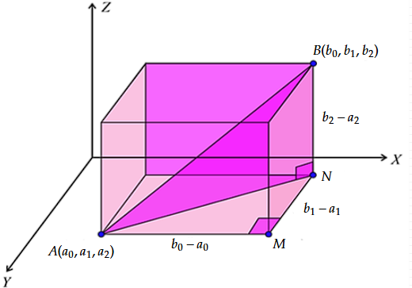
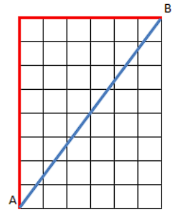
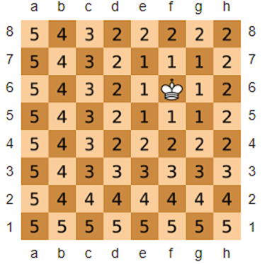

# Dimensions supérieures et distances

Il y a beaucoup de contextes en informatique, notamment en intelligence artificielle, où on voudrait pouvoir dire que deux objets sont semblables, en ayant une vision précise de ce que "semblable" veut dire. C'est ce qui permet par exemple à un algorithme de déterminer d'après une photo si elle représente un chat ou un chien. Pour y venir nous allons nous intéresser à la notion de distance en partant de ce qui vous a déjà été présenté.

## Distance entre des points

Soient 2 points $A(a_0,a_1)$ et $B(b_0, b_1)$ du plan

Pythagore nous dit que:

$$AB^2 = AH^2 + BH^2$$

donc :

$$
d(A, B) = \sqrt{(b_0 - a_0)^2 + (b_1 - a_1)^2}
$$

où on notera toujours $d(A, B)$ la distance entre $A$ et $B$.

Il est ici facile de concevoir que les points sont semblables si la distance est très petite. Plus la distance augmente, plus les 2 points nous paraissent dissemblables.

Maintenant, supposons que nous ayons 2 points A et B en dimension 3. Pythagore vient encore à la rescousse.

C'est exactement le même raisonnement, d'abord dans $\triangle AMN$ pour obtenir $AN^2$, puis dans $\triangle ANB$ pour obtenir $AB^2$.

On obtient alors:

$$
d(A, B) = \sqrt{(b_0 - a_0)^2 + (b_1 - a_1)^2 + (b_2 - a_2)^2}
$$

Jusqu'à ce point, nous pouvons faire appel au sens de la vue pour déterminer si des choses sont proches ou pas et nous avons besoin de l'espace qui nous entoure pour concevoir cette distance physique.

## Distances entre des fleurs

Prenons maintenant un ensemble de fleurs de 3 variétés différentes (des Iris) dont nous avons mesuré, pour chacune, 5 informations:

- L'espèce
- La longueur et la largeur des sépales
- La longueur et la largeur des pétales

Tout d'abord dressons une représentation graphique de la largeur des sépales en fonction de la longueur des sépales.

Chaque point sur ce graphique représente une fleur.  Ces fleurs ne sont pas positionnées réellement dans le plan, ce sont des caractéristiques de ces fleurs qui sont dans ce plan, et ça ne gêne personne. 

Lorsqu'on considère 2 fleurs proches dans le plan, il n'est pas difficile de s'imaginer qu'elles auront des sépales qui se ressembleront plus que deux fleurs qui sont plus éloignées l'une de l'autre.

Cependant, ici, nous ne considérons que les sépales, et pas la fleur dans son intégralité. Nous allons rajouter l'information de la largeur des pétales.

On commence à distinguer visuellement un groupe de fleurs qui se détache. Nous avons aussi l'information, pour chaque fleur, de sa variété. Il s'agit des variétés Setosa, Verticolor et Virginica. Colorions les avec des couleurs différentes.

Nous voyons maintenant distinctement 3 groupes se former sous nos yeux, car notre cerveau est capable d'estimer la distance entre ces groupes. On voit que le groupe 2 est "loin" des 2 autres, qui sont "collés". On se dit que les fleurs qui sont éloignées sont dissimilaires. Il ne s'agit pas de distance par rapport à la localisation, mais de distance par rapport à des caractéristiques choisies des fleurs.
Mais il y a toujours une information qui nous manque visuellement pour avoir une idée de nos données, il s'agit ici de la longueur des pétales. Or nous avons épuisé les 3 dimensions physiques et la coloration, et nous savons que l'ajout d'une dimension peut bouleverser la donne.
Ne vous fatiguez pas, il n'existe pas de magie pour "voir" les 4 dimensions numériques et ainsi pouvoir renouveler l'expérience de la distance visuelle en "voyant" des groupes se distinguer. Toute représentation graphique n'est qu'une projection de la réalité avec perte d'information.
En réalité, rien ne nous empêche de caractériser les fleurs avec l'ensemble de leurs coordonnées dans un espace de dimension supérieure, même si on ne peut pas le voir avec nos yeux.
Très basiquement, la dimension d'un ensemble d'éléments est le nombre de coordonnées dont vous avez besoin pour identifier un de ses éléments.
Dans nos données, une fleur est identifiée par 5 coordonnées. La dimension de notre ensemble de fleurs est donc 5.

!!! note
    Dans le dernier graphique, nous voyons une projection en dimension 2 (l'écran ou la feuille) d'une projection en dimension 4 (spatialement 3 dimensions, plus une dimension de couleur) de la totalité des données en dimension 5.

## Distances en dimension $n$

Oublions la dimension de la variété, concentrons nous sur les 4 coordonnées numériques et revenons à notre notion de distance. Comment établir une distance dans un espace à 4 dimensions?

En dimension 2, pour deux points $A(a_0, a_1)$ et $B(b_0, b_1)$
$$
d(A, B) = \sqrt{(b_0 - a_0)^2 + (b_1 - a_1)^2}
$$

En dimension 3, pour deux points $A(a_0, a_1, a_2)$ et $B(b_0, b_1, b_2)$
$$
d(A, B) = \sqrt{(b_0 - a_0)^2 + (b_1 - a_1)^2 + (b_2 - a_2)^2}
$$

En dimension 4, nous généralisons le principe pour $A(a_0, a_1, a_2, a_3)$ et $B(b_0, b_1, b_2, b_3)$

$$
d(A, B) = \sqrt{(b_0 - a_0)^2 + (b_1 - a_1)^2 + (b_2 - a_2)^2 + (b_3 - a_3)^2}
$$

Allons-y gaiement, pour un espace de dimension $n$, pour $A(a_0, ..., a_{n-1})$ et $B(b_0, ..., b_{n-1})$

$$
d(A, B) = \sqrt{(b_0 - a_0)^2 + ... + (b_{n-1} - a_{n-1})^2}
$$

Autrement posé:

$$
d(A,B)=\sqrt{\sum_{i=0}^{n-1} (b_i-a_i)^2}
$$

Bien sûr, le fait que nous généralisions aussi facilement n'est pas une garantie que la notion résultante est une définition "sensée" d'une distance. Ça soulève la question des propriétés que nous estimons nécessaires à la définition d'une distance pour qu'elle ait un sens, celui de la caractérisation d'une "proximité". 

Soit X un ensemble de "points". Supposons qu'étant donnés 2 de ces points A et B, nous avons une manière d'assigner un nombre réel $d(A, B)$ qu'on souhaiterait être la distance entre ces points.
Les propriétés suivantes doivent être respectées pour que $d$ soit une distance:

$$
\forall(A,B,C) \in X^3
\begin{cases}
P_1: d(A, B) \ge 0
\\
P_2: d(A, B)=0  \iff A=B
\\
P_3: d(A, B)=d(B, A)
\\
P_4: d(A, B) + d(B, C) \ge d(A,C)
\end{cases}
$$

Dans un ensemble quelconque, n'importe quelle fonction qui satisfait à ces propriétés est, par définition, une distance.
$P_1$ et $P_2$ signifient que la distance entre deux points est toujours positive ou nulle (elle est définie positive), et elle vaut 0 uniquement quand les deux points sont égaux.
$P_3$ dit que la distance est une notion symétrique, c'est à dire que la distance entre A et B est la même qu'entre B et A.
$P_4$ s'appelle l'inégalité triangulaire. Si vous imaginez A, B et C comme les sommets d'un triangle, ça dit que si vous prenez la somme des longueurs de deux côtés, elle sera toujours supérieure ou égale à la longueur du côté restant.

La notion physique de distance entre deux objets n'est qu'un cas très particulier de distance.

## Exemples de distances

### La distance Euclidienne

C'est celle dont nous avons parlé tout du long. Si un élément d'un ensemble a pour coordonnées des éléments de $\mathbb{R}$, alors les formules dérivées du théorème de Pythagore donnent une notion de distance conforme aux propriétés. L'ensemble muni de cette distance est alors appelé Espace Euclidien.

$$
d(A,B)=\sqrt{\sum_{i=0}^{n-1} (b_i-a_i)^2}
$$

### La distance de Manhattan

Là où la distance Euclidienne calcule la longueur du "vol d'oiseau" (le segment bleu), la distance de Manhattan calcule la longueur en rouge. Elle s'appelle ainsi car, les rues de Manhattan étant perpendiculaires, ça correspond à la longueur du trajet réel pour y marcher d'un point $A$ à un point $B$.

Sur le dessin, la distance de Manhattan entre A et B est 14.

$$
d(A,B)=\sum_{i=0}^{n-1} |b_i-a_i|
$$

### La similarité cosinus

La distance euclidienne mesure l'écart entre deux points, mais dans certains contextes c'est la direction des vecteurs qui importe davantage que leur longueur. C'est le cas dans les grands modèles de langage (LLMs), présentés dans [cet article](../../../recherche/intro_llm_philo.md) : chaque mot y est représenté par un vecteur dans un espace de plusieurs centaines de dimensions. Deux mots qui apparaissent souvent dans des contextes similaires pointent dans des directions voisines, indépendamment de la longueur de leurs vecteurs. Un mot très fréquent peut avoir un vecteur d'embedding plus long qu'un mot rare, sans que cela reflète une différence de comportement dans les textes.

Pour comparer des vecteurs, on part du **produit scalaire**. Pour deux points $A(a_0, ..., a_{n-1})$ et $B(b_0, ..., b_{n-1})$, il est défini par :

$$\vec{OA} \cdot \vec{OB} = \sum_{i=0}^{n-1} a_i \cdot b_i$$

Le produit scalaire vérifie une propriété fondamentale liée à l'angle $\theta$ entre les deux vecteurs :

$$\vec{OA} \cdot \vec{OB} = \|\vec{OA}\| \cdot \|\vec{OB}\| \cdot \cos(\theta)$$

où $\|\vec{OA}\| = \sqrt{\sum_{i=0}^{n-1} a_i^2}$ est la norme (longueur) du vecteur $\vec{OA}$.

En isolant $\cos(\theta)$, on obtient la **similarité cosinus** :

$$\text{sim}(A, B) = \cos(\theta) = \frac{\vec{OA} \cdot \vec{OB}}{\|\vec{OA}\| \cdot \|\vec{OB}\|} = \frac{\displaystyle\sum_{i=0}^{n-1} a_i \cdot b_i}{\sqrt{\displaystyle\sum_{i=0}^{n-1} a_i^2} \cdot \sqrt{\displaystyle\sum_{i=0}^{n-1} b_i^2}}$$

Cette valeur est comprise entre $-1$ et $1$ : elle vaut $1$ si les deux vecteurs pointent exactement dans la même direction, $0$ s'ils sont perpendiculaires, et $-1$ s'ils pointent en sens opposé.

Comme $\text{sim}(A, B)$ peut être négative, ce n'est pas une distance. Pour obtenir une valeur toujours positive ou nulle et croissante avec la dissimilarité, on définit la **dissimilarité cosinus** :

$$d_{cos}(A, B) = 1 - \text{sim}(A, B)$$

Cette quantité est comprise entre $0$ et $2$. Ce n'est pas une distance au sens formel du terme, ni même une pseudo-distance. Elle viole deux propriétés :

- **P2** : deux vecteurs de longueurs différentes mais pointant dans la même direction donnent $d_{cos} = 0$ sans être égaux.
- **P4** : prenons trois vecteurs unitaires à 0°, 60° et 120°. On obtient $d_{cos}(A,B) = \frac{1}{2}$, $d_{cos}(B,C) = \frac{1}{2}$, $d_{cos}(A,C) = \frac{3}{2}$. L'inégalité triangulaire exigerait $\frac{3}{2} \leq \frac{1}{2} + \frac{1}{2} = 1$, ce qui est faux.

C'est une **mesure de dissimilarité**, utilisée en pratique parce qu'elle est efficace, pas parce qu'elle satisfait les propriétés d'une distance.

#### Le produit scalaire normalisé

Une façon équivalente de calculer la similarité cosinus consiste à **normaliser** d'abord chaque vecteur, c'est-à-dire le diviser par sa norme pour obtenir un vecteur de longueur 1 :

$$\hat{A} = \frac{\vec{OA}}{\|\vec{OA}\|}, \qquad \hat{B} = \frac{\vec{OB}}{\|\vec{OB}\|}$$

Le produit scalaire de ces deux vecteurs normalisés donne directement la similarité cosinus :

$$\hat{A} \cdot \hat{B} = \cos(\theta) = \text{sim}(A, B)$$

C'est pourquoi on parle indifféremment de similarité cosinus ou de **produit scalaire normalisé**. Ramener les vecteurs à une longueur unitaire avant de les comparer permet de ne juger que de leur orientation, pas de leur norme.

!!! info "Lien avec les LLMs"

    L'article mentionne que "roi" et "reine" se retrouvent proches dans l'espace des embeddings, avec une différence de coordonnées proche de celle entre "homme" et "femme". La mesure utilisée est la similarité cosinus : ce qui compte n'est pas la longueur des vecteurs, mais la direction dans laquelle ils pointent. La distance euclidienne serait ici trompeuse, car un mot plus fréquent dans les textes d'entraînement aura tendance à produire un vecteur d'embedding de norme plus grande, et la distance euclidienne le signalerait comme "éloigné" de mots pourtant très souvent présents dans les mêmes contextes. La similarité cosinus corrige ce biais en ne regardant que l'angle.

    On pourrait objecter qu'il existe de vraies distances compatibles avec cette idée : la distance angulaire $\theta = \arccos(\cos\theta)$ est une vraie distance sur les vecteurs normalisés. Pourquoi ne pas l'utiliser pour rester cohérent avec les mathématiques ? Parce que l'usage concret ne nécessite jamais les propriétés formelles d'une distance. Ce qu'on fait avec les embeddings, c'est classer des vecteurs par ordre de similarité décroissante. Or $\arccos$ est une fonction strictement décroissante : trier par $\cos(\theta)$ décroissant donne exactement le même classement que trier par $\theta$ croissant. La distance angulaire est mathématiquement correcte mais coûteuse à calculer pour rien. L'inégalité triangulaire, elle, n'est jamais exploitée dans ces algorithmes. La similarité cosinus est donc un choix délibérément pragmatique : une mesure efficace pour la tâche, pas une distance.

    C'est une leçon générale de l'informatique : la définition formelle d'une distance (P1 à P4) est un objet mathématique cohérent, mais en pratique on extrait de cette notion uniquement ce qui est utile au problème posé. Ici, seul l'ordre compte, pas les propriétés algébriques. Le produit scalaire normalisé fournit cet ordre au moindre coût de calcul.

### Distance entre des chaînes de caractères

Lorsqu'on transmet des données numériques sur un réseau, des erreurs peuvent survenir et modifier des bits. On veut quantifier combien de bits ont été altérés entre le message envoyé et le message reçu, pour détecter ou corriger ces erreurs. L'information est transmise aujourd'hui sous forme de 0 et de 1, comme "00111010010". La distance de Hamming entre deux de ces chaînes de caractères, de même taille, est définie comme le nombre de caractères qu'il faut modifier dans une chaîne pour obtenir l'autre. Par exemple, la distance entre les chaînes "00111010010" et "00100010010" est 2, car il faut modifier les caractères aux indices 3 et 4 seulement. Il existe une autre distance plus poussée entre les chaînes de caractères utilisées dans les correcteurs orthographiques qui s'appelle la distance de Levenshtein. Elle prend en compte le nombre minimum d'ajouts, de suppressions et de remplacement de caractères pour obtenir l'autre chaîne. Lorsque votre correcteur orthographique souligne un mot en rouge, c'est qu'il ne le trouve pas dans le dictionnaire. Il vous propose alors les mots les plus similaires, ceux pour lesquels la distance de levenshtein est la plus petite.

### La distance $\tau$ de Kendall

Parfois les données ne sont pas des nombres mais des classements : deux utilisateurs ordonnent leurs films préférés différemment, deux médecins classent des symptômes par ordre d'importance, deux séquences génétiques diffèrent par l'ordre de leurs éléments. Il faut une distance qui mesure à quel point deux ordres se ressemblent. C'est une distance entre des listes. Elle est équivalente au nombre d'échanges nécessaires à l'algorithme de tri à bulle pour passer d'une liste à l'autre.

### La distance de Minkowski

En pratique, on ne sait pas toujours a priori quelle distance est la plus adaptée à un jeu de données. La distance de Minkowski offre une famille de distances paramétrée par un réel $p$, ce qui permet de tester différentes sensibilités sans changer de formule. C'est une généralisation de la distance euclidienne et de la distance de Manhattan.

La distance Euclidienne en dimension n peut se réécrire ainsi:

$$
d(A,B)=\left(\sum_{i=0}^{n-1} (b_i-a_i)^2 \right)^{1/2}
$$

Minkowski propose de généraliser à la distance d'ordre $p$:

$$
d(A,B)=\left(\sum_{i=0}^{n-1} |b_i-a_i|^p \right)^{1/p}
$$

Sa seule existence permet d'affirmer qu'il existe une infinité de fonctions de distances possibles, attendu que le domaine de valeurs de $p$ est infini.

On l'appelle la distance de Minkowski d'ordre $p \in \mathbb{R}, p \ge 1$. Quand $p<1$, la fonction viole l'inégalité triangulaire et ça n'est donc pas une distance.

- La distance de Minkowski d'ordre 1 est la distance de Manhattan.
- La distance de Minkowski d'ordre 2 est la distance Euclidienne.
- Sa limite quand $p$ tend vers $+\infty$ est appelée distance de Tchebychev.

Plus $p$ est grand, plus on donne de l'importance aux grandes différences entre coordonnées. Faire varier $p$ permet d'ajuster la sensibilité des modèles qu'on cherche à construire.

### Distance de Tchebychev

Certains problèmes ne s'intéressent pas à la distance globale entre deux objets, mais à leur pire écart sur une seule dimension. Une pièce mécanique est dans les tolérances si chacune de ses cotes est acceptable indépendamment des autres : c'est la dimension la plus déviante qui détermine si la pièce est bonne ou non. La distance de Tchebychev est équivalente au plus grand écart entre chaque coordonnée de deux points. On l'appelle aussi distance de l'échiquier car c'est le nombre de tours minimal qu'il faut à un roi pour atteindre une case d'un échiquier à partir de sa position courante.
Elle s'écrit aussi sous une forme plus simple que la limite de la distance de Minkowski:

$$
d(A, B) = \max_{0\le i <n}\, |b_i-a_i|
$$

