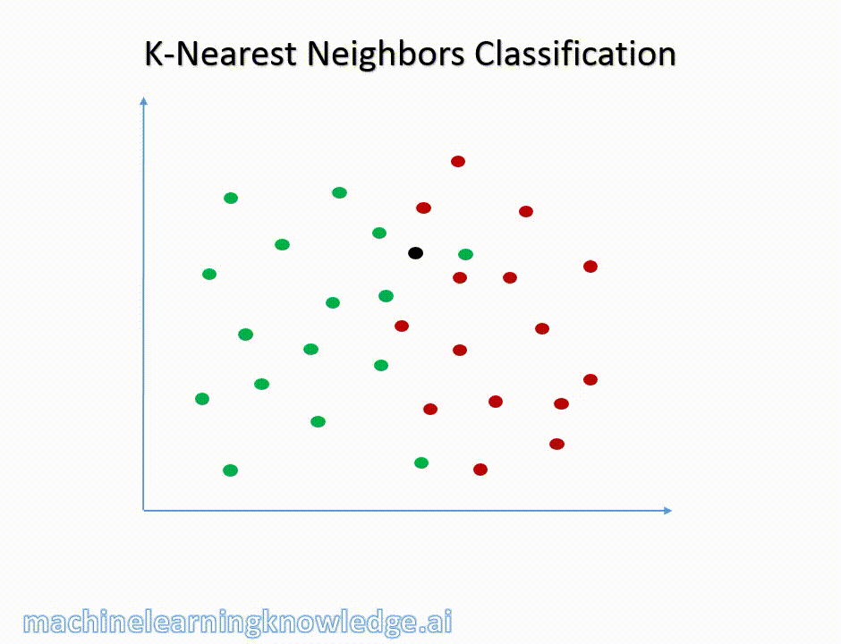

# Algorithme des k plus proches voisins (KNN)

Il s'agit ici de découvrir un algorithme de classification du domaine de l'apprentissage supervisé.

Du point de vue de la programmation, il s'agit de constater qu'un algorithme réputé savant se construit entièrement avec des schémas que vous connaissez déjà : un parcours, une accumulation, un tri et un comptage. Rien de neuf n'est nécessaire.

## Objectif
D'après des données connues, deviner une propriété inconnue d'une nouvelle donnée.

## Problème de classification

Un problème de classification s'exprime dans le contexte suivant:

- On a un ensemble $C$ de classes (ex: $\{Setosa, Versicolor, Virginica\}$)
- On a un ensemble $E$ d'éléments (ex: points $(x,y)$ du plan, ensemble de fleurs)
- Chaque élément $e$ de $E$ est associé à exactement une classe $c(e)$ de $C$ (ex: pour chaque fleur, on sait à quelle classe elle appartient)

L'objectif est alors de produire un algorithme qui, pour chaque élément de $E$ détermine sa classe $c(e)$

L'algorithme s'applique quand:

- On n'a pas de manière efficace (raisonnable en temps et en espace humain) de calculer exactement $c(e)$
- On dispose d'une table $T$ d'associations correcte entre des éléments $e$ et leur classe $c(e)$
- On dispose d'une notion de distance sur l'ensemble $E$, c'est à dire d'une fonction qui à une paire d'éléments de $E$ associe un nombre réel positif ou nul mesurant la dissimilarité entre les deux éléments (La fonction doit donner des valeurs proches de 0 si les deux éléments sont peu dissimilaires, et de grandes valeurs s'ils sont très dissimilaires)

## Les k plus proches voisins

Ce que nous voulons, c'est que, si on donne les coordonnées d'un nouvel Iris, la machine soit capable de dire de quelle variété il s'agit, sur le principe de ce gif animé:




Voici donc l'algorithme permettant cette sorcellerie:

1. Chercher parmi les éléments présents dans la table $T$ les $k$ éléments ayant la plus faible distance à e
2. Collecter les classes associées à ces $k$ éléments
3. Déterminer la classe la plus souvent présente parmi les classes retenues.

L'algorithme est dit **supervisé** car il nécessite l'intervention d'un humain qui doit **choisir k à l'avance**. Nous ne nous intéresserons pas au choix de $k$. Il sera donné.


## Réalisation


### Lecture du fichier csv:

Le fichier `Iris.csv` contient 150 fleurs, une par ligne, avec un identifiant, les quatre mesures et l'espèce. Placez-le à côté de votre programme.

```python
import csv

# Nous assimilons une fleur à un dictionnaire.
type Fleur = dict

# Les quatre colonnes numériques, les seules sur lesquelles une distance a un sens.
ATTRIBUTS: list[str] = ['SepalLength', 'SepalWidth', 'PetalLength', 'PetalWidth']

liste_fleurs: list[Fleur] = []

with open('Iris.csv', newline='', encoding='utf-8') as fichier:
    lecteur = csv.DictReader(fichier)
    for ligne in lecteur:
        fleur: Fleur = {}
        for cle in ligne:
            if cle in ATTRIBUTS:
                fleur[cle] = float(ligne[cle])   # conversion indispensable, voir ci-dessous
            else:
                fleur[cle] = ligne[cle]
        liste_fleurs.append(fleur)
```

!!! warning "Un fichier ne contient que du texte"
    `csv.DictReader` rend **toutes** les valeurs sous forme de chaînes de caractères, y compris `'5.1'`. Sans la conversion en `float`, deux choses arrivent, et la seconde est la pire. Une soustraction lève une `TypeError`, ce qui se voit tout de suite. Mais une **comparaison**, elle, ne lève rien : les chaînes se comparent dans l'ordre alphabétique, si bien que `'49' > '100'` vaut `True`. Le programme tourne et se trompe en silence.

Nous cherchons à savoir de quelle espèce est la fleur que nous avons ramassée et mesurée:

```python
fleur_mystere: Fleur = {
    'SepalLength': 5.7,
    'SepalWidth': 3.0,
    'PetalLength': 4.2,
    'PetalWidth': 1.2
}
```

### Fonction de distance:

Nous utiliserons la distance euclidienne à travers la distance de Minkowski:

```python
def dist_minkowski(keys: list, p: float, a: dict, b: dict) -> float:
    """
    Distance de Minkowski d'ordre p entre deux objets modélisés 
    par des dictionnaires à clés indiquées en paramètre.
    """
    return sum([abs(b[key]-a[key])**p for key in keys])**(1/p)
```

### Etape 1 - Tri et sélection des k plus proches voisins

Nous calculons la distance de chaque fleur à la fleur mystère, et nous rangeons les couples `(distance, indice)`. Trier des couples, c'est trier sur le premier élément, donc sur la distance.

```python
# intéressons nous aux 5 plus proches voisins
k = 5

couples: list[tuple[float, int]] = []
for i in range(len(liste_fleurs)):
    d = dist_minkowski(ATTRIBUTS, 2, fleur_mystere, liste_fleurs[i])
    couples.append((d, i))

couples.sort()          # tri croissant : les plus proches en premier

knn: list[Fleur] = []
for j in range(k):
    indice = couples[j][1]
    knn.append(liste_fleurs[indice])
```

!!! warning "Deux erreurs faciles à cet endroit"
    La première est de trier **dans le mauvais sens** : ce sont les distances les plus **petites** qui désignent les voisins les plus proches. Un tri décroissant donnerait les cinq fleurs les plus dissemblables, sans que rien ne plante.
    La seconde est de calculer la distance sur **toutes** les colonnes. `Id` et `Species` ne sont pas des mesures : la première fausserait le résultat, la seconde ferait échouer la soustraction. C'est la raison d'être de `ATTRIBUTS`.

### Etape 2 - Collecte des classes

Calcul des fréquences absolues par espèce. Vous avez déjà vu cet algorithme de comptage.

```python
frequences: dict[str, int] = {}
for fleur in knn:
    espece = fleur['Species']
    if espece in frequences:
        frequences[espece] += 1
    else:
        frequences[espece] = 1
```

### Etape 3 - Prédiction

Il suffit de renvoyer la clé qui correspond à la plus grande fréquence. C'est la recherche d'un maximum, sur les valeurs d'un dictionnaire cette fois.

```python
espece_predite: str = ''
meilleure_frequence: int = -1

for espece in frequences:
    if frequences[espece] > meilleure_frequence:
        meilleure_frequence = frequences[espece]
        espece_predite = espece

print(espece_predite)
```

Sur la fleur mystère ci-dessus, les cinq voisins sont **tous** des `Iris-versicolor` : la prédiction est unanime. Ce ne sera pas toujours le cas, et c'est l'objet de la seconde question du choixpeau.

??? note "Pour aller plus loin : la même chose avec des fonctions d'ordre supérieur"
    Python permet d'écrire les étapes 1 et 3 en une ligne chacune, en passant une **fonction en argument** d'une autre fonction. C'est plus court, ce n'est pas plus clair tant que le schéma explicite n'est pas solide, et cela n'est pas exigible.

    ```python
    from functools import partial

    distance_a_la_mystere = partial(dist_minkowski, ATTRIBUTS, 2, fleur_mystere)
    knn = sorted(liste_fleurs, key=distance_a_la_mystere)[:k]

    espece_predite = max(frequences, key=frequences.get)
    ```

    Notez que `sorted` trie par ordre **croissant** par défaut, ce qui est exactement ce que nous voulons ici : ajouter `reverse=True` donnerait les voisins les plus lointains.

## Le choixpeau magique


Il s'agit d'une application directe pour la distance de Manhattan.

Vous disposez du fichier `Poudlard.csv`, qui contient 48 élèves déjà répartis. Ses colonnes sont `Id`, `Courage`, `Loyaute`, `Sagesse`, `Malice` et `Maison`. Le choixpeau magique utilise les 7 plus proches voisins pour distribuer les élèves dans les différentes maisons, en utilisant la distance de Manhattan sur 4 dimensions.

Rien n'est à réécrire : c'est le **même** algorithme, avec un autre jeu de données et une autre distance. Il suffit de rappeler `dist_minkowski` avec `p = 1` et la bonne liste d'attributs.

1. Quelle maison va-t-il assigner aux élèves suivants? 
2. Le choixpeau hésite plus ou moins à l'affectation des élèves dans leur maison. Proposez une manière de rendre compte du degré d'hésitation du choixpeau magique pour chaque prédiction.

!!! tip "Indice pour la question 2"
    Regardez le dictionnaire `frequences`, et non la seule espèce prédite. Un vote de 7 voix contre 0 et un vote de 3 voix contre 2 et 2 donnent la même réponse, et pourtant l'un est sûr et l'autre non. Toute l'information est déjà là, elle n'est simplement pas affichée.

|Nom|Courage|Loyauté|Sagesse|Malice
|--|--|--|--|--|
|Hermione|8|6|6|6|
|Drago|6|6|5|8|
|Cho|7|6|9|6|
|Cédric|7|10|5|6|

