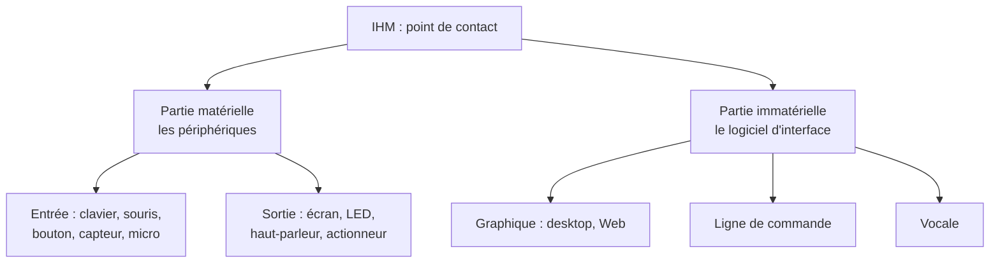

# Interface Homme-Machine (IHM)

!!! abstract "Définition"
    Une **Interface Homme-Machine (IHM)** est le **point de contact** entre un humain et une machine.

    Elle **capte une action de l'humain** (une *entrée*) pour déclencher un traitement, et, le plus souvent, elle lui **restitue une information** en retour (une *sortie*).

    Une IHM peut prendre des formes très variées : un écran avec des boutons, une page Web, une commande vocale, un bouton physique, un capteur, un terminal…

!!! tip "Attention au vocabulaire"
    Dans le langage courant, beaucoup de gens disent « IHM » pour parler uniquement de l'**interface graphique** d'une application. C'est l'usage le plus fréquent, mais c'est un raccourci : l'interface graphique n'est qu'**une** sorte d'IHM parmi d'autres.

## Deux parties dans toute IHM

Une IHM a toujours une **partie matérielle** (les objets physiques que l'on touche) et, le plus souvent, une **partie immatérielle** posée dessus (le logiciel qui donne du sens à nos actions).



!!! warning "Deux couches, pas deux boîtes"
    Matériel et immatériel ne sont pas deux catégories séparées : ce sont **deux couches superposées**. Une application de bureau, c'est un **logiciel graphique** (immatériel) qui s'appuie sur un **écran et une souris** (matériel).

    De même, il existe **deux sortes de boutons** : le bouton physique d'une machine (matériel) et le bouton dessiné dans une fenêtre (immatériel). Les deux sont des IHM, mais pas de la même nature.

## 1. La partie matérielle : les périphériques

Ce sont les organes physiques par lesquels passe le contact. On les range selon leur rôle :

- **Périphériques d'entrée** (capter l'action) : clavier, souris, écran tactile, bouton, interrupteur, molette, capteur (température, mouvement…), microphone.
- **Périphériques de sortie** (restituer l'information) : écran, LED, haut-parleur, actionneur (moteur…).

C'est l'angle du thème **« Architectures matérielles et systèmes d'exploitation »**, qui aborde l'IHM au niveau des **entrées-sorties** de la machine.

!!! example "IHM presque uniquement matérielles"
    Sur un objet connecté, un système embarqué ou un robot, l'interface se réduit souvent à cette partie matérielle : des boutons et des capteurs en entrée, des LED et des moteurs en sortie. Le bouton d'arrêt d'urgence d'une machine en est un bon exemple.

## 2. La partie immatérielle : le logiciel d'interface

C'est le programme qui interprète nos actions et décide de la réponse. On le classe selon la **façon d'interagir** : graphique, en ligne de commande, ou vocale.

### 2.1 Les interfaces graphiques

C'est le cas le plus courant. L'utilisateur **manipule** des **composants graphiques** (boutons, champs de texte, menus, curseurs…) en les pointant et en cliquant, à la souris, au clavier ou au doigt.

Ce style d'interaction porte un nom en informatique : la **manipulation directe** (Ben Shneiderman, 1983). L'idée : on agit sur des objets affichés par des actions physiques (pointer, cliquer, glisser) au lieu de taper une syntaxe, et l'effet est immédiatement visible.

!!! note "Le principe : un événement déclenche une fonction"
    Une interface graphique ne s'exécute pas « de haut en bas » comme un programme classique. Elle **attend** que l'utilisateur fasse quelque chose. Chaque action (un clic, une saisie) est un **événement** qui **déclenche une fonction** chargée d'y répondre.

    C'est exactement la définition de l'IHM en action : l'interface *capte l'action*, ce qui *déclenche un traitement*.

On fabrique une interface graphique de deux manières.

#### a. Sur ordinateur : les applications *desktop*

Une application **desktop** est un logiciel installé sur la machine, qui affiche sa propre fenêtre. Cette année, nous les construirons en **Python avec PySide6** (la bibliothèque Qt).

Le principe : on **décrit** l'interface (les composants et leur disposition), puis on **programme les réactions** aux événements dans une fonction appelée *callback*.

```python
# On relie le clic du bouton à une fonction.
# La fonction sera appelée à CHAQUE clic.
bouton.clicked.connect(dire_bonjour)
```

!!! info "Avantages pour débuter"
    On reste dans **un seul langage déjà connu, Python**, et l'application fonctionne sans connexion Internet. C'est un bon terrain pour comprendre le modèle « événement → fonction » avant d'aborder le Web.

#### b. Dans le navigateur : le Web

Une interface **Web** est une page affichée dans un navigateur. Trois langages s'y partagent le travail :

- **HTML** décrit les composants (un bouton, un champ, un formulaire) ;
- **CSS** gère la mise en forme (couleurs, disposition) ;
- **JavaScript** programme les réactions aux événements.

```html
<!-- Le clic sur le bouton déclenche la fonction direBonjour() -->
<button onclick="direBonjour()">Clic</button>
```

C'est l'objet du thème **« Interactions entre l'homme et la machine sur le Web »** du programme. Une page Web ajoute une difficulté propre : elle fait dialoguer un **client** (le navigateur) et un **serveur**.

!!! success "Le point commun desktop / Web"
    Dans les deux cas, le modèle est le même : **un événement (un clic) déclenche une fonction**. Ce que vous apprenez en PySide6 se transfère directement au Web ; seule la technologie change.

### 2.2 L'interface en ligne de commande

Le **terminal** est une interface **textuelle** : on interagit en **tapant des commandes**, et la machine répond par du texte. Bien sûr, les lettres affichées sont, elles aussi, dessinées à l'écran. Ce qui distingue le terminal d'une interface graphique n'est donc pas l'absence d'images, mais la **façon d'agir** : on n'y **manipule aucun composant** (bouton, menu) en pointant et cliquant, on **écrit des commandes**.

!!! note "La fenêtre est matérielle, l'interaction est textuelle"
    L'écran et le clavier du terminal sont bien **matériels**. Mais la façon d'interagir (taper des commandes plutôt que manipuler des composants) définit une **ligne de commande**. On l'utilise dans le thème *systèmes d'exploitation*.

### 2.3 L'interface vocale

Un **assistant vocal** (enceinte connectée, serveur vocal au téléphone) capte la parole (via un microphone, matériel) et répond en parlant (via un haut-parleur, matériel). Le logiciel qui reconnaît et synthétise la voix est, lui, immatériel. C'est une IHM **sans aucun affichage** : la preuve qu'une IHM n'a pas besoin d'écran.

!!! note "Pour aller plus loin : les styles d'interaction"
    En informatique, on décrit plus finement les façons d'interagir avec un logiciel. Ben Shneiderman en distingue **cinq** : la **manipulation directe** (agir sur des objets à l'écran), la **sélection dans des menus**, le **remplissage de formulaires**, le **langage de commande** (taper des commandes) et le **langage naturel** (parler ou écrire en langue courante).

    Les trois familles de ce cours en sont une version simplifiée : « graphique » regroupe la manipulation directe, les menus et les formulaires ; « ligne de commande » correspond au langage de commande ; « vocale » au langage naturel.

## 3. Une interface logicielle a toujours besoin de matériel

On peut aller plus loin et **démontrer** que la partie immatérielle ne peut jamais exister seule : toute IHM immatérielle a besoin d'au moins une IHM matérielle. Le raisonnement tient en trois points.

1. Par définition, une IHM **capte une action de l'humain**.
2. Une action humaine est **physique** : appuyer, parler, toucher, bouger. L'humain n'agit que par des moyens physiques.
3. Un logiciel ne perçoit rien du monde physique : il ne manipule que des **signaux déjà numériques**.

Pour qu'un geste physique (point 2) parvienne jusqu'au logiciel (point 3), il faut donc un objet physique qui **convertit ce geste en signal** : un clavier, une souris, un écran tactile, un microphone, un capteur. Cet objet est un périphérique d'entrée, c'est-à-dire une IHM **matérielle**.

**Conclusion :** une interface logicielle qui capte une action s'appuie forcément sur au moins un périphérique matériel. L'immatériel ne touche jamais l'humain directement ; le matériel est le passage obligé. On peut même ajouter que le logiciel doit s'exécuter sur un processeur et une mémoire, eux aussi matériels. (Même une interface neuronale utilise des électrodes : encore des capteurs, donc du matériel.)

La réciproque, elle, est **fausse** : une IHM matérielle peut très bien fonctionner sans aucun logiciel, comme un interrupteur mécanique ou un bouton câblé à une sonnette. La dépendance ne va donc que dans un sens. Une interface immatérielle exige toujours du matériel, alors que du matériel peut se passer de logiciel. C'est exactement ce qui justifie que, dans la carte ci-dessus, le **matériel soit la couche de base** et l'immatériel une couche posée par-dessus.

## Ce que nous allons construire cette année

Nous nous concentrerons sur la partie **immatérielle graphique**, dans cet ordre :

1. d'abord des **applications desktop** en Python avec **PySide6**, pour installer le modèle « événement → fonction » dans un langage connu ;
2. puis des **interfaces Web**, qui réutilisent le même modèle avec HTML et JavaScript.

!!! quote "À retenir"
    - Une **IHM** est le **point de contact** humain ↔ machine : elle capte une action (entrée) et restitue souvent une information (sortie).
    - Toute IHM a une **partie matérielle** (les périphériques) et, le plus souvent, une **partie immatérielle** par-dessus (le logiciel d'interface). Ce sont deux couches, pas deux boîtes séparées.
    - La partie **immatérielle** se décline en **graphique**, **ligne de commande** ou **vocale**.
    - Une interface **graphique** repose sur le principe **un événement déclenche une fonction**. On la fabrique en **desktop** (PySide6) ou pour le **Web** (HTML + JavaScript) : même principe, technologies différentes.
