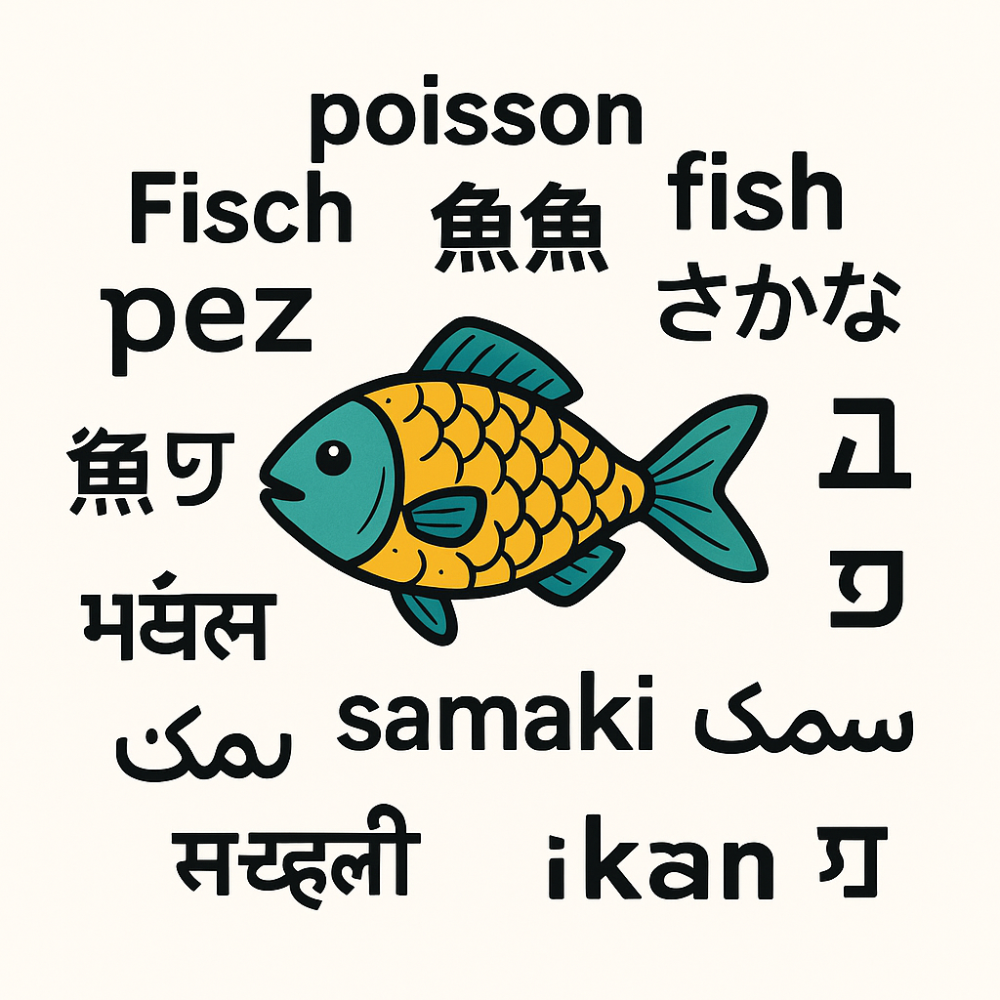

# Représentation des entiers naturels

!!! question "Préambule"
    - Quel est le premier chiffre?
    - Quel est le dernier chiffre?
    - Combien y-a-t-il de chiffres?
    - Donnez les valeurs de $10^k$ pour $k$ allant de 0 à 5
    - Plus grand nombre:
        - Quel est le plus grand nombre représentable sur:
            - 1 chiffres?
            - 4 chiffres?
            - 9 chiffres?
        - Pour chaque résultat précédent, Ajoutez-y 1. D'après ce que vous obtenez, exprimez les solutions en vous aidant de puissances.
        - Quel calcul faut-il faire pour obtenir le plus grand nombre sur 5678 chiffres?
        - Donnez une formule permettant de connaître le plus grand nombre représentable sur $n>0$ chiffres.

## Un peu de philosophie: Le signifiant et le signifié

Sur terre, il existe des centaines de manière de signifier qu'on parle d'un poisson.

On peut écrire et dire "poisson" en français.

On peut écrire et dire "fish" en anglais.

On peut écrire 魚, ou さかな et dire "sakana" en japonais.

**Ce qu’on dit ou écrit (le signifiant) peut varier d'une personne à l'autre sur terre. L'idée qu’on désigne (le signifié), par contre, reste inchangé.**

Ce qui réveille l'idée d'un poisson est différent, mais l'idée d'un poisson est globalement la même pour tous.

La relation entre le signifiant et le signifié est arbitraire. Il n'y a aucune raison qu'on choisisse un signifiant particulier pour décrire un signifié. Autrement dit, les deux n’ont pas de relation logique et doivent être apprises. Il s’agit d’une convention humaine.

## Les chiffres et les nombres

Les nombres servent à signifier une **quantité** ou un **ordre**.

- Il y a 53 pommes dans le panier $\rarr$ cardinal
- Je suis arrivé en 3ème position $\rarr$ ordinal

Pour l’instant vous n'avez été habitués qu’à dire, lire et écrire les nombres sur base de cet ensemble de dessins $<0, 1, 2, 3, 4, 5, 6, 7, 8, 9>$. On appelle chacun de ces dessins un chiffre (indo-arabe).

Au japon, leur équivalent est <零, 一, 二, 三, 四, 五, 六, 七, 八, 九> mais les nombres ne sont pas construits de la même façon que chez nous. Le Japon a totalement adopté le système de numération occidental au cours du XXème siècle. (vous remarquerez au passage qu'en France, nous utilisons toujours les chiffres romains pour écrire les siècles)

**Une lettre est un dessin. Nous disposons de 26 lettres dans l'alphabet.
Avec ces lettres, nous composons des mots auxquels nous attribuons un sens.**

**Un chiffre est un dessin. Nous disposons de dix chiffres. 
Avec ces chiffres, nous composons des nombres auxquels nous attribuons un sens, celui d'une quantité ou d'un ordre.**

Contrairement à l'exemple du poisson, pratiquement tout le monde sur terre s'accorde maintenant sur les symboles, mais pas sur leur prononciation.

Presque tous les adultes alphabétisés sur terre comprennent le dessin $88$ de la même façon, mais peu comprennent le dessin $quatre\text{-}vingt\text{-}huit$

## Le système positionnel décimal

Le système décimal, celui que vous avez appris dès tout petits est la base 10, constitué de ces chiffres: 

$$<0, 1, 2, 3, 4, 5, 6, 7, 8, 9>$$

$5429$ en base 10 se décompose ainsi:

$$5429_{10}=5 \times 1000+4 \times 100+2 \times 10+9 \times 1$$

$$\Large \textcolor{blue}{5429}_{10}= \textcolor{blue}{5} \times 10^{\textcolor{red}{3}}+ \textcolor{blue}{4} \times 10^{\textcolor{red}{2}}+ \textcolor{blue}{2} \times 10^{\textcolor{red}{1}}+ \textcolor{blue}{9} \times 10^{\textcolor{red}{0}}$$

Chaque chiffre représente un nombre de puissances de 10.
Le chiffre le plus à droite est multiplié par $10^0$, celui de gauche par $10^1$, etc pour $10^2$, $10^3$...

On interprète chaque chiffre selon sa position (système de numération positionnel)

Plus petits, vous parliez de la colonne des unités, des dizaines, des centaines, des milliers, ...

## La roue des chiffres

!!! abstract "Vocabulaire"
    - **Incrémenter** est l'action d'ajouter un
    - **Décrémenter** est l'action de retirer un 

La petite application ci-dessous permet d'incrémenter ou décrémenter un compteur constitué de roues de chiffres.

  

  

**La colonne/roue 0 est la colonne de droite. la colonne 1 est la colonne juste à sa gauche, etc...**

- Combien de fois faut-il incrémenter le compteur pour faire bouger la roue 1?
- Combien de fois faut-il incrémenter le compteur pour faire bouger la roue 2?
- Que doit faire la roue 2 pour que la roue 3 bouge?

## Changer de base

Modifiez l'alphabet de chiffres pour ces chiffres: $<0, 1, 2>$

Nos roues n'ont plus alors que 3 chiffres chacune.

- Incrémentez le compteur 10 fois. 
    - Quel est le nombre obtenu? 
    - Comment est-il écrit?
- Combien de fois faut-il incrémenter le compteur pour faire bouger la roue 1?
- Combien de fois faut-il incrémenter le compteur pour faire bouger la roue 2?
- Combien de fois faut-il incrémenter le compteur pour faire bouger la roue 3?
- Que doit faire la roue 2 pour que la roue 3 bouge?

Ici, vous venez de représenter des nombres dans la **base 3**.

Pourquoi? **Tout simplement** parce qu'on ne dispose que de 3 chiffres pour représenter les nombres.

- **Ecrivez** le plus grand nombre possible sur 4 chiffres en base 3.
- A quel nombre correspond-il?

## Rechanger de base

Modifiez l'alphabet de chiffres pour ces chiffres: $<0, 1>$

- En quelle base sont maintenant écrits les nombres affichés au compteur?
- Incrémentez le compteur 10 fois. 
    - Quel est le nombre obtenu? 
    - Comment est-il écrit?
- Combien de fois faut-il incrémenter le compteur pour faire bouger la roue 1?
- Combien de fois faut-il incrémenter le compteur pour faire bouger la roue 2?
- Combien de fois faut-il incrémenter le compteur pour faire bouger la roue 3?
- Que doit faire la roue 2 pour que la roue 3 bouge?

!!! danger "Le binaire"

    **Le binaire, c'est tout simplement la base 2.**

    Le mot "binaire" vient du latin binarius, qui signifie "composé de deux".

    En base 2, chaque chiffre (appelé **bit**, contraction de **binary digit**) ne peut valoir que :

    - 0 : "éteint", "faux", "non", etc.
    - 1 : "allumé", "vrai", "oui", etc.

!!! danger "L'hexadécimal"

    **L'hexadécimal, c'est la base 16**

    On ne dispose que de 10 chiffres, pas de 16, il nous en manque donc 6. On n'a pas voulu recréer de nouveaux symboles pour ces chiffres, alors on utilise les lettres de l'alphabet. Les chiffres de l'hexadécimal sont donc

    $$<0, 1, 2, 3, 4, 5, 6, 7, 8, 9, A, B, C, D, E, F>$$

    l'hexadécimal revient souvent en informatique:

    - Utilisé pour les couleurs en HTML/CSS (ex : #FF0000 pour rouge)
    - 1 chiffre hexadécimal représente 4 bits → lecture plus simple du binaire
    - Plus lisible que le binaire ou le décimal pour les données machines
    - Utilisé pour représenter les adresses mémoire en informatique bas niveau
    - Indispensable pour déboguer ou lire les fichiers binaires
    - Utile en systèmes, électronique, assembleur, sécurité informatique

## Systèmes alternatifs

En réalité vous utilisez sans le savoir d’autres modes.

Vous comptez par exemple les minutes et les secondes dans le système sexagésimal hérité des babyloniens (-3000).

Vous dites quatre-vingt quinze (4 × 20 + 15) en héritage des celtes qui comptaient sur une base de 20 chiffres (ils comptaient aussi sur les doigts de pied). [Tout comme les mayas](https://fr.wikipedia.org/wiki/Num%C3%A9ration_maya)

