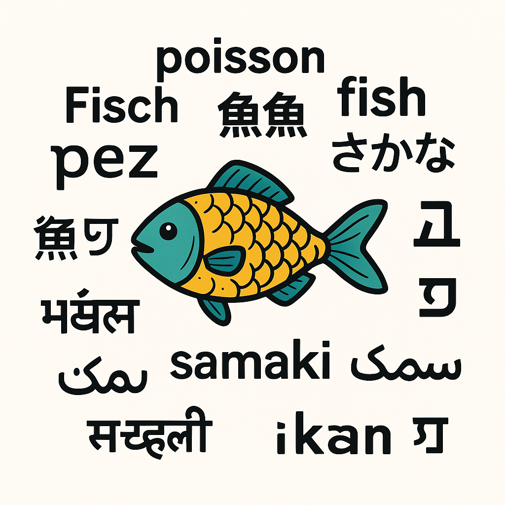
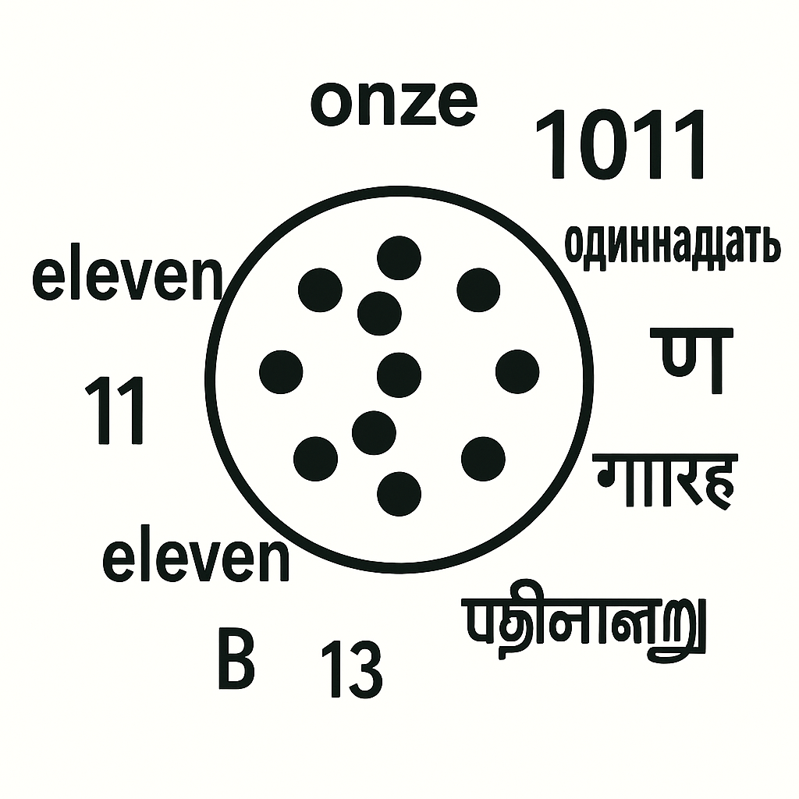

# Représentation des entiers naturels

!!! question "Préambule"
    - Quel est le premier chiffre?
    - Quel est le dernier chiffre?
    - Combien y-a-t-il de chiffres?
    - Donnez les valeurs de $10^k$ pour $k$ allant de 0 à 5
    - Plus grand nombre:
        - Quel est le plus grand nombre représentable sur:
            - 1 chiffres?
            - 4 chiffres?
            - 9 chiffres?
        - Pour chaque résultat précédent, Ajoutez-y 1. D'après ce que vous obtenez, exprimez les solutions en vous aidant de puissances.
        - Quel calcul faut-il faire pour obtenir le plus grand nombre sur 5678 chiffres?
        - Donnez une formule permettant de connaître le plus grand nombre représentable sur $n>0$ chiffres.

## Un peu de philosophie: Le signifiant et le signifié

Sur terre, il existe des centaines de manière de signifier qu'on parle d'un poisson.

On peut écrire et dire "poisson" en français.

On peut écrire et dire "fish" en anglais.

On peut écrire 魚, ou さかな et dire "sakana" en japonais.

**Ce qu’on dit ou écrit (le signifiant) peut varier d'une personne à l'autre sur terre. L'idée qu’on désigne (le signifié), par contre, reste inchangé.**

Ce qui réveille l'idée d'un poisson est différent, mais l'idée d'un poisson est globalement la même pour tous.

La relation entre le signifiant et le signifié est arbitraire. Il n'y a aucune raison qu'on choisisse un signifiant particulier pour décrire un signifié. Autrement dit, les deux n’ont pas de relation logique et doivent être apprises. Il s’agit d’une convention humaine.

## Les chiffres et les nombres

Dans la vie courante, on pense d'abord aux nombres pour signifier une **quantité** ou un **ordre**.

- Il y a 53 pommes dans le panier $\rarr$ cardinal
- Je suis arrivé en 3ème position $\rarr$ ordinal

Pour l’instant vous n'avez été habitués qu’à dire, lire et écrire les nombres sur base de cet ensemble de dessins $<0, 1, 2, 3, 4, 5, 6, 7, 8, 9>$. On appelle chacun de ces dessins un chiffre (indo-arabe).

Au japon, leur équivalent est <零, 一, 二, 三, 四, 五, 六, 七, 八, 九> mais les nombres ne sont pas construits de la même façon que chez nous. Le Japon a totalement adopté le système de numération occidental au cours du XXème siècle. (vous remarquerez au passage qu'en France, nous utilisons toujours les chiffres romains pour écrire les siècles)

**Une lettre est un dessin. Nous disposons de 26 lettres dans l'alphabet.
Avec ces lettres, nous composons des mots auxquels nous attribuons un sens.**

**Un chiffre est un dessin. Nous disposons de dix chiffres. 
Avec ces chiffres, nous composons des nombres auxquels nous attribuons un sens, celui d'une quantité ou d'un ordre.**

Contrairement à l'exemple du poisson, pratiquement tout le monde sur terre s'accorde maintenant sur les symboles, mais pas sur leur prononciation.

Presque tous les adultes alphabétisés sur terre comprennent le dessin $88$ de la même façon, mais peu comprennent le dessin $quatre\text{-}vingt\text{-}huit$

Il existe un nombre incroyable de signifiants pour un signifié. En voici un exemple pour le nombre 42:

  <label for="lang42" style="font-weight:600;">Langue :</label>
  <select id="lang42" style="padding:0.3em 0.5em;font-size:1em;"></select>
  
  <button onclick="jouer42()" style="padding:0.3em 0.8em;font-size:1em;cursor:pointer;">&#9654; Écouter</button>
  <audio id="audio42"></audio>

??? info "Pour aller plus loin : la notion d'alphabet"
    Notre liste de chiffres $<0, 1, ..., 9>$ et notre liste de lettres $<a, b, ..., z>$ ne sont que deux exemples de ce que l'informatique appelle un **alphabet** : un ensemble fini de symboles.

    À partir d'un alphabet, en mettant les symboles bout à bout, on forme des **mots** (on dit aussi des chaînes). Un ensemble de mots est un **langage**.

    - Avec l'alphabet $<0, 1>$, on forme les mots du binaire.
    - Avec l'alphabet latin, on forme les mots du français.
    - Avec l'alphabet des symboles de Python, on forme les mots-clés de Python pour écrire des programmes.

    C'est le point de départ de la **théorie des langages formels** (mots, langages, automates, expressions régulières), une branche centrale de l'informatique : c'est elle qui permet, par exemple, à Python de décider si votre code est bien écrit. Rien de tout cela n'est à connaître cette année, mais sachez que « chiffres » et « lettres » sont deux instances d'une même idée plus générale.

## Les chiffres et les codes

Signifier une quantité ou un ordre n'est pas le seul usage. Une suite de chiffres peut aussi servir de **code** : une étiquette qui désigne autre chose, et dont la valeur ne représente ni une quantité ni un rang.

- Mon numéro de téléphone est le 06... $\rarr$ code (l'additionner à un autre n'aurait aucun sens)
- La lettre `'A'` est codée par le nombre 65 $\rarr$ code (norme ASCII)

En réalité, **ce rôle de code est le plus général, et les deux premiers n'en sont qu'un cas particulier.** Représenter, c'est toujours la même opération : choisir un **signifiant** pour un **signifié**, par une convention arbitraire, comme on l'a vu plus haut.

- Quand le signifié est une **quantité** ou un **rang**, on le représente avec des chiffres : c'est le cas cardinal et ordinal, et c'est précisément l'objet de ce chapitre.
- Quand le signifié est une **lettre**, une **couleur** ou un **son**, on lui associe un nombre, qui sera lui-même écrit avec des chiffres.

Autrement dit, « signifier une quantité avec des chiffres » n'est qu'une façon de coder parmi d'autres. C'est l'idée centrale de tout ce qui suit : la machine ne sait manipuler que des nombres, et au fond uniquement des 0 et des 1. **Pour qu'un ordinateur traite un texte, une image ou un son, il faut donc d'abord coder cette information sous forme de nombres.** Nous le retrouverons très concrètement en codant les caractères.

## La roue des chiffres

!!! abstract "Vocabulaire"
    - **Incrémenter** est l'action d'ajouter un
    - **Décrémenter** est l'action de retirer un 

La petite application ci-dessous permet d'incrémenter ou décrémenter un compteur constitué de roues de chiffres.

**La colonne/roue 0 est la colonne de droite. la colonne 1 est la colonne juste à sa gauche, etc...**

- Combien de fois faut-il incrémenter le compteur pour faire bouger :
    - la roue 0 d'un seul cran ?
    - la roue 1 ?
    - la roue 2 ?
    - la roue 3 ?
- Exprimez chacune de ces réponses à l'aide d'une puissance de 10. Que remarquez-vous ?
- Que doit faire la roue 2 pour que la roue 3 bouge ?

!!! abstract "Le poids d'une roue"
    Le nombre d'incréments nécessaires pour faire bouger la roue $k$ d'un seul cran vaut $10^k$ : $1$ pour la roue 0, $10$ pour la roue 1, $100$ pour la roue 2, $1000$ pour la roue 3... On appelle ce nombre le **poids** de la roue (ou de la colonne).

## Changer de base

Jusqu'ici, nos roues disposent de 10 chiffres : c'est la base 10. Que se passe-t-il avec moins (ou plus) de chiffres ? Choisissez une base ci-dessous, recopiez l'alphabet proposé dans le compteur, puis répondez aux questions. Vous remarquerez que **l'énoncé ne change jamais** : seul le nombre en bleu change.

  

    <label style="font-weight:600;">Choisissez votre base : </label>
    <select id="base-choix" style="padding:0.3em 0.5em;font-size:1em;">
      <option value="2">base 2 (binaire)</option>
      <option value="3" selected>base 3</option>
      <option value="4">base 4</option>
      <option value="8">base 8 (octal)</option>
      <option value="16">base 16 (hexadécimal)</option>
    </select>
  

  
Alphabet à recopier dans le compteur ci-dessus :
    <code id="base-alpha" style="font-size:1.1em;"></code>

Vous travaillez maintenant en base . Répondez aux questions suivantes (cherchez d'abord, puis dépliez la réponse pour vérifier) :

<ol>
<li>En partant de 0, incrémentez le compteur douze fois. Vous obtenez toujours la même quantité ; comment s'écrit-elle en base  ?

Réponse

On a compté douze fois : la quantité obtenue est toujours <b>douze</b>, quelle que soit la base. Seule son <b>écriture</b> change. En base , douze s'écrit <b></b>.

</li>
<li>Combien de fois faut-il incrémenter le compteur pour faire bouger :
<ul><li>la roue 0 d'un seul cran ?</li><li>la roue 1 ?</li><li>la roue 2 ?</li><li>la roue 3 ?</li></ul>

Réponse

Roue 0 : <b>1</b>. Roue 1 : <b></b>. Roue 2 : <b></b>. Roue 3 : <b></b>.

</li>
<li>Exprimez ces réponses à l'aide de puissances de . Quel est le poids de la roue numéro <em>k</em> ?

Réponse

. Le poids de la roue <em>k</em> est <b><em>k</em></b>.

</li>
<li>Que doit faire la roue 2 pour que la roue 3 bouge ?

Réponse

Elle doit faire un <b>tour complet</b> : parcourir ses  chiffres et revenir à 0.

</li>
<li>Écrivez le plus grand nombre possible sur 4 chiffres en base . Écrivez ensuite la représentation en base 10 de ce nombre.

Réponse

C'est <b></b> en base , soit <b></b> en base 10 (c'est-à-dire 4 - 1).

</li>
</ol>

!!! tip "Comment travailler"
    Commencez par la **base 3** avec votre professeur. Refaites ensuite seul(e) tout le travail en **base 2**. Pour aller plus loin, essayez aussi les bases 4, 8 et 16 : vous constaterez que la méthode est toujours la même.

## Le système positionnel : de la roue à la valeur

Vous venez de constater la même chose dans toutes les bases : il faut $b^k$ incréments pour faire avancer la roue $k$ d'un seul cran. Le **poids** de la roue $k$ est donc $b^k$ :

- un cran de la roue 0 (les unités) vaut $b^0 = 1$ ;
- un cran de la roue 1 vaut $b^1 = b$ ;
- un cran de la roue 2 vaut $b^2$ ;
- et ainsi de suite.

Pour connaître la valeur totale affichée au compteur, il suffit alors, pour chaque roue, de multiplier **son chiffre** par **son poids**, puis d'additionner le tout. On interprète chaque chiffre selon sa position : c'est le **système de numération positionnel**.

Vous l'utilisez depuis toujours en base 10, sans le nommer. Le nombre $5429$ se décompose ainsi :

$$5429_{10}=5 \times 1000+4 \times 100+2 \times 10+9 \times 1$$

$$\Large \textcolor{blue}{5429}_{10}= \textcolor{blue}{5} \times 10^{\textcolor{red}{3}}+ \textcolor{blue}{4} \times 10^{\textcolor{red}{2}}+ \textcolor{blue}{2} \times 10^{\textcolor{red}{1}}+ \textcolor{blue}{9} \times 10^{\textcolor{red}{0}}$$

C'est bien le poids $10^k$ que vous aviez repéré sur les roues. Plus petits, vous parliez d'ailleurs de la colonne des unités, des dizaines, des centaines, des milliers...

Et **c'est vrai dans n'importe quelle base.** Par exemple, le nombre $2102$ écrit en **base 3** vaut :

$$2102_3 = 2 \times 3^3 + 1 \times 3^2 + 0 \times 3^1 + 2 \times 3^0 = 54 + 9 + 0 + 2 = 65$$

De façon générale, un nombre dont les chiffres sont $d_{k-1}\,\dots\,d_1\,d_0$ en base $b$ a pour valeur :

$$\sum_{i=0}^{k-1} d_i \times b^i$$

Et cette valeur est justement son écriture en **base 10**. Calculer cette somme, c'est donc **convertir vers la base 10** : c'est ce que nous systématisons dans la page suivante.

## De la base 10 vers une base : diviser

Vous savez maintenant lire la valeur d'un nombre écrit dans n'importe quelle base. Faisons l'inverse : partir d'un nombre en base 10 et l'écrire dans une autre base.

Reprenons **douze**. Tout à l'heure, en comptant sur les roues, vous l'avez écrit `1100` en base 2, `110` en base 3... On va retrouver ces écritures, mais cette fois **par le calcul**, en divisant.

  

    <label style="font-weight:600;">Choisissez la base d'arrivée : </label>
    <select id="base-choix-div" style="padding:0.3em 0.5em;font-size:1em;">
      <option value="2">base 2 (binaire)</option>
      <option value="3" selected>base 3</option>
      <option value="4">base 4</option>
      <option value="8">base 8 (octal)</option>
      <option value="16">base 16 (hexadécimal)</option>
    </select>
  

!!! abstract "Que représentent le quotient et le reste ?"
    Sur le compteur, faire avancer la roue des unités (roue 0), c'est faire des paquets de  (la base). Diviser un nombre par  répond alors à deux questions :

    - le **reste** est ce qui ne remplit pas un paquet complet : c'est exactement le **chiffre des unités** (la roue 0) ;
    - le **quotient** est le nombre de paquets complets : c'est la valeur qui « monte » sur les roues suivantes, autrement dit **ce qu'il reste à écrire**.

    On recommence alors en divisant le quotient par  (chiffre suivant), jusqu'à obtenir un quotient nul. On lit les restes **de bas en haut**.

<ol>
<li>Posez les divisions successives de douze par . À chaque étape, notez le quotient et le reste.

Réponse

</li>
<li>Lisez les restes de bas en haut : quelle est l'écriture de douze en base  ?

Réponse

douze s'écrit <b></b> en base , exactement comme vous l'aviez trouvé avec les roues.

</li>
</ol>

Cette méthode des divisions successives est reprise, sur d'autres exemples, dans la page [Conversions depuis la base 10](3-depuis10.md).

!!! danger "Le binaire"

    **Le binaire, c'est tout simplement la base 2.**

    Le mot "binaire" vient du latin binarius, qui signifie "composé de deux".

    En base 2, chaque chiffre (appelé **bit**, contraction de **binary digit**) ne peut valoir que :

    - 0 : "éteint", "faux", "non", etc.
    - 1 : "allumé", "vrai", "oui", etc.

!!! danger "L'hexadécimal"

    **L'hexadécimal, c'est la base 16**

    On ne dispose que de 10 chiffres, pas de 16, il nous en manque donc 6. On n'a pas voulu recréer de nouveaux symboles pour ces chiffres, alors on utilise les lettres de l'alphabet. Les chiffres de l'hexadécimal sont donc

    $$<0, 1, 2, 3, 4, 5, 6, 7, 8, 9, A, B, C, D, E, F>$$

    l'hexadécimal revient souvent en informatique:

    - Utilisé pour les couleurs en HTML/CSS (ex : #FF0000 pour rouge)
    - 1 chiffre hexadécimal représente 4 bits → lecture plus simple du binaire
    - Plus lisible que le binaire ou le décimal pour les données machines
    - Utilisé pour représenter les adresses mémoire en informatique bas niveau
    - Indispensable pour déboguer ou lire les fichiers binaires
    - Utile en systèmes, électronique, assembleur, sécurité informatique

## Combien de bits pour un entier ?

Sur $k$ bits, on écrit les entiers de $0$ à $2^k - 1$ (c'est le cas particulier en base 2 de la formule $n^k - 1$).

Inversement, pour savoir **combien de bits** sont nécessaires pour écrire un entier donné, on cherche la plus petite puissance de 2 qui le dépasse. Par exemple, $13 = 1101_2$ tient sur 4 bits, car $2^3 <= 13 < 2^4$.

Quand on calcule, le résultat peut demander **plus de bits** que les nombres de départ :

- **Somme** : additionner deux nombres de $k$ bits peut créer une retenue finale, donc un résultat sur **$k+1$ bits** au plus. Exemple : $1111_2 + 1111_2 = 11110_2$ (4 bits + 4 bits donne 5 bits).
- **Produit** : multiplier un nombre de $k$ bits par un nombre de $m$ bits donne un résultat sur **$k+m$ bits** au plus.

## Systèmes alternatifs

En réalité vous utilisez sans le savoir d’autres modes.

Vous comptez par exemple les minutes et les secondes dans le système sexagésimal hérité des babyloniens (-3000).

Vous dites quatre-vingt quinze (4 × 20 + 15) en héritage des celtes qui comptaient sur une base de 20 chiffres (ils comptaient aussi sur les doigts de pied). [Tout comme les mayas](https://fr.wikipedia.org/wiki/Num%C3%A9ration_maya)

