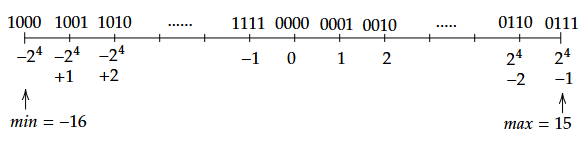

# Entiers relatifs en binaire (Entiers signés)

## Additionner des entiers naturels

### En Base 10
$\begin{array}{ccc}
_1 &  &  \\
  & 5 & 1 \\
\text{+}  & 7 & 5 \\
\hline
1 & 2 & 6
\end{array}$

$5+7=12$ donc $2$ et je retiens $1$

### En Base 2

C'est exactement la même chose.

$\begin{array}{ccccc}
_1 & _1 & _1 &  & \\
  & 1 & 0 & 1 & 1\\
\text{+}  & 1 & 1 & 1 & 0 \\
\hline
1 & 1 & 0 & 0 & 1
\end{array}$

Il faut seulement savoir que:

 - $1 + 1 = 10$  (deux) donc $0$ et je retiens $1$
 - $1 + 1 + 1 = 11$  (trois) donc $1$ et je retiens $1$

!!! question "Additions en base 2 – Exercices"

    Effectue les additions suivantes en **base 2**, en les posant, retenues apparentes..

    1. \( 0010_2 + 0101_2 = \ \_\_\_\_ \)  
    2. \( 1000_2 + 0011_2 = \ \_\_\_\_ \)  
    3. \( 0001_2 + 0010_2 = \ \_\_\_\_ \)
    4. \( 0011_2 + 0011_2 = \ \_\_\_\_ \)  
    5. \( 0110_2 + 0101_2 = \ \_\_\_\_ \)  
    6. \( 1111_2 + 0001_2 = \ \_\_\_\_ \)

    #### Additions à trou
    7. Complète : \( \_\_\_\_ +\ 0011_2 = 0110_2 \)  
    8. Complète : \( 0101_2 +\ \_\_\_\_ = 1111_2 \)

??? warning "Corrigés – Additions en base 2"

    1. \( 0010_2 + 0101_2 = 0111_2 \) → 2 + 5 = 7  
    2. \( 1000_2 + 0011_2 = 1011_2 \) → 8 + 3 = 11  
    3. \( 0001_2 + 0010_2 = 0011_2 \) → 1 + 2 = 3  
    4. \( 0011_2 + 0011_2 = 0110_2 \) → 3 + 3 = 6  
    5. \( 0110_2 + 0101_2 = 1011_2 \) → 6 + 5 = 11  
    6. \( 1111_2 + 0001_2 = 1\ 0000_2 \) → 15 + 1 = 16 (5 bits)

    #### Additions à trou
    7. \( 0101_2 + 0011_2 = 0110_2 \Rightarrow \boxed{0101_2} \)  
    8. \( 0101_2 + 1010_2 = 1111_2 \Rightarrow \boxed{1010_2} \)

## L'opposé d'un nombre

### Définition mathématique

Pour tout entier relatif $x$, il existe un unique entier relatif $y$ tel que $x + y = 0$.  
On appelle ce nombre $y$ **l'opposé** de $x$.

L'opposé d'un nombre $x$, c'est l'unique nombre $y$ tel que $x + y = 0$.

### Application au décimal

Dans notre système de numération usuel, l'opposé de 3, c'est le nombre $y$ tel que $3 + y = 0$.  
Les humains ont choisi de l'écrire **$-3$**, et on le lit "**moins trois**" en français.

## Représentation de l'opposé d'un nombre en binaire

Nous devons trouver un mode de représentation des entiers relatifs qui répond à la définition mathématique de l'opposé d'un nombre, et qui préserve notre addition sachant qu'il n'existe pas de symbole "-" vu qu'on n'a le droit d'utiliser que les symboles 0 et 1.

On va donc résoudre une addition à trou, ce qui nous garantit déjà de préserver l'addition:

Prenons le nombre positif "cinq" \( 101_{2} \).
Pour trouver son opposé $y= \text{moins 5}$, on doit donc résoudre :

\[
101_{2} + y = 0
\]

On va poser l’**addition à trou** pour trouver \( y \) :

$\begin{array}{ccccc}
  & 1 & 0 & 1 \\
\text{+}  & \_ & \_ & \_ \\
\hline
 & 0 & 0 & 0
\end{array}$

??? warning "Corrigé"
    $\begin{array}{ccccc}
    ... _1  & _1 & _1 & _1 & _1 & _1 &  \\
    ...& 0 & 0 & 0 & 1 & 0 & 1 \\
    \text{+} ... & 1 & 1 & 1 & 0 & 1 & 1 \\
    \hline
    & 0 & 0 & 0 & 0 & 0 & 0
    \end{array}$

On remarque que notre opposé est préfixé par une infinité de 1. Tout comme n'importe quel nombre positif peut être préfixé par une infinité de 0, c'est juste qu'on ne les écrit pas.

Pour résoudre ce problème, on ne va travailler que sur des nombres dont **la taille est fixée à l'avance.**

!!! danger "Attention"
    Il faut savoir **à l'avance** en quelle "langue" est écrit un nombre avant de le traduire. 
    
    De la même façon, donnez moi la définition du mot "pain"
    
    ??? warning "Réponse"
        Il s'agit d'une douleur en anglais. Il fallait savoir à l'avance qu'il s'agissait d'un mot anglais.

    Ici c'est pareil, lorsqu'on voit $101101$, il faut savoir si on parle d'un entier relatif ou d'un entier naturel à l'avance, et il faut savoir sur combien de bits on travaille.

    Il est impossible de répondre à la question "Quel nombre est représenté par $10011$ ?" si on ne sait pas à l'avance de quoi on parle.

Ici, "moins cinq" s'écrit:

- $1011$ **sur 4 bits signés**
- $11011$ **sur 5 bits signés**

C'est aussi valable pour "cinq" qui s'écrit:

- $0101$ **sur 4 bits signés**
- $00101$ **sur 5 bits signés**

Le bit le plus à gauche, aussi appelé **bit de poids fort** (celui qui correspond à la plus grande puissance de 2), est appelé le **bit de signe**.
**Il ne peut valoir que 0 si le nombre est positif, et 1 si le nombre est négatif.**

De cette manière, on sait que si on travaille sur 8 bits signés, $10001001$ sera un nombre négatif, et que $00001001$ sera un nombre positif. 

---
A partir de maintenant nous allons découvrir une formule simple pour exhiber l'opposé d'un nombre.

## Complément à 1

Le complément à 1 d'une suite de bits est la même séquence où on a intervertit les 0 et les 1.

Le complément à 1 de $110010$ est $001101$

!!! question "Exercice"
    On travaille **sur 4 bits**. On note $c_1(x)$ le complément à 1 de $x$

    Calculez $x + c_1(x)$ pour $x=$:  

    - $1010$
    - $1101$
    - $0110$
    - $0100$

    Calculez $x+c_1(x)+1$ pour les mêmes valeurs. Qu'obtenez vous **sur 4 bits**?

## Formule pour trouver la représentation de l'opposé
!!! danger "Opposé d'un entier signé $x$ sur $n$ bits"
    Attendu que $x + (c_1(x) + 1) = 0$, c'est que $c_1(x) + 1$ donne l'écriture de l'opposé de $x$

    **La représentation de l'opposé d'un entier signé $x$ s'obtient en calculant $c_1(x) + 1$**

<iframe
  src="https://play.rust-lang.org/?edition=2021&mode=debug&version=stable&code=fn%20main()%20%7B%20println!(%22Hello%2C%20Rust!%22);%20%7D"
  width="100%"
  height="460"
  frameborder="0"
  loading="lazy"
></iframe>

## Intervalle des entiers sur 4 bits signés:

!!! abstract "A savoir"
    - Sur $n$ bits signés, on peut écrire les nombres de $-2^n$ à $2^n-1$ inclus
    - On remarque que $-2^n$ n'a pas d'opposé sur $n$ bits, puisqu'on ne peut pas écrire $2^n$ sur $n$ bits.

!!! question "Exercices"
    - Donnez par ordre croissant tous les entiers sur 3 bits signés
    - Ecrivez $-53$ sur 8 bits
    - Trouvez la représentation décimale de l'entier signé sur 8-bits $10101100$
    - Est-ce qu'on peut représenter 211 sur 8 bits signés? Sur 8 bits non signés?

    