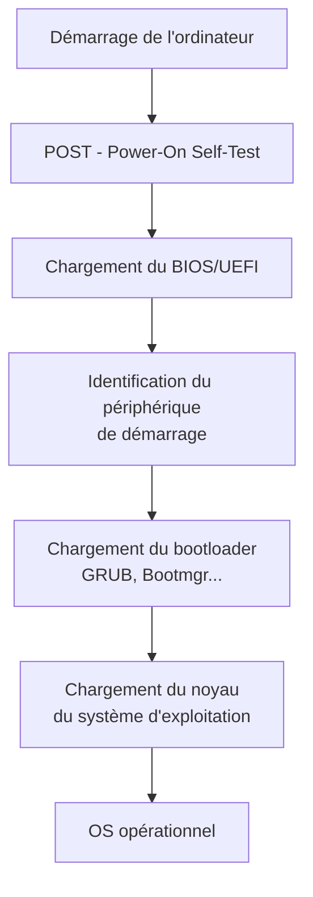

# Systèmes d'exploitation

## 1. Introduction : Pourquoi a-t-on besoin d'un système d'exploitation ?

Imaginons un ordinateur sans système d'exploitation : chaque programme devrait savoir comment communiquer directement avec le processeur, la mémoire, le disque dur, la carte graphique... Chaque développeur devrait réécrire le code pour afficher un pixel à l'écran, lire un fichier, ou gérer plusieurs programmes simultanément. Ce serait un **cauchemar**.

Voici une vidéo de l'institut national de recherche en intelligence artificielle (INRIA), qui explique les principales fonctions d'un OS.

<iframe width="560" height="315" src="https://www.youtube.com/embed/SpCP2oaCx8A" title="YouTube video player" frameborder="0" allow="accelerometer; autoplay; clipboard-write; encrypted-media; gyroscope; picture-in-picture; web-share" referrerpolicy="strict-origin-when-cross-origin" allowfullscreen></iframe>


Le **système d'exploitation** (OS, *Operating System*) est le **chef d'orchestre** de l'ordinateur. C'est un logiciel qui :

- **Abstrait le matériel** : les programmes n'ont pas besoin de connaître les détails du matériel
- **Gère les ressources** : partage le processeur, la mémoire et le stockage entre les applications
- **Assure la sécurité** : empêche les programmes de se perturber mutuellement ou d'accéder à des données interdites
- **Fournit une interface** : permet à l'utilisateur d'interagir avec la machine (graphique ou ligne de commande)

Sans OS, votre ordinateur serait une calculatrice géante, incapable de faire tourner plusieurs programmes en même temps ou de gérer des fichiers de manière organisée.

!!! info "Exemples d'OS"
    - **Desktop** : Windows, macOS, Linux (Ubuntu, Fedora, Debian...)
    - **Mobile** : Android, iOS
    - **Serveur** : Linux (CentOS, Alpine), Windows Server
    - **Embarqué** : FreeRTOS, Zephyr (dans les objets connectés, voitures, routeurs...)

    Il existe des centaines d'OS : [voir l'arbre généalogique](https://eylenburg.github.io/os_familytree.htm)

## 2. Démarrage de l'ordinateur (boot process)

Lorsque vous appuyez sur le bouton d'alimentation, l'ordinateur n'a qu'un seul objectif : **charger le système d'exploitation en mémoire**. Ce processus se déroule en **4 étapes** :

### 2.1 POST (Power-On Self-Test)

L'ordinateur s'allume et le **BIOS** (*Basic Input/Output System*) ou **UEFI** (*Unified Extensible Firmware Interface*) effectue un test automatique des composants :

- Vérification de la mémoire RAM
- Détection du processeur
- Test de la carte graphique
- Inventaire des disques et périphériques

Si un composant est défectueux, le BIOS émet des **bips sonores** ou affiche un message d'erreur.

### 2.2 Chargement du BIOS/UEFI

Le BIOS/UEFI initialise le matériel de base et identifie le **périphérique de démarrage** (disque dur, SSD, clé USB). Il cherche le **bootloader** sur ce périphérique.

### 2.3 Chargement du bootloader

Le **bootloader** (GRUB pour Linux, Bootmgr pour Windows) est un petit programme qui charge le **noyau** (*kernel*) du système d'exploitation en mémoire RAM.

### 2.4 Chargement du noyau

Le noyau prend le contrôle et initialise :

- La **gestion de la mémoire** (allocation de RAM aux processus)
- La **gestion des processus** (création du premier processus : `init` ou `systemd` sous Linux)
- Les **pilotes matériels** (pour communiquer avec disques, réseau, clavier, etc.)

À partir de ce moment, l'OS est opérationnel et peut lancer les applications.



## 3. Les rôles d'un système d'exploitation

Un système d'exploitation remplit **quatre rôles principaux** :

### 3.1 Gestion de la mémoire

Le système d'exploitation **alloue** de la mémoire RAM aux programmes qui en ont besoin et la **récupère** quand ils se terminent.

**Sans OS** : un programme pourrait écraser la mémoire d'un autre programme → plantage général.

**Avec OS** : chaque programme a son propre **espace mémoire isolé**. Si un programme plante, les autres continuent de fonctionner.

!!! example "Exemple concret"
    Vous ouvrez Chrome (2 Go de RAM), Spotify (500 Mo) et Word (300 Mo). L'OS :

    1. Vérifie qu'il y a assez de RAM disponible
    2. Alloue à chaque programme son propre espace mémoire
    3. Empêche Spotify d'accéder à la mémoire de Word

    Si la RAM est pleine, l'OS utilise le **swap** : il écrit temporairement des données sur le disque pour libérer de la RAM (mais c'est **lent**).

### 3.2 Gestion des processus (multitâche)

Un **processus** est un programme en cours d'exécution. L'OS permet de faire tourner **plusieurs processus simultanément** en partageant le temps processeur.

**Comment ça marche ?**

Le processeur ne peut exécuter qu'**une seule instruction à la fois** (par cœur). L'OS utilise un **ordonnanceur** (*scheduler*) qui attribue des **tranches de temps** (quelques millisecondes) à chaque processus à tour de rôle. Ça va tellement vite qu'on a l'impression que tout se passe en parallèle.

!!! example "Ordonnancement"
    - **0-5 ms** : Chrome affiche une page web
    - **5-10 ms** : Spotify décode de la musique
    - **10-15 ms** : Word vérifie l'orthographe
    - **15-20 ms** : Chrome reçoit des données du réseau
    - ...

    L'OS bascule entre les processus des milliers de fois par seconde → illusion de simultanéité.

### 3.3 Gestion du système de fichiers

L'OS organise les données sur le disque sous forme d'**arborescence de fichiers et répertoires**.

**Sans OS** : le disque serait une suite d'octets sans structure. Comment trouver vos photos parmi 500 Go de données ?

**Avec OS** : les fichiers sont organisés en **dossiers** (ou *répertoires*), avec des **permissions** pour contrôler qui peut lire/écrire/exécuter chaque fichier.

Sous Linux, tout commence à la **racine** `/` :

```
/
├── home/           ← Répertoires des utilisateurs
│   ├── alice/
│   └── bob/
├── etc/            ← Fichiers de configuration
├── usr/            ← Programmes installés
│   ├── bin/        ← Exécutables (ls, cd, cat...)
│   └── lib/        ← Bibliothèques partagées
├── var/            ← Données variables (logs, caches)
└── tmp/            ← Fichiers temporaires
```

### 3.4 Gestion des pilotes et matériel

Les **pilotes** (*drivers*) sont des programmes qui permettent à l'OS de communiquer avec le matériel : carte graphique, imprimante, clavier, disque dur, carte réseau...

**Sans pilote** : l'OS ne peut pas utiliser le matériel. Exemple : vous branchez une imprimante, mais Windows ne sait pas comment lui envoyer des données → vous devez installer le pilote.

Sous Linux, la plupart des pilotes sont **intégrés au noyau** ou chargés automatiquement, ce qui explique pourquoi Linux fonctionne souvent "out of the box" sur du matériel standard.

## 4. Interface CLI vs GUI

### 4.1 Interface graphique (GUI)

Une **GUI** (*Graphical User Interface*) utilise des fenêtres, icônes, menus et souris. C'est ce que vous connaissez avec Windows, macOS, ou les interfaces Linux comme GNOME, KDE, XFCE.

**Avantages** : intuitif, accessible aux débutants, agréable visuellement.

**Inconvénients** : consomme beaucoup de ressources (RAM, CPU), moins précis pour certaines tâches.

### 4.2 Interface en ligne de commande (CLI)

Une **CLI** (*Command Line Interface*) utilise un **terminal** où l'on tape des commandes textuelles.

**Avantages** :

- **Rapide** : une commande fait en 1 seconde ce qui prendrait 10 clics
- **Scriptable** : on peut automatiser des tâches répétitives
- **Léger** : ne nécessite pas de RAM ni de GPU
- **Précis** : contrôle total sur ce que fait la machine
- **Distant** : on peut administrer un serveur à distance via SSH

**Inconvénients** : courbe d'apprentissage, il faut connaître les commandes.

!!! tip "CLI sous Windows"
    Même sous Windows, vous pouvez ouvrir un terminal :

    - **CMD** : l'ancien terminal Windows (limité)
    - **PowerShell** : plus moderne, avec un langage de script puissant
    - **WSL** : Windows Subsystem for Linux, un vrai Linux dans Windows

    

Sur un **serveur** (machine sans écran, dans un datacenter), il n'y a **que la CLI** : pas d'interface graphique pour économiser les ressources et améliorer la sécurité.

## 5. Système de fichiers Linux

### 5.1 Chemins absolus et relatifs

#### Chemin absolu

Un **chemin absolu** commence **toujours par `/`** (la racine) et indique l'emplacement exact d'un fichier depuis la racine.

**Exemple** : `/home/alice/Documents/notes.txt`

Peu importe où vous êtes dans l'arborescence, ce chemin vous amène toujours au même fichier.

#### Chemin relatif

Un **chemin relatif** ne commence **pas par `/`** et dépend de votre **position actuelle** dans l'arborescence.

**Exemple** : si vous êtes dans `/home/alice/`, alors :

- `Documents/notes.txt` désigne `/home/alice/Documents/notes.txt`
- `../bob/` désigne `/home/bob/` (on remonte d'un niveau avec `..`)

**Raccourcis** :

- `.` désigne le **répertoire courant**
- `..` désigne le **répertoire parent** (celui au-dessus)
- `~` désigne le **répertoire personnel** de l'utilisateur (`/home/alice` si vous êtes alice)

!!! example "Navigation"
    ```bash
    pwd                    # Affiche : /home/alice
    cd Documents           # Va dans /home/alice/Documents
    pwd                    # Affiche : /home/alice/Documents
    cd ..                  # Remonte à /home/alice
    cd /etc                # Va dans /etc (chemin absolu)
    cd ~/Documents         # Va dans /home/alice/Documents (~ = home)
    ```

## 6. Commandes Linux de base

Voici un **tableau de référence** des commandes essentielles :

### 6.1 Navigation et information

| Commande | Description | Exemple |
|----------|-------------|---------|
| `pwd` | **P**rint **W**orking **D**irectory : affiche le répertoire courant | `pwd` → `/home/alice` |
| `ls` | **L**i**s**t : liste les fichiers et dossiers | `ls` |
| `ls -l` | Liste détaillée (permissions, taille, date) | `ls -l` |
| `ls -a` | Liste **tous** les fichiers (y compris les cachés `.`) | `ls -a` |
| `ls -lh` | Liste avec tailles **h**umainement lisibles (Ko, Mo, Go) | `ls -lh` |
| `cd <dir>` | **C**hange **D**irectory : change de répertoire | `cd Documents` |
| `cd ..` | Remonte au répertoire parent | `cd ..` |
| `cd ~` | Va dans le répertoire personnel | `cd ~` |
| `cd /` | Va à la racine | `cd /` |

### 6.2 Manipulation de fichiers et répertoires

| Commande | Description | Exemple |
|----------|-------------|---------|
| `mkdir <dir>` | **M**a**k**e **dir**ectory : crée un répertoire | `mkdir projet` |
| `mkdir -p a/b/c` | Crée une arborescence complète | `mkdir -p dossier/sous-dossier` |
| `touch <file>` | Crée un fichier vide (ou met à jour la date de modification) | `touch notes.txt` |
| `cp <src> <dest>` | **C**o**p**y : copie un fichier | `cp test.txt backup.txt` |
| `cp -r <dir1> <dir2>` | Copie un répertoire **r**écursivement | `cp -r projet/ backup/` |
| `mv <src> <dest>` | **M**o**v**e : déplace ou renomme | `mv old.txt new.txt` |
| `rm <file>` | **R**e**m**ove : supprime un fichier | `rm test.txt` |
| `rm -r <dir>` | Supprime un répertoire et son contenu | `rm -r dossier/` |
| `rm -rf <dir>` | Supprime **f**orcément (sans confirmation) | ⚠️ **Dangereux** : `rm -rf /` détruit tout ! |

!!! danger "Attention avec rm"
    `rm` supprime **définitivement** les fichiers (pas de corbeille). `rm -rf` est encore plus dangereux : il supprime tout sans demander de confirmation.

### 6.3 Affichage et édition de fichiers

| Commande | Description | Exemple |
|----------|-------------|---------|
| `cat <file>` | Con**cat**enate : affiche le contenu complet d'un fichier | `cat notes.txt` |
| `head <file>` | Affiche les **10 premières lignes** | `head fichier.log` |
| `head -n 5 <file>` | Affiche les 5 premières lignes | `head -n 5 fichier.log` |
| `tail <file>` | Affiche les **10 dernières lignes** | `tail fichier.log` |
| `tail -f <file>` | Affiche les dernières lignes et **suit** les ajouts en temps réel | `tail -f /var/log/syslog` |
| `less <file>` | Affiche un fichier page par page (navigation avec ↑↓, quitter avec `q`) | `less long.txt` |
| `nano <file>` | Éditeur de texte simple (Ctrl+O pour sauver, Ctrl+X pour quitter) | `nano config.txt` |

### 6.4 Recherche

| Commande | Description | Exemple |
|----------|-------------|---------|
| `grep <motif> <file>` | Cherche un motif dans un fichier | `grep "error" fichier.log` |
| `grep -r <motif> <dir>` | Cherche **r**écursivement dans tous les fichiers d'un répertoire | `grep -r "TODO" projet/` |
| `grep -i <motif>` | Recherche **i**nsensible à la casse | `grep -i "erreur" log.txt` |
| `find <dir> -name <nom>` | Trouve des fichiers par nom | `find /home -name "*.txt"` |
| `find <dir> -type f` | Trouve tous les **f**ichiers | `find . -type f` |
| `find <dir> -type d` | Trouve tous les répertoires (**d**irectory) | `find . -type d` |

### 6.5 Redirections et pipes

Les **redirections** permettent de rediriger l'entrée/sortie des commandes. Les **pipes** permettent de chaîner des commandes.

| Syntaxe | Description | Exemple |
|---------|-------------|---------|
| `cmd > file` | Redirige la **sortie** de `cmd` dans `file` (écrase) | `ls > liste.txt` |
| `cmd >> file` | **Ajoute** la sortie à la fin de `file` | `echo "log" >> fichier.log` |
| `cmd < file` | Utilise `file` comme **entrée** de `cmd` | `sort < noms.txt` |
| `cmd1 \| cmd2` | **Pipe** : la sortie de `cmd1` devient l'entrée de `cmd2` | `ls \| grep ".txt"` |

!!! example "Exemples de pipes"
    ```bash
    # Compter le nombre de fichiers dans le répertoire
    ls | wc -l

    # Afficher les 5 fichiers les plus gros
    ls -lh | sort -k5 -h | tail -5

    # Chercher "error" dans tous les logs et compter les occurrences
    grep -r "error" /var/log/ | wc -l

    # Afficher les processus Python en cours
    ps aux | grep python
    ```

### 6.6 Permissions

Sous Linux, chaque fichier a des **permissions** qui déterminent qui peut le lire, l'écrire, ou l'exécuter.

#### Afficher les permissions

```bash
ls -l fichier.txt
-rw-r--r-- 1 alice users 1234 Jan 10 12:00 fichier.txt
```

Décomposition de `-rw-r--r--` :

- **1er caractère** : type (`-` = fichier, `d` = répertoire, `l` = lien symbolique)
- **3 caractères suivants** : permissions du **propriétaire** (alice) → `rw-` = lecture + écriture
- **3 suivants** : permissions du **groupe** (users) → `r--` = lecture seule
- **3 derniers** : permissions des **autres** utilisateurs → `r--` = lecture seule

**Signification** :

- `r` = **r**ead (lecture) : peut lire le fichier
- `w` = **w**rite (écriture) : peut modifier le fichier
- `x` = e**x**ecute (exécution) : peut exécuter le fichier (s'il est un programme ou script)

#### Modifier les permissions avec `chmod`

**Syntaxe symbolique** :

```bash
chmod u+x script.sh     # Ajoute le droit d'exécution pour le user (propriétaire)
chmod g+w fichier.txt   # Ajoute l'écriture pour le group
chmod o-r fichier.txt   # Retire la lecture pour les others
chmod a+x script.sh     # Ajoute l'exécution pour all (u+g+o)
```

**Syntaxe octale** (plus compacte) :

Chaque permission a une valeur : `r=4`, `w=2`, `x=1`. On additionne pour obtenir un chiffre :

- `rwx` = 4+2+1 = **7**
- `rw-` = 4+2 = **6**
- `r-x` = 4+1 = **5**
- `r--` = **4**

```bash
chmod 755 script.sh     # rwxr-xr-x (propriétaire: tout, groupe+autres: lecture+exec)
chmod 644 fichier.txt   # rw-r--r-- (propriétaire: lire+écrire, autres: lire)
chmod 600 secret.txt    # rw------- (seul le propriétaire peut lire/écrire)
```

!!! example "Rendre un script exécutable"
    Vous créez un script Python `test.py`. Par défaut, il n'est pas exécutable :

    ```bash
    ls -l test.py
    -rw-r--r-- 1 alice users 245 Jan 10 12:00 test.py

    ./test.py              # ❌ Erreur : Permission denied

    chmod +x test.py       # Rend le fichier exécutable

    ./test.py              # ✅ Le script s'exécute
    ```

### 6.7 Gestion des processus

Un **processus** est un programme en cours d'exécution. Chaque processus a un **PID** (*Process ID*), un numéro unique.

| Commande | Description | Exemple |
|----------|-------------|---------|
| `ps` | Affiche les processus du terminal actuel | `ps` |
| `ps aux` | Affiche **tous** les processus de tous les utilisateurs | `ps aux` |
| `top` | Affiche les processus en temps réel (CPU, RAM) - sortir avec `q` | `top` |
| `htop` | Version améliorée de `top` (à installer : `sudo apt install htop`) | `htop` |
| `kill <PID>` | Envoie un signal TERM (terminaison propre) au processus | `kill 1234` |
| `kill -9 <PID>` | **Force** l'arrêt du processus (SIGKILL, brutal) | `kill -9 1234` |
| `killall <nom>` | Tue tous les processus avec ce nom | `killall firefox` |

!!! example "Trouver et tuer un processus bloqué"
    ```bash
    # Trouver le PID d'un programme bloqué (ex: Firefox)
    ps aux | grep firefox
    # alice  1234  5.2  2.1  firefox

    # Tuer le processus
    kill 1234

    # Si ça ne marche pas, forcer :
    kill -9 1234
    ```

**Lancer un processus en arrière-plan** :

```bash
python3 serveur.py &      # Le & lance en arrière-plan
jobs                       # Liste les processus en arrière-plan
fg %1                      # Ramène le job 1 au premier plan
```

### 6.8 Gestion des paquets (Alpine Linux)

Alpine utilise `apk` comme gestionnaire de paquets :

| Commande | Description |
|----------|-------------|
| `doas apk update` | Met à jour la liste des paquets disponibles |
| `doas apk upgrade` | Met à jour tous les paquets installés |
| `doas apk add <paquet>` | Installe un paquet |
| `doas apk del <paquet>` | Désinstalle un paquet |
| `apk search <mot>` | Cherche un paquet |

!!! info "doas vs sudo"
    - **`sudo`** : **S**uper**u**ser **do** (utilisé sur Ubuntu, Debian, etc.)
    - **`doas`** : **Do as** (utilisé sur Alpine, OpenBSD) - plus simple et léger

    Les deux permettent d'exécuter une commande avec les privilèges de `root` (superutilisateur).

## 7. TP : Installation d'Alpine Linux dans une machine virtuelle

Nous allons installer **Alpine Linux**, une distribution légère, dans une **machine virtuelle** QEMU. Cette installation est plus technique qu'une installation graphique classique, mais permet de :

- S'habituer à la ligne de commande
- Comprendre toutes les étapes du boot et de l'installation
- Économiser les ressources (Alpine est ultra-léger)

!!! warning "Ressources"
    Les ordinateurs du lycée ne sont pas très puissants. **Fermez tous les programmes inutiles** (Pronote, navigateurs...) pendant le TP pour libérer de la RAM.

### 7.1 Préparation (MSYS2 + QEMU)

Nous utilisons **MSYS2** (un environnement Linux pour Windows) et **QEMU** (un émulateur de machine virtuelle).

1. **Ouvrir MSYS2 UCRT64** (chercher avec la loupe Windows)

2. **Mettre à jour MSYS2** :
   ```bash
   pacman -Syu
   ```
   Répétez jusqu'à voir "there is nothing to do". Si le terminal demande à être fermé, fermez-le et relancez UCRT64.

3. **Installer QEMU** :
   ```bash
   pacman -S mingw-w64-x86_64-qemu
   ```

4. **Télécharger Alpine Linux** :
   ```bash
   wget https://dl-cdn.alpinelinux.org/alpine/v3.21/releases/x86_64/alpine-virt-3.21.3-x86_64.iso
   ```

### 7.2 Installation

**1. Créer un disque dur virtuel de 5 Go**

```bash
qemu-img create -f qcow2 disquedur.qcow2 5G
```

Cette commande crée un fichier `disquedur.qcow2` qui simule un disque dur de 5 Go.

**2. Démarrer la machine virtuelle avec le CD d'installation**

```bash
qemu-system-x86_64 -boot d -cdrom alpine-virt-3.21.3-x86_64.iso -hda disquedur.qcow2 -m 256 -net nic -net user
```

**Explication** :

- `-boot d` : boot sur le CD-ROM (d = drive)
- `-cdrom ...` : insère le fichier ISO comme CD
- `-hda disquedur.qcow2` : branche le disque dur virtuel
- `-m 256` : alloue 256 Mo de RAM (256M)
- `-net nic -net user` : active le réseau

**3. Login**

Une fois le système démarré, login : `root` (pas de mot de passe pour l'instant)

**4. Lancer l'installation**

```bash
setup-alpine
```

**5. Répondre aux questions**

Suivez ces réponses (appuyez sur Entrée pour accepter les valeurs par défaut) :

- **Keyboard layout** : `fr` puis `fr` (clavier français)
- **Hostname** : `localhost` (ou un nom de votre choix)
- **Network** : Entrée (accepter DHCP automatique)
- **Root password** : `root` (simple pour le TP)
- **Timezone** : `Europe/Paris`
- **Proxy** : Entrée (aucun)
- **NTP client** : `chrony` (par défaut)
- **Mirror** : `f` puis Entrée (choix rapide)
- **SSH server** : `openssh` (par défaut)
- **Disk** : `sda` (le disque virtuel créé)
- **Mode** : `sys` (installation complète sur disque)
- **Erase disk ?** : `y` (oui, confirmer)

L'installation démarre. Attendez quelques minutes.

**6. Éteindre**

Une fois l'installation terminée :

```bash
doas poweroff
```

**7. Redémarrer sans le CD**

```bash
qemu-system-x86_64 -hda disquedur.qcow2 -m 256 -nic user,ipv6=off,hostfwd=tcp::22022-:22
```

Maintenant le système boot **depuis le disque virtuel** (plus besoin du CD).

Login : `root` / mot de passe : `root`

!!! success "Vous avez installé Linux !"
    Votre machine virtuelle Alpine Linux est prête. Vous pouvez maintenant :

    - Installer des programmes : `doas apk add python3 nano`
    - Créer des fichiers, naviguer dans l'arborescence
    - Apprendre les commandes Linux dans un environnement réel

### 7.3 Interface graphique (optionnel)

Alpine peut avoir une interface graphique, mais ça consomme beaucoup de ressources. **À la maison**, si vous avez plus de RAM (4 Go ou plus), vous pouvez :

1. Allouer plus de RAM à la VM : `-m 2G` au lieu de `-m 256`
2. Installer un environnement graphique :
   ```bash
   setup-desktop
   ```
   Choisir **xfce** (le plus léger)
3. Redémarrer

Vous aurez alors une interface similaire à Windows :


## 8. Exercices pratiques

### Exercice 1 : Premiers pas

Connectez-vous à votre machine virtuelle Alpine et :

1. Affichez le répertoire courant avec `pwd`
2. Listez les fichiers avec `ls -la`
3. Allez dans `/etc` avec `cd /etc`
4. Affichez le contenu du fichier `/etc/hostname` avec `cat /etc/hostname`
5. Revenez dans votre répertoire personnel avec `cd ~`

### Exercice 2 : Mise à jour et installation

1. Mettez à jour la liste des paquets : `doas apk update`
2. Mettez à jour tous les paquets : `doas apk upgrade`
3. Installez Python et nano : `doas apk add python3 nano`
4. Vérifiez l'installation : `python3 --version`

### Exercice 3 : Script Python

1. Créez un fichier `test.py` avec nano : `nano test.py`
2. Écrivez ce contenu :
   ```python
   #!/usr/bin/python3
   import random
   print(f"Voici un entier aléatoire : {random.randint(1, 100)}")
   ```
3. Sauvegardez (Ctrl+O) et quittez (Ctrl+X)
4. Essayez d'exécuter : `./test.py`
   - **Erreur** : Permission denied
5. Rendez le fichier exécutable : `chmod +x test.py`
6. Exécutez à nouveau : `./test.py` → ça fonctionne !

### Exercice 4 : Création d'arborescence

Créez un fichier `arbo.sh` qui contient toutes les commandes pour créer l'arborescence suivante :

```
Mon_Site/
├── index.html
├── css/
│   └── style.css
├── js/
│   └── script.js
└── images/
    ├── logo.png
    └── banniere.jpg
```

**Solution** :

```bash
#!/bin/bash
mkdir -p Mon_Site/css Mon_Site/js Mon_Site/images
touch Mon_Site/index.html
touch Mon_Site/css/style.css
touch Mon_Site/js/script.js
touch Mon_Site/images/logo.png
touch Mon_Site/images/banniere.jpg
```

Rendez le script exécutable et exécutez-le :

```bash
chmod +x arbo.sh
./arbo.sh
ls -R Mon_Site/
```

### Exercice 5 : Questions de compréhension

1. **Navigation et gestion des répertoires**
   - Quelle est la différence entre `cd /home` et `cd home` ?
   - Quelle commande affiche le répertoire courant ?
   - Comment revenir au répertoire parent ?

??? success "Réponses"
    - `cd /home` : chemin absolu (va toujours dans `/home`)
    - `cd home` : chemin relatif (va dans `home/` depuis le répertoire courant)
    - `pwd` : affiche le répertoire courant
    - `cd ..` : remonte au parent

2. **Listing et informations sur les fichiers**
   - À quoi sert `ls` ? Citez deux options utiles.
   - Quelle différence entre `ls` et `ls -l` ?

??? success "Réponses"
    - `ls` : liste les fichiers
    - Options : `-a` (tout, y compris les cachés), `-l` (détails), `-h` (tailles lisibles)
    - `ls -l` : affiche les permissions, propriétaire, taille, date

3. **Création et suppression**
   - Comment créer un fichier vide ? (deux méthodes)
   - Supprimer un répertoire vide ? Un répertoire non vide ?

??? success "Réponses"
    - `touch fichier.txt` ou `> fichier.txt`
    - Vide : `rmdir dossier/` ou `rm -r dossier/`
    - Non vide : `rm -r dossier/`

4. **Copie et déplacement**
   - Copier `source.txt` en `destination.txt` ?
   - Renommer `test.txt` en `test2.txt` ?

??? success "Réponses"
    - `cp source.txt destination.txt`
    - `mv test.txt test2.txt`

5. **Recherche de texte**
   - Chercher un mot-clé dans un fichier ?
   - Chercher "linux" dans tous les fichiers du répertoire ?

??? success "Réponses"
    - `grep "mot" fichier.txt`
    - `grep -r "linux" .`

6. **Permissions**
   - Afficher les permissions d'un fichier ?
   - Que signifie `rwxr-xr--` ?
   - À quoi sert `chmod` ?

??? success "Réponses"
    - `ls -l fichier`
    - Propriétaire : lecture+écriture+exécution, groupe : lecture+exécution, autres : lecture
    - `chmod` : modifier les permissions. Ex : `chmod +x script.sh`

7. **Recherche de fichiers**
   - Chercher un fichier `notes.txt` ?
   - Trouver tous les fichiers `.txt` ?

??? success "Réponses"
    - `find . -name "notes.txt"`
    - `find . -name "*.txt"`

8. **Affichage du contenu**
   - Afficher tout le contenu d'un fichier ?
   - Afficher les premières/dernières lignes ?

??? success "Réponses"
    - `cat fichier.txt`
    - Premières : `head fichier.txt`, dernières : `tail fichier.txt`

9. **Redirections et pipes**
   - Que fait `ls > liste.txt` ?
   - À quoi sert `|` ?

??? success "Réponses"
    - Redirige la sortie de `ls` dans `liste.txt` (écrase le fichier)
    - Pipe : envoie la sortie d'une commande vers une autre. Ex : `ls | grep ".txt"`

10. **Processus**
    - Afficher les processus en temps réel ?
    - Lister tous les processus ?

??? success "Réponses"
    - `top` ou `htop`
    - `ps aux`

## 9. Résumé

- Un **système d'exploitation** gère le matériel, la mémoire, les processus, et le système de fichiers
- Le **boot process** charge l'OS en mémoire (POST → BIOS → Bootloader → Kernel)
- La **CLI** est plus rapide et scriptable que la GUI, mais nécessite de connaître les commandes
- Le système de fichiers Linux est une **arborescence** partant de `/`
- Les **permissions** contrôlent qui peut lire/écrire/exécuter un fichier
- Les **processus** sont des programmes en cours d'exécution
- Les **redirections** (`>`, `<`) et **pipes** (`|`) permettent de chaîner des commandes

**Commandes essentielles à retenir** : `pwd`, `ls`, `cd`, `mkdir`, `touch`, `cp`, `mv`, `rm`, `cat`, `grep`, `chmod`, `ps`, `top`, `kill`

---

**Pour aller plus loin** :

- Tutoriel Linux complet (5h) : [https://www.youtube.com/watch?v=ZtqBQ68cfJc](https://www.youtube.com/watch?v=ZtqBQ68cfJc)
- Arbre généalogique des OS : [https://eylenburg.github.io/os_familytree.htm](https://eylenburg.github.io/os_familytree.htm)
