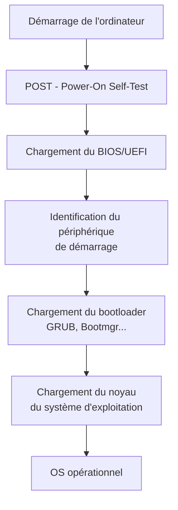

# Systèmes d'exploitation

## 1. Introduction : Pourquoi a-t-on besoin d'un système d'exploitation ?

Imaginons un ordinateur sans système d'exploitation : chaque programme devrait savoir comment communiquer directement avec le processeur, la mémoire, le disque dur, la carte graphique... Chaque développeur devrait réécrire le code pour afficher un pixel à l'écran, lire un fichier, ou gérer plusieurs programmes simultanément. Ce serait un **cauchemar**.

Voici une vidéo de l'institut national de recherche en intelligence artificielle (INRIA), qui explique les principales fonctions d'un OS.

<iframe width="560" height="315" src="https://www.youtube.com/embed/SpCP2oaCx8A" title="YouTube video player" frameborder="0" allow="accelerometer; autoplay; clipboard-write; encrypted-media; gyroscope; picture-in-picture; web-share" referrerpolicy="strict-origin-when-cross-origin" allowfullscreen></iframe>


Le **système d'exploitation** (OS, *Operating System*) est le **chef d'orchestre** de l'ordinateur. C'est un logiciel qui :

- **Abstrait le matériel** : les programmes n'ont pas besoin de connaître les détails du matériel
- **Gère les ressources** : partage le processeur, la mémoire et le stockage entre les applications
- **Assure la sécurité** : empêche les programmes de se perturber mutuellement ou d'accéder à des données interdites
- **Fournit une interface** : permet à l'utilisateur d'interagir avec la machine (graphique ou ligne de commande)

Sans OS, votre ordinateur serait une calculatrice géante, incapable de faire tourner plusieurs programmes en même temps ou de gérer des fichiers de manière organisée.

!!! info "Exemples d'OS"
    - **Desktop** : Windows, macOS, Linux (Ubuntu, Fedora, Debian...)
    - **Mobile** : Android, iOS
    - **Serveur** : Linux (CentOS, Alpine), Windows Server
    - **Embarqué** : FreeRTOS, Zephyr (dans les objets connectés, voitures, routeurs...)

    Il existe des centaines d'OS : [voir l'arbre généalogique](https://eylenburg.github.io/os_familytree.htm)

## 2. Démarrage de l'ordinateur (boot process)

Lorsque vous appuyez sur le bouton d'alimentation, l'ordinateur n'a qu'un seul objectif : **charger le système d'exploitation en mémoire**. Ce processus se déroule en **4 étapes** :

### 2.1 POST (Power-On Self-Test)

L'ordinateur s'allume et le **BIOS** (*Basic Input/Output System*) ou **UEFI** (*Unified Extensible Firmware Interface*) effectue un test automatique des composants :

- Vérification de la mémoire RAM
- Détection du processeur
- Test de la carte graphique
- Inventaire des disques et périphériques

Si un composant est défectueux, le BIOS émet des **bips sonores** ou affiche un message d'erreur.

### 2.2 Chargement du BIOS/UEFI

Le BIOS/UEFI initialise le matériel de base et identifie le **périphérique de démarrage** (disque dur, SSD, clé USB). Il cherche le **bootloader** sur ce périphérique.

### 2.3 Chargement du bootloader

Le **bootloader** (GRUB pour Linux, Bootmgr pour Windows) est un petit programme qui charge le **noyau** (*kernel*) du système d'exploitation en mémoire RAM.

### 2.4 Chargement du noyau

Le noyau prend le contrôle et initialise :

- La **gestion de la mémoire** (allocation de RAM aux processus)
- La **gestion des processus** (création du premier processus : `init` ou `systemd` sous Linux)
- Les **pilotes matériels** (pour communiquer avec disques, réseau, clavier, etc.)

À partir de ce moment, l'OS est opérationnel et peut lancer les applications.



## 3. Les rôles d'un système d'exploitation

Un système d'exploitation remplit **quatre rôles principaux** :

### 3.1 Gestion de la mémoire

Le système d'exploitation **alloue** de la mémoire RAM aux programmes qui en ont besoin et la **récupère** quand ils se terminent.

**Sans OS** : un programme pourrait écraser la mémoire d'un autre programme → plantage général.

**Avec OS** : chaque programme a son propre **espace mémoire isolé**. Si un programme plante, les autres continuent de fonctionner.

!!! example "Exemple concret"
    Vous ouvrez Chrome (2 Go de RAM), Spotify (500 Mo) et Word (300 Mo). L'OS :

    1. Vérifie qu'il y a assez de RAM disponible
    2. Alloue à chaque programme son propre espace mémoire
    3. Empêche Spotify d'accéder à la mémoire de Word

    Si la RAM est pleine, l'OS utilise le **swap** : il écrit temporairement des données sur le disque pour libérer de la RAM (mais c'est **lent**).

### 3.2 Gestion des processus (multitâche)

Un **processus** est un programme en cours d'exécution. L'OS permet de faire tourner **plusieurs processus simultanément** en partageant le temps processeur.

**Comment ça marche ?**

Le processeur ne peut exécuter qu'**une seule instruction à la fois** (par cœur). L'OS utilise un **ordonnanceur** (*scheduler*) qui attribue des **tranches de temps** (quelques millisecondes) à chaque processus à tour de rôle. Ça va tellement vite qu'on a l'impression que tout se passe en parallèle.

!!! example "Ordonnancement"
    - **0-5 ms** : Chrome affiche une page web
    - **5-10 ms** : Spotify décode de la musique
    - **10-15 ms** : Word vérifie l'orthographe
    - **15-20 ms** : Chrome reçoit des données du réseau
    - ...

    L'OS bascule entre les processus des milliers de fois par seconde → illusion de simultanéité.

### 3.3 Gestion du système de fichiers

L'OS organise les données sur le disque sous forme d'**arborescence de fichiers et répertoires**.

**Sans OS** : le disque serait une suite d'octets sans structure. Comment trouver vos photos parmi 500 Go de données ?

**Avec OS** : les fichiers sont organisés en **dossiers** (ou *répertoires*), avec des **permissions** pour contrôler qui peut lire/écrire/exécuter chaque fichier.

Sous Linux, tout commence à la **racine** `/` :

```
/
├── home/           ← Répertoires des utilisateurs
│   ├── alice/
│   └── bob/
├── etc/            ← Fichiers de configuration
├── usr/            ← Programmes installés
│   ├── bin/        ← Exécutables (ls, cd, cat...)
│   └── lib/        ← Bibliothèques partagées
├── var/            ← Données variables (logs, caches)
└── tmp/            ← Fichiers temporaires
```

### 3.4 Gestion des pilotes et matériel

Les **pilotes** (*drivers*) sont des programmes qui permettent à l'OS de communiquer avec le matériel : carte graphique, imprimante, clavier, disque dur, carte réseau...

**Sans pilote** : l'OS ne peut pas utiliser le matériel. Exemple : vous branchez une imprimante, mais Windows ne sait pas comment lui envoyer des données → vous devez installer le pilote.

Sous Linux, la plupart des pilotes sont **intégrés au noyau** ou chargés automatiquement, ce qui explique pourquoi Linux fonctionne souvent "out of the box" sur du matériel standard.

## 4. Interface CLI vs GUI

### 4.1 Interface graphique (GUI)

Une **GUI** (*Graphical User Interface*) utilise des fenêtres, icônes, menus et souris. C'est ce que vous connaissez avec Windows, macOS, ou les interfaces Linux comme GNOME, KDE, XFCE.

**Avantages** : intuitif, accessible aux débutants, agréable visuellement.

**Inconvénients** : consomme beaucoup de ressources (RAM, CPU), moins précis pour certaines tâches.

### 4.2 Interface en ligne de commande (CLI)

Une **CLI** (*Command Line Interface*) utilise un **terminal** où l'on tape des commandes textuelles.

**Avantages** :

- **Rapide** : une commande fait en 1 seconde ce qui prendrait 10 clics
- **Scriptable** : on peut automatiser des tâches répétitives
- **Léger** : ne nécessite pas de RAM ni de GPU
- **Précis** : contrôle total sur ce que fait la machine
- **Distant** : on peut administrer un serveur à distance via SSH

**Inconvénients** : courbe d'apprentissage, il faut connaître les commandes.

!!! tip "CLI sous Windows"
    Même sous Windows, vous pouvez ouvrir un terminal :

    - **CMD** : l'ancien terminal Windows (limité)
    - **PowerShell** : plus moderne, avec un langage de script puissant
    - **WSL** : Windows Subsystem for Linux, un vrai Linux dans Windows

    

Sur un **serveur** (machine sans écran, dans un datacenter), il n'y a **que la CLI** : pas d'interface graphique pour économiser les ressources et améliorer la sécurité.

## Résumé

- Un **système d'exploitation** gère le matériel, la mémoire, les processus, et le système de fichiers
- Le **boot process** charge l'OS en mémoire (POST → BIOS → Bootloader → Kernel)
- L'OS remplit **4 rôles** : gestion de la mémoire, des processus, du système de fichiers, et des pilotes
- La **CLI** est plus rapide et scriptable que la GUI, mais nécessite de connaître les commandes
- Les **serveurs** utilisent uniquement la CLI pour économiser les ressources

---

**Pour aller plus loin** :

- Arbre généalogique des OS : [https://eylenburg.github.io/os_familytree.htm](https://eylenburg.github.io/os_familytree.htm)
