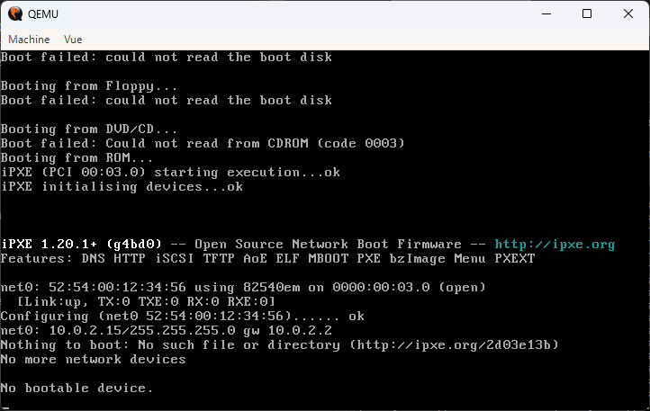
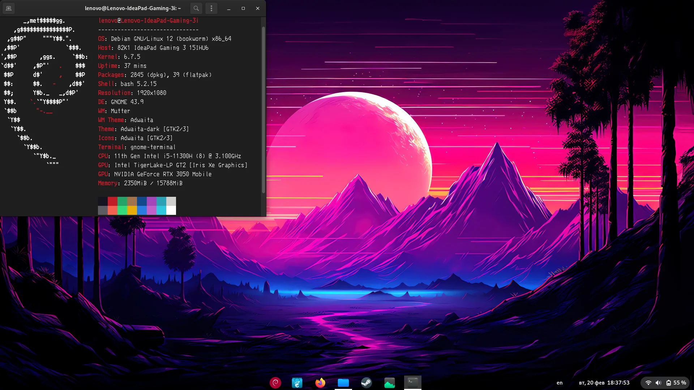

# TP : Installation d'Alpine Linux

## Introduction

Nous allons installer **Alpine Linux**, une distribution légère, dans une **machine virtuelle** QEMU. Cette installation est plus technique qu'une installation graphique classique, mais permet de :

- S'habituer à la ligne de commande
- Comprendre toutes les étapes du boot et de l'installation
- Économiser les ressources (Alpine est ultra-léger)

!!! warning "Ressources"
    Les ordinateurs du lycée ne sont pas très puissants. **Fermez tous les programmes inutiles** (Pronote, navigateurs...) pendant le TP pour libérer de la RAM.

## 1. Préparation (MSYS2 + QEMU)

Nous utilisons **MSYS2** (un environnement Linux pour Windows) et **QEMU** (un émulateur de machine virtuelle). Si des erreurs apparaissent lors de l'exécution des commandes suivantes, il s'agit très certainement d'un problème de connexion. Relancez.

1. **Ouvrir MSYS2 UCRT64** (chercher avec la loupe Windows)

2. **Mettre à jour MSYS2** :
   ```bash
   pacman -Syu
   ```
   Répétez jusqu'à voir "there is nothing to do". Si le terminal demande à être fermé, fermez-le et relancez UCRT64.

   !!! hint "Gestionnaire de paquet"
      `pacman` est un gestionnaire de paquets (package manager). Il permet d'installer des applications en ligne de commande en assurant que tout ce qui est installé sur la machine reste compatible. Sous alpine, on aura `apk`, sous debian et dérivées, on a `apt`, sous fédora, `dnf`, sous windows, `winget`.

3. **Installer QEMU** :
   ```bash
   pacman -S --needed mingw-w64-ucrt-x86_64-qemu
   ```

   !!! hint "Gestionnaire de machines virtuelle"
      `qemu` permet de créer et d'exécuter des machines virtuelles sur un ordinateur. On peut voir une machine virtuelle est un vrai ordinateur qui tourne sur votre ordinateur, et elle en emprunte les ressources pour fonctionner. Il ne s'agit pas d'une simulation, il s'agit véritablement d'un système qui tourne sur votre PC.

   !!! tip "Vérifier que ça a marché"
      Lancez la commande suivante:

      ```bash
      pacman -S --needed mingw-w64-ucrt-x86_64-qemu
      ```

      L'écran suivant doit apparaître

      

      Un ordinateur s'est lancé. Cet ordinateur n'a aucun système d'exploitation d'installé, il n'a que les composants de base de l'architecture de von Veumann. Il cherche à lancer un système d'exploitation. Il cherche partout, mais il ne trouve pas de matériel sur lequel réside un OS: `No bootable device`

      Vous pouvez fermer la fenêtre (=débrancher la prise de courant de l'ordinateur)

4. **Télécharger Alpine Linux** :
   ```bash
   wget https://dl-cdn.alpinelinux.org/alpine/v3.21/releases/x86_64/alpine-virt-3.21.3-x86_64.iso
   ```

   On télécharge l'image du disque d'installation de Linux Alpine. On pourrait très bien la graver sur un vrai disque ou une vraie clé usb en la rendant bootable (avec des logiciels comme `balena etcher`), mais ici, on n'en aura pas besoin.

   !!! hint "wget"
      `wget`est une commande linux standard disponible dans la quasi totalité des distributions par défaut. Elle permet tout simplement de télécharger un fichier dans le répertoire courant.


## 2. Installation de l'OS

Grâce à `qemu`, on va créer un PC de toute pièce. On va commencer par créer un disque dur afin de pouvoir rendre persistantes nos modifications (souvenez vous, sans mémoire de stackage, rien ne peut être persistent entre deux allumages de PC, y compris le système d'exploitation).

### 2.1 Créer un disque dur virtuel de 5 Go

```bash
qemu-img create -f qcow2 disquedur.qcow2 5G
```

Cette commande crée un fichier `disquedur.qcow2` qui représente un disque dur vierge de 5 Go.

### 2.2 Démarrer la machine virtuelle avec le CD d'installation

Ici, on va lancer un ordinateur possédant l'architecture x86_64


!!! hint "Architecture x86_64"

   **Le 86**

   Intel lance en 1978 le processeur 8086, premier d'une longue lignée. Les suivants (80186, 80286, 80386, 80486...) prolongent cette famille en restant compatibles entre eux — un programme compilé pour le 8086 tourne sur un 80486.

   Par abus de langage, toute cette famille s'appelle x86 (le "x" remplaçant le préfixe variable 80/...). C'est une architecture 32 bits : les registres (les ACC du LCM, car en vrai il y a "plusieurs ACC") font 32 bits, on peut adresser au max 2³² = 4 Go de RAM.

   **Le "64"**

   En 2003, AMD étend l'architecture x86 à 64 bits (registres 64 bits, espace d'adressage 2⁶⁴). Intel adopte ensuite le même standard.

   Le nom complet est x86-64 (ou AMD64, ou x64) : c'est l'architecture x86, étendue à 64 bits.

La commande suivante lance un ordinateur x86_64 muni d'un CDROM dans lequel on a inséré le CD d'installation d'Alpine. On dit de plus qu'il faut booter sur ce CD-ROM. On y branche aussi notre disque dur.

```bash
qemu-system-x86_64 -boot d -cdrom alpine-virt-3.21.3-x86_64.iso -hda disquedur.qcow2 -m 256 -net nic -net user
```

**Explication** :

- `-boot d` : boot sur le CD-ROM (d = drive)
- `-cdrom ...` : insère le fichier ISO comme CD
- `-hda disquedur.qcow2` : branche le disque dur virtuel
- `-m 256` : alloue 256 Mo de RAM (256M)
- `-net nic -net user` : active une carte réseau

### 2.3 Login

Le système d'exploitation se charge en RAM depuis le disque d'installation. Maintenant l'objectif c'est de ne plus avoir besoin du disque d'installation. 

Installer un système d'exploitation, c'est tout simplement le faire persister sur un disque dur avec des paramètres que nous allons indiquer.

Une fois le système démarré, se connecter avec le login : `root` (pas de mot de passe pour l'instant)

Une version minimaliste d'Alpine est maintenant disponible. Un prompt attend alors que vous lui donniez des commandes.

### 2.4 Lancer l'installation

```bash
setup-alpine
```

Attention, le clavier est configuré en QWERTY par défaut. C'est souvent le cas à l'installation. Il faut écrire `setup)qlpine`. Une des premières questions sera la configuration du clavier.


### 2.5 Répondre aux questions

Suivez ces réponses (appuyez sur Entrée pour accepter les valeurs par défaut) :

- **Keyboard layout** : `fr` puis `fr` (clavier français). Le clavier se comportera maintenant 'normalement'
- **Interfaces** : Entrée (tout accepter en appuyant sur Entrée)
- **Root password** : `root` (simple pour le TP. Par sécurité, vous ne verrez pas les caractères que vous tapez, c'est normal)
- **Timezone** : `Europe/Paris`
- **Proxy** : Entrée (aucun)
- **NTP client** : `chrony` (par défaut)
- **Mirror** : `f` puis Entrée (choix di mirror le plus rapide)
- **User** : `padawan` puis Entrée (création de l'utilisateur padawan, mettez aussi padawan en mot de passe)
- **SSH server** : `openssh` (par défaut)
- **Disk** : `sda` (le disque virtuel créé)
- **Mode** : `sys` (installation complète sur disque)
- **Erase disk ?** : `y` (oui, confirmer, sinon le processus s'arrête et vous devez tout refaire)

L'installation démarre. Attendez quelques minutes.

### 2.6 Éteindre

Une fois l'installation terminée :

```bash
poweroff
```

!!! hint "Mise hors tension"
   Il faut demander à la machine de s'éteindre avec cette commande, il ne faut plus simplement fermer la fenêtre ou vous risquez très probablement de corrompre votre système d'exploitation et de devoir tout réinstaller.


### 2.7 Redémarrer sans le CD

Maintenant le système bootera **depuis le disque dur** (plus besoin du CD).

On modifie donc la configuration de la machine. On lui rattache le disque dur, et dans la phase de démarrage, le PC verra qu'il y a un système d'exploitation dessus qu'il faut charger.

Voici la **commande définitive** pour maintenant lancer votre PC avec une distribution Alpine:

```bash
qemu-system-x86_64 -hda disquedur.qcow2 -m 256 -nic user,ipv6=off,hostfwd=tcp::22022-:22
```

J'ai aussi modifié la configuration de la carte réseau, mais je ne m'étendrai pas là dessus.

Login : `padawan` / mot de passe : `padawan`

!!! success "Vous avez installé Linux !"
    Votre machine virtuelle Alpine Linux est prête. Vous pouvez maintenant :

    - Installer des programmes : `doas apk add python3 nano`
    - Créer des fichiers, naviguer dans l'arborescence
    - Apprendre les commandes Linux dans un environnement réel


### 2.8 Réflexe

Il faut avoir le réflexe de mettre à jour régulièrement le système. Y compris à la première utilisation.

Récupération de la liste des paquets qu'on peut mettre à jour

```bash
doas apk update
```

Mise à jour

```bash
doas apk upgrade
```

!!! hint "doas"
   Les opérations qu'on a demandé sont sensibles. Seul un super utilisateur peut les exécuter. Lorsqu'on a créé le user padawan, on lui a donné le droit d'exécuter des commandes comme s'il était le super utilisateur. Mais ça requiert de préfixer ces commandes avec `doas`pour réaliser ce qu'on appelle une élévation de privilèges.

   doas est une spécificité alpine. Dans beaucoup d'autres distributions, la commande équivalente est `sudo`. Il est d'ailleurs possible de configurer sudo sous alpine.

## 3. Interface graphique (optionnel)

Alpine peut avoir une interface graphique, mais ça consomme beaucoup de ressources. **À la maison**, si vous avez plus de RAM (4 Go ou plus), vous pouvez :

1. Allouer plus de RAM à la VM : `-m 4G` au lieu de `-m 256`
2. Installer un environnement graphique :
   ```bash
   setup-desktop
   ```
   Choisir **xfce** (le plus léger)
3. Redémarrer

Vous aurez alors une interface similaire à Windows :



Ca n'a pas d'intérêt en virtualisation où on cherche justement à limiter au maximum l'utilisation de ressources inutiles.

## 4. Exercices pratiques - Commandes linux

### Exercice 1 : Premiers pas

Connectez-vous à votre machine virtuelle Alpine et :

1. Affichez le répertoire courant avec `pwd`
2. Listez les fichiers avec `ls -la`
3. Allez dans `/etc` avec `cd /etc`
4. Affichez le contenu du fichier `/etc/hostname` avec `cat /etc/hostname`
5. Revenez dans votre répertoire personnel avec `cd ~`

### Exercice 2 : Mise à jour et installation

3. Installez Python et nano : `doas apk add python3 nano`
4. Vérifiez l'installation : `python3 --version`

### Exercice 3 : Script Python

1. Créez un fichier `test.py` avec nano : `nano test.py`
2. Écrivez ce contenu :
   ```python
   #!/usr/bin/python3
   import random
   print(f"Voici un entier aléatoire : {random.randint(1, 100)}")
   ```
3. Sauvegardez (Ctrl+O) et quittez (Ctrl+X)
4. Essayez d'exécuter : `./test.py`
   - **Erreur** : Permission denied
5. Rendez le fichier exécutable : `chmod +x test.py`
6. Exécutez à nouveau : `./test.py` → ça fonctionne !

### Exercice 4 : Création d'arborescence

Créez un fichier `arbo.sh` qui contient toutes les commandes pour créer l'arborescence suivante :

```
Mon_Site/
├── index.html
├── css/
│   └── style.css
├── js/
│   └── script.js
└── images/
    ├── logo.png
    └── banniere.jpg
```

**Solution** :

```bash
#!/bin/bash
mkdir -p Mon_Site/css Mon_Site/js Mon_Site/images
touch Mon_Site/index.html
touch Mon_Site/css/style.css
touch Mon_Site/js/script.js
touch Mon_Site/images/logo.png
touch Mon_Site/images/banniere.jpg
```

Rendez le script exécutable et exécutez-le :

```bash
chmod +x arbo.sh
./arbo.sh
ls -R Mon_Site/
```

### Exercice 5 : Questions de compréhension

1. **Navigation et gestion des répertoires**
   - Quelle est la différence entre `cd /home` et `cd home` ?
   - Quelle commande affiche le répertoire courant ?
   - Comment revenir au répertoire parent ?

??? success "Réponses"
    - `cd /home` : chemin absolu (va toujours dans `/home`)
    - `cd home` : chemin relatif (va dans `home/` depuis le répertoire courant)
    - `pwd` : affiche le répertoire courant
    - `cd ..` : remonte au parent

2. **Listing et informations sur les fichiers**
   - À quoi sert `ls` ? Citez deux options utiles.
   - Quelle différence entre `ls` et `ls -l` ?

??? success "Réponses"
    - `ls` : liste les fichiers
    - Options : `-a` (tout, y compris les cachés), `-l` (détails), `-h` (tailles lisibles)
    - `ls -l` : affiche les permissions, propriétaire, taille, date

3. **Création et suppression**
   - Comment créer un fichier vide ? (deux méthodes)
   - Supprimer un répertoire vide ? Un répertoire non vide ?

??? success "Réponses"
    - `touch fichier.txt` ou `> fichier.txt`
    - Vide : `rmdir dossier/` ou `rm -r dossier/`
    - Non vide : `rm -r dossier/`

4. **Copie et déplacement**
   - Copier `source.txt` en `destination.txt` ?
   - Renommer `test.txt` en `test2.txt` ?

??? success "Réponses"
    - `cp source.txt destination.txt`
    - `mv test.txt test2.txt`

5. **Recherche de texte**
   - Chercher un mot-clé dans un fichier ?
   - Chercher "linux" dans tous les fichiers du répertoire ?

??? success "Réponses"
    - `grep "mot" fichier.txt`
    - `grep -r "linux" .`

6. **Permissions**
   - Afficher les permissions d'un fichier ?
   - Que signifie `rwxr-xr--` ?
   - À quoi sert `chmod` ?

??? success "Réponses"
    - `ls -l fichier`
    - Propriétaire : lecture+écriture+exécution, groupe : lecture+exécution, autres : lecture
    - `chmod` : modifier les permissions. Ex : `chmod +x script.sh`

7. **Recherche de fichiers**
   - Chercher un fichier `notes.txt` ?
   - Trouver tous les fichiers `.txt` ?

??? success "Réponses"
    - `find . -name "notes.txt"`
    - `find . -name "*.txt"`

8. **Affichage du contenu**
   - Afficher tout le contenu d'un fichier ?
   - Afficher les premières/dernières lignes ?

??? success "Réponses"
    - `cat fichier.txt`
    - Premières : `head fichier.txt`, dernières : `tail fichier.txt`

9. **Redirections et pipes**
   - Que fait `ls > liste.txt` ?
   - À quoi sert `|` ?

??? success "Réponses"
    - Redirige la sortie de `ls` dans `liste.txt` (écrase le fichier)
    - Pipe : envoie la sortie d'une commande vers une autre. Ex : `ls | grep ".txt"`

10. **Processus**
    - Afficher les processus en temps réel ?
    - Lister tous les processus ?

??? success "Réponses"
    - `top` ou `htop`
    - `ps aux`

## Résumé

Vous avez maintenant :

- Installé **Alpine Linux** dans une machine virtuelle QEMU
- Appris à utiliser les **commandes de base** Linux
- Compris le fonctionnement des **permissions**
- Créé et exécuté des **scripts**
- Manipulé des **fichiers et répertoires**

Ces compétences sont fondamentales pour comprendre les systèmes d'exploitation et l'administration système.

---

**Commandes pour démarrer/arrêter la VM** :

- **Démarrer** : `qemu-system-x86_64 -hda disquedur.qcow2 -m 256 -nic user,ipv6=off,hostfwd=tcp::22022-:22`
- **Arrêter** : `doas poweroff`
