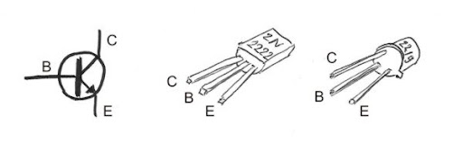
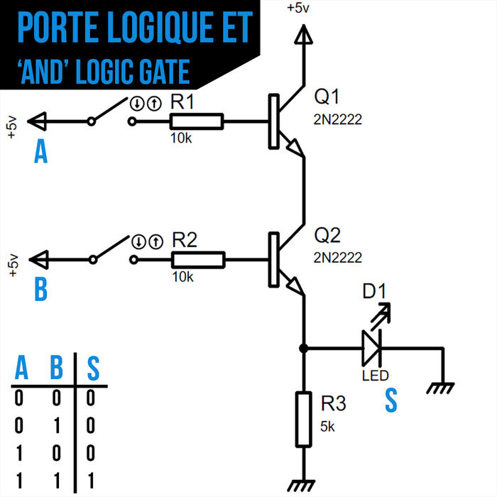
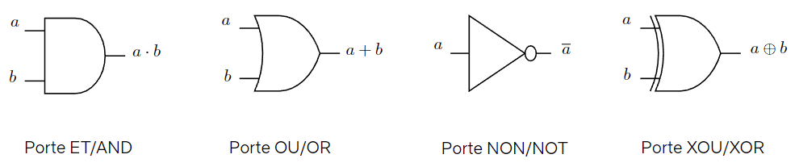
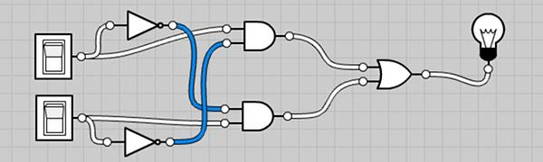
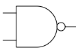

# Circuits logiques

## Un peu d'électronique

### Le transistor

Le fonctionnement d'un ordinateur réside presque essentiellement sur un composant inventé en 1947 et qui ne cesse de se perfectionner et de se miniaturiser encore aujourd'hui: le transistor.

Il existe des transistors de diverses technologies. Ici je vous présente le PNP.

C'est un composant électronique doté de 3 pattes:

- (C) Le collecteur
- (B) La base
- L'émetteur

Voici son symbole électrique et ce à quoi ça ressemble:


L'objet n'est pas ici d'être expert en transistors mais de saisir un de ses usages fondamentaux: **L'interrupteur commandé**.

Si la tension à la base n'est pas suffisamment forte, le courant entre le collecteur et l'émetteur est coupé.

### Une opération logique avec des transistors : ET



La LED ne s'allumera que si la tension est suffisante à la base de Q1 et de Q2. Si l'une ou l'autre des bases n'est pas alimentée, le courant est coupé et la LED s'éteint.


## Portes et Circuits logiques

On peut résumer ces circuits électroniques dans des composants qu'on appelle des **portes logiques**. Chaque porte logique réalise une opération booléenne élémentaire.

Le circuit électronique précédent se résume entièrement à la porte logique ET. Voici les représentations des différentes portes logiques :



### Exemple de circuit logique

Un **circuit logique** est un assemblage de portes logiques connectées entre elles. Les entrées du circuit sont les variables booléennes, et la sortie est le résultat de l'expression booléenne correspondante.

Par exemple, le circuit suivant réalise l'expression $\overline{a.b}$ (c'est une porte NAND) :

- On connecte $a$ et $b$ à une porte ET.
- On connecte la sortie de la porte ET à une porte NON.
- La sortie finale est $\overline{a.b}$.

### Exercices

!!! question "Interrupteurs et lampe"
    On donne le circuit logique suivant avec les interrupteurs a (en haut) et b (en bas). L'interrupteur est à 1 s'il est fermé.

    

    On note la lampe S. La lampe est à 1 si elle est allumée.

    - Exprimez S en fonction de a et de b.
    - Etudiez la table de vérité de S
    - Proposez une simplification drastique de ce circuit.


!!! question "Porte NAND"
    La porte NAND réalise l'opération NON(A ET B), i.e. $\overline{a.b}$

    - Dressez la table de vérité de la porte NAND

    Voici son comment elle est représentée sur un circuit:

    

    Sachant que $\bar{\bar{x}} = x $, à l'aide de la loi de Morgan, exprimez $a+b$ unqiuement grâces aux opérations ET et NON.


!!! question "Turing Complete"
    Ces exercices sont les premiers niveaux d'un jeu nommé "[turing complete](https://store.steampowered.com/app/1444480/Turing_Complete/)". Ce jeu, partant de la simple porte NAND, vous emmène jsuqu'à construire un ordinateur entier.

    Au début des exercices, seule la porte NAND est utilisable. A chaque fois que vous arrivez à créer une nouvelle porte, elle devient utilisable.

    Réalisez chacun de ces exercices les uns sous les autres dans l'interface suivante et sauvegardez votre travail avec le bouton "télécharger le circuit".

    - Créer une porte NOT. Seule porte autorisée: NAND
    - Créer une porte AND (on utilisera les lois de de Morgan pour exprimer AND à partir de NAND et NOT)
    - Créer une porte OR (on utilisera aussi les lois de de Morgan)
    - Créer une porte NOR
    - Créer une porte XOR

    Pourquoi appelle-t-on une porte NAND une porte universelle?

    Sauvegardez votre circuit, et réalisez le même exercice, cette fois en partant de la porte NOR. Il faudra peut-être réaliser les portes dans un ordre différent.

```{.logic showonly="in out nand not and or nor xor label" height=500 mode="design"}

{
v: 6,
components: {
    out0: {type: 'out', pos: [415, 145], id: 0},
    in0: {type: 'in', pos: [275, 145], id: 1, val: 1},
}
}
```

### Circuit demi-additionneur

Ce circuit prend 2 bits en entrée et les additionne, comme s'il s'agissait d'entiers binaires dont on **pose l'addition**.

Le circuit prend en entrée deux bits $a$ et $b$. Il renvoie la somme $S$, ainsi que la retenue $C_{out}$

Ainsi, on peut directement construire la table de vérité du circuit résultant:

| $a$ | $b$ | $S$ | $C_{out}$ | Commentaire           |
| --- | --- | --- | ------- | --------------------- |
| 0   | 0   | 0   | 0       | 0+0=0 et je retiens 0 |
| 0   | 1   | 1   | 0       | 0+1=1 et je retiens 0 |
| 1   | 0   | 1   | 0       | 1+0=1 et je retiens 0 |
| 1   | 1   | 0   | 1       | 1+1=0 et je retiens 1 |

- En observant la colonne $s$, on reconnaît la table de vérité de la porte XOR.
- En observant la colonne $C_{out}$, on reconnaît la table de vérité de la porte AND.

!!! question "Réalisation du demi-additionneur"
    Réalisez le circuit demi-additionneur dans l'interface et téléchargez le résultat.

### Circuit additionneur complet (Full Adder)

Le circuite additionneur prend en entrée deux bits $a$ et $b$ ainsi qu'une retenue $C_{in}$.

Il émet 2 informations en sortie, la somme obtenue $S$, ainsi que la retenue $C_{out}$


!!! question "Full-Adder"
    - Complétez la table de vérité suivante pour l'additionneur complet.

    | $a$ | $b$ | $C_{in}$ | $S$                  | $C_{out}$            | Commentaire             |
    | --- | --- | -------- | -------------------- | -------------------- | ----------------------- |
    | 0   | 0   | 0        | 0                    | 0                    | 0+0+0=0 et je retiens 0 |
    | 0   | 0   | 1        | <input type="text" class="bin"/> | <input type="text" class="bin"/> | <input type="text"/>    |
    | 0   | 1   | 0        | <input type="text" class="bin"/> | <input type="text" class="bin"/> | <input type="text"/>    |
    | 0   | 1   | 1        | <input type="text" class="bin"/> | <input type="text" class="bin"/> | <input type="text"/>    |
    | 1   | 0   | 0        | <input type="text" class="bin"/> | <input type="text" class="bin"/> | <input type="text"/>    |
    | 1   | 0   | 1        | <input type="text" class="bin"/> | <input type="text" class="bin"/> | <input type="text"/>    |
    | 1   | 1   | 0        | <input type="text" class="bin"/> | <input type="text" class="bin"/> | <input type="text"/>    |
    | 1   | 1   | 1        | <input type="text" class="bin"/> | <input type="text" class="bin"/> | <input type="text"/>    |

    - Montrer que $S = a \oplus b \oplus C_{in}$
    - Montrer que $C_{out} = (a \oplus b) . C_{in} + a . b$
    - Réalisez alors le circuit de l'additionneur complet et sauvegardez-le.

!!! question "Additionneur 4 bits"
    Un additionneur 4 bits est composé d'un Half-Adder et de 3 Full-Adders en chaîne.
    Le but est d'additionner le nombre formé par les bits de la première colonne avec le nombre formé par les bits de la deuxième colonne.

    Les composants d'affichage en bas vous permettent de visualiser sous forme décimale chaque nombre, et il y en a aussi un pour le résultat.

    Réalisez ce circuit et sauvegardez-le


```{.logic showonly="in out display halfadder adder" height=750 mode="design"}

{ // JSON5
  v: 6,
  components: {
    disp0: {type: 'display', pos: [190, 645], id: '0-3'},
    in0: {type: 'in', pos: [65, 80], id: 4},
    in1: {type: 'in', pos: [150, 120], id: 5},
    in2: {type: 'in', pos: [65, 180], id: 6},
    in3: {type: 'in', pos: [150, 220], id: 7},
    in4: {type: 'in', pos: [70, 310], id: 32},
    in5: {type: 'in', pos: [155, 350], id: 33},
    in7: {type: 'in', pos: [70, 430], id: 35},
    in8: {type: 'in', pos: [160, 470], id: 36},
    disp1: {type: 'display', pos: [295, 645], id: '12-15'},
    disp2: {type: 'display', pos: [475, 645], id: [31, '38-40']},
    out1: {type: 'out', pos: [440, 80], id: 41},
    out2: {type: 'out', pos: [440, 200], id: 42},
    out3: {type: 'out', pos: [440, 330], id: 43},
    out4: {type: 'out', pos: [440, 450], id: 44},
    label0: {type: 'label', pos: [235, 650], text: '+'},
    label1: {type: 'label', pos: [370, 650], text: '='},
    label2: {type: 'label', pos: [255, 30], text: 'Additionneur 4-bits'},
  }
}
```
