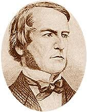
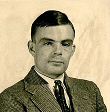

# Logique booléenne

## Introduction

Dans le cours sur l'architecture de Von Neumann, nous avons vu de quoi est composé un ordinateur : une unité centrale (CPU), de la mémoire, et des bus de communication. Nous avons aussi vu comment parler directement au CPU grâce au langage machine (LCM).

Nous avons vu que le CPU était capable d'effectuer des calculs, par exemple avec l'opération `ADD`. Mais comment cela fonctionne-t-il réellement à l'intérieur du processeur ?

**L'objectif de ce cours est de comprendre comment, à partir de la théorie de la logique booléenne, on peut construire des composants matériels capables de réellement effectuer des opérations comme l'addition.**

## Histoire


En 1703, [Gottfried Wilhelm Leibniz](https://fr.wikipedia.org/wiki/Gottfried_Wilhelm_Leibniz) fut le premier occidental à formaliser un
système d'opérations à partir de 0 et de 1, le binaire, dans son article "Explication de l'Arithmétique Binaire". On retrouve des traces de précédentes tentatives en Chine dans le [Yi Jing](https://fr.wikipedia.org/wiki/Yi_Jing), le livre des mutations, au 9ème siècle avant notre ère.

Les nombres binaires étaient au centre de la théologie de Leibniz. Il croyait que les nombres binaires étaient symboliques de l'idée chrétienne de creatio ex ni-hilo ou de création à partir de rien. Leibniz essayait de trouver un système qui convertisse les déclarations verbales de la logique en un système purement mathématique.



A partir de 1847, [George Boole](https://fr.wikipedia.org/wiki/George_Boole) propose un mode de calcul permettant de
traduire des raisonnements logiques par des opérations mathématiques.
Il créé ainsi une branche des mathématiques qui définit des opérations dans
un ensemble qui ne contient que 2 éléments.


En 1938, [Claude Shannon](https://fr.wikipedia.org/wiki/Claude_Shannon) prouve que des circuits électroniques peuvent résoudre tous les problèmes que la logique de Boole peut résoudre.



Avec les travaux d'[Alan Turing](https://fr.wikipedia.org/wiki/Alan_Turing) de 1936, ceci constitue le fondement de ce qui deviendra l'informatique.

## Les booléens et leurs opérations

Les booléens sont au nombre de 2 : au choix, $\{ Vrai, Faux\}$ ou $\{0, 1\}$.

On peut utiliser l'une ou l'autre des représentations, c'est justement le principe de modélisation.

D'ailleurs, en python, ces 2 opérations valent True:

```python
0 == False
1 == True
```

### ET
**Répond à la question "Est-ce que les 2 sont vrais ?"**

Exemple : Pour qu'une lampe s'allume dans un circuit de sécurité, il faut que l'interrupteur ET la porte soient fermés.

Si l'interrupteur est ON (fermé) ET la porte est fermée, alors la lampe s'allume.

Si l'un des deux (ou les deux) est ouvert, la lampe reste éteinte.


### OU (inclusif)
**Répond à la question "Est-ce qu'au moins un des deux est vrai ?"**

Pour qu'une alarme se déclenche, il suffit que l'une des conditions suivantes soit vraie : une fenêtre OU une porte est ouverte.
Si la fenêtre est ouverte, l'alarme sonne.
Si la porte est ouverte, l'alarme sonne.
Si les deux sont ouvertes, l'alarme sonne également.
Si les deux sont fermées, l'alarme ne sonne pas.

### NON
**Répond à la question "Est-ce que c'est Faux ?"**

Imaginons une porte avec un voyant lumineux.
Si la porte est fermée, le voyant lumineux est éteint.
Si la porte est ouverte, le voyant lumineux s'allume.
En logique, cela revient à dire : si la porte est NON fermée, alors le voyant est allumé.


### OU EXCLUSIF
**Répond à la question "Est-ce que les deux sont différents?"**

Deux interrupteur dans une pièce actionnent la même lampe.
- S'ils sont dans la même position, alors la lampe sera éteinte.
- S'ils sont dans une position différente, alors la lampe sera allumée.

Le mécanisme qui est derrière ce comportement est un ou exclusif.


## Notation booléenne

En logique booléenne, on utilise une notation mathématique précise pour écrire les expressions :

| Opération | Notation | Exemple |
| --- | --- | --- |
| ET | $.$ (point) | $a.b$ |
| OU | $+$ | $a+b$ |
| OU EXCLUSIF | $\oplus$ | $a \oplus b$ |
| NON | $\bar{\ }$ (barre) | $\bar{a}$ |

Ainsi, une expression booléenne comme "NON a ET b OU c" s'écrit : $\bar{a}.b + c$

!!! warning "Attention"
    Le point $a.b$ n'est **pas** une multiplication classique, et le $+$ n'est **pas** une addition classique. Ce sont des opérations logiques. Ne les confondez pas avec l'arithmétique habituelle.

## Tables de vérité

### Qu'est-ce qu'une table de vérité ?

Ce qui est pratique quand on travaille sur un ensemble fini d'éléments comme $\{0, 1\}$, c'est qu'on peut **donner le résultat de toutes les opérations possibles**. Contrairement à l'addition $x + y$ sur $\mathbb{R}$, où il y a une infinité de cas, ici avec 2 variables booléennes il n'y a que 4 combinaisons possibles !

Une **table de vérité** est justement ce tableau qui liste **toutes les combinaisons possibles** des valeurs d'entrée (0 ou 1) et donne le résultat de l'expression pour chaque combinaison.

C'est l'outil fondamental pour étudier et comprendre une expression booléenne.

### Comment dresser une table de vérité ?

1. **Identifier les variables** : repérer toutes les variables de l'expression (par exemple $a$ et $b$).
2. **Lister toutes les combinaisons** : avec $n$ variables, il y a $2^n$ combinaisons. Pour 2 variables : 4 lignes. Pour 3 variables : 8 lignes.
3. **Évaluer l'expression** pour chaque combinaison, en calculant étape par étape.

Vous pouvez vérifier la table de vérité de vos expressions sur [Ce site](https://www.dcode.fr/table-verite-logique)


### Tables de vérité des opérateurs

#### Table NON

"NON a" renvoie le "contraire" de a.

Ici, il n'y a que a qui peut simplement prendre les valeurs 0 et 1.

| a   | $\bar{a}$ |
| --- | --------- |
| 0   | 1         |
| 1   | 0         |

#### Table ET
La table de vérité donne toutes les possibilités de résultats.

$a.b$ ne répond Vrai que lorsque les deux sont vrais.

Ici, a et b peuvent être dans 4 configurations qu'on sait énumérer.

| $a$ | $b$ | $a.b$ |
| --- | --- | ----- |
| 0   | 0   | 0     |
| 0   | 1   | 0     |
| 1   | 0   | 0     |
| 1   | 1   | 1     |

#### Table OU

| $a$ | $b$ | $a+b$ |
| --- | --- | ----- |
| 0   | 0   | 0     |
| 0   | 1   | 1     |
| 1   | 0   | 1     |
| 1   | 1   | 1     |


#### Table OU EXCLUSIF

$a\oplus b$ n'est vrai que lorsque les deux sont différents.

| $a$ | $b$ | $a\oplus b$ |
| --- | --- | ----------- |
| 0   | 0   | 0           |
| 0   | 1   | 1           |
| 1   | 0   | 1           |
| 1   | 1   | 0           |


### Exemple : dresser la table de vérité d'une expression

Prenons l'expression $\bar{a} + a.b$.

Pour dresser sa table de vérité, on **décompose en sous-expressions** en ajoutant des colonnes intermédiaires :

| $a$ | $b$ | $\bar{a}$ | $a.b$ | $\bar{a} + a.b$ |
| --- | --- | --------- | ----- | ---------------- |
| 0   | 0   | 1         | 0     | 1                |
| 0   | 1   | 1         | 0     | 1                |
| 1   | 0   | 0         | 0     | 0                |
| 1   | 1   | 0         | 1     | 1                |

### Équivalence d'expressions

**Deux expressions booléennes sont équivalentes (égales) si elles ont la même table de vérité.**

Si on compare la dernière colonne du tableau ci-dessus avec la table de $\bar{a} + b$, on constate qu'elles sont identiques :

| $a$ | $b$ | $\bar{a}$ | $\bar{a} + b$ |
| --- | --- | --------- | ------------- |
| 0   | 0   | 1         | 1             |
| 0   | 1   | 1         | 1             |
| 1   | 0   | 0         | 0             |
| 1   | 1   | 0         | 1             |

On peut donc conclure que :

$$\bar{a} + a.b = \bar{a} + b$$

Ce n'est pas évident à première vue, mais la table de vérité le prouve !
## Exercices

!!! question "Propriétés de base"

    Que valent les expressions suivantes?

    Vous devez calculer le résultat 2 fois:

    - Une fois en français d'après les définitions de ET, OU, NON
    - Une fois par table de vérité

    1. $1+a$
    2. $1.a$
    3. $0+a$
    4. $0.a$
    5. $a.\bar{a}$
    6. $a+\bar{a}$

!!! question "Ou exclusif"

    Montrer que $\bar{x}.y + x.\bar{y} = x \oplus y$


!!! question "implication logique"


!!! question "Lois de de Morgan"
    1- Dresser la table de vérité de $\overline{a+b}$ ainsi que de  $\bar{a}.\bar{b}$

    | $a$ | $b$ | $a+b$                            | $\color{red}\overline{a+b}$      | $\bar{a}$                        | $\bar{b}$                        | $\color{red}\bar{a}.\bar{b}$     |
    | --- | --- | -------------------------------- | -------------------------------- | -------------------------------- | -------------------------------- | -------------------------------- |
    | 0   | 0   | <input type="text" class="bin"/> | <input type="text" class="bin"/> | <input type="text" class="bin"/> | <input type="text" class="bin"/> | <input type="text" class="bin"/> |
    | 0   | 1   | <input type="text" class="bin"/> | <input type="text" class="bin"/> | <input type="text" class="bin"/> | <input type="text" class="bin"/> | <input type="text" class="bin"/> |
    | 1   | 0   | <input type="text" class="bin"/> | <input type="text" class="bin"/> | <input type="text" class="bin"/> | <input type="text" class="bin"/> | <input type="text" class="bin"/> |
    | 1   | 1   | <input type="text" class="bin"/> | <input type="text" class="bin"/> | <input type="text" class="bin"/> | <input type="text" class="bin"/> | <input type="text" class="bin"/> |

    2- Conclure sur une égalité

    3- Montrer que  $\overline{a.b} = \bar{a}+\bar{b}$

    Ces égalités à connaître sont connues sous le nom de lois de de Morgan


