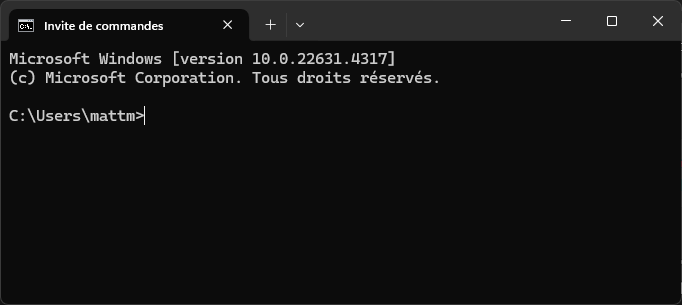
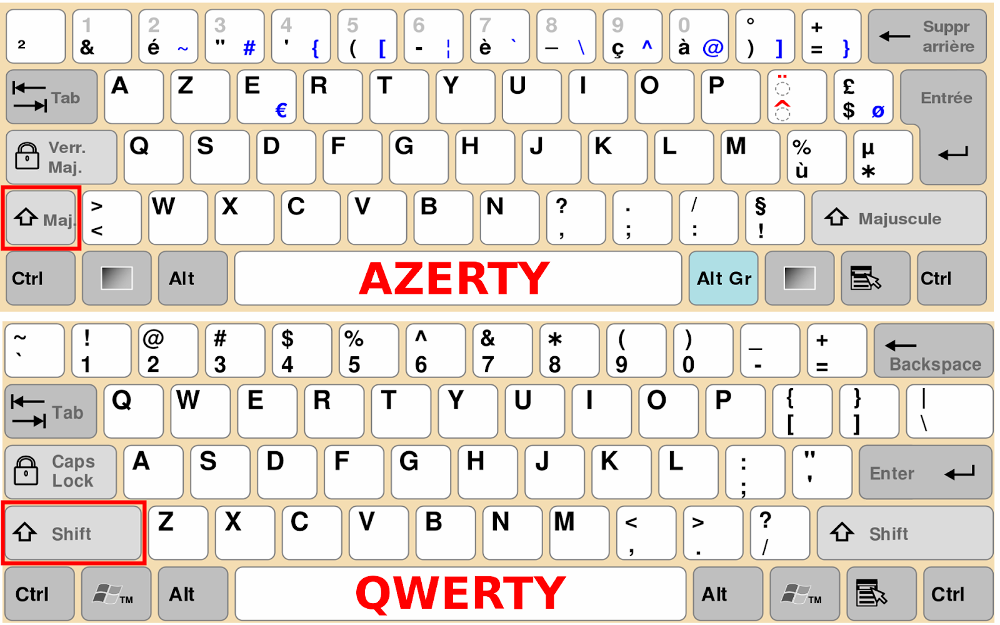
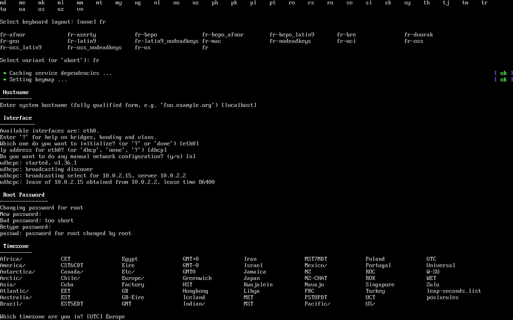
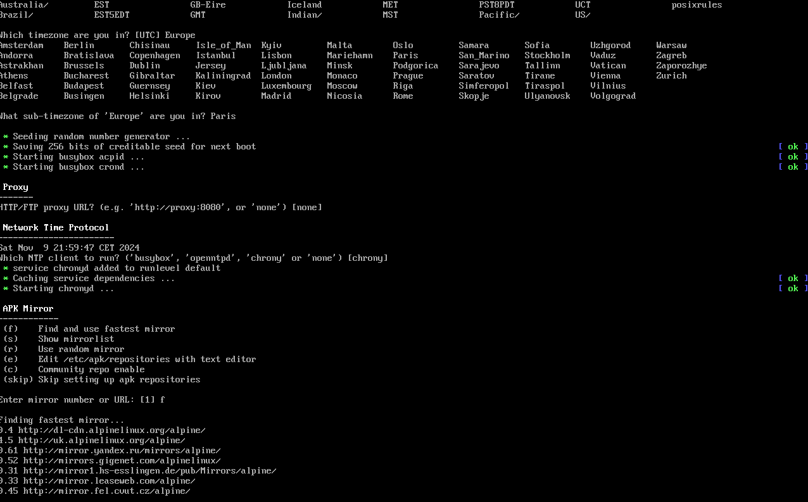
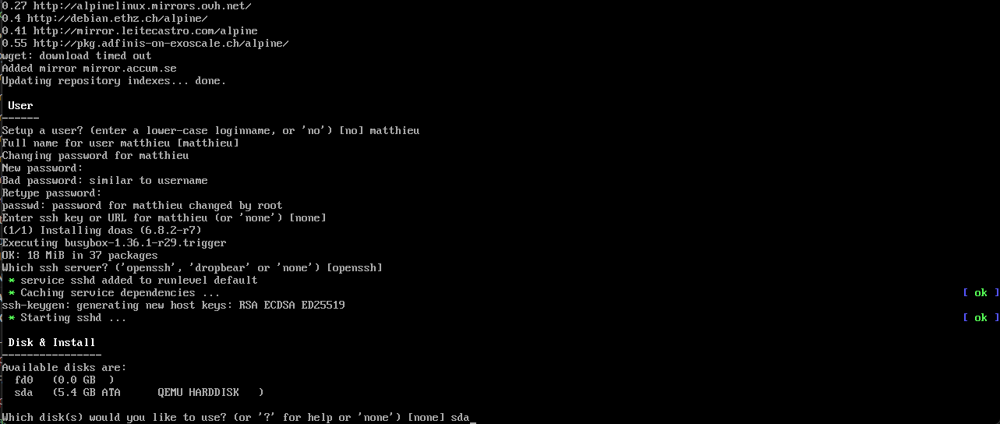
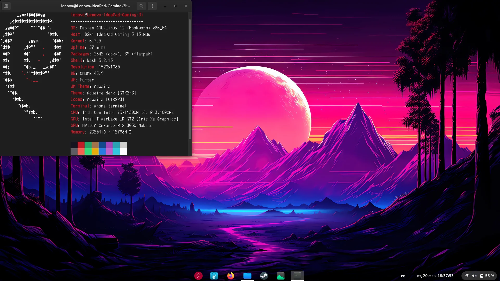

# Systèmes d'exploitation

EN CONSTRUCTION

Essayer avec http://ftp.debian.org/debian/dists/stable/main/installer-amd64/current/images/netboot/mini.iso

## Introduction

Un système d’exploitation est un logiciel essentiel qui gère l’ensemble des ressources d’un ordinateur (processeur, mémoire, stockage) et permet aux utilisateurs d’interagir avec la machine. Il assure le bon fonctionnement des applications, la sécurité, et la gestion efficace des tâches. Dans ce chapitre, nous aborderons ses principales fonctions et découvrirons les types de systèmes d’exploitation courants.


# Démarrage de l'ordinateur:

Lorsque vous démarrez un ordinateur, son unique objectif est de charger le système d'exploitation.

Ceci peut se découper en 4 étapes:

1. Alimentation et auto-test matériel (POST) : 
    - L'ordinateur s'allume, et le BIOS (Basic Input/Output System) ou UEFI (Unified Extensible Firmware Interface) effectue un Power-On Self-Test (POST). Ce test vérifie les composants matériels essentiels (mémoire, processeur, carte graphique, etc.) pour s'assurer qu'ils fonctionnent correctement.

2. Chargement du BIOS/UEFI :
    - Le BIOS ou UEFI initialise le matériel de base, en activant la mémoire et les périphériques nécessaires pour lancer le système d'exploitation. Il identifie également le périphérique de démarrage (disque dur, SSD, clé USB) où est installé l'OS.

3. Chargement du chargeur d'amorçage (Bootloader) :
    - Une fois le périphérique de démarrage identifié, le BIOS ou UEFI passe le contrôle au chargeur d'amorçage, souvent GRUB pour Linux ou Bootmgr pour Windows. Le bootloader est un petit programme qui charge le noyau du système d'exploitation en mémoire.

4. Chargement du noyau : 
    - Le chargeur d'amorçage charge ensuite le noyau du système d'exploitation en mémoire et lui passe le contrôle. Le noyau initialise les fonctions essentielles : gestion de la mémoire, création de processus initiaux, et prise en charge des pilotes matériels de base.

A partir de ce moment, c'est le système d'exploitation qui va prendre la main et servir à faire le lien entre le matériel et les applications.

```mermaid
graph TD
    A[Démarrage de l'ordinateur] --> B[POST -> Power-On Self-Test]
    B --> C[Chargement du BIOS/UEFI]
    C --> D[Identification du périphérique<br>de démarrage]
    D --> E[Chargement du chargeur<br>d'amorçage -> Bootloader]
    E --> F[Chargement du noyau<br>du système d'exploitation]
```

## A quoi sert un système d'exploitation

<iframe width="560" height="315" src="https://www.youtube.com/embed/qza9V9ad7nc?si=_RwgafPcuO7JaL8H" title="YouTube video player" frameborder="0" allow="accelerometer; autoplay; clipboard-write; encrypted-media; gyroscope; picture-in-picture; web-share" referrerpolicy="strict-origin-when-cross-origin" allowfullscreen></iframe>

Visionnez cette vidéo, et résumez la en une introduction et 3 parties. Elle constitue le minimum que vous devez savoir sur les systèmes d'exploitation.

https://eylenburg.github.io/os_familytree.htm
Il existe une multitude de systèmes d'exploitation, comme en témoigne la page suivante: https://eylenburg.github.io/os_familytree.htm


## Interagir avec le système d'exploitation

Un système d'exploitation ne nécessite pas forcément une interface graphique avancée comme celle de Windows. Certains OS, notamment les systèmes utilisés sur des serveurs, des appareils embarqués (comme ceux dans les routeurs ou appareils industriels) ou dans des environnements professionnels, fonctionnent uniquement avec une interface en ligne de commande (CLI). Ces OS, comme certaines versions de Linux, offrent un contrôle précis des fonctions système sans nécessiter d'interface visuelle.

L'absence d'interface graphique permet souvent de réduire l'utilisation des ressources (comme la mémoire et le processeur) et d'améliorer la stabilité et la sécurité, ce qui est essentiel dans les environnements où chaque ressource est précieuse, où l'efficacité est prioritaire.

Lorsque le système d'exploitation n'a pas d'interface graphique, l'interaction se fait via une interface en ligne de commande (CLI = Command Line Interface). Dans ce type d’interface, l’utilisateur entre des commandes textuelles dans un terminal pour exécuter des actions, comme la gestion de fichiers, le contrôle des processus, ou la configuration du réseau.

L’utilisateur doit connaître des commandes spécifiques, comme celles utilisées sous Linux (par exemple, ls pour lister les fichiers, cd pour changer de répertoire, ou top pour surveiller les processus en cours). Ces commandes permettent une interaction directe avec le système, souvent de manière plus rapide et précise que par une interface graphique.

Dans un système d'exploitation avec une interface graphique avancée, il est toujours possible d'accéder au CLI via un terminal.

Par exemple pour windows:




## TP Installation d'un système d'exploitation dans une machine virtuelle.

Nous allons installer un système d'exploitation basé sur le noyau linux: Alpine.
Cette installation est plus technique en comparaison à une installation d'un Full Linux, qui se fait en quelques clicks avec des questions compréhensibles par le commun des mortels.

Mais:
- Ca vous habitue à la ligne de commande
- On voit bien toutes les étapes
- Les ordinateurs du lycée ne sont pas assez puissants

Pour cette activité, il faut utiliser le moins possible de RAM. Donc on n'ouvre rien qui n'est pas en lien direct avec l'activité (genre pronote...).

Tout se fera dans le même répertoire de MSYS2

!!! note "Préparation"
    - Tout se fait dans le même répertoire MSYS2 MINGW64 (chercher avec la loupe de windows)
    - Exécutez `pacman -Syu` de manière répétitive jusqu'à ce que le message "there is nothing to do" apparaisse.
        - Ceci sert à mettre à jour MSYS2.
        - Le terminal peut demander à être fermer, il faut le faire et relancer MINGW64
    - Installer qemu, le gestionnaire de machines virtuelles, en exécutant cette commande: `pacman -S mingw-w64-x86_64-qemu`
    - Télécharger le disque d'installation d'alpine: `wget https://dl-cdn.alpinelinux.org/alpine/v3.21/releases/x86_64/alpine-virt-3.21.3-x86_64.iso`


1. Créer un disque dur virtuel de 5Go pour le brancher à notre PC virtuel.
`qemu-img create -f qcow2 disquedur.qcow2 5G`

2. On démarre une machine virtuelle. Un ordinateur dans votre ordinateur. Ici on lui donne comme disque dur le disque virtuel qu'on vient de créer, on y insère le cd-rom d'installation du système d'exploitation, et on lui demande de booter sur le cdrom. On l'autorise à utiliser 512M de RAM sur la machine physique. on lui branche notre disque (hda) de 5G. Les autres options sont des options pour la gestion du réseau.
`qemu-system-x86_64 -boot d -cdrom alpine-virt-3.21.3-x86_64.iso -hda disquedur.qcow2 -m 256 -net nic -net user`

3. Après avoir booté, le système demande de vous logger, entrez "root" et validez avec la touche entrée. L'utilisateur root est le superutilisateur. Il a le droit de tout faire.

4. Le clavier n'est pas en français, mais ça sera bientôt le cas. On lance l'installation en tapant: `setup-alpine`, puis entrée.



5. Répondez aux questions comme sur l'image suivante (quand je n'ai rien mis, j'ai juste appuyé sur entrée. pour le mot de passe, mettez root):





Sur l'image suivante, à la fin, on voit qu'il nous demande sur quel disque dur on veut installer alpine. On va lui dire de l'installer sur le disque qu'on a créé. On voit ici que le "QEMU DRIVE" est sda. On entre donc sda.




- On valide l'installation en entrant y  (si vous ne mettez pas y, ça s'arrête et vous devez tout recommencer)

- Le système d'exploitation est installé, et il nous demande de redémarrer.

- On entre cette commande pour arrêter l'ordinateur: ` doas poweroff`
    - La commande doas nous permet sous alpine d'exécuter une commande comme si on était le super utilisateur (si on y a droit)
    - Dans d'autres distributions linux, on recontre communément la commande `sudo`


!!! hint "Commande pour démarrer l'ordinateur virtuel"
    - Dès que vous voulez démarrer cet ordinateur, entrez:
    `qemu-system-x86_64 -hda disquedur.qcow2 -m 256 -nic user,ipv6=off,hostfwd=tcp::22022-:22`

    - Dès que vous voudrez l'arrêter, entrez:
    `doas poweroff`


!!! tip "Interface graphique de l'OS"
    Un OS dispose habituellement d'une interface graphique, comme windows.
    Sous linux, vous avez même l'embarras du choix.
    On n'en ajoutera pas car ça prend trop d'espace disque et que les ordis ne sont pas assez puissants pour faire tourner 2 OS, mais voici ce que ça peut donner.
    

    - Chez vous, si vous avez beaucoup de RAM, vous pouvez attribuer plus de mémoire à la machine virtuelle en mettant par exemple 2G à la place de 256.
    - Vous pouvez ainsi installer un environnement dektop en exécutant la commande `setup-desktop` et en choisissant `xfce` (le plus léger, les autres demandent beaucoup de RAM)
    - En éteignant, puis rallumant la machine, vous aurez un environnement graphique plus léger, mais similaire à windows.

## Manipulations

!!! question "Exercice débrouille"
    - Mettre à jour alpine
        - `doas apk update` fait état des nouvelles versions de composants disponibles
        - `doas apk upgrade` applique les mises à jour disponibles
    - Installer python et nano (Un éditeur de texte pour CLI)
        - `doas apk add nano python3`
    - Ecrire un script python simple
        - créer un fichier test.py
        - Ce programme affiche "Voici un entier aléatoire: 6", où 6 est un exemple
        - La première ligne de code doit être `#! /usr/bin/python` qui indique au système qu'il faut envoyer le contenu du fichier à l'exécutale python pour exécution.
    - Exécuter le script python
        - `./test.py` demande l'exécution du fichier python
        - Vous rencontrez un problème. L'utilisateur courant n'a pas le droit d'exécuter ce fichier.
        - Trouvez un moyen de rendre le fichier exécutable par l'utilisateur courant.

---

## Naviguer dans le système de fichiers

### 1. Chemin absolu

- **Définition** : un chemin absolu **commence toujours par la racine** `/` et indique l’emplacement exact d’un fichier ou répertoire dans l’arborescence, **depuis la racine** jusqu’au répertoire/fichier ciblé.
  
- **Exemple** :
  ```bash
  cd /home/alice/Documents
  ```
  Ce chemin part de `/` (racine), puis va dans `home`, puis `alice`, puis `Documents`.  
  Peu importe d’où vous partez, vous atterrirez exactement dans `/home/alice/Documents`.

---

### 2. Chemin relatif

- **Définition** : un chemin relatif **ne commence pas par `/`** et indique l’emplacement d’un répertoire ou fichier **par rapport au répertoire courant** (celui où vous vous trouvez déjà).
  
- **Exemples** :
  1. Si vous êtes déjà dans `/home/alice`, alors :
     ```bash
     cd Documents
     ```
     vous amène dans `/home/alice/Documents`.

  2. S’il faut monter d’un répertoire avant d’aller ailleurs, on utilise `..` pour désigner le parent :
     ```bash
     cd ../Bob
     ```
     si vous êtes dans `/home/alice`, `cd ../Bob` vous amène dans `/home/Bob`.

---

### 3. Bien savoir que:

- `.` désigne le répertoire courant (rarement nécessaire avec `cd`, mais on peut l’utiliser dans d’autres commandes).
- `..` désigne le répertoire parent (celui qui contient le répertoire courant).
- Un **chemin absolu** fonctionne **où que vous soyez**.
- Un **chemin relatif** dépend de **votre emplacement actuel** (`pwd` pour savoir où vous êtes).

---

#### Exemple de navigation

1. **Position de départ** :  
   Vous êtes dans `/home/alice`.
   ```bash
   pwd
   # /home/alice
   ```

2. **Aller dans `Documents` (chemin relatif)** :
   ```bash
   cd Documents
   pwd
   # /home/alice/Documents
   ```

3. **Revenir au répertoire parent (chemin relatif avec `..`)** :
   ```bash
   cd ..
   pwd
   # /home/alice
   ```

4. **Aller directement à `/etc` (chemin absolu)** :
   ```bash
   cd /etc
   pwd
   # /etc
   ```

---

**En résumé** :  
- **Chemin absolu** : commence par `/` et décrit **l’itinéraire complet** depuis la racine.  
- **Chemin relatif** : **dépend** du répertoire courant et ne commence pas par `/`.  
- Utilisez `cd` pour naviguer facilement en combinant `..` (parent) et les noms de dossiers.

## les commandes Linux de base

<iframe width="560" height="315" src="https://www.youtube.com/embed/ZtqBQ68cfJc?si=vV-v1yeCKhRjc1Is" title="YouTube video player" frameborder="0" allow="accelerometer; autoplay; clipboard-write; encrypted-media; gyroscope; picture-in-picture; web-share" referrerpolicy="strict-origin-when-cross-origin" allowfullscreen></iframe>

Cette vidéo les résume. Elle dure 5h mais dispose d'un sommaire.

!!! question "Exercice"
    - Créez un fichier arbo.sh
    - Editez ce fichier pour qu'il comporte toutes les commandes nécessaires à la création de l'arborescence suivante.
        - 1 commande par ligne
    - Exécutez le fichier arbo.sh et vérifiez que l'arborescence a bien été créée.

    


!!! question "Questions"
    Ces questions couvrent les bases de la navigation, la manipulation de fichiers et dossiers, la gestion des droits, la recherche de fichiers, et quelques notions de redirection et de processus. Elles permettent déjà de se familiariser avec l’essentiel de la ligne de commande sous Linux.

    1. **Navigation et gestion des répertoires :**
        - Quelle est la différence entre `cd /home` et `cd home` (sans le /) ?  
        - Quelle commande permet d’afficher le répertoire courant (là où vous êtes) ?  
        - Comment revenir au répertoire parent avec la commande `cd` ?
    2. **Listing et informations sur les fichiers :**
        - À quoi sert la commande `ls` ? Citez deux options utiles de `ls`.  
        - Quelle différence y a-t-il entre `ls` et `ls -l` ?
    3. **Création et suppression de fichiers/répertoires :**
        - Comment créer un fichier vide ? (Donnez deux méthodes possibles)  
        - Quelle commande utilise-t-on pour supprimer un répertoire **vide** ? Et pour un répertoire **non vide** ?
    4. **Copie et déplacement :**
        - Comment copier un fichier `source.txt` en `destination.txt` depuis la ligne de commande ?  
        - Comment déplacer (ou renommer) un fichier `test.txt` en `test2.txt` ?
    5. **Recherche de texte :**
        - Quelle commande peut-on utiliser pour rechercher un mot clé dans un fichier texte ?  
        - Comment rechercher le terme `linux` dans tous les fichiers du répertoire courant ?
    6. **Permissions et propriétés des fichiers :**
        - Comment afficher les droits de fichier et le propriétaire/groupe d’un fichier ou répertoire ?  
        - Que signifie `rwxr-xr--` (dans l’ordre : propriétaire, groupe, autres) ?  
        - À quoi sert la commande `chmod` ? Donnez un exemple simple d’utilisation.
    7. **Recherche et localisation de fichiers :**
        - Comment chercher un fichier nommé `notes.txt` dans l’arborescence à partir du répertoire courant ?  
        - Quelle commande (ou quelles options) permet de trouver des fichiers selon leur nom ou d’autres critères (taille, type, etc.) ?
    8. **Affichage et manipulation du contenu des fichiers :**
        - Quelle commande permet d’afficher le contenu d’un fichier texte directement dans le terminal ?  
        - Comment afficher les premières lignes d’un fichier ? Les dernières ?
    9. **Redirection et pipes :**
        - Que fait `>` après une commande (par exemple `ls > liste.txt`) ?  
        - À quoi sert le caractère `|` (pipe) ? Donnez un exemple simple.
    10. **Informations système et processus :**
        - Quelle commande affiche des informations sur la mémoire et les processus en temps réel ?  
        - Comment lister les processus en cours d’exécution dans le terminal ?

---

