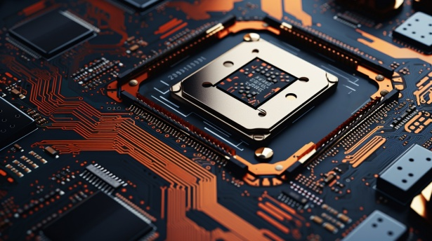

# Architecture de von Neumann

## Le problème de départ

Les premiers ordinateurs, comme l'**ENIAC** (1945), étaient capables de faire des calculs extraordinairement rapides. Mais ils avaient un défaut majeur : pour changer de programme, il fallait **physiquement recâbler la machine**. Des opératrices devaient rebrancher des centaines de câbles et repositionner des interrupteurs, ce qui prenait **plusieurs jours**, alors que le calcul lui-même ne durait que quelques secondes.

Le programme n'existait pas en mémoire : il était inscrit dans le **câblage physique** de la machine. Changer de tâche revenait à reconstruire une partie de l'ordinateur.

!!! example "Concrètement"
    Imaginons qu'à chaque fois que vous voulez utiliser une nouvelle application sur votre téléphone, un technicien doive ouvrir l'appareil et ressouder des composants. C'était exactement la situation avant l'architecture de von Neumann.

**La solution proposée par von Neumann en 1945** : stocker le programme **dans la mémoire**, au même endroit que les données. Ainsi, changer de programme revient simplement à charger de nouvelles instructions en mémoire, sans toucher au matériel. C'est le principe du **programme enregistré**, et c'est le fonctionnement de tous les ordinateurs actuels.

## Introduction

L'**architecture de von Neumann** est le modèle fondamental de la plupart des ordinateurs actuels. Elle tire son nom du mathématicien et physicien John von Neumann qui l'a formalisée en 1945 dans son rapport sur l'EDVAC (*Electronic Discrete Variable Automatic Computer*).

## 1. Principe fondamental

Le principe central de l'architecture de von Neumann est le **programme enregistré** : les instructions du programme et les données sont stockées dans la **même mémoire**.

## 2. Les composants principaux

L'architecture de von Neumann se compose de **quatre éléments essentiels** :

### 2.1 L'unité centrale de traitement (CPU)



Le **processeur** (CPU - *Central Processing Unit*) est le cerveau de l'ordinateur. Il se divise en deux sous-unités :

#### a) L'Unité Arithmétique et Logique (UAL)

L'**UAL** (*ALU* en anglais) effectue les opérations :

- **Arithmétiques** : addition, soustraction, multiplication, division
- **Logiques** : AND, OR, NOT, XOR (les opérations booléennes que vous connaissez)
- **Comparaisons** : égalité, supériorité, infériorité

!!! example "Lien avec les circuits logiques"
    L'UAL est construite à partir des circuits logiques que vous avez étudiés : portes ET, OU, NON, etc. Par exemple, un additionneur 8 bits utilise une cascade de portes logiques pour calculer une somme.

#### b) L'Unité de Contrôle (UC)

L'**Unité de Contrôle** orchestre le fonctionnement de l'ordinateur :

- Elle **lit** les instructions en mémoire
- Elle les **décode** pour comprendre quelle opération effectuer
- Elle **commande** les autres composants pour exécuter l'instruction

### 2.2 La mémoire


La **mémoire** stocke à la fois :

- Les **instructions** du programme (le code)
- Les **données** manipulées par le programme

Chaque emplacement mémoire possède une **adresse** unique qui permet d'y accéder.

!!! info "Types de mémoire"
    - **Mémoire vive (RAM)** : rapide, volatile (effacée à l'extinction)
    - **Mémoire morte (ROM)** : contient le BIOS, non volatile
    - **Mémoire de stockage** : disque dur, SSD (non volatile, plus lente)

### 2.3 Les dispositifs d'entrée/sortie (E/S) (I/O)

Les **périphériques d'entrée/sortie** permettent la communication avec l'extérieur :

- **Entrée** : clavier, souris, capteurs, réseau
- **Sortie** : écran, imprimante, haut-parleurs

### 2.4 Les bus

Les **bus** sont les canaux de communication qui relient les composants. Un bus n'est pas un tuyau dans lequel les informations circulent les unes après les autres : c'est un **groupe de fils parallèles** qui portent chacun un signal électrique (0 ou 1) **en permanence**.

Chaque bus est un groupe de fils **physiquement séparé** des autres. A chaque instant, la mémoire "voit" l'état de tous les fils simultanément. Il n'y a pas de mélange possible : chaque information voyage sur son propre groupe de fils.

- **Bus d'adresses** : transmet l'adresse mémoire à accéder (indique **où**)
- **Bus de données** : transmet le contenu (un nombre, une instruction...)
- **Bus de contrôle** : transmet les signaux de commande (indique **quoi faire** : lire ou écrire)

C'est le signal sur le bus de contrôle qui déclenche l'action. Sans lui, la mémoire ne fait rien, même si une adresse est présente sur le bus d'adresses.

!!! example "Exemple : ajouter 2 à la valeur stockée à l'adresse 42"
    Supposons que la case mémoire 42 contient la valeur **10**. Le CPU doit calculer 10 + 2 et réécrire le résultat en mémoire.

    Les trois bus travaillent **simultanément** à chaque étape. C'est leur combinaison qui donne un sens à l'opération : le bus de contrôle dit quoi faire, le bus d'adresses dit où, et le bus de données transporte le contenu.

    **Etape 1 : Lire la valeur en mémoire**

    ```
    CPU  ══[ LIRE ]══►  Mémoire      (bus de contrôle : le CPU demande une lecture)
    CPU  ══[  42  ]══►  Mémoire      (bus d'adresses  : le CPU envoie l'adresse)
    CPU  ◄═[  10  ]═══  Mémoire      (bus de données  : la mémoire répond avec la valeur)
    ```

    Le CPU envoie **en même temps** l'ordre LIRE et l'adresse 42. La mémoire répond en plaçant la valeur 10 sur le bus de données. Le CPU la récupère dans l'accumulateur.

    **Etape 2 : Le calcul**

    L'UAL effectue 10 + 2 = **12**. Cette étape est interne au CPU, les bus ne sont pas sollicités.

    **Etape 3 : Ecrire le résultat en mémoire**

    ```
    CPU  ══[ ECRIRE ]══►  Mémoire    (bus de contrôle : le CPU demande une écriture)
    CPU  ══[   42   ]══►  Mémoire    (bus d'adresses  : le CPU envoie l'adresse)
    CPU  ══[   12   ]══►  Mémoire    (bus de données  : le CPU envoie la valeur)
    ```

    Le CPU envoie **en même temps** l'ordre ECRIRE, l'adresse 42 et la valeur 12. La mémoire reçoit les trois informations et écrit 12 à l'adresse 42.

    **A retenir :** A l'étape 1, le bus de données va de la mémoire vers le CPU (la mémoire **répond**). A l'étape 3, il va du CPU vers la mémoire (le CPU **envoie**). Les bus d'adresses et de contrôle vont toujours du CPU vers la mémoire : c'est le CPU qui commande.

    La case mémoire 42 contient maintenant **12**.

```
┌─────────────────────────────────────┐
│     Unité Centrale (CPU)            │
│  ┌──────────┐      ┌─────────┐     │
│  │ Unité de │      │   UAL   │     │
│  │ Contrôle │◄────►│         │     │
│  └──────────┘      └─────────┘     │
└──────┬──────────────────┬───────────┘
       │                  │
    ┌──▼──────────────────▼──┐
    │        BUS              │
    └──┬──────────────────┬──┘
       │                  │
┌──────▼────────┐    ┌───▼──────┐
│   Mémoire     │    │   E/S    │
└───────────────┘    └──────────┘
```

## 3. Le cycle d'exécution (FETCH-DECODE-EXECUTE)

Le processeur fonctionne selon un **cycle répétitif** en trois phases :

### 3.1 Fetch (Recherche)

1. L'UC lit l'adresse de la prochaine instruction dans le **compteur ordinal** (ou *Program Counter*)
2. L'instruction est chargée depuis la mémoire vers le **registre d'instruction**
3. Le compteur ordinal est incrémenté pour pointer vers l'instruction suivante

### 3.2 Decode (Décodage)

L'UC analyse l'instruction pour déterminer :

- Quelle opération effectuer
- Quelles données utiliser (adresses, registres)

### 3.3 Execute (Exécution)

L'UC commande l'UAL ou les autres composants pour réaliser l'opération.

!!! example "Exemple concret"
    Instruction : `ADD R1, R2, R3` (additionner R2 et R3, stocker dans R1)
    
    - **Fetch** : charger l'instruction depuis la mémoire
    - **Decode** : identifier qu'il s'agit d'une addition, repérer les registres R1, R2, R3
    - **Execute** : l'UAL additionne le contenu de R2 et R3, le résultat est placé dans R1

Ce cycle se répète des milliards de fois par seconde (fréquence du processeur en GHz).

## 4. Les registres

Les **registres** sont de petites mémoires ultra-rapides **intégrées au processeur** :

- **Compteur ordinal (PC)** : contient l'adresse de la prochaine instruction
- **Registre d'instruction (RI)** : contient l'instruction en cours d'exécution
- **Registres généraux** : stockent temporairement des données pour les calculs
- **Accumulateur** : stocke les résultats intermédiaires de l'UAL

## 5. Le goulot de von Neumann

Le fait que les instructions et les données partagent la même mémoire et le même bus crée un **goulot d'étranglement** : le processeur doit attendre que les données arrivent de la mémoire.

!!! info "Solutions modernes"
    - **Mémoire cache** : mémoire très rapide entre le CPU et la RAM
    - **Architecture Harvard** : mémoires séparées pour instructions et données
    - **Pipeline** : exécution simultanée de plusieurs étapes du cycle

## 6. Exercices

### Les bus

!!! question "Le CPU veut lire la valeur stockée à l'adresse 7"
    Complétez le tableau :

    | Bus | Valeur transportée | Sens |
    |-----|--------------------|------|
    | Bus d'adresses | ? | ? → ? |
    | Bus de contrôle | ? | ? → ? |
    | Bus de données | ? | ? → ? |

??? success "Réponse"
    | Bus | Valeur transportée | Sens |
    |-----|--------------------|------|
    | Bus d'adresses | **7** | CPU → Mémoire |
    | Bus de contrôle | **LIRE** | CPU → Mémoire |
    | Bus de données | **la valeur à l'adresse 7** | Mémoire → CPU |

    Le bus de données va de la mémoire vers le CPU car c'est une lecture : la mémoire **répond**.

!!! question "Le CPU veut écrire la valeur 25 à l'adresse 3"
    Complétez le tableau :

    | Bus | Valeur transportée | Sens |
    |-----|--------------------|------|
    | Bus d'adresses | ? | ? → ? |
    | Bus de contrôle | ? | ? → ? |
    | Bus de données | ? | ? → ? |

??? success "Réponse"
    | Bus | Valeur transportée | Sens |
    |-----|--------------------|------|
    | Bus d'adresses | **3** | CPU → Mémoire |
    | Bus de contrôle | **ECRIRE** | CPU → Mémoire |
    | Bus de données | **25** | CPU → Mémoire |

    Cette fois, les trois bus vont dans le même sens : le CPU envoie tout. C'est la différence avec la lecture.

!!! question "Qu'est-ce qui changerait si on supprimait le bus de contrôle ?"
    On garde le bus d'adresses et le bus de données. Le CPU envoie l'adresse 3 et la valeur 25.

    La mémoire doit-elle lire ou écrire ? Peut-elle le savoir ?

??? success "Réponse"
    Non, elle ne peut pas le savoir. Sans bus de contrôle, la mémoire voit une adresse (3) et une donnée (25) mais ne sait pas si elle doit :

    - **lire** la valeur à l'adresse 3 et la mettre sur le bus de données, ou
    - **écrire** 25 à l'adresse 3

    Le bus de contrôle est indispensable pour lever cette ambiguïté.

### Le cycle fetch-decode-execute

!!! question "Dérouler un programme"
    Voici un programme en mémoire et l'état initial de la mémoire de données :

    ```
    Adresse | Instruction
    --------|------------------
    0       | LOAD ACC, 10
    1       | ADD ACC, 11
    2       | STORE ACC, 12
    3       | HALT
    ```

    ```
    Adresse | Valeur
    --------|-------
    10      | 5
    11      | 3
    12      | ?
    ```

    Pour chaque instruction, donnez :

    1. La valeur du PC **avant** le fetch
    2. Ce que fait chaque phase (fetch, decode, execute)
    3. La valeur de l'accumulateur **après** l'execute

??? success "Réponse"
    **Instruction 0 : LOAD ACC, 10**

    - PC = 0 avant le fetch
    - **Fetch** : charge l'instruction à l'adresse 0 dans le registre d'instruction. PC passe à 1.
    - **Decode** : identifie LOAD, adresse source = 10
    - **Execute** : lit la valeur à l'adresse 10 (= 5), la place dans l'accumulateur
    - ACC = **5**

    **Instruction 1 : ADD ACC, 11**

    - PC = 1 avant le fetch
    - **Fetch** : charge l'instruction à l'adresse 1. PC passe à 2.
    - **Decode** : identifie ADD, adresse source = 11
    - **Execute** : lit la valeur à l'adresse 11 (= 3), l'additionne à l'accumulateur (5 + 3)
    - ACC = **8**

    **Instruction 2 : STORE ACC, 12**

    - PC = 2 avant le fetch
    - **Fetch** : charge l'instruction à l'adresse 2. PC passe à 3.
    - **Decode** : identifie STORE, adresse destination = 12
    - **Execute** : écrit la valeur de l'accumulateur (8) à l'adresse 12
    - La case mémoire 12 contient maintenant **8**

    **Instruction 3 : HALT** - Le programme s'arrête.

!!! question "Les bus pendant le fetch"
    Lors de la phase fetch de l'instruction 1 (ADD ACC, 11) de l'exercice précédent :

    1. Que transporte le bus d'adresses ? Dans quel sens ?
    2. Que transporte le bus de contrôle ?
    3. Que transporte le bus de données ? Dans quel sens ?

??? success "Réponse"
    1. Le bus d'adresses transporte **1** (l'adresse de l'instruction à charger, celle contenue dans le PC). Sens : CPU → Mémoire.
    2. Le bus de contrôle transporte **LIRE** (le CPU veut récupérer l'instruction). Sens : CPU → Mémoire.
    3. Le bus de données transporte **l'instruction ADD ACC, 11** (son code machine). Sens : Mémoire → CPU.

    Le fetch est toujours une **lecture** en mémoire : le CPU va chercher l'instruction.

## 7. Pour aller plus loin

!!! tip "Concepts avancés"
    - **Jeu d'instructions** : ensemble des opérations qu'un processeur peut exécuter (CISC vs RISC)
    - **Assembleur** : langage de bas niveau qui correspond directement aux instructions machine
    - **Architectures alternatives** : Harvard, von Neumann modifiée

## Résumé

- L'architecture de von Neumann repose sur le principe du **programme enregistré**
- Quatre composants principaux : **CPU** (UC + UAL), **mémoire**, **E/S**, **bus**
- Le CPU fonctionne en cycle : **fetch-decode-execute**
- Les **registres** sont des mémoires ultra-rapides dans le CPU
- Le **goulot de von Neumann** limite les performances (résolu partiellement par le cache)

---

**Sources** :

- von Neumann, J. (1945). *First Draft of a Report on the EDVAC*. University of Pennsylvania.
- Tanenbaum, A. S. (2013). *Structured Computer Organization* (6e éd.). Pearson.