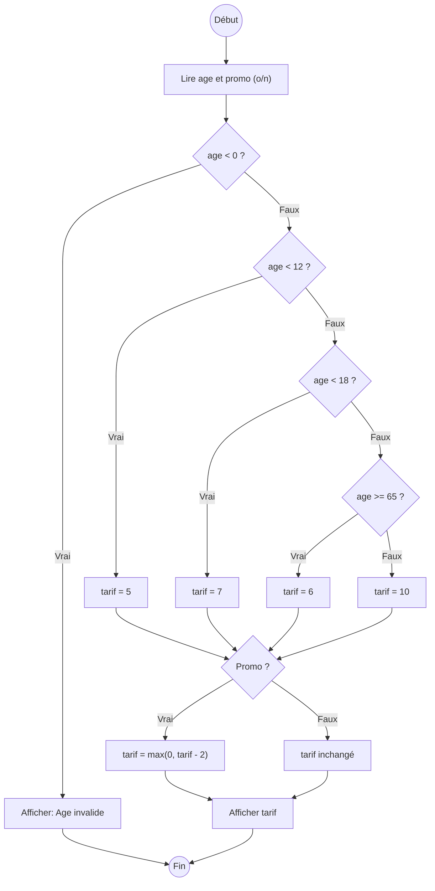

# Les conditionnelles

## Pourquoi ? Décider.

Jusqu'ici, nos programmes exécutent les instructions **les unes après les autres**, toujours dans le même ordre. Mais un programme doit souvent **choisir** ce qu'il fait selon la situation : afficher « majeur » ou « mineur » selon l'âge, accepter ou refuser un mot de passe, calculer un tarif selon le client.

Une **conditionnelle** donne au programme ce **pouvoir de décision**. On la représente souvent par un **diagramme d'activité** : les losanges sont les questions que l'on se pose, les rectangles les actions à réaliser.



*(Combien auriez-vous payé dans ce cinéma ? Vous coderez ce diagramme en exercice.)*

## SI ... ALORS : une seule branche

!!! danger "Conditionnelle à une branche"
    **SI** (il fait beau) **ALORS** (je mets mes lunettes de soleil).

    « Il fait beau » est la **condition**. « Je mets mes lunettes » est le bloc d'**instructions** exécuté seulement si la condition est vraie.

    En Python :
    ```python
    if condition:
        instructions
    ```

    Le bloc d'instructions doit être **indenté** (touche tabulation).

```python
age = 20
if age >= 18:
    print("Vous êtes majeur.")
    print("Bienvenue.")
print("Fin du programme.")
```

!!! abstract "Ce que fait la machine, pas à pas"
    Avec `age` valant 20 :

    1. Python évalue la condition `age >= 18`, soit `20 >= 18` : cela vaut `True`.
    2. La condition est vraie : Python **entre dans le bloc indenté** et exécute ses deux lignes.
    3. Puis il continue avec la ligne non indentée « Fin du programme. »

    Si `age` valait 15, la condition `15 >= 18` vaudrait `False` : Python **sauterait tout le bloc indenté**.

!!! danger "L'indentation définit le bloc"
    Ce sont les **espaces en début de ligne** qui disent ce qui est « à l'intérieur » du `if`. Une ligne réalignée à gauche n'en fait plus partie.

## SI ... ALORS ... SINON : deux branches

!!! danger "Conditionnelle à deux branches"
    **SI** (il fait beau) **ALORS** (je mets mes lunettes) **SINON** (je prends mon parapluie).

    ```python
    if condition:
        instructions_si_vrai
    else:
        instructions_si_faux
    ```

```python
age = int(input("Votre âge ? "))
if age >= 18:
    print("Vous êtes majeur !")
else:
    print("Vous êtes mineur !")
print("Au revoir !")
```

Exactement **un** des deux blocs s'exécute, jamais les deux, jamais aucun.

### Les opérateurs de comparaison

Une condition se construit avec des comparaisons :

| Opérateur | Signification |
| :--: | --- |
| `==` | égal à |
| `!=` | différent de |
| `<`  | strictement inférieur à |
| `>`  | strictement supérieur à |
| `<=` | inférieur ou égal à |
| `>=` | supérieur ou égal à |

!!! danger "Piège : `==` n'est pas `=`"
    - `=` est l'**affectation** : `age = 18` range 18 dans `age`.
    - `==` est le **test d'égalité** : `age == 18` vaut `True` ou `False`.

    Dans une condition, on **teste**, donc on écrit `==`. C'est une source de bugs très fréquente chez les débutants.

!!! question "Exercices (deux branches)"
    1. **Parc.** Il faut mesurer au moins 1m30 pour entrer. Demandez la taille en cm et indiquez si l'accès est autorisé.
    2. **Plus grand.** Demandez deux nombres et affichez le plus grand.
    3. **Valeur absolue.** Demandez un nombre et affichez sa valeur absolue (sans `abs`).
    4. **Mot de passe.** Le mot de passe est `"azerty"`. Demandez-le et indiquez si l'accès est autorisé.

    ??? warning "Corrigés (3 et 4)"
        ```python
        # 3. Valeur absolue
        x = int(input("Un nombre : "))
        if x < 0:
            print(-x)
        else:
            print(x)

        # 4. Mot de passe
        mdp = input("Mot de passe : ")
        if mdp == "azerty":
            print("Accès autorisé")
        else:
            print("Accès refusé")
        ```

## Une condition est un booléen

Une comparaison comme `7 > 4` est une **opération**, au même titre que `+` ou `*`, sauf qu'elle ne renvoie pas un nombre mais un **booléen** : `True` ou `False` (le type booléen est présenté dans [Les booléens](../Numération/booleens.md), du nom du logicien George Boole).

```python
a = 7 > 4
print(a)         # True
print(type(a))   # <class 'bool'>
```

!!! hint "Une condition est un calcul"
    Une condition est en réalité **un calcul qui renvoie un booléen**. Quand vous vous demandez s'il fait beau, votre cerveau *calcule* vrai ou faux à partir de ce que voient vos yeux.

On peut donc stocker une condition dans une variable, puis l'utiliser :

```python
majeur = age >= 18
if majeur:
    print("Vous êtes majeur.")
```

!!! tip "Écrire `if majeur`, pas `if majeur == True`"
    Si `majeur` vaut `True`, alors `majeur == True` vaut aussi `True` ; s'il vaut `False`, `majeur == True` vaut `False`. Tester `majeur` ou `majeur == True` revient donc au même. On écrit simplement :
    ```python
    if majeur:        # et non : if majeur == True
    ```

!!! question "Exercice : type et valeur"
    On exécute ces lignes dans l'ordre. Donnez le **type** et la **valeur** de chaque variable.
    ```python
    a = 18
    b = (a > 7)
    c = (a == 6)
    e = a > 7
    a = 6.0
    f = (a == 6)
    ```

    ??? warning "Réponse"
        `a` : int, 18. `b` : bool, True. `c` : bool, False. `e` : bool, True. Puis `a` devient float, 6.0. `f` : bool, True (car `6.0 == 6`).

## SINON SI : plusieurs branches (`elif`)

Pour plus de deux cas, on enchaîne avec `elif` (contraction de « else if »).

```python
if note >= 16:
    print("Très bien")
elif note >= 10:
    print("Admis")
else:
    print("Ajourné")
```

!!! abstract "Le mécanisme caché : Python s'arrête au premier vrai"
    Python teste les conditions **dans l'ordre**. **Dès qu'une est vraie**, il exécute son bloc et **ignore toutes les suivantes**. Évaluer la condition d'un `elif` signifie donc que **toutes les précédentes étaient fausses**. Le `else` final ne sert que si aucune n'a été vraie.

!!! danger "L'ordre des `elif` compte"
    Avec `note = 15` :
    ```python
    if note >= 10:
        mention = "passable"
    elif note >= 12:
        mention = "assez bien"
    elif note >= 14:
        mention = "bien"
    ```
    Résultat : `"passable"` ! Car `15 >= 10` est vrai en premier, et Python s'arrête là. Il faut tester **du cas le plus exigeant au moins exigeant**.

!!! question "Exercices (`elif`)"
    1. **Mention au bac.** À partir d'une moyenne sur 20 : `[0;8)` Recalé, `[8;10)` Rattrapage, `[10;12)` Sans mention, `[12;14)` Assez bien, `[14;16)` Bien, `[16;18)` Très bien, `[18;20]` Félicitations.
    2. **Année bissextile.** Une année est bissextile si elle est multiple de 4 mais pas de 100, **ou** multiple de 400. Testez 2021, 2020, 1900, 2000.

    ??? warning "Corrigé (mention)"
        ```python
        moyenne = float(input("Moyenne : "))
        if moyenne >= 18:
            print("Félicitations")
        elif moyenne >= 16:
            print("Très bien")
        elif moyenne >= 14:
            print("Bien")
        elif moyenne >= 12:
            print("Assez bien")
        elif moyenne >= 10:
            print("Sans mention")
        elif moyenne >= 8:
            print("Rattrapage")
        else:
            print("Recalé")
        ```

## Combiner les conditions : `and`, `or`, `not`

On combine des booléens avec `and` (et), `or` (ou, inclusif) et `not` (non). Les tables de vérité sont dans [Les booléens](../Numération/booleens.md). Ce sont de vraies opérations : elles prennent des booléens et renvoient un booléen.

Cela permet souvent de **remplacer des conditions imbriquées** par une seule, plus claire.

!!! example "Le pass sanitaire : de l'imbriqué au booléen"
    On peut entrer si on est vacciné, ou, à défaut, si on a un test négatif.

    Version imbriquée, lourde :
    ```python
    if vaccine:
        print("Vous pouvez entrer")
    else:
        if test_negatif:
            print("Vous pouvez entrer")
        else:
            print("Vous ne pouvez pas entrer")
    ```

    Version `elif`, un peu mieux :
    ```python
    if vaccine:
        print("Vous pouvez entrer")
    elif test_negatif:
        print("Vous pouvez entrer")
    else:
        print("Vous ne pouvez pas entrer")
    ```

    Version booléenne, la plus claire :
    ```python
    if vaccine or test_negatif:
        print("Vous pouvez entrer")
    else:
        print("Vous ne pouvez pas entrer")
    ```

!!! tip "Tester un encadrement"
    Pour vérifier qu'un nombre `n` est entre 4 et 8 inclus, il faut qu'il soit `>= 4` **et** `<= 8` :
    ```python
    if n >= 4 and n <= 8:
        ...
    ```

!!! question "Exercices (booléens)"
    1. **Triangle.** Demandez trois longueurs entières `a`, `b`, `c`. Si elles ne peuvent pas former un triangle (un côté doit être inférieur à la somme des deux autres), affichez `pas un triangle`. Sinon, affichez `equilateral`, `isocele` ou `scalene`.
    2. **Cinéma.** Implémentez en Python le calcul de tarif du diagramme d'activité du début de la page.
    3. **Bissextile, version booléenne.** Reprenez l'année bissextile avec **un seul calcul booléen**.

    ??? warning "Corrigé (bissextile booléenne)"
        ```python
        annee = int(input("Année : "))
        bissextile = (annee % 4 == 0 and annee % 100 != 0) or (annee % 400 == 0)
        print(bissextile)
        ```

!!! question "Projet : livre dont vous êtes le héros"
    Implémentez l'histoire suivante avec des conditionnelles et des saisies utilisateur.

    ```mermaid
    flowchart TD
        A((Début)) --> C{Choisir la forêt ?}
        C -- Vrai --> D[Cabane forêt]
        D --> E{Frapper ?}
        E -- Vrai --> K1[cle = True] --> H[Arrive à la grille]
        E -- Faux --> L1[Échec : piège] --> Z(((Fin)))
        H --> G{cle ?}
        G -- Vrai --> V1[Victoire] --> Z
        G -- Faux --> L2[Échec : grille fermée] --> Z
        C -- Faux --> M[Entrée caverne]
        M --> N{Torche ?}
        N -- Vrai --> P[Avancer]
        P --> Q{Courir ?}
        Q -- Vrai --> V2[Victoire] --> Z
        Q -- Faux --> L3[Échec : perdu] --> Z
        N -- Faux --> L4[Échec : trou] --> Z
    ```

---

Une conditionnelle combinée à une **boucle** permet de filtrer ou de compter (par exemple : compter les 6 sur 1000 lancers de dé). On y viendra juste après, avec [Les boucles](boucle-for.md).
