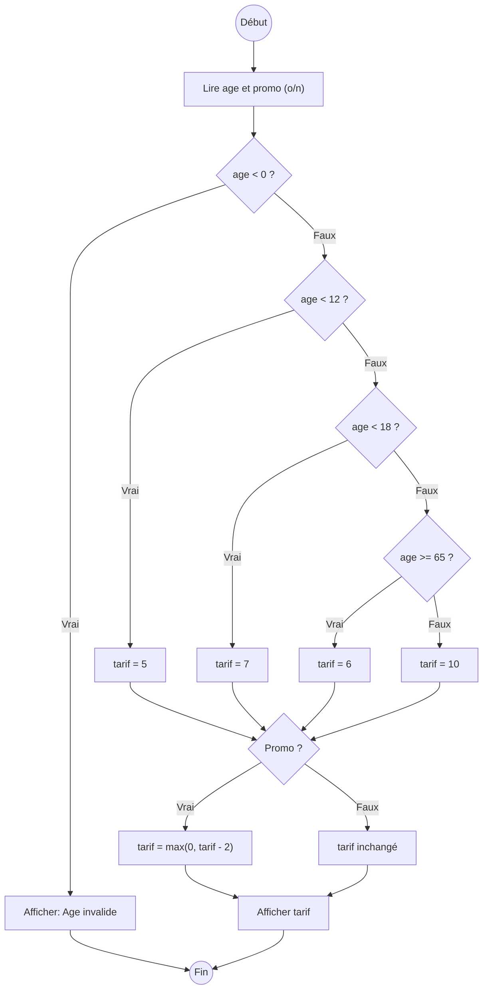

# Les conditionnelles

!!! note "Rappel d'ouverture (5 minutes, cours fermé)"
    Réponds **sans rouvrir** les pages précédentes, en écrivant tes réponses. Se tester est ce qui fixe les acquis ; relire ne le fait pas.

    1. Après `a = 3` puis `a = a + 2`, que vaut `a` ? Dans quel ordre la machine fait-elle le calcul et le rangement ?
    2. Que valent `17 // 5` et `17 % 5` ?
    3. Avec `s = "informatique"` : que vaut `s[0]` ? Que se passe-t-il si on écrit `s[0] = "I"` ?

    ??? success "Corrigé"
        1. `a` vaut `5`. Le membre de droite est **calculé d'abord** (`3 + 2`), et le résultat est **ensuite** rangé dans la case `a`. Le `=` n'est pas une égalité mathématique.
        2. `17 // 5` vaut `3` (quotient entier) et `17 % 5` vaut `2` (reste). On a bien `5 * 3 + 2 = 17`.
        3. `s[0]` vaut `"i"`. L'affectation `s[0] = "I"` provoque une `TypeError` : une chaîne est **immuable**, on ne peut pas en changer un caractère, seulement construire une nouvelle chaîne.

## Pourquoi ? Décider.

Jusqu'ici, nos programmes exécutent les instructions **les unes après les autres**, toujours dans le même ordre. Mais un programme doit souvent **choisir** ce qu'il fait selon la situation : afficher « majeur » ou « mineur » selon l'âge, accepter ou refuser un mot de passe, calculer un tarif selon le client.

Une **conditionnelle** donne au programme ce **pouvoir de décision**. On la représente souvent par un **diagramme d'activité** : les losanges sont les questions que l'on se pose, les rectangles les actions à réaliser.


```mermaid
flowchart TD
    A((Début)) --> B["Lire age et promo (o/n)"]
    B --> C{"age < 0 ?"}
    C -- Vrai --> X["Afficher: Age invalide"] --> Z(("Fin"))
    C -- Faux --> D{"age < 12 ?"}
    D -- Vrai --> T1["tarif = 5"] --> F{"Promo ?"}
    D -- Faux --> E{"age < 18 ?"}
    E -- Vrai --> T2["tarif = 7"] --> F
    E -- Faux --> G{"age >= 65 ?"}
    G -- Vrai --> T3["tarif = 6"] --> F
    G -- Faux --> T4["tarif = 10"] --> F
    F -- Vrai --> R1["tarif = max(0, tarif - 2)"] --> O["Afficher tarif"]
    F -- Faux --> R2["tarif inchangé"] --> O
    O --> Z
```

*(Combien aurais-tu payé dans ce cinéma ? Tu coderas ce diagramme en exercice.)*

## SI ... ALORS : une seule branche

!!! danger "Conditionnelle à une branche"
    **SI** (il fait beau) **ALORS** (je mets mes lunettes de soleil).

    « Il fait beau » est la **condition**. « Je mets mes lunettes » est le bloc d'**instructions** exécuté seulement si la condition est vraie.

    En Python :
    ```python
    if condition:
        instructions
    ```

    Le bloc d'instructions doit être **indenté** (touche tabulation).

```python
age = 20
if age >= 18:
    print("Vous êtes majeur.")
    print("Bienvenue.")
print("Fin du programme.")
```

!!! question "Prédis avant d'exécuter"
    Sans lancer le code, écris ce qui s'affiche **dans les deux cas** : avec `age = 20`, puis avec `age = 15`. Combien de lignes chaque fois ?

    ??? success "Réponse"
        Avec `age = 20`, trois lignes : « Vous êtes majeur. », « Bienvenue. », « Fin du programme. » Python évalue `20 >= 18`, qui vaut `True`, **entre dans le bloc indenté** et exécute ses deux lignes, puis continue avec la ligne non indentée.

        Avec `age = 15`, une seule ligne : « Fin du programme. » La condition `15 >= 18` vaut `False`, Python **saute tout le bloc indenté** et reprend juste après.

        Ce qui décide de tout, ce n'est pas le `if` mais l'**indentation** : elle seule dit ce qui est sauté et ce qui ne l'est pas.

!!! danger "L'indentation définit le bloc"
    Ce sont les **espaces en début de ligne** qui disent ce qui est « à l'intérieur » du `if`. Une ligne réalignée à gauche n'en fait plus partie.

## SI ... ALORS ... SINON : deux branches

!!! danger "Conditionnelle à deux branches"
    **SI** (il fait beau) **ALORS** (je mets mes lunettes) **SINON** (je prends mon parapluie).

    ```python
    if condition:
        instructions_si_vrai
    else:
        instructions_si_faux
    ```

```python
age = int(input("Votre âge ? "))
if age >= 18:
    print("Vous êtes majeur !")
else:
    print("Vous êtes mineur !")
print("Au revoir !")
```

Exactement **un** des deux blocs s'exécute, jamais les deux, jamais aucun.

### Les opérateurs de comparaison

Une condition se construit avec des comparaisons :

| Opérateur | Signification |
| :--: | --- |
| `==` | égal à |
| `!=` | différent de |
| `<`  | strictement inférieur à |
| `>`  | strictement supérieur à |
| `<=` | inférieur ou égal à |
| `>=` | supérieur ou égal à |

!!! danger "Piège : `==` n'est pas `=`"
    - `=` est l'**affectation** : `age = 18` range 18 dans `age`.
    - `==` est le **test d'égalité** : `age == 18` vaut `True` ou `False`.

    Dans une condition, on **teste**, donc on écrit `==`. C'est une source de bugs très fréquente chez les débutants.

!!! question "Exercices (deux branches)"
    1. **Parc.** Il faut mesurer au moins 1m30 pour entrer. Demande la taille en cm et indique si l'accès est autorisé.
    2. **Plus grand.** Demande deux nombres et affiche le plus grand.
    3. **Valeur absolue.** Demande un nombre et affiche sa valeur absolue (sans `abs`).
    4. **Mot de passe.** Le mot de passe est `"azerty"`. Demande-le et indique si l'accès est autorisé.

    ??? warning "Corrigés (3 et 4)"
        ```python
        # 3. Valeur absolue
        x = int(input("Un nombre : "))
        if x < 0:
            print(-x)
        else:
            print(x)

        # 4. Mot de passe
        mdp = input("Mot de passe : ")
        if mdp == "azerty":
            print("Accès autorisé")
        else:
            print("Accès refusé")
        ```

## Une condition est un booléen

Une comparaison comme `7 > 4` est une **opération**, au même titre que `+` ou `*`, sauf qu'elle ne renvoie pas un nombre mais un **booléen** : `True` ou `False` (le type booléen est présenté dans [Les booléens](../Numération/booleens.md), du nom du logicien George Boole).

```python
a = 7 > 4
print(a)         # True
print(type(a))   # <class 'bool'>
```

!!! hint "Une condition est un calcul"
    Une condition est en réalité **un calcul qui renvoie un booléen**. Quand tu te demandes s'il fait beau, ton cerveau *calcule* vrai ou faux à partir de ce que voient tes yeux.

On peut donc stocker une condition dans une variable, puis l'utiliser :

```python
majeur = age >= 18
if majeur:
    print("Vous êtes majeur.")
```

!!! tip "Écrire `if majeur`, pas `if majeur == True`"
    Si `majeur` vaut `True`, alors `majeur == True` vaut aussi `True` ; s'il vaut `False`, `majeur == True` vaut `False`. Tester `majeur` ou `majeur == True` revient donc au même. On écrit simplement :
    ```python
    if majeur:        # et non : if majeur == True
    ```

!!! question "Exercice : type et valeur"
    On exécute ces lignes dans l'ordre. Donne le **type** et la **valeur** de chaque variable.
    ```python
    a = 18
    b = (a > 7)
    c = (a == 6)
    e = a > 7
    a = 6.0
    f = (a == 6)
    ```

    ??? warning "Réponse"
        `a` : int, 18. `b` : bool, True. `c` : bool, False. `e` : bool, True. Puis `a` devient float, 6.0. `f` : bool, True (car `6.0 == 6`).

## SINON SI : plusieurs branches (`elif`)

Pour plus de deux cas, on enchaîne avec `elif` (contraction de « else if »).

```python
if note >= 16:
    print("Très bien")
elif note >= 10:
    print("Admis")
else:
    print("Ajourné")
```

!!! abstract "Le mécanisme caché : Python s'arrête au premier vrai"
    Python teste les conditions **dans l'ordre**. **Dès qu'une est vraie**, il exécute son bloc et **ignore toutes les suivantes**. Évaluer la condition d'un `elif` signifie donc que **toutes les précédentes étaient fausses**. Le `else` final ne sert que si aucune n'a été vraie.

!!! danger "L'ordre des `elif` compte"
    Avec `note = 15` :
    ```python
    if note >= 10:
        mention = "passable"
    elif note >= 12:
        mention = "assez bien"
    elif note >= 14:
        mention = "bien"
    ```
    Résultat : `"passable"` ! Car `15 >= 10` est vrai en premier, et Python s'arrête là. Il faut tester **du cas le plus exigeant au moins exigeant**.

!!! question "Exercices (`elif`)"
    1. **Mention au bac.** À partir d'une moyenne sur 20 : `[0;8)` Recalé, `[8;10)` Rattrapage, `[10;12)` Sans mention, `[12;14)` Assez bien, `[14;16)` Bien, `[16;18)` Très bien, `[18;20]` Félicitations.
    2. **Année bissextile.** Une année est bissextile si elle est multiple de 4 mais pas de 100, **ou** multiple de 400. Teste 2021, 2020, 1900, 2000.

    ??? warning "Corrigé (mention)"
        ```python
        moyenne = float(input("Moyenne : "))
        if moyenne >= 18:
            print("Félicitations")
        elif moyenne >= 16:
            print("Très bien")
        elif moyenne >= 14:
            print("Bien")
        elif moyenne >= 12:
            print("Assez bien")
        elif moyenne >= 10:
            print("Sans mention")
        elif moyenne >= 8:
            print("Rattrapage")
        else:
            print("Recalé")
        ```

## Combiner les conditions : `and`, `or`, `not`

On combine des booléens avec `and` (et), `or` (ou, inclusif) et `not` (non). Les tables de vérité sont dans [Les booléens](../Numération/booleens.md). Ce sont de vraies opérations : elles prennent des booléens et renvoient un booléen.

Cela permet souvent de **remplacer des conditions imbriquées** par une seule, plus claire.

!!! example "Le pass sanitaire : de l'imbriqué au booléen"
    On peut entrer si on est vacciné, ou, à défaut, si on a un test négatif.

    Version imbriquée, lourde :
    ```python
    if vaccine:
        print("Vous pouvez entrer")
    else:
        if test_negatif:
            print("Vous pouvez entrer")
        else:
            print("Vous ne pouvez pas entrer")
    ```

    Version `elif`, un peu mieux :
    ```python
    if vaccine:
        print("Vous pouvez entrer")
    elif test_negatif:
        print("Vous pouvez entrer")
    else:
        print("Vous ne pouvez pas entrer")
    ```

    Version booléenne, la plus claire :
    ```python
    if vaccine or test_negatif:
        print("Vous pouvez entrer")
    else:
        print("Vous ne pouvez pas entrer")
    ```

!!! tip "Tester un encadrement"
    Pour vérifier qu'un nombre `n` est entre 4 et 8 inclus, il faut qu'il soit `>= 4` **et** `<= 8` :
    ```python
    if n >= 4 and n <= 8:
        ...
    ```

!!! question "Exercices (booléens)"
    1. **Triangle.** Demande trois longueurs entières `a`, `b`, `c`. Si elles ne peuvent pas former un triangle (chaque côté doit être inférieur à la somme des deux autres), affiche `pas un triangle`. Sinon, affiche `equilateral`, `isocele` ou `scalene`.
    2. **Cinéma.** Implémente en Python le calcul de tarif du diagramme d'activité du début de la page.
    3. **Bissextile, version booléenne.** Reprends l'année bissextile avec **un seul calcul booléen**.

    ??? tip "Indice léger (triangle)"
        Il y a **deux décisions successives**, pas une seule : d'abord « est-ce un triangle ? », et seulement ensuite « lequel ? ». N'essaie pas de tout écrire dans un seul enchaînement de `elif`.

    ??? tip "Indice plus précis (triangle)"
        La première décision est un `if / else` dont la condition combine **trois** comparaisons avec `and`. La seconde décision, dans le `else`, est un `elif` à trois branches : combien de côtés sont égaux ? Attention à l'ordre, l'équilatéral est le cas **le plus exigeant**.

    ??? tip "Indice léger (cinéma)"
        Suis le diagramme dans l'ordre où il est dessiné : il te donne déjà la structure du programme. Chaque losange est un test, chaque rectangle une affectation.

    ??? tip "Indice plus précis (cinéma)"
        Le diagramme se lit en deux temps. Un premier bloc `if / elif / else` fixe le tarif selon l'âge, du plus exigeant au moins exigeant. Puis, **après** ce bloc et une seule fois, un second `if` applique la promotion. Ne recopie pas la promotion dans chaque branche.

    ??? warning "Corrigé (bissextile booléenne)"
        ```python
        annee = int(input("Année : "))
        bissextile = (annee % 4 == 0 and annee % 100 != 0) or (annee % 400 == 0)
        print(bissextile)
        ```

!!! question "Projet : livre dont vous êtes le héros"
    Implémente l'histoire suivante avec des conditionnelles et des saisies utilisateur.

    ```mermaid
    flowchart TD
        A((Début)) --> C{Choisir la forêt ?}
        C -- Vrai --> D[Cabane forêt]
        D --> E{Frapper ?}
        E -- Vrai --> K1[cle = True] --> H[Arrive à la grille]
        E -- Faux --> L1[Échec : piège] --> Z(((Fin)))
        H --> G{cle ?}
        G -- Vrai --> V1[Victoire] --> Z
        G -- Faux --> L2[Échec : grille fermée] --> Z
        C -- Faux --> M[Entrée caverne]
        M --> N{Torche ?}
        N -- Vrai --> P[Avancer]
        P --> Q{Courir ?}
        Q -- Vrai --> V2[Victoire] --> Z
        Q -- Faux --> L3[Échec : perdu] --> Z
        N -- Faux --> L4[Échec : trou] --> Z
    ```

---

Une conditionnelle combinée à une **boucle** permet de filtrer ou de compter (par exemple : compter les 6 sur 1000 lancers de dé). On y viendra juste après, avec [Les boucles](boucle-for.md).

## Point d'étape : où en es-tu vraiment ?

Ce bloc (variables, entiers, chaînes, conditionnelles) est le socle de tout le reste de l'année. Il vaut donc la peine de savoir **maintenant**, et pas en février, ce qui est acquis et ce qui ne l'est pas.

!!! warning "Vérification individuelle (15 minutes, seul, cours fermé)"
    À faire seul, sans aide et sans IA. Ce n'est pas noté : c'est un instrument de mesure, et il ne sert que si tu ne triches pas avec toi-même.

    **1. Lire.** Que s'affiche-t-il ?
    ```python
    x = 7
    y = x
    x = x + 3
    if y > 5 and x > 5:
        print("les deux")
    elif y > 5:
        print("y seul")
    else:
        print("aucun")
    print(x, y)
    ```

    **2. Compléter.** Remplis les trous pour que le programme affiche `"cher"` si le prix dépasse 100, `"correct"` entre 50 et 100 inclus, et `"bon marché"` en dessous.
    ```python
    prix = int(input("Prix ? "))
    if ...:
        print("cher")
    elif ...:
        print("correct")
    else:
        print("bon marché")
    ```

    **3. Écrire.** Depuis zéro : demande une année et affiche si elle est bissextile (multiple de 4 mais pas de 100, **ou** multiple de 400).

    ??? success "Réponses"
        **1.** `les deux` puis `10 7`. Le point délicat est `y = x` : il a copié la valeur `7` à cet instant, et `x = x + 3` ne l'a pas suivi.

        **2.** `if prix > 100:` puis `elif prix >= 50:`. L'ordre compte : le `elif` n'est atteint que si le premier test est faux, donc il est inutile d'y réécrire `prix <= 100`.

        **3.**
        ```python
        annee = int(input("Année ? "))
        if (annee % 4 == 0 and annee % 100 != 0) or annee % 400 == 0:
            print("bissextile")
        else:
            print("non bissextile")
        ```

!!! abstract "Comment lire ton résultat"
    Les trois questions ne mesurent pas la même chose, et **rater la troisième en réussissant la première n'est pas un signe de faiblesse**. Lire du code, le compléter et l'écrire de zéro sont trois compétences distinctes, qui se travaillent séparément.

    - Tu réussis les trois : passe à la suite.
    - Tu réussis 1 et 2 mais pas 3 : tu comprends le mécanisme, il te manque la **mise en route**. Refais des exercices d'écriture courts, pas de la relecture.
    - Tu rates la 1 : reprends le traçage avant tout le reste. Écrire du code qu'on ne sait pas lire ne mène nulle part.

!!! tip "Ce que ce point d'étape dit, et ce qu'il ne dit pas"
    En programmation, réussir un concept rend le suivant plus facile, et le rater le rend plus difficile : l'écart entre deux élèves se creuse par **enchaînement**, pas parce que l'un aurait un don et l'autre non. C'est justement pour cela qu'on mesure **tôt**, quand un rattrapage coûte encore une heure et pas un trimestre. Un résultat faible aujourd'hui est une information sur ce qu'il faut retravailler, rien d'autre.
