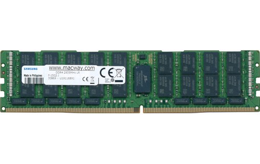

# Les variables

## Se souvenir d'une information

!!! abstract "Le plus important"
    **Une variable est le seul moyen de se souvenir d'une information entre les instructions d'un programme.**

    - Toute information qui n'est pas stockée dans une variable est **perdue**.
    - Toute nouvelle information stockée dans une variable **efface** la précédente.
    - Les variables sont stockées sous forme binaire dans la mémoire de l'ordinateur : la **RAM**.



## Une variable est une case mémoire nommée

Souvenez-vous du modèle de von Neumann et du [Little Man Computer](../architecture/von_neumann/langage-machine.md) : la mémoire est une suite de **cases**, chacune repérée par une **adresse**, et le processeur y **range** ou y **lit** des valeurs.

Une **variable**, c'est exactement cela : une **case mémoire à laquelle on a donné un nom**. Plutôt que de retenir « la case d'adresse 17 », on écrit `age`, et l'ordinateur sait de quelle case on parle.

!!! tip "L'image de la boîte"
    Voyez une variable comme une **boîte avec une étiquette** : l'étiquette est le nom (`age`), le contenu est la valeur (`16`). On peut regarder dans la boîte, ou en remplacer le contenu.

## Écrire dans une variable : l'affectation

Pour ranger une valeur dans une variable, on utilise l'opérateur `=`, appelé **affectation**.

```python
a = 4
```

!!! danger "`=` n'est pas l'égalité"
    `=` **ne signifie pas « est égal à »**. C'est une **opération mécanique** : « calcule ce qui est à droite, et range le résultat dans la variable de gauche ».

    Si la variable n'existe pas encore, elle est créée ; sinon, son contenu est remplacé.

!!! abstract "Ce que fait vraiment la machine"
    Cette opération correspond très exactement à une instruction du processeur. Dans le [Little Man Computer](../architecture/von_neumann/langage-machine.md), affecter une valeur, c'est l'instruction **`STA`** (*store*) : « écris cette valeur à telle adresse mémoire ». Ainsi `a = 4` revient à **ranger `4` dans la case étiquetée `a`**.

!!! question "Exercice"
    ```python
    truc = 4
    truc = 3
    ```
    Que vaut `truc` à la fin ? Pourquoi ?

    ??? warning "Réponse"
        `3`. La deuxième affectation a **remplacé** le contenu de la case : `4` est perdu.

## Lire une variable

On utilise le contenu d'une variable simplement en écrivant son **nom** dans une expression.

!!! abstract "Ce que fait vraiment la machine"
    Lire une variable correspond à l'instruction **`LDA`** (*load*) du Little Man Computer : « va chercher la valeur à telle adresse ». On en obtient une **copie** : **lire une variable ne la vide pas**, on peut la relire autant qu'on veut.

```python
truc = 2
print(truc)          # 2
bidule = truc + 5    # on lit truc (2), on calcule 7, on range dans bidule
print(bidule + truc) # on lit bidule (7) et truc (2) : affiche 9
print(truc)          # truc vaut toujours 2 : le lire ne l'a pas vidé
```

## Le membre de droite est calculé, *puis* rangé

Parce que `=` n'est pas l'égalité, une ligne comme celle-ci a un sens parfaitement clair :

```python
a = a + 1
```

En tant qu'égalité mathématique, ce serait absurde. En tant qu'affectation, c'est mécanique : **on calcule d'abord la droite** (`a + 1`, avec la valeur actuelle de `a`), **puis on range** le résultat dans `a`. Si `a` valait 4, il vaut maintenant 5.

!!! abstract "Dérouler un programme pas à pas"
    Suivons l'état des cases mémoire, instruction après instruction :

    ```python
    x = 10
    y = x + 2
    x = 0
    print(x, y)
    ```

    | Instruction | `x` | `y` |
    | --- | :--: | :--: |
    | `x = 10` | 10 | |
    | `y = x + 2` | 10 | 12 |
    | `x = 0` | 0 | 12 |

    L'affichage est donc `0 12`. Remarquez que `y` **garde 12** : sa valeur a été calculée au moment du `y = x + 2`, et changer `x` ensuite n'y touche pas.

!!! tip "Tracez vous-même avec Python Tutor"
    Ne vous contentez pas de lire les traces : **produisez-les**. Copiez un programme dans [Python Tutor](https://pythontutor.com/), avancez pas à pas et observez, à chaque instruction, ce que contiennent les cases mémoire. C'est le meilleur moyen de construire une image juste de ce que fait la machine, et c'est un réflexe à garder pour tout le cours.

## Échanger le contenu de deux variables

On veut échanger les contenus de `a` et `b`. La tentative naïve **échoue** :

```python
a = "gauche"
b = "droite"

a = b   # a devient "droite"... mais "gauche" est PERDU
b = a   # b devient "droite" aussi. Raté !
```

En rangeant `b` dans `a`, on a écrasé l'ancienne valeur de `a`. Il faut la **mettre de côté** dans une troisième variable :

```python
temp = a    # on sauvegarde "gauche"
a = b       # a devient "droite"
b = temp    # b récupère "gauche"
```

!!! tip "Le raccourci de Python"
    Python permet d'échanger en une ligne grâce à la [déstructuration](tuples.md) : `a, b = b, a`. La droite est entièrement calculée d'abord, puis rangée dans la gauche.

## Le type d'une variable

Toute variable a un **type**, qui indique le genre d'information qu'elle contient :

| Type | Exemple | Signification |
| --- | --- | --- |
| `int` | `age = 16` | un [entier](entiers.md) |
| `float` | `taille = 1.75` | un nombre à virgule |
| `str` | `nom = "Alice"` | une [chaîne de caractères](caracteres.md) |
| `bool` | `majeur = True` | un booléen |

Python **devine** le type d'après la valeur. On peut aussi l'indiquer explicitement, ce qui rend le programme plus clair :

```python
age: int = 16
```
