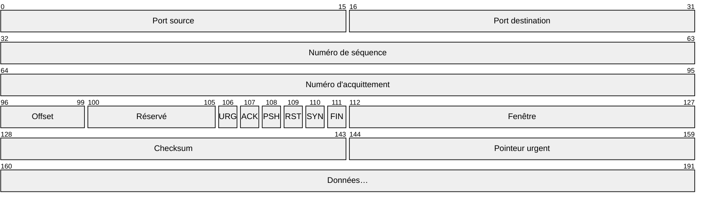
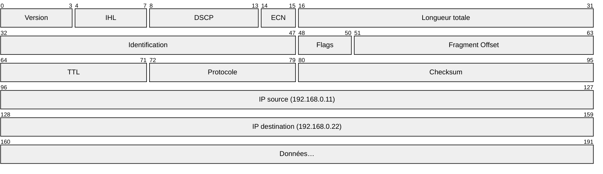
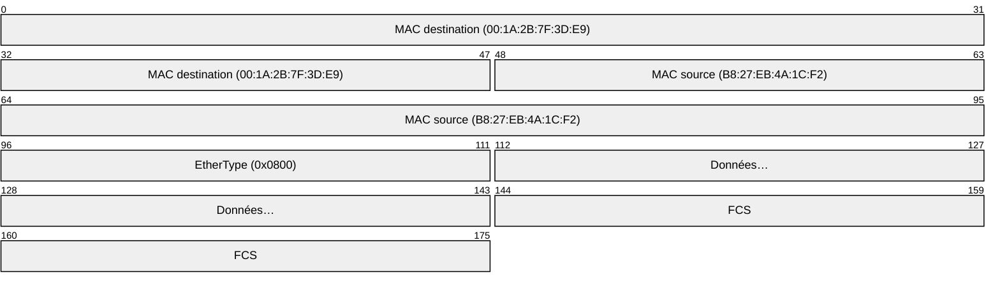

# Les couches de l'OSI

Nous allons les découvrir à travers ce scenario:

PC1 a pour adresse IP 192.168.0.11
PC2 a pour adresse IP 192.168.0.22

- Sur une application de PC1, un utilisateur clique sur le bouton "Envoyer" qui sert à envoyer une image `IMG` à PC2
- Sur une application de PC2, un utilisateur voit s'afficher l'image `IMG`

## Pourquoi des couches ?

Faire communiquer deux machines à travers un réseau est une tâche complexe. Elle implique des problèmes de nature très différente : comment représenter les données ? comment garantir leur livraison ? comment acheminer les paquets jusqu'à destination ? comment transmettre des signaux physiquement ?

Le modèle OSI (*Open Systems Interconnection*) découpe ce problème en **7 couches indépendantes**, chacune ayant une responsabilité précise. Chaque couche communique uniquement avec la couche directement au-dessus et en dessous d'elle.

À l'émission, chaque couche ajoute ses propres informations aux données : c'est l'**encapsulation**.

!!! info "PDU — Protocol Data Unit"
    À chaque couche, les données ont un nom spécifique : on parle de **PDU** (*Protocol Data Unit*). Le PDU d'une couche devient la **charge utile** (*payload*) de la couche inférieure.

---

## PC1 envoie l'image — la descente


!!! hint "Principe général"
    Quand l'utilisateur clique sur "Envoyer", les données traversent les 7 couches **de haut en bas** sur PC1. À chaque étape, la couche ajoute un **en-tête** (parfois un **pied de page**) contenant ses propres informations de contrôle.

### Couche 7 — Application

**Rôle :** interface entre l'utilisateur et le réseau.

L'application (par exemple une messagerie web) prend l'image `IMG` et la formule sous la forme d'un message HTTP :

```
POST /upload HTTP/1.1
Host: pc2.local
Content-Type: image/png
Content-Length: 204800

[données brutes de IMG]
```

La couche application ne sait pas comment les données vont voyager. Elle se contente de formuler **ce qu'elle veut envoyer** et passe le tout à la couche du dessous.

> PDU : **message**

---

### Couche 6 — Présentation

**Rôle :** format, encodage, chiffrement.

La couche présentation s'assure que les données sont dans un format compréhensible par le destinataire :

- Elle peut **compresser** les données (l'image est déjà en PNG, déjà compressée)
- Si la connexion est HTTPS, elle **chiffre** les données via TLS — PC2 seul pourra les déchiffrer

```
[données IMG chiffrées par TLS]
```

> PDU : **données encodées/chiffrées**

---

### Couche 5 — Session

**Rôle :** ouvrir, maintenir, fermer le dialogue entre les deux applications.

Cette couche gère les **sessions** : elle a préalablement établi une connexion avec PC2 (handshake TLS, négociation de paramètres) et s'assure que la conversation reste cohérente du début à la fin.

Si la connexion est interrompue au milieu de l'envoi, c'est cette couche qui gère la reprise ou la signalisation d'erreur.

> PDU : **données encodées/chiffrées**

---

### Couche 4 — Transport

**Rôle :** découper, numéroter, garantir la livraison.

Une image de 200 Ko ne peut pas être envoyée d'un seul bloc. La raison principale est physique : Ethernet impose une taille maximale de trame de **1 500 octets** (le MTU, *Maximum Transmission Unit*). Au-delà, la trame est trop grande pour être transmise sur le réseau local. Il y a aussi des raisons pratiques : envoyer un bloc de 200 Ko sans découpage, c'est monopoliser le réseau pendant toute la durée de la transmission, sans possibilité de détecter une erreur avant la fin, ni de retransmettre uniquement la partie perdue.

La couche transport **découpe donc les données en segments** et ajoute un en-tête contenant :

| Champ | Valeur (exemple) |
|---|---|
| Port source | 54231 |
| Port destination | 443 (HTTPS) |
| Numéro de séquence | 1, 1461, 2921… |
| Numéro d'acquittement | — |
| Flags TCP | SYN, ACK, PSH… |

Le protocole **TCP** garantit que tous les segments arrivent, dans le bon ordre, sans erreur. Si un segment est perdu en route, il sera renvoyé.



> PDU : **segment**

---

### Couche 3 — Réseau

**Rôle :** adresser et acheminer les paquets à travers le réseau.

La couche réseau prend chaque segment TCP et y ajoute un **en-tête IP** pour savoir où envoyer le paquet :

| Champ | Valeur (exemple) |
|---|---|
| IP source | 192.168.0.11 (PC1) |
| IP destination | 192.168.0.22 (PC2) |
| TTL | 64 |
| Protocole | TCP (valeur 6) |



C'est à cette couche que les **routeurs** interviennent : ils lisent l'IP de destination et décident par quel chemin acheminer le paquet. Les adresses IP restent inchangées de bout en bout.

> PDU : **paquet** (datagramme)

---

### Couche 2 — Liaison de données

**Rôle :** transmettre les données sur le lien physique local (entre deux équipements directement connectés).

Un paquet IP ne sait pas comment traverser le câble entre PC1 et le switch. La couche liaison encapsule le paquet dans une **trame Ethernet** et y ajoute les adresses **MAC** (adresses physiques des cartes réseau) :

| Champ | Valeur (exemple) |
|---|---|
| MAC source | `B8:27:EB:4A:1C:F2` (PC1) |
| MAC destination | `00:1A:2B:7F:3D:E9` (switch) |
| Type | `0x0800` (IPv4) |
| FCS (checksum) | valeur calculée sur l'ensemble de la trame |



!!! question "Challenge"
    D'après les informations à votre disposition:

    - Quelle est la marque de PC1?
    - Quelle est la marque du switch?


!!! warning "IP vs MAC : deux adresses, deux portées"
    L'adresse **IP** identifie une machine à l'échelle d'Internet. Elle ne change pas de bout en bout.

    L'adresse **MAC** identifie une carte réseau sur le segment local. Elle change à chaque routeur : quand un routeur reçoit la trame, il en crée une nouvelle avec ses propres adresses MAC pour le prochain saut.

> PDU : **trame**

---

### Couche 1 — Physique

**Rôle :** transmettre des bits sous forme de signaux sur un support physique.

La couche physique prend la trame (une suite de bits) et la convertit en **signal** adapté au support :

- **Câble Ethernet (RJ45)** → variations de tension électrique
- **Fibre optique** → impulsions lumineuses
- **Wi-Fi** → ondes radio

PC2 reçoit ces signaux et les reconvertit en bits. Cette couche ne comprend pas le sens de ce qu'elle transporte : pour elle, tout est des `0` et des `1`.

> PDU : **bits**

---

## Schéma d'encapsulation

À chaque descente de couche, les données s'enrichissent d'un en-tête supplémentaire :

```
Couche 7  │ MSG                                                          │
Couche 6  │ MSG chiffré (TLS)                                            │
Couche 5  │ MSG chiffré (TLS)                                            │
Couche 4  │ En-tête TCP    │ MSG chiffré                                 │
Couche 3  │ En-tête IP     │ En-tête TCP    │ MSG chiffré                │
Couche 2  │ En-tête ETH    │ En-tête IP     │ En-tête TCP │ MSG │ FCS    │
Couche 1  │ 01001101 00110101 10110010 01101001 10110110 …                │
```

Chaque couche **ignore le contenu** des couches supérieures. Elle ne voit que son propre en-tête et traite la suite comme une boîte noire opaque. C'est ce principe d'isolation qui rend le modèle extensible : on peut changer le protocole d'une couche sans toucher aux autres.

---

## PC2 reçoit l'image — la montée

À l'arrivée sur PC2, le processus est **exactement inverse** : les couches remontent de bas en haut, chacune **désencapsulant** la partie dont elle est responsable et passant le reste à la couche supérieure.

| Couche | Action sur PC2 |
|---|---|
| 1 — Physique | reçoit les signaux, reconstitue les bits |
| 2 — Liaison | vérifie le FCS (intégrité), lit le MAC destination, extrait le paquet IP |
| 3 — Réseau | vérifie que l'IP destination est bien celle de PC2, extrait le segment TCP |
| 4 — Transport | réordonne les segments par numéro de séquence, envoie les acquittements, reconstitue les données complètes |
| 5 — Session | vérifie la cohérence de la session |
| 6 — Présentation | déchiffre les données TLS |
| 7 — Application | reçoit le message HTTP avec `IMG` en payload, l'affiche à l'utilisateur |

!!! success "Résultat"
    L'utilisateur sur PC2 voit s'afficher l'image `IMG`. L'ensemble de ce mécanisme — 7 couches en descente, autant en montée, plus le routage intermédiaire — s'est déroulé en quelques dizaines de millisecondes.

---

## Le modèle TCP/IP

En pratique, on utilise souvent le **modèle TCP/IP** à 4 couches plutôt que les 7 couches OSI. Le modèle OSI est un **modèle de référence** conceptuel, tandis que TCP/IP est le modèle **réellement implémenté** sur Internet.

| Modèle OSI | Modèle TCP/IP | Protocoles courants |
|---|---|---|
| Application (7) | Application | HTTP, DNS, SMTP, FTP |
| Présentation (6) | Application | TLS, JPEG, UTF-8 |
| Session (5) | Application | TLS handshake |
| Transport (4) | Transport | TCP, UDP |
| Réseau (3) | Internet | IP, ICMP |
| Liaison (2) | Accès réseau | Ethernet, Wi-Fi (802.11) |
| Physique (1) | Accès réseau | câble, fibre, ondes radio |

Dans le cadre du programme NSI, on travaille principalement avec le modèle TCP/IP et on s'intéresse aux couches **Transport (TCP/UDP)**, **Internet (IP)** et **Application (HTTP, DNS)**.
