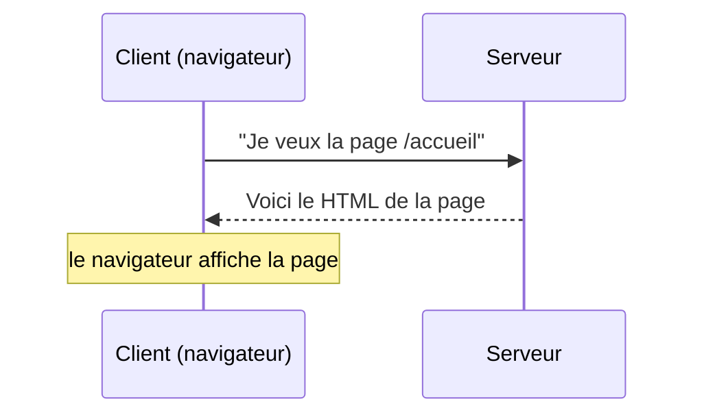
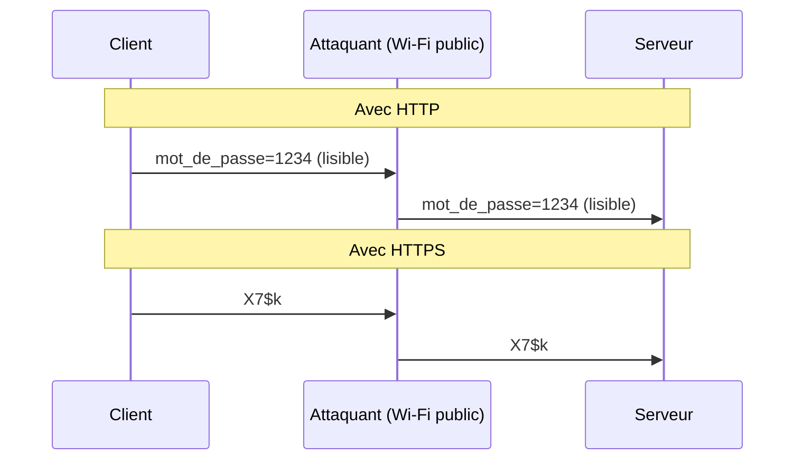

# Le Web : client, serveur et HTTP

## Architecture client-serveur

Quand tu ouvres une page web, deux machines sont impliquées :

- le **client** : ton navigateur (Chrome, Firefox...), qui s'exécute sur ton ordinateur
- le **serveur** : une machine distante qui héberge le site et répond aux demandes



!!! abstract "Règle fondamentale"
    Le code Python (ou tout autre langage) qui tourne sur le serveur n'est **jamais** visible par l'utilisateur. Le navigateur ne reçoit que le résultat : du HTML, du JSON, etc.

    Le code JavaScript contenu dans une page HTML, lui, s'exécute **dans le navigateur**, sur la machine de l'utilisateur.

---

## Le protocole HTTP

HTTP (*HyperText Transfer Protocol*) est le langage que le client et le serveur utilisent pour se parler. Chaque échange suit toujours le même schéma :

1. le client envoie une **requête**
2. le serveur renvoie une **réponse**

### Anatomie d'une URL

```
http://localhost:5000/deviner?proposition=42
 ^        ^           ^        ^
 |        |           |        |
protocole  serveur    route   paramètre(s)
```

La partie qui commence par `?` s'appelle la **chaîne de requête** (*query string*). Elle contient des paramètres sous la forme `nom=valeur`, séparés par `&` si plusieurs.

```
?proposition=42&mode=facile
   ^^^^^^^^^      ^^^^^^^^^^
   paramètre 1   paramètre 2
```

### Les méthodes HTTP

Une requête HTTP précise toujours quelle **méthode** elle utilise. Les deux principales sont :

| Méthode | Usage | Paramètres |
|---------|-------|------------|
| **GET** | Demander une ressource | Dans l'URL (`?cle=valeur`) |
| **POST** | Envoyer des données | Dans le corps de la requête (invisible dans l'URL) |

!!! warning "GET ou POST ?"
    - Utilise **GET** pour des données non sensibles qui peuvent apparaître dans l'URL (une recherche, un filtre, une proposition de jeu).
    - Utilise **POST** dès que les données sont sensibles (mot de passe, données personnelles) ou volumineuses (fichier, formulaire long).

    **Attention :** POST cache les données dans l'URL, mais ne les chiffre pas. Sans HTTPS, elles restent lisibles par un attaquant qui intercepte le trafic.

### La réponse du serveur

Le serveur répond avec :

- un **code de statut** (200 = OK, 404 = page introuvable, 500 = erreur serveur)
- des **en-têtes** (type du contenu, date...)
- un **corps** contenant les données (HTML, JSON, image...)

---

## Le format JSON

Quand un serveur doit renvoyer des données structurées (pas une page HTML entière), il utilise souvent le format **JSON** (*JavaScript Object Notation*).

```json
{"resultat": "Trop petit !", "tentatives": 3}
```

JSON ressemble beaucoup à un dictionnaire Python. Le JavaScript peut le lire directement, ce qui en fait le format d'échange idéal entre un serveur et du code JS côté client.

---

## Ce qui est mémorisé où

Une page web peut avoir besoin de retenir des informations. Mais côté client et côté serveur, les mécanismes sont très différents :

| | Côté client (navigateur) | Côté serveur |
|--|--------------------------|--------------|
| **Exemples** | Variables JavaScript, localStorage, cookies | Variables Python, base de données |
| **Durée de vie** | Disparait si on recharge la page (sauf localStorage) | Persiste tant que le serveur tourne |
| **Partagé entre utilisateurs ?** | Non, propre à chaque onglet | Oui, commun à tous les utilisateurs (si variable globale) |
| **Transmis au serveur ?** | Seulement si le code le prévoit explicitement | Toujours accessible au serveur |

!!! example "Exemple concret"
    Dans notre jeu, l'historique des tentatives est un tableau JavaScript : il est mémorisé dans le navigateur et jamais envoyé au serveur. Le compteur de tentatives est une variable Python : il est mémorisé sur le serveur.

---

## Les formulaires HTML

Un formulaire HTML permet d'envoyer des données saisies par l'utilisateur vers le serveur.

```html
<form action="/inscription" method="POST">
  <input type="text" name="pseudo" placeholder="Pseudo">
  <input type="password" name="mot_de_passe" placeholder="Mot de passe">
  <button type="submit">S'inscrire</button>
</form>
```

Les attributs importants :

- `action` : la route du serveur qui recevra les données
- `method` : `GET` ou `POST`
- `name` : le nom du paramètre tel qu'il sera reçu côté serveur

Avec `method="GET"`, les valeurs apparaissent dans l'URL :
```
/inscription?pseudo=alice&mot_de_passe=1234
```

Avec `method="POST"`, les valeurs sont dans le corps de la requête et n'apparaissent pas dans l'URL.

---

## HTTPS : pourquoi chiffrer ?

HTTP transmet tout en clair sur le réseau. N'importe quel équipement intermédiaire (routeur, fournisseur d'accès, Wi-Fi public) peut lire les données échangées.

**HTTPS** ajoute une couche de chiffrement (protocole TLS) : les données sont rendues illisibles pour quiconque intercepterait le trafic.



Le navigateur signale HTTPS par un **cadenas** à gauche de la barre d'adresse.

!!! warning "POST ne suffit pas"
    Utiliser `method="POST"` empêche le mot de passe d'apparaître dans l'URL, mais sans HTTPS il reste lisible dans le corps de la requête. Les deux sont nécessaires : **POST + HTTPS**.

---

## Les outils de développement

Le navigateur intègre des outils pour observer tous ces échanges. Ouvre-les avec **F12**, puis va dans l'onglet **Réseau** (Network).

À chaque requête, tu peux consulter :

- l'URL complète et la méthode utilisée (GET/POST)
- les en-têtes de la requête et de la réponse
- le corps de la requête (pour POST : onglet **Charge utile**)
- la réponse du serveur (onglet **Aperçu** ou **Réponse**)
- le code de statut HTTP

Ces outils sont indispensables pour comprendre ce qui se passe réellement entre le client et le serveur.
