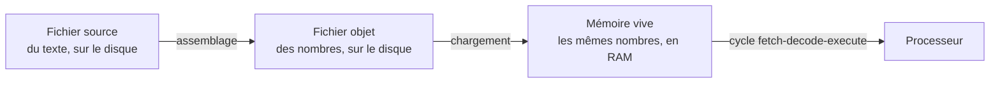

# Le langage machine

!!! question "Rappel d'ouverture (5 minutes, cours fermé)"
    1. Ton groupe avait codé `avance` par un certain nombre. Un autre groupe avait choisi un nombre différent. Lequel des deux avait raison ?
    2. Tu reçois la suite `9 3 100 7 90`. Que te manque-t-il pour la lire ?
    3. Cite une raison pour laquelle un programme installé sur un ordinateur ne fonctionne pas sur un téléphone.
    4. Cite les trois éléments que le modèle de von Neumann distingue dans une machine.
    5. Le compteur ordinal vaut 12. Que désigne ce nombre ?
    6. Qu'est-ce qui, dans la mémoire, distingue une instruction d'une donnée ?

    ??? success "Corrigé"
        1. **Les deux.** Le nombre associé à un mot est une convention arbitraire : elle n'est ni vraie ni fausse, elle est partagée ou elle ne l'est pas.
        2. **La table de correspondance.** Un code ne contient jamais son propre mode d'emploi.
        3. Les deux machines n'ont pas le même **jeu d'instructions**, c'est-à-dire pas la même table. Le même nombre y désigne des ordres différents.
        4. L'**unité centrale** (avec son unité de calcul et son unité de contrôle), la **mémoire**, et les **entrées-sorties**, reliées par des bus.
        5. L'**adresse de la prochaine instruction** à exécuter, pas sa valeur.
        6. **Rien.** Ce qui décide qu'un nombre est exécuté comme une instruction, c'est uniquement le fait que le compteur ordinal pointe dessus.

!!! tip "D'où l'on vient"
    Dans l'activité [Inventer un langage pour une machine](langage-invente.md), tu as fabriqué une table de correspondance entre des mots et des nombres, et constaté qu'un programme codé ne veut rien dire sans elle. Il restait une question ouverte : comment distinguer, dans une suite de nombres, les ordres des quantités ?

    Cette page y répond, et elle te fait écrire tes premiers programmes.

## 1. Ce qui se passe entre ton fichier et l'exécution

Tu n'écris jamais des nombres. Tu écris du **texte**, dans un fichier, sur le **disque**. Ce texte n'est pas exécutable : le processeur ne lit pas des lettres.

Il se passe donc trois choses, dans cet ordre, et ce sont les mêmes pour Python, pour un jeu vidéo ou pour le système d'exploitation.



1. **Tu écris le source.** Du texte lisible par toi : des mots, des noms que tu choisis, des commentaires. Il est rangé sur le disque, comme n'importe quel fichier.
2. **Un programme le traduit : l'assembleur.** Il remplace chaque mot par le nombre que le **jeu d'instructions** de la machine lui associe, et il produit un second fichier, le **fichier objet**, qui ne contient plus que des nombres.
3. **Le fichier objet est chargé en mémoire vive.** Le disque est un périphérique d'entrée-sortie : le processeur ne peut pas y exécuter quoi que ce soit. Il faut d'abord recopier les nombres en RAM. C'est seulement là que le compteur ordinal peut s'y promener.

!!! abstract "Ce que l'assembleur enlève, et c'est le point important"
    Le fichier objet ne contient **ni mnémonique, ni nom de variable, ni commentaire**. Tout cela a disparu à la traduction : c'était pour toi, pas pour la machine.

    Un assembleur n'est donc pas un programme intelligent. C'est un programme qui **applique une table**, exactement celle que ton groupe a fabriquée à la première séance. Un **compilateur**, que tu rencontreras plus tard, fait un travail beaucoup plus difficile : il traduit un langage où une seule ligne peut valoir des dizaines d'instructions machine.

## 2. La machine : le Little Man Computer

Le **Little Man Computer** (LMC) est un ordinateur d'étude. Il est minuscule, et c'est tout son intérêt : il tient en une page, et il a pourtant tout ce qu'a une vraie machine de von Neumann.

| | |
|---|---|
| **Mémoire** | 100 cases, numérotées de 00 à 99 |
| **Contenu d'une case** | un nombre de 0000 à 9999 |
| **Accumulateur** (`ACC`) | le seul endroit où l'on calcule : tout passe par lui |
| **Compteur ordinal** (`PC`) | l'adresse de la prochaine instruction à exécuter |
| **Entrée / sortie** | des nombres qu'on fournit, des nombres qui s'affichent |

Une case contient un nombre, et **une instruction est un nombre comme un autre**. C'est déjà la réponse à la sixième question du rappel : rien ne distingue une case de code d'une case de données, c'est le compteur ordinal qui décide, en s'y arrêtant.

!!! info "Le format d'une instruction, en quatre chiffres"
    Voilà la seconde convention qui manquait à ton langage de la première séance : le **format**.

    ```
      5 0 4 2
      │ │ └─┴── l'adresse de la case concernée, de 00 à 99
      │ └────── toujours 0 dans tout ce chapitre
      └──────── le code opération : quelle instruction
    ```

    `5042` se lit donc « charge dans l'accumulateur le contenu de la case 42 ». Le premier chiffre dit **quoi faire**, les deux derniers **sur quelle case**.

    Le chiffre du milieu sert, sur cette machine, à désigner des registres et des modes d'accès dont tu n'auras pas besoin cette année. Il vaut `0` partout dans ce chapitre.

## 3. Le jeu d'instructions

Onze mots à connaître, pas un de plus.

**Entrée et sortie**

| Mnémonique | Code | Effet |
|---|---|---|
| `INP` | `9001` | lit une valeur et la place dans l'accumulateur |
| `OUT` | `9002` | affiche la valeur de l'accumulateur |

**Mémoire et arithmétique**

| Mnémonique | Code | Effet |
|---|---|---|
| `LDA adr` | `50adr` | `ACC` reçoit le contenu de la case `adr` |
| `STA adr` | `30adr` | la case `adr` reçoit le contenu de `ACC` |
| `ADD adr` | `10adr` | `ACC` reçoit `ACC` plus le contenu de la case `adr` |
| `SUB adr` | `20adr` | `ACC` reçoit `ACC` moins le contenu de la case `adr` |

**Branchements**

| Mnémonique | Code | Effet |
|---|---|---|
| `BRA adr` | `60adr` | saute toujours à l'adresse `adr` |
| `BRZ adr` | `70adr` | saute à `adr` si `ACC` vaut 0 |
| `BRP adr` | `80adr` | saute à `adr` si `ACC` est positif ou nul |

**Arrêt et données**

| Mnémonique | Code | Effet |
|---|---|---|
| `HLT` | `0000` | arrête le processeur |
| `DAT` | | réserve une case, avec une valeur initiale facultative. Ce n'est pas une instruction : rien ne l'exécute, elle sert seulement à mettre un nombre en mémoire avant le départ |

!!! info "Comment lire la colonne « Code »"
    `50adr` veut dire : les deux chiffres `50`, puis l'**adresse écrite sur deux chiffres**.

    - `LDA 42` s'écrit donc `5042`
    - `LDA 7` s'écrit `5007`, et non `507` : l'adresse occupe toujours deux chiffres, le zéro compris
    - `HLT` s'écrit `0000`, quatre zéros

    Un mot machine fait **toujours quatre chiffres**, sans exception. C'est ce qui permet au processeur de savoir où finit une instruction et où commence la suivante, ce qui manquait justement à ton langage de la première séance.

!!! abstract "Cette table est une convention, exactement comme la tienne"
    Tu as déjà fait ce travail dans l'activité [Inventer un langage pour une machine](langage-invente.md) : tu as attribué **un numéro à chaque mot**, et tu as constaté que le programme du voisin était indéchiffrable sans ta table.

    Un processeur ne fait rien d'autre. La table ci-dessus n'est pas *la* bonne, c'est *celle-là*. Elle a été décidée par les concepteurs de cette machine et gravée dans son circuit, comme la tienne a été décidée par ton groupe. Une autre machine en utilise une autre, et c'est pourquoi un programme assemblé pour un processeur ne tourne pas sur un autre.

!!! danger "`LDA 07` et `BRA 07` ne parlent pas de la même chose"
    Dans `LDA 07`, le `07` désigne une case dont on veut **le contenu**.

    Dans `BRA 07`, le `07` désigne la case **où aller**, c'est-à-dire une adresse d'instruction.

    Le même chiffre, deux sens. Le processeur, lui, ne se trompe jamais : il lit d'abord le code opération, et c'est **lui** qui décide comment lire la suite.

## 4. Écrire un programme

Une ligne porte au plus une **étiquette**, une **instruction** et un **commentaire**.

```
// Un commentaire commence par // et va jusqu'à la fin de la ligne.

        INP             // lire un nombre
        STA total       // le ranger dans la case étiquetée "total"
        HLT

total:  DAT             // réserve une case, initialisée à 0
```

- **Une étiquette se termine par deux points** : `total:`, `depart:`. Elle donne un nom à une case, pour ne pas avoir à compter les adresses soi-même.
- **`DAT` réserve une case.** `DAT` seul la met à 0, `DAT 42` la met à 42.
- **L'indentation est libre.** On aligne les instructions pour que les étiquettes ressortent, c'est tout.
- **Le programme et ses données ne peuvent pas dépasser 100 cases**, puisque c'est la taille de la mémoire.

!!! warning "Le LMC ne sait ni multiplier ni diviser"
    Il n'y a que `ADD` et `SUB` dans la table. Multiplier par 3, c'est additionner trois fois ; diviser par 3, c'est retirer 3 autant de fois que possible en comptant les retraits. Tu le feras aux défis 5 et 11.

    Ce n'est pas une bizarrerie du LMC : les tout premiers processeurs ne savaient pas multiplier non plus.

## 5. Le simulateur

Le simulateur est une extension de VSCode, et c'est aussi l'occasion de te familiariser avec l'outil qu'on utilisera toute l'année.

!!! info "Installation"
    1. Ouvre VSCode.
    2. Clique sur l'icône des **extensions** dans la barre de gauche.
    3. Cherche `mmarchand.lmc-vscode`.
    4. Clique sur le bouton bleu **Installer**.

    Crée ensuite un fichier dont le nom se termine par **`.lmc`**, par exemple `essai.lmc`. C'est l'extension du fichier qui déclenche la coloration et la détection d'erreurs.

    Pour ouvrir l'émulateur : `Ctrl+Shift+P`, puis tape **LMC: Open Emulator**.

Quatre boutons, et ils suivent exactement la chaîne de la section 1.

| Bouton | Ce qu'il fait |
|---|---|
| **Assembler .lmc** | traduit ton source et écrit le fichier objet `.lmcobj` à côté de lui. N'exécute rien. |
| **Charger .lmcobj en RAM** | relit ce fichier **sur le disque** et le dépose en mémoire. |
| **Step** | exécute une seule instruction, et montre les trois phases du cycle. |
| **Run** | exécute jusqu'au `HLT`. |

!!! warning "Le piège du fichier objet périmé"
    Si tu modifies ton source **sans réassembler**, le bouton « Charger » chargera l'**ancien** programme, celui qui est encore sur le disque. Ta correction ne servira à rien et tu chercheras longtemps.

    Ce n'est pas un défaut du simulateur : une vraie chaîne d'outils se comporte exactement ainsi. Assemble d'abord, charge ensuite.

## 6. Lire et tracer avant d'écrire

### 6.1 Prédire l'état de la machine

!!! question "Que va afficher ce programme ?"
    Voici un programme complet. Chaque ligne occupe une case, à partir de l'adresse 00.

    | Ligne | Adresse | Contenu |
    |:---:|:---:|:---|
    | 1 | 00 | `LDA a` |
    | 2 | 01 | `ADD b` |
    | 3 | 02 | `STA c` |
    | 4 | 03 | `SUB a` |
    | 5 | 04 | `OUT` |
    | 6 | 05 | `HLT` |
    | 7 | 06 | `a: DAT 4` |
    | 8 | 07 | `b: DAT 7` |
    | 9 | 08 | `c: DAT 0` |

    **Sur ton cahier**, recopie et remplis ce tableau. Une ligne par instruction exécutée, et tu donnes l'état **après exécution de la ligne** indiquée.

    | Après la ligne | `ACC` | contenu de `c` |
    |:---:|:---:|:---:|
    | 1 | | |
    | 2 | | |
    | 3 | | |
    | 4 | | |

    Puis réponds à ces deux questions, en une ligne chacune :

    - quel nombre la ligne 5 affiche-t-elle ?
    - la case `c` contient-elle ce nombre-là ?

    **N'ouvre pas le simulateur tant que tu n'as pas écrit tes réponses.**

    ??? tip "Indice"
        Deux instructions seulement écrivent dans `ACC` sans le lire : `LDA` et `INP`. Toutes les autres partent de ce qu'il contient déjà.

        Demande-toi ce que `STA` fait à l'accumulateur. Rien du tout ? Ou est-ce qu'il le vide ?

    ??? question "Avant d'ouvrir la correction"
        En une phrase, sur ton cahier : sur quelle ligne ta prédiction s'est-elle écartée de ce que tu croyais, et qu'est-ce que l'indice t'a appris ?

    ??? success "Correction"
        | Après la ligne | `ACC` | contenu de `c` |
        |:---:|:---:|:---:|
        | 1 | 4 | 0 |
        | 2 | 11 | 0 |
        | 3 | 11 | 11 |
        | 4 | 7 | 11 |

        La ligne 5 affiche **7**, et la case `c` contient **11**. Ce ne sont pas les mêmes.

        Deux pièges dans quatre lignes, et ce sont les deux plus fréquents de tout le chapitre.

        - **`STA` copie, il ne déplace pas.** Après la ligne 3, la valeur 11 est à deux endroits : dans la case `c` **et** toujours dans l'accumulateur. Beaucoup pensent que ranger une valeur vide l'accumulateur.
        - **`OUT` affiche l'accumulateur, jamais une case.** Il n'a pas d'opérande : il ne peut pas afficher `c`. Pour afficher `c`, il faudrait `LDA c` puis `OUT`.

        Vérifie maintenant dans le simulateur, en mode **Step**.

### 6.2 Assembler à la main, une fois

Tu écriras tes programmes en **mnémoniques**, parce que c'est lisible. La machine, elle, ne connaît que des **nombres**. Tu vas faire ce travail de traduction une seule fois toi-même, pour savoir ce que l'assembleur fait à ta place ensuite.

!!! question "Traduire un programme en code machine"
    Voici un programme, déjà placé en mémoire. Chaque ligne occupe une case, à partir de l'adresse 00.

    | Adresse | Instruction |
    |:---:|:---|
    | 00 | `INP` |
    | 01 | `STA 06` |
    | 02 | `INP` |
    | 03 | `ADD 06` |
    | 04 | `OUT` |
    | 05 | `HLT` |
    | 06 | `DAT` |

    **Sur ton cahier :**

    1. Écris le **code machine** de chaque ligne, c'est-à-dire les **quatre chiffres** que contiendra réellement la case. Utilise la table de la section 3.
    2. Dis en une phrase ce que fait ce programme.
    3. Combien de tables de correspondance t'a-t-il fallu pour faire cette traduction ?

    **Ensuite seulement**, vérifie :

    1. Saisis ce programme en mnémoniques dans un fichier `main.lmc`, et clique sur **Assembler .lmc**.
    2. Ouvre le fichier `main.lmcobj` qui vient d'apparaître à côté. Compare-le, ligne à ligne, avec ce que tu as écrit sur ton cahier.
    3. Modifie un des nombres de `main.lmcobj`, par exemple remplace le `1006` par `2006`, enregistre, puis clique sur **Charger .lmcobj en RAM** **sans réassembler**, et sur **Run**. Le programme fait maintenant une soustraction.

    C'est bien le fichier de nombres qui est chargé, et lui seul.

    ??? question "Avant d'ouvrir la correction"
        En une phrase, sur ton cahier : quelle case t'a demandé le plus de réflexion, et pourquoi ?

    ??? success "Correction"
        **1.**

        | Adresse | Instruction | Code machine |
        |:---:|:---|:---:|
        | 00 | `INP` | `9001` |
        | 01 | `STA 06` | `3006` |
        | 02 | `INP` | `9001` |
        | 03 | `ADD 06` | `1006` |
        | 04 | `OUT` | `9002` |
        | 05 | `HLT` | `0000` |
        | 06 | `DAT` | `0000` |

        La suite est donc : `9001 3006 9001 1006 9002 0000 0000`

        **2.** Il lit deux nombres et affiche leur somme. Le premier est rangé en case 06 le temps de lire le second.

        **3.** Une seule, celle du jeu d'instructions du LMC. Et c'est tout le point : tu viens de faire **à la main** ce qu'un assembleur fait automatiquement. Traduire des mnémoniques en code machine, ce n'est pas comprendre un programme, c'est appliquer une table.

        **Et la vérification est la vraie leçon** : le programme tourne, alors que tu n'as écrit aucun mnémonique nulle part. Ils n'existaient que pour toi.

!!! tip "Pourquoi ne le faire qu'une fois"
    Une fois cette traduction faite à la main, elle n'a plus d'intérêt : le simulateur la fait sans erreur et sans fatigue. Ce que tu dois en garder n'est pas la capacité de traduire vite, mais la certitude qu'**il n'y a rien de magique entre ce que tu écris et ce que la machine exécute**. Pour les douze défis, écris en mnémoniques.

## 7. Le seul pouvoir que tu as : changer le compteur ordinal

Tous les programmes que tu as lus jusqu'ici se déroulent de la même façon : la case 00, puis la 01, puis la 02, et ainsi de suite jusqu'au `HLT`. Le compteur ordinal avance de 1, toujours, et chaque instruction est exécutée **une fois**.

Avec ces seules instructions, un programme ne peut faire qu'une liste de gestes, toujours la même, dans le même ordre. C'est peu.

Les trois branchements changent cela, et ce sont les **seules** instructions de la table qui écrivent dans le compteur ordinal. Elles disent : « la prochaine instruction n'est pas celle d'à côté, c'est celle de la case `adr` ».

- `BRA adr` le fait **toujours**.
- `BRZ adr` le fait **seulement si** l'accumulateur vaut 0.
- `BRP adr` le fait **seulement si** l'accumulateur est positif ou nul.

C'est tout. Et de ces trois instructions naissent les deux seules formes que prend n'importe quel programme, dans n'importe quel langage.

### 7.1 Sauter par-dessus un morceau

Si le saut mène **plus loin** dans le programme, les instructions enjambées ne sont jamais exécutées. La machine emprunte l'un des deux chemins, jamais les deux.

```
        INP
        BRZ nul         // si le nombre lu vaut 0, aller à la case étiquetée "nul"
        LDA cent        // chemin emprunté quand on n'a PAS sauté
        OUT
        HLT
nul:    LDA mille       // chemin emprunté quand on a sauté
        OUT
        HLT

cent:   DAT 100
mille:  DAT 1000
```

Avec l'entrée `5`, ce programme affiche **100**. Avec l'entrée `0`, il affiche **1000**. Les deux `LDA` sont dans la mémoire, mais un seul des deux est exécuté à chaque fois.

!!! danger "Chaque chemin a besoin de son propre `HLT`"
    Regarde la ligne `HLT` du milieu. Si on l'enlevait, le chemin « pas sauté » afficherait 100, **puis continuerait** sur la ligne `nul:` et afficherait 1000 aussi.

    Une case n'est pas une frontière. Rien n'arrête le compteur ordinal, sauf un `HLT` ou un saut. C'est l'erreur la plus fréquente sur les défis 6, 7 et 8.

### 7.2 Sauter en arrière

Si le saut mène **plus haut** dans le programme, la machine repasse sur des instructions qu'elle a déjà exécutées. Les mêmes cases sont donc exécutées plusieurs fois, alors qu'elles ne sont écrites qu'une fois.

Voici un programme qui lit un nombre et l'affiche **trois fois**, en n'écrivant `OUT` qu'une seule fois.

```
        INP
        STA n
        LDA trois
        STA cpt         // cpt sert à compter les tours restants
boucle: LDA n
        OUT
        LDA cpt
        SUB un
        STA cpt         // un tour de moins
        BRZ fin         // s'il n'en reste plus, sortir
        BRA boucle      // sinon, remonter à "boucle"
fin:    HLT

n:      DAT
cpt:    DAT
trois:  DAT 3
un:     DAT 1
```

Avec l'entrée `7`, il affiche `7 7 7`.

Deux choses sont indispensables, et l'oubli de l'une ou de l'autre est le défaut le plus courant du niveau 3.

- **Une case qui compte**, ici `cpt`. Sans elle, rien ne change d'un tour à l'autre, donc rien ne peut décider d'arrêter.
- **Un branchement conditionnel avant le saut en arrière**, ici le `BRZ`. C'est lui, et lui seul, qui permet de sortir.

!!! danger "Un saut en arrière sans sortie ne s'arrête jamais"
    Retire le `BRZ fin` du programme ci-dessus, et il affiche `7` indéfiniment.

    Le simulateur finit par s'interrompre avec une erreur, au bout de 100 000 instructions. Une vraie machine, elle, ne dirait rien : elle tournerait, c'est tout. C'est très exactement ce qui se passe quand un logiciel « se fige ».

### 7.3 Les deux noms qu'on leur donnera

Tu viens de voir les deux seules choses qu'un processeur sait faire en plus d'enchaîner des instructions.

| Ce que tu as fait | Le nom que ça portera |
|---|---|
| Sauter par-dessus un morceau, pour n'emprunter qu'un chemin sur deux | une **condition** |
| Sauter en arrière, pour repasser sur les mêmes instructions | une **boucle** |

Retiens l'ordre dans lequel tu les rencontres : **le saut existe d'abord, le nom vient après**. En Python, tu écriras `if` et `while`, et ce sera plus court et plus lisible. Mais dessous, une fois traduit en langage machine, il n'y aura toujours que des sauts, exactement ceux-là.

!!! question "Vérifie que tu as compris (5 minutes, sur ton cahier)"
    Reprends le programme de la section 7.2, celui qui affiche un nombre trois fois.

    1. Combien de fois la case étiquetée `boucle` est-elle **exécutée** ? Et combien de fois est-elle **écrite** dans le programme ?
    2. Quelle valeur contient `cpt` juste avant le tout dernier `BRZ fin` ?
    3. Que faudrait-il changer, et seulement cela, pour qu'il affiche le nombre **cinq** fois ?
    4. On remplace `BRZ fin` par `BRP fin`. Qu'est-ce que le programme affiche ?

    **N'ouvre pas le simulateur tant que tu n'as pas écrit tes réponses.**

    ??? question "Avant d'ouvrir la correction"
        En une phrase, sur ton cahier : sur laquelle des quatre questions as-tu hésité, et pourquoi ?

    ??? success "Correction"
        1. Elle est **écrite une fois** et **exécutée trois fois**. C'est tout l'intérêt du saut en arrière : le nombre de lignes écrites ne dit rien du nombre d'instructions exécutées.
        2. **0.** Les valeurs prises par `cpt` sont 3, puis 2, puis 1, puis 0 ; c'est en atteignant 0 que le `BRZ` fait sortir.
        3. Remplacer `trois: DAT 3` par `trois: DAT 5`. **Rien d'autre** : aucune autre ligne ne sait combien de tours seront faits. L'étiquette s'appelle alors `trois` alors qu'elle vaut 5, ce qui est un mauvais nom mais un programme parfaitement correct : les étiquettes n'existent que pour toi, elles ont disparu du fichier objet.
        4. Il affiche **7 une seule fois**. `BRP` saute dès que l'accumulateur est positif **ou nul** : après le premier tour, `cpt` vaut 2, qui est positif, donc on sort immédiatement. Choisir le bon branchement n'est pas un détail.

### 7.4 Et le saut peut tomber sur une donnée

!!! question "Prédire l'impossible"
    Regarde bien ce programme. La case 04 a été remplie avec `DAT 9002`, c'est-à-dire avec le **nombre** 9002.

    | Ligne | Adresse | Instruction |
    |:---:|:---:|:---|
    | 1 | 00 | `LDA 04` |
    | 2 | 01 | `OUT` |
    | 3 | 02 | `BRA 04` |
    | 4 | 03 | `HLT` |
    | 5 | 04 | `DAT 9002` |

    **Sur ton cahier**, écris :

    - la liste exacte des nombres affichés, dans l'ordre ;
    - ce qui se passe quand le compteur ordinal arrive à la case 04 ;
    - pourquoi le programme finit par s'arrêter, alors qu'il n'atteint jamais la ligne 4.

    **N'ouvre pas le simulateur tant que tu n'as pas écrit tes réponses.**

    ??? tip "Indice"
        Compare le contenu de la case 01 et celui de la case 04, en code machine. Que remarques-tu ?

    ??? question "Avant d'ouvrir la correction"
        En une phrase, sur ton cahier : qu'est-ce qui, dans la mémoire, aurait pu empêcher cela ?

    ??? success "Correction"
        Le programme affiche **9002**, puis **9002** une seconde fois.

        - La ligne 1 charge le **contenu** de la case 04 dans l'accumulateur : `ACC` vaut 9002, comme nombre.
        - La ligne 2 l'affiche. Premier `9002`.
        - La ligne 3 saute **à** la case 04. Le compteur ordinal y pointe, donc le processeur y lit une **instruction**. Il trouve 9002, et 9002 est le code de `OUT`. Il affiche donc l'accumulateur : second `9002`.
        - Le compteur ordinal passe alors à la case 05, qui n'a jamais été écrite et vaut donc `0000`. Or `0000` est le code de `HLT` : le programme s'arrête là, sans jamais passer par la ligne 4.

        **Les cases 01 et 04 contiennent le même nombre.** L'une a été écrite `OUT`, l'autre `DAT 9002`, et il n'en reste aucune trace : le fichier objet ne porte que des nombres.

        Rien, dans la mémoire, n'aurait pu empêcher cela. Il n'existe pas de marque « ceci est une donnée ». C'est le compteur ordinal qui décide, et rien d'autre. C'est exactement le principe du **programme enregistré** de von Neumann, vu du mauvais côté : la même liberté qui permet de charger un programme sans recâbler la machine permet aussi d'exécuter n'importe quoi.

## 8. Les douze défis

Douze exercices progressifs, à faire **dans l'ordre** : chacun réutilise ce que le précédent a installé.

!!! info "Comment l'aide fonctionne dans ces défis"
    **Les indices sont faits pour être lus.** Les ouvrir n'est pas de la triche, et ils ne comptent dans aucune note. Ce qui compte est ce que tu sais faire à la fin, pas le nombre de volets que tu as ouverts.

    **En revanche, l'énoncé t'en dit de moins en moins, et c'est voulu.**

    - **Niveau 1**, les étapes du programme sont écrites dans l'énoncé : tu n'as à chercher que les instructions qui les réalisent.
    - **Niveau 2**, les étapes y sont encore, mais plus aucune indication sur les instructions à employer.
    - **Niveau 3**, l'énoncé ne donne que le **résultat attendu**. Les étapes existent toujours, elles ont simplement changé de place : elles sont dans le premier indice, à ouvrir si tu en as besoin.

    Découper un problème en étapes est précisément ce que tu dois savoir faire à la fin de cette activité. C'est pour cela qu'on cesse de le faire à ta place.

    **Le palier « avant d'ouvrir la correction » n'est pas décoratif.** Un indice lu améliore ce que tu fais sur l'exercice en cours, et rien sur le suivant, sauf si tu t'expliques à toi-même ce qu'il t'a appris. Une phrase suffit, mais écris-la.

### Niveau 1 : on te donne les étapes et les instructions

!!! question "Défi 1 : écho"
    **Objectif :** demander un nombre et l'afficher.

    **Étapes :**

    - lire une entrée
    - afficher cette entrée

    **Instructions à utiliser :** `INP`, `OUT`, `HLT`

    ??? question "Avant d'ouvrir la correction"
        En une phrase, sur ton cahier : ton programme marchait-il, et sinon, où bloquait-il ?

    ??? success "Correction du défi 1"
        ```
                INP             // lire l'entrée dans l'accumulateur
                OUT             // afficher l'accumulateur
                HLT
        ```

        Entrée `7`, sortie `7`.

!!! question "Défi 2 : deux nombres"
    **Objectif :** demander deux nombres et les afficher dans le même ordre.

    **Étapes :**

    - lire un premier nombre et le ranger
    - lire un deuxième nombre et le ranger
    - afficher le premier
    - afficher le second

    **Instructions à utiliser :** `INP`, `OUT`, `STA`, `LDA`, `HLT`, `DAT`

    ??? tip "Indice"
        Il n'y a qu'un seul accumulateur. Le second `INP` écrase le premier nombre : il faut donc l'avoir rangé **avant**.

    ??? question "Avant d'ouvrir la correction"
        En une phrase, sur ton cahier : qu'est-ce que l'indice t'a appris sur ce qui n'allait pas dans **ton** programme ?

    ??? success "Correction du défi 2"
        ```
                INP
                STA nb1
                INP
                STA nb2
                LDA nb1
                OUT
                LDA nb2
                OUT
                HLT

        nb1:    DAT
        nb2:    DAT
        ```

        Entrées `4` puis `9`, sortie `4 9`.

!!! question "Défi 3 : addition"
    **Objectif :** demander deux nombres et afficher leur somme.

    **Étapes :**

    - lire le premier nombre et le ranger
    - lire le deuxième nombre
    - additionner les deux
    - afficher le résultat

    **Instructions à utiliser :** `INP`, `OUT`, `STA`, `ADD`, `HLT`, `DAT`

    ??? tip "Indice"
        Le second nombre est déjà dans l'accumulateur après le second `INP`. Il n'y a donc qu'une seule case à réserver, pas deux.

    ??? question "Avant d'ouvrir la correction"
        En une phrase, sur ton cahier : qu'est-ce que l'indice t'a appris sur ce qui n'allait pas dans **ton** programme ?

    ??? success "Correction du défi 3"
        ```
                INP
                STA nb1
                INP
                ADD nb1         // ACC = second nombre + nb1
                OUT
                HLT

        nb1:    DAT
        ```

        Entrées `3` puis `8`, sortie `11`.

!!! question "Défi 4 : soustraction"
    **Objectif :** demander deux nombres et afficher leur différence, premier moins second.

    **Étapes :**

    - lire le premier nombre et le ranger
    - lire le deuxième nombre et le ranger
    - calculer premier moins second
    - afficher le résultat

    **Instructions à utiliser :** `INP`, `OUT`, `STA`, `LDA`, `SUB`, `HLT`, `DAT`

    ??? tip "Indice"
        Ici on ne peut pas se contenter d'une case, contrairement au défi 3 : l'ordre compte. `SUB` retire de l'accumulateur, il faut donc que ce soit le **premier** nombre qui s'y trouve au moment du calcul.

    ??? question "Avant d'ouvrir la correction"
        En une phrase, sur ton cahier : qu'est-ce que l'indice t'a appris sur ce qui n'allait pas dans **ton** programme ?

    ??? success "Correction du défi 4"
        ```
                INP
                STA nb1
                INP
                STA nb2
                LDA nb1
                SUB nb2         // ACC = nb1 - nb2
                OUT
                HLT

        nb1:    DAT
        nb2:    DAT
        ```

        Entrées `10` puis `4`, sortie `6`.

!!! question "Défi 5 : moyenne de trois nombres"
    **Objectif :** demander trois nombres et afficher leur moyenne, c'est-à-dire leur somme divisée par 3.

    **Étapes :**

    - lire trois nombres et les ranger
    - calculer leur somme
    - diviser par 3 : retirer 3 autant de fois que possible, en comptant les retraits
    - afficher le compte

    **Instructions à utiliser :** `INP`, `OUT`, `LDA`, `STA`, `ADD`, `SUB`, `BRP`, `BRA`, `HLT`, `DAT`

    C'est le plus long des cinq premiers, et le premier qui a besoin d'un saut en arrière. Relis la section 7.2 avant de commencer.

    ??? tip "Indice léger"
        Le LMC ne sait pas diviser, mais il sait soustraire. Combien de fois peut-on retirer 3 de 12 ? Quatre fois. Diviser, c'est donc retirer 3 encore et encore, et **compter** les retraits.

        « Encore et encore », c'est un saut en arrière, comme en section 7.2. Il te faut donc une étiquette où revenir, une case qui compte les retraits, et un branchement qui décide de ne plus y revenir.

    ??? tip "Indice précis"
        Construis-la sur la soustraction : charge la somme, retire 3, et regarde le **signe** du résultat avec `BRP`. S'il est encore positif ou nul, tu peux compter un retrait de plus ; sinon, c'est fini.

        Le piège est le même que partout : l'accumulateur ne tient qu'une valeur. Range la somme avant de toucher au quotient, et recharge-la ensuite.

    ??? question "Avant d'ouvrir la correction"
        En une phrase, sur ton cahier : qu'est-ce que l'indice t'a appris sur ce qui n'allait pas dans **ton** programme ?

    ??? success "Correction du défi 5"
        ```
                INP
                STA nb1
                INP
                STA nb2
                INP
                STA nb3
                LDA nb1         // calculer la somme
                ADD nb2
                ADD nb3
                STA somme
                LDA zero
                STA moy
        boucle: LDA somme       // tester si somme - 3 reste positif
                SUB trois
                BRP suite
                LDA moy         // sinon, afficher le quotient
                OUT
                HLT
        suite:  STA somme       // somme = somme - 3
                LDA moy
                ADD un          // moy = moy + 1
                STA moy
                BRA boucle

        nb1:    DAT
        nb2:    DAT
        nb3:    DAT
        somme:  DAT
        moy:    DAT
        zero:   DAT 0
        un:     DAT 1
        trois:  DAT 3
        ```

        Entrées `4 5 6`, sortie `5`. Entrées `1 1 1`, sortie `1`. Entrées `10 10 10`, sortie `10`.

        C'est une division **entière** : les entrées `1 2 3` donnent `2`, et non `2,5`. Le LMC ne connaît pas les nombres à virgule.

### Niveau 2 : on te donne les étapes, pas les instructions

!!! question "Défi 6 : le plus grand de deux nombres"
    **Objectif :** demander deux nombres et afficher le plus grand des deux.

    **Étapes :**

    - lire deux nombres, A et B
    - calculer A moins B
    - si le résultat est positif ou nul, afficher A
    - sinon, afficher B

    ??? tip "Indice léger"
        Tu ne disposes d'aucune instruction « comparer ». Il va donc falloir fabriquer la comparaison avec ce que la machine sait faire, et regarder le **signe** du résultat.

    ??? tip "Indice précis"
        `SUB` puis `BRP`. Le branchement mène à un morceau de programme qui affiche A ; le chemin qui ne branche pas affiche B. Chacun des deux se termine par son propre `HLT`, sinon le premier déborde sur le second.

    ??? question "Avant d'ouvrir la correction"
        En une phrase, sur ton cahier : qu'est-ce que l'indice t'a appris sur ce qui n'allait pas dans **ton** programme ?

    ??? success "Correction du défi 6"
        ```
                INP
                STA a
                INP
                STA b
                LDA a
                SUB b
                BRP affA        // si a - b >= 0, afficher a
                LDA b           // sinon afficher b
                OUT
                HLT
        affA:   LDA a
                OUT
                HLT

        a:      DAT
        b:      DAT
        ```

        Entrées `3 9`, sortie `9`. Entrées `9 3`, sortie `9`.

!!! question "Défi 7 : positif ou négatif"
    **Objectif :** demander un nombre. Afficher 1 s'il est positif ou nul, 0 s'il est négatif.

    **Étapes :**

    - lire un nombre
    - tester s'il est positif ou nul
    - afficher 1 ou 0 selon le cas

    ??? tip "Indice léger"
        C'est le mécanisme du défi 6, en plus court : un `BRP` sépare deux chemins, et chacun se termine par son propre `OUT` puis `HLT`.

    ??? tip "Indice précis"
        Le nombre lu par `INP` est déjà dans l'accumulateur : tu peux tester directement, sans le ranger d'abord. Les valeurs 0 et 1 à afficher, en revanche, doivent exister quelque part en mémoire : réserve-leur deux cases avec `DAT`.

    ??? question "Avant d'ouvrir la correction"
        En une phrase, sur ton cahier : qu'est-ce que l'indice t'a appris sur ce qui n'allait pas dans **ton** programme ?

    ??? success "Correction du défi 7"
        ```
                 INP
                 BRP positif    // si ACC >= 0, sauter à "positif"
                 LDA zero       // sinon charger 0
                 OUT
                 HLT
        positif: LDA un         // charger 1
                 OUT
                 HLT

        zero:    DAT 0
        un:      DAT 1
        ```

        Entrée `5`, sortie `1`. Entrée `0`, sortie `1`. Entrée `-3`, sortie `0`.

!!! question "Défi 8 : le plus grand de trois nombres"
    **Objectif :** demander trois nombres et afficher le plus grand des trois.

    **Étapes :**

    - lire trois nombres, A, B et C
    - comparer A et B, garder le plus grand dans une case
    - comparer cette case avec C
    - afficher le résultat

    ??? tip "Indice léger"
        Tu sais déjà comparer **deux** nombres, c'est le défi 6. N'essaie pas de comparer les trois d'un coup : sers-toi deux fois de ce que tu sais faire.

    ??? tip "Indice précis"
        Deux temps. D'abord, compare A et B et **range le plus grand des deux** dans une case, disons `max`. Ensuite, compare le contenu de `max` avec C, exactement comme au défi 6, et range à nouveau le vainqueur dans `max`. Il ne reste plus qu'à l'afficher.

        Le piège est de vouloir afficher dans chaque branche. Ne le fais qu'**une seule fois, à la fin** : la comparaison décide, elle n'affiche pas.

    ??? question "Avant d'ouvrir la correction"
        En une phrase, sur ton cahier : qu'est-ce que l'indice t'a appris sur ce qui n'allait pas dans **ton** programme ?

    ??? success "Correction du défi 8"
        ```
                INP
                STA a
                INP
                STA b
                INP
                STA c
                LDA a
                SUB b
                BRP aGb         // si a >= b, max = a
                LDA b           // sinon max = b
                STA max
                BRA cmpC
        aGb:    LDA a
                STA max
        cmpC:   LDA max
                SUB c
                BRP fin         // si max >= c, max est déjà bon
                LDA c           // sinon max = c
                STA max
        fin:    LDA max
                OUT
                HLT

        a:      DAT
        b:      DAT
        c:      DAT
        max:    DAT
        ```

        Entrées `3 9 5`, sortie `9`. Entrées `9 3 5`, sortie `9`. Entrées `3 5 9`, sortie `9`.

### Niveau 3 : on ne te donne que le résultat attendu

!!! question "Défi 9 : compte à rebours"
    **Objectif :** afficher les nombres de 10 à 1.

    ??? tip "Indice léger : les étapes"
        Cherche d'abord sans, c'est le travail du niveau 3.

        - initialiser un compteur à 10
        - afficher le compteur
        - lui retirer 1
        - recommencer tant qu'il n'est pas à 0

    ??? tip "Indice précis"
        Le corps de la boucle tient en trois gestes : charger le compteur, l'afficher, lui retirer 1. Ensuite seulement viennent les deux décisions.

        D'abord, **range le compteur** avant de tester, sinon tu testeras autre chose que ce que tu crois. Ensuite, `BRZ` saute vers la sortie si l'accumulateur vaut zéro, et un `BRA` inconditionnel ramène au début du corps sinon. Attention à l'ordre : le `BRZ` doit venir **avant** le `BRA`, sans quoi on ne sort jamais.

    ??? question "Avant d'ouvrir la correction"
        En une phrase, sur ton cahier : qu'est-ce que l'indice t'a appris sur ce qui n'allait pas dans **ton** programme ?

    ??? success "Correction du défi 9"
        ```
                LDA dix
                STA cpt
        boucle: LDA cpt
                OUT             // afficher le compteur
                SUB un
                STA cpt
                BRZ fin         // si cpt = 0, terminer
                BRA boucle
        fin:    HLT

        cpt:    DAT
        dix:    DAT 10
        un:     DAT 1
        ```

        Sortie : `10 9 8 7 6 5 4 3 2 1`.

!!! question "Défi 10 : compteur croissant"
    **Objectif :** afficher les nombres de 1 à 10.

    ??? tip "Indice léger : les étapes"
        Cherche d'abord sans.

        - initialiser un compteur à 1
        - afficher le compteur
        - lui ajouter 1
        - recommencer jusqu'à 10

    ??? tip "Indice précis"
        C'est le défi 9 retourné : on ajoute 1 au lieu d'en retirer 1, et la sortie ne peut plus se tester avec `BRZ` sur le compteur lui-même, puisqu'il ne passera jamais par zéro.

        Teste donc `compteur - 10`, et souviens-toi de **recharger** le compteur après ce test : la soustraction a écrasé l'accumulateur.

    ??? question "Avant d'ouvrir la correction"
        En une phrase, sur ton cahier : qu'est-ce que l'indice t'a appris sur ce qui n'allait pas dans **ton** programme ?

    ??? success "Correction du défi 10"
        ```
                LDA un
                STA cpt
        boucle: LDA cpt
                OUT             // afficher le compteur
                SUB dix
                BRZ fin         // si cpt = 10, terminer
                LDA cpt
                ADD un
                STA cpt
                BRA boucle
        fin:    HLT

        cpt:    DAT
        un:     DAT 1
        dix:    DAT 10
        ```

        Sortie : `1 2 3 4 5 6 7 8 9 10`.

!!! question "Défi 11 : table de multiplication"
    **Objectif :** demander un nombre N, puis afficher sa table de multiplication de 1 à 10.

    **Exemple :** pour l'entrée 7, afficher `7 14 21 28 35 42 49 56 63 70`.

    ??? tip "Indice léger : les étapes"
        Cherche d'abord sans.

        - lire N
        - initialiser un compteur à 1 et un résultat à 0
        - dans la boucle : ajouter N au résultat, l'afficher, puis ajouter 1 au compteur
        - recommencer jusqu'à 10

    ??? tip "Indice précis"
        Le LMC ne sait pas multiplier, mais tu n'en as pas besoin : afficher la table, c'est **ajouter N dix fois de suite** en affichant à chaque tour.

        Deux cases à tenir à jour, `res` et `cpt`, et un seul accumulateur pour les deux : chaque fois que tu passes de l'une à l'autre, il faut **ranger avant de charger**. C'est la principale source d'erreur de ce défi.

    ??? question "Avant d'ouvrir la correction"
        En une phrase, sur ton cahier : qu'est-ce que l'indice t'a appris sur ce qui n'allait pas dans **ton** programme ?

    ??? success "Correction du défi 11"
        ```
                INP
                STA n
                LDA zero
                STA res
                LDA un
                STA cpt
        boucle: LDA res
                ADD n           // res = res + n
                STA res
                OUT             // afficher res, c'est-à-dire n x cpt
                LDA cpt
                SUB dix
                BRZ fin         // si cpt = 10, terminer
                LDA cpt
                ADD un
                STA cpt
                BRA boucle
        fin:    HLT

        n:      DAT
        res:    DAT
        cpt:    DAT
        zero:   DAT 0
        un:     DAT 1
        dix:    DAT 10
        ```

        Entrée `7`, sortie `7 14 21 28 35 42 49 56 63 70`.

!!! question "Défi 12 : somme des N premiers entiers"
    **Objectif :** demander un nombre N et afficher la somme 1 + 2 + 3 + ... + N.

    **Exemple :** pour l'entrée 5, afficher 15, car 1+2+3+4+5 = 15.

    ??? tip "Indice léger : les étapes"
        Cherche d'abord sans.

        - lire N
        - initialiser une somme à 0 et un compteur à N
        - dans la boucle : ajouter le compteur à la somme, puis retirer 1 au compteur
        - recommencer tant que le compteur n'est pas à 0
        - afficher la somme, une seule fois, à la sortie

        C'est le défi 9 avec une opération en plus : au lieu d'afficher le compteur, tu l'ajoutes à une seconde case avant de lui retirer 1.

    ??? tip "Indice précis"
        Tu manipules **deux** cases, `somme` et `cpt`, et un seul accumulateur pour les deux. Chaque fois que tu veux travailler sur l'une, il faut la charger, et **la ranger avant de toucher à l'autre**.

        L'ordre qui fonctionne : charger `somme`, y ajouter `cpt`, ranger `somme` ; puis charger `cpt`, lui retirer 1, ranger `cpt` ; puis tester s'il vaut zéro. N'affiche qu'à la sortie de la boucle.

    ??? question "Avant d'ouvrir la correction"
        En une phrase, sur ton cahier : qu'est-ce que l'indice t'a appris sur ce qui n'allait pas dans **ton** programme ?

    ??? success "Correction du défi 12"
        ```
                INP
                STA cpt         // cpt = N, on décompte de N à 1
                LDA zero
                STA somme
        boucle: LDA somme
                ADD cpt         // somme = somme + cpt
                STA somme
                LDA cpt
                SUB un
                STA cpt
                BRZ fin         // si cpt = 0, terminer
                BRA boucle
        fin:    LDA somme
                OUT
                HLT

        cpt:    DAT
        somme:  DAT
        zero:   DAT 0
        un:     DAT 1
        ```

        Entrée `5`, sortie `15`. Entrée `1`, sortie `1`.

        **Un cas non traité, et c'est instructif.** Avec l'entrée `0`, ce programme ne s'arrête jamais : le compteur passe à moins 1, puis moins 2, et il n'est plus jamais égal à zéro. C'est le danger annoncé en section 7.2, rencontré pour de vrai.

        Le programme teste **après** avoir fait un tour, donc il en fait toujours au moins un. Pour qu'il puisse n'en faire aucun, il faudrait tester **avant** d'entrer. Ces deux façons de placer le test existent dans tous les langages, et tu les retrouveras nommément en Python.

## 9. Quand ça ne marche pas

- **Le simulateur charge un vieux programme.** Tu as modifié le source sans réassembler. Assemble d'abord, charge ensuite.
- **Le programme ne s'arrête pas.** Il manque un `HLT`, ou un `BRA` ramène en arrière sans qu'aucun test ne fasse sortir. Relis l'ordre de tes deux branchements.
- **Le résultat est faux d'un tour.** Regarde le moment où tu testes : avant ou après avoir modifié le compteur, ce n'est pas la même boucle.
- **Une valeur a disparu.** Tu as chargé autre chose dans l'accumulateur sans avoir rangé la précédente. Il n'y en a qu'un.
- **Le programme fait n'importe quoi puis s'arrête.** Le compteur ordinal est probablement tombé dans tes `DAT`. Vérifie que le chemin d'exécution rencontre bien un `HLT` avant la zone des données.

Utilise **Step** plutôt que **Run** : c'est en regardant l'accumulateur et le compteur ordinal changer, une instruction à la fois, qu'on trouve l'erreur. Et écris ta prédiction avant de cliquer, sinon tu ne fais que regarder.

## 10. Et une vraie machine ?

Le LMC écrit ses instructions avec quatre chiffres **décimaux**, parce que c'est commode pour nous. Un processeur réel, lui, ne dispose que de **deux** symboles, puisque ses circuits ne savent distinguer que deux états. Ses instructions sont donc les mêmes nombres, écrits autrement.

!!! example "La même idée, avec deux symboles"
    Une instruction pourrait s'écrire `0010 0000 0101` :

    - `0010` : le code opération, par exemple « charger »
    - `0000 0101` : l'opérande, ici l'adresse 5

    L'instruction signifie « charge la valeur rangée à l'adresse 5 ». C'est **exactement** la structure du LMC, code opération plus opérande, avec un alphabet de deux chiffres au lieu de dix.

Écrire les nombres avec deux symboles seulement, c'est tout l'objet du chapitre **Représentation de l'information**. Tu y répondras notamment à la question que cette page laisse ouverte : une case ne contenant qu'un nombre de taille fixe, **jusqu'où peut-on compter avant qu'elle ne déborde** ?

Une case du LMC tient quatre chiffres décimaux, donc de 0000 à 9999. Que se passe-t-il si un calcul donne 10 000 ?

## 11. Ce qu'il faut retenir

- Un **fichier source** est du texte. L'**assembleur** le traduit en nombres, le **fichier objet** ; c'est ce fichier qui est chargé en **RAM** et exécuté.
- Le fichier objet ne contient ni mnémonique, ni nom de variable, ni commentaire : tout cela n'existait que pour toi.
- Le **jeu d'instructions** d'un processeur est une table de correspondance décidée par ses concepteurs, de même nature que celle de ton groupe à la première séance.
- Sur le LMC, une instruction est un nombre de **quatre chiffres** : le premier est le code opération, les deux derniers l'adresse.
- L'**accumulateur** est unique : il faut ranger avant de charger autre chose.
- Les **branchements** sont les seules instructions qui écrivent dans le compteur ordinal. Un saut en avant fait choisir entre deux chemins, c'est une **condition** ; un saut en arrière fait repasser sur les mêmes instructions, c'est une **boucle**. Il n'y a rien d'autre.
- **Rien ne distingue une instruction d'une donnée en mémoire** : c'est le compteur ordinal qui décide.

---

**Sources :**

- von Neumann, J. (1945). *First Draft of a Report on the EDVAC*. University of Pennsylvania.
- Tanenbaum, A. S. (2013). *Structured Computer Organization* (6e éd.). Pearson.
- Programme de NSI, Bulletin officiel spécial n°1 du 22 janvier 2019.
