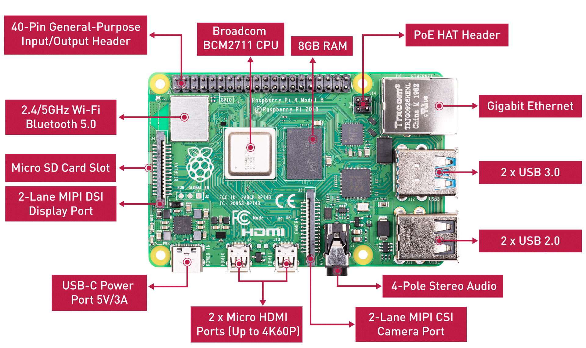
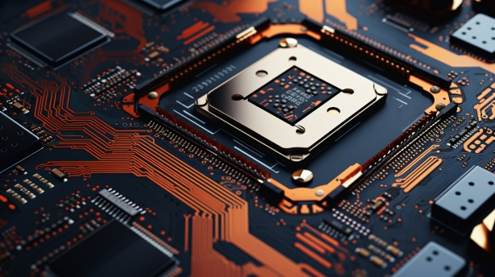
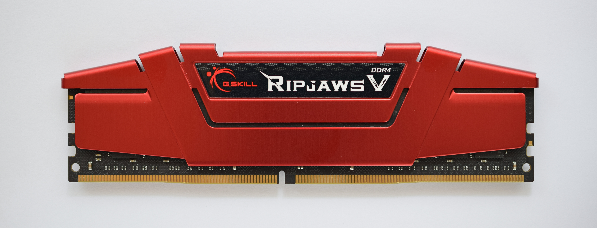
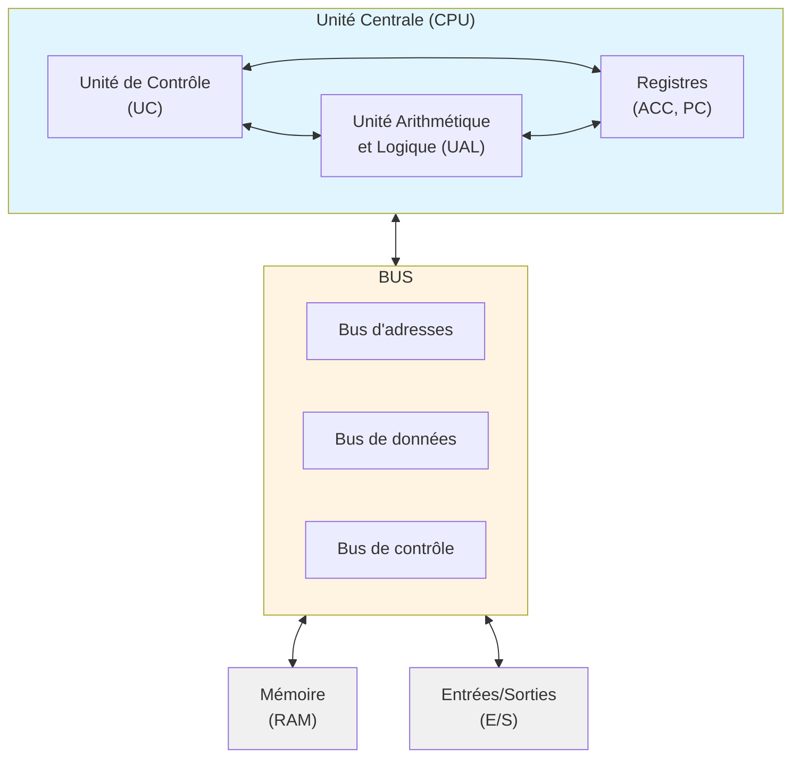

# Architecture de von Neumann

Voici un **ordinateur complet**, de la taille d'une carte bancaire : un Raspberry Pi 4. Tout ce dont parle ce cours tient sur cette carte, et on y voit les quatre composants **d'un seul coup d'œil**, alors que dans un ordinateur de bureau ils sont dispersés dans le boîtier et le processeur caché sous son ventilateur.

Il y a beaucoup d'étiquettes. **Quatre** comptent ici :

- **Broadcom BCM2711 CPU** : le **processeur** ;
- **8GB RAM** : la **mémoire** ;
- tout ce qui dépasse sur les bords, USB, Ethernet, HDMI, prise jack : les **entrées/sorties** ;
- les **bus** sont les pistes qui relient les puces entre elles. Quelques-unes se voient à la surface, mais la plupart passent **à l'intérieur** de la carte.

Retiens aussi le **Micro SD Card Slot** : c'est le **stockage**, et ce n'est pas de la mémoire. La différence est expliquée plus bas, et elle compte.

## Le problème de départ

Les premiers ordinateurs, comme l'**ENIAC** (1945), étaient capables de faire des calculs extraordinairement rapides. Mais ils avaient un défaut majeur : pour changer de programme, il fallait **physiquement recâbler la machine**. Six mathématiciennes, les premières programmeuses de la machine, devaient établir la séquence des opérations puis la câbler : des centaines de fiches à rebrancher et d'interrupteurs à repositionner, ce qui prenait **plusieurs jours**, alors que le calcul lui-même ne durait que quelques secondes.

Le programme n'existait pas en mémoire : il était inscrit dans le **câblage physique** de la machine. Changer de tâche revenait à reconstruire une partie de l'ordinateur.

!!! example "Concrètement"
    Imaginons qu'à chaque fois que tu veux utiliser une nouvelle application sur ton téléphone, un technicien doive ouvrir l'appareil et ressouder des composants. C'était exactement la situation avant l'architecture de von Neumann.

**La solution proposée par von Neumann en 1945** : stocker le programme **dans la mémoire**, au même endroit que les données. Ainsi, changer de programme revient simplement à charger de nouvelles instructions en mémoire, sans toucher au matériel. C'est le principe du **programme enregistré**, et c'est le fonctionnement de tous les ordinateurs actuels.

L'**architecture de von Neumann** est ainsi devenue le modèle fondamental de la plupart des ordinateurs actuels. Elle tire son nom du mathématicien et physicien John von Neumann, qui l'a formalisée en 1945 dans son rapport sur l'EDVAC (*Electronic Discrete Variable Automatic Computer*).

## 1. Principe fondamental

Le principe central de l'architecture de von Neumann est le **programme enregistré** : les instructions du programme et les données sont stockées dans la **même mémoire**.

## 2. Les composants principaux

L'architecture de von Neumann se compose de **quatre éléments essentiels** :

### 2.1 L'unité centrale de traitement (CPU)

Le **processeur** (CPU - *Central Processing Unit*) est le cerveau de l'ordinateur. Il se divise en deux sous-unités :

#### a) L'Unité Arithmétique et Logique (UAL)

L'**UAL** (*ALU* en anglais) effectue les opérations :

- **Arithmétiques** : addition, soustraction, multiplication, division
- **Logiques** : AND, OR, NOT, XOR (les opérations booléennes, que tu verras au chapitre suivant)
- **Comparaisons** : égalité, supériorité, infériorité

Elle travaille sur un registre particulier, l'**accumulateur**, qui contient la valeur en cours de calcul et reçoit le résultat.

**l'UAL est le seul endroit de la machine où un calcul a lieu, et elle ne sait faire que des opérations élémentaires.**

#### b) Les registres

L'UAL ne va pas chercher chaque valeur en mémoire au moment où elle en a besoin : la mémoire est bien trop lente pour cela. Le processeur possède ses propres cases, en très petit nombre, appelées **registres**.

Un registre est une **mini-mémoire intégrée au processeur**, et c'est la mémoire la plus rapide de la machine. Un processeur n'en compte que quelques dizaines, là où la mémoire vive compte des milliards de cases : plus une mémoire est rapide, plus elle coûte cher à quantité d'information égale, et moins on peut en mettre.

Deux registres suffisent pour tout ce chapitre :

- l'**accumulateur** (`ACC`) : la valeur sur laquelle l'UAL travaille, et où elle dépose son résultat ;
- le **compteur ordinal** (`PC`, *program counter*) : l'adresse de la prochaine instruction à exécuter.

!!! warning "Un registre n'est pas une case mémoire"
    Quand le processeur charge le contenu de la case 42 dans l'accumulateur, il le **recopie** : la case 42 ne bouge pas. Et l'accumulateur, lui, n'a **pas d'adresse** : il n'est pas dans la mémoire, il est dans le processeur. C'est pourquoi il n'apparaît jamais sur le bus d'adresses.

#### c) L'Unité de Contrôle (UC)

L'**Unité de Contrôle** orchestre le fonctionnement de l'ordinateur :

Elle ne fait qu'une seule chose, indéfiniment : répéter un **cycle** en trois temps.

1. Elle **lit** en mémoire l'instruction que désigne le compteur ordinal (`fetch`)
2. Elle les **décode** pour comprendre quelle opération effectuer (`decode`)
3. Elle **commande** les autres composants pour exécuter l'instruction (`execute`)

On appelle ça le **cycle decode-fetch-execute**

L'UC **répète ce cycle en boucle et ne sait rien faire d'autre**. Sa force réside uniquement dans sa vitesse d'exécution, dictée par sa fréquence d'horloge : un processeur cadencé à 3 GHz effectue ainsi 3 milliards de cycles par seconde.

#### d) Un processeur, ou plusieurs ?

La machine décrite ici n'a **qu'une** unité de traitement : elle exécute une instruction à la fois, dans l'ordre où le compteur ordinal les désigne. C'est une architecture **monoprocesseur**, et c'est celle que tu manipuleras dans tout ce chapitre.

Les machines actuelles sont **multiprocesseur** : elles contiennent plusieurs unités de traitement complètes, appelées **cœurs**, le plus souvent gravées sur la même puce. Chacune a son compteur ordinal et déroule son propre cycle, et elles partagent la mémoire.

!!! info "Ce qu'il faut en retenir, et rien de plus"
    Avec un seul cœur, un ordinateur qui semble faire plusieurs choses à la fois ne fait qu'**alterner très vite** entre elles. Avec plusieurs cœurs, plusieurs instructions sont exécutées **réellement au même instant**.

    Deux réserves, qui évitent la conclusion trop rapide :

    - **Deux cœurs ne divisent pas le temps d'un programme par deux.** Il faut que le travail puisse être découpé en parties indépendantes, et beaucoup de tâches ne s'y prêtent pas. Si les parties doivent constamment s'attendre, on gagne peu. Par contre, 2 programmes lancés au même instant peuvent s'exécuter sur des coeurs différents automatiquement.
    - **Le modèle de von Neumann n'est pas remis en cause.** Chaque cœur fait exactement ce que décrit ce chapitre : fetch, decode, execute, sur une mémoire où instructions et données cohabitent. Il y en a simplement plusieurs.

    Nous n'irons pas plus loin cette année : ce qui suit, écrire et dérouler des programmes, se fait sur **un seul** processeur.

### 2.2 La mémoire

Le processeur est un calculateur hors pair, mais il ne peut pas travailler à vide. Pour réaliser une opération aussi simple que 3 + 2, il a besoin qu'on lui fournisse ses opérandes : le nombre 3 et le nombre 2. C’est là qu'intervient la mémoire : elle sert de réservoir pour stocker les données nécessaires à un calcul.

La **mémoire** stocke à la fois :

- Les **instructions** du programme (le code)
- Les **données** manipulées par le programme

Chaque emplacement mémoire possède une **adresse** unique qui permet d'y accéder.

!!! info "Types de mémoire"
    - **Mémoire vive (RAM)** : rapide, volatile (effacée à l'extinction)
    - **Mémoire morte (ROM)** : contient l'UEFI (anciennement BIOS), non volatile,  le tout premier programme qui se lance à l'allumage pour réveiller les composants de l'ordinateur et lui apprendre à démarrer

### 2.3 Les dispositifs d'entrée/sortie (E/S) (I/O)

Les **périphériques d'entrée/sortie** permettent la communication avec l'extérieur :

- **Entrée** : clavier, souris, capteurs, réseau
- **Sortie** : écran, imprimante, haut-parleurs

#### Et le disque dur ?

Le **disque dur** (HDD) et le **SSD** sont des **dispositifs d'entrée/sortie**, même si on les appelle souvent "mémoire de stockage". Pourquoi ?

- Ils permettent de **lire** des données (entrée) et d'**écrire** des données (sortie)
- Ils sont **externes au modèle de base** de von Neumann : ni le CPU ne peut les utiliser directement pour exécuter des instructions, ni ils ne font partie de la mémoire vive
- Avant d'exécuter un programme stocké sur disque, il faut le **charger en RAM**

!!! danger "Distinction mémoire vs stockage"
    - **Mémoire (RAM)** : rapide, volatile, directement accessible par le CPU pour lire les instructions et les données
    - **Stockage (disque dur, SSD)** : lent, persistant, accessible via les bus d'E/S. Le CPU ne peut pas exécuter directement du code sur le disque car tout serait extrêmement lent. Tout doit d'abord être transféré en RAM.

### 2.4 Les bus

Tous les composants présentés communiquent par des liaisons matérielles. Ca n'est pas magique. Ils ont branchés ensemble avec des "fils" qu'on appele des `bus`.

Les **bus** sont les canaux de communication qui relient les composants. Il y en a trois, et chacun porte une information d'une nature différente :

- **Bus d'adresses** : **où**, c'est-à-dire l'adresse de la case concernée
- **Bus de données** : **quoi**, c'est-à-dire le contenu, un nombre
- **Bus de contrôle** : **quoi faire**, c'est-à-dire lire ou écrire

Les trois travaillent en même temps, et c'est leur combinaison qui donne un sens à l'opération. Sans le bus de contrôle, la mémoire verrait passer une adresse et une valeur sans savoir si on lui demande de lire ou d'écrire.

Imaginez que le processeur (CPU) veuille stocker le nombre 42 dans la case mémoire numéro 150. Pour ce faire, il envoie trois informations simultanément :📬 Le bus d'adresses (Où) : C'est l'étiquette sur la boîte. Le processeur y écrit : « Box n°150 ».🎁 Le bus de données (Quoi) : C'est l'objet que l'on transporte. Le processeur y dépose la valeur : « 42 ».📋 Le bus de contrôle (Quoi faire) : C'est l'ordre écrit sur la feuille. Le processeur coche la case : « ÉCRIRE » (enregistrer).

## 3. Diagramme récapitulatif à connaître

## Résumé

- L'architecture de von Neumann repose sur le principe du **programme enregistré**
- Quatre composants principaux : **CPU** (UC + UAL), **mémoire**, **E/S**, **bus**
- Le CPU contient des **registres**, mini-mémoires internes et ultra-rapides : l'**accumulateur** (où l'on calcule) et le **compteur ordinal** (l'adresse de la prochaine instruction)
- Trois bus, qui disent **où**, **quoi** et **quoi faire**
- Le CPU répète un cycle : **fetch-decode-execute**, et le **compteur ordinal** désigne la prochaine instruction
- Rien, dans la mémoire, ne distingue une instruction d'une donnée : c'est le compteur ordinal qui décide

---

**Sources** :

- von Neumann, J. (1945). *First Draft of a Report on the EDVAC*. University of Pennsylvania.
- Tanenbaum, A. S. (2013). *Structured Computer Organization* (6e éd.). Pearson.
