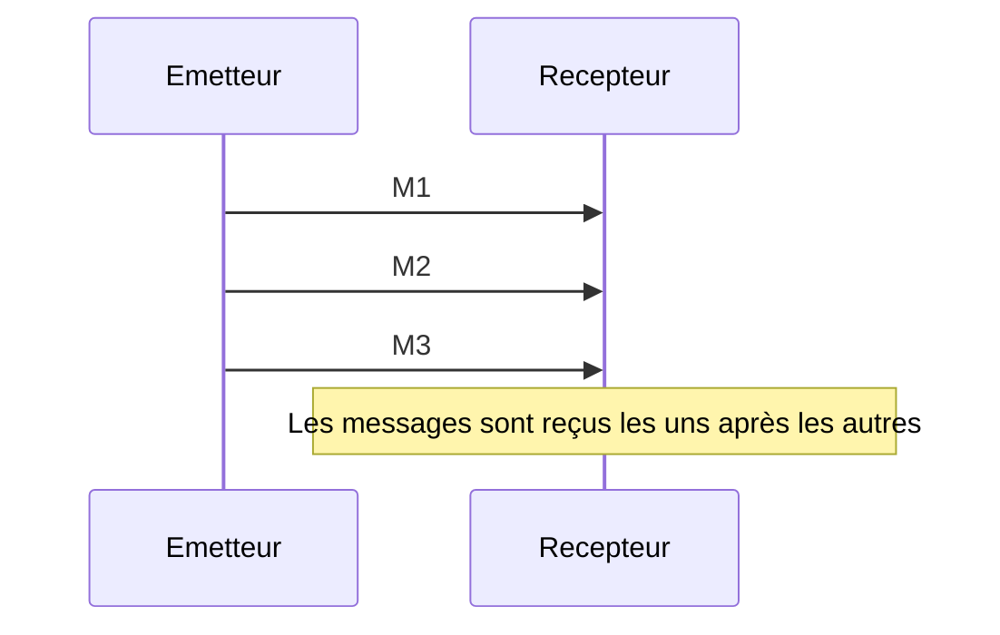
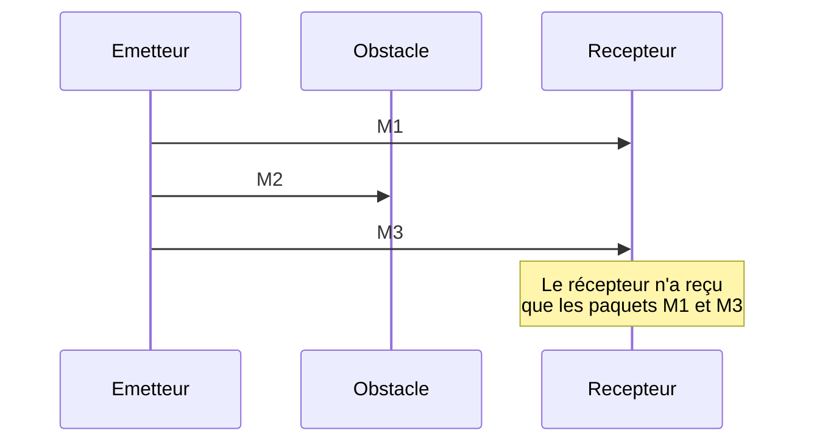
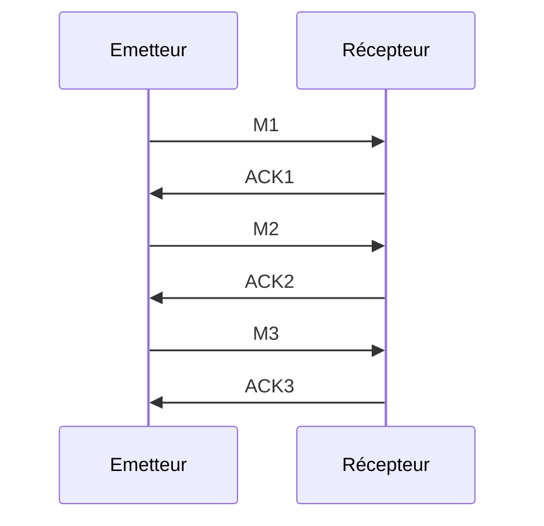
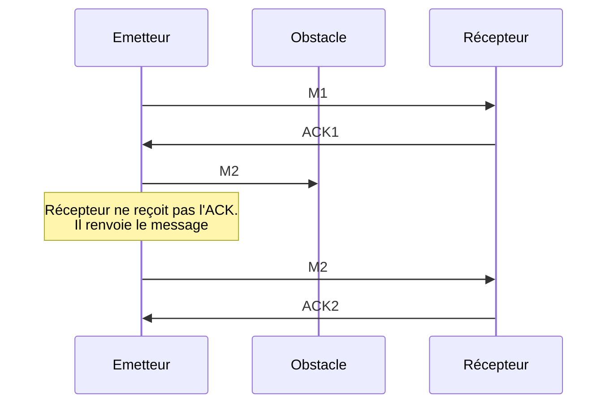
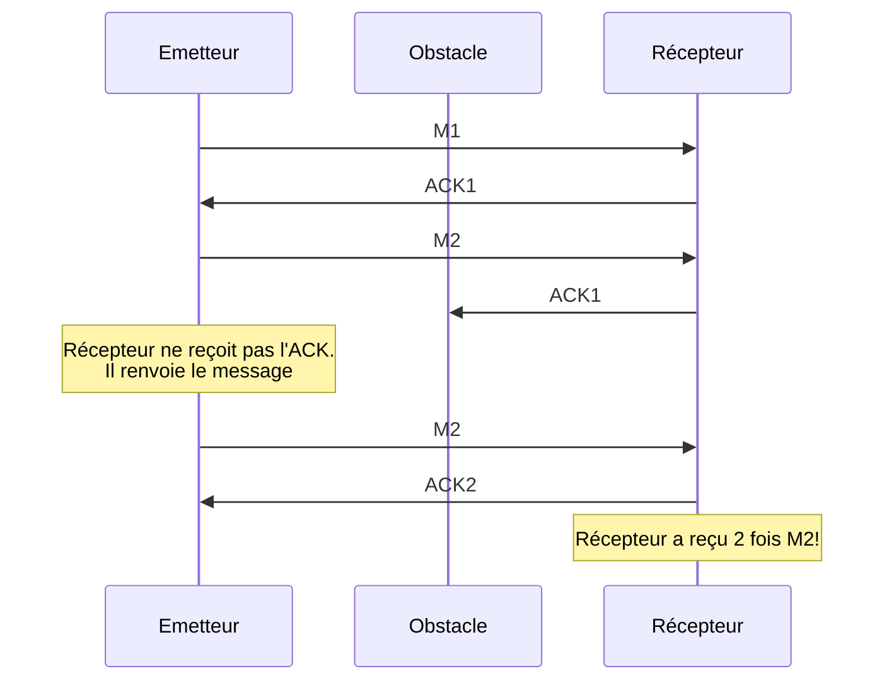
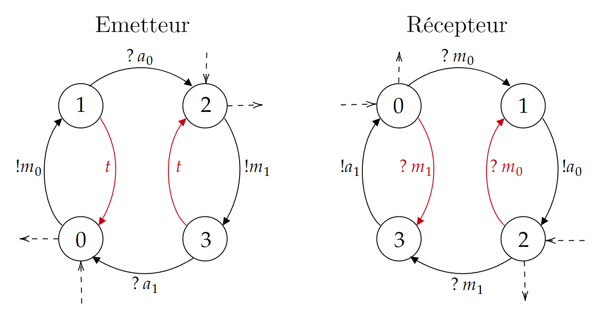

# Le protocole du bit alterné

Comme nous l'avons vu précédemment, la couche 3 permet de couper les trames en paquets avant d'être envoyée.
Ces paquets seront reconstitués ensuite par le récepteur.

Voyons comment peut se dérouler naïvement un transport dans un monde parfait.

Nous représentons l'émetteur ainsi que le récepteur à l'aide d'un automate.

Ici, l'émetteur n'a qu'un état, l'état 0. Dès qu'il reçoit unn message, il l'envoie.
De même, le récepteur n'a qu'un état, l'état 0. Il attend en permanence un message.
Ces diagrammes n'incluent volontairement pas ce qu'on fait des messages reçus.

$m$ désigne un message quelconque. $!m$ vaut dire "envoyer m".

Cependant, de multiples raisons peuvent faire su'un message peut être perdu

!!! hint "Comment les messages peuvent-ils se perdre?"
    1. **Perte Physique** : Dans un réseau, les données sont transmises via des ondes radio, des fils électriques, ou des fibres optiques. Des perturbations physiques peuvent provoquer une perte :

    2. **Interférences** : Dans une connexion sans fil, des interférences (par ex., un four à micro-ondes ou d'autres réseaux Wi-Fi) peuvent corrompre les données. Le bruit électromagnétique peut affecter les câbles ou les signaux optiques, surtout sur de longues distances.

    3. **Défaillance matérielle** : Une carte réseau défectueuse ou un routeur mal configuré peut ne pas transmettre correctement les paquets.

    4. **Saturation ou Congestion du Réseau**: Si une liaison réseau est surchargée : En cas de saturatin d'un routeur, les paquets excédentaires sount souvent abandonnés.

    Cette liste est non-exhaustive

En cas de problème de communication, on pourrait se retrouver dans cette situation:

Il faut trouver une solution afin de garantir la fiabilité de la communication. Pour ce fair on introduit les ACK (acknowledgement).
Ce sont des messages envoyés par le réceptuer à l'émetteur afin qu'il sache que le message est bien arrivé.

En cas d'obstacle, l'émetteur ne reçoit pas l'ACK et renvoie le message.

Voilà qui semble résoudre notre problème, mais... Si jamais c'est l'ACK qui se perd, que se passe-t-il?

Et c'est à ce moment précis que vient à notre rescousse le protocole du bit alterné. Ne jetons pas le bébé avec l'eau du bain, gardons les ACK, mais ajoutons-y une petite subtilité: Les messages, ainsi que les ACK correspondants, porteront un bit qui changera à chaque fois qu'un nouveau message est envoyé.

