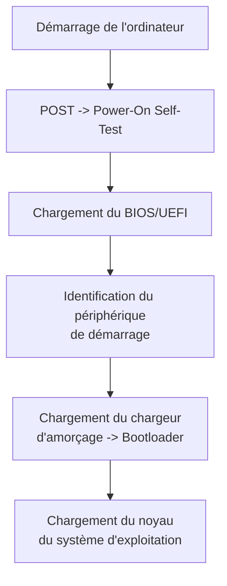

# Systèmes d'exploitation

EN CONSTRUCTION

Essayer avec http://ftp.debian.org/debian/dists/stable/main/installer-amd64/current/images/netboot/mini.iso

## Introduction

Un système d’exploitation est un logiciel essentiel qui gère l’ensemble des ressources d’un ordinateur (processeur, mémoire, stockage) et permet aux utilisateurs d’interagir avec la machine. Il assure le bon fonctionnement des applications, la sécurité, et la gestion efficace des tâches. Dans ce chapitre, nous aborderons ses principales fonctions et découvrirons les types de systèmes d’exploitation courants.

# Démarrage de l'ordinateur:

Lorsque vous démarrez un ordinateur, son unique objectif est de charger le système d'exploitation.

Ceci peut se découper en 4 étapes:

1. Alimentation et auto-test matériel (POST) : L'ordinateur s'allume, et le BIOS (Basic Input/Output System) ou UEFI (Unified Extensible Firmware Interface) effectue un Power-On Self-Test (POST). Ce test vérifie les composants matériels essentiels (mémoire, processeur, carte graphique, etc.) pour s'assurer qu'ils fonctionnent correctement.

2. Chargement du BIOS/UEFI : Le BIOS ou UEFI initialise le matériel de base, en activant la mémoire et les périphériques nécessaires pour lancer le système d'exploitation. Il identifie également le périphérique de démarrage (disque dur, SSD, clé USB) où est installé l'OS.

3. Chargement du chargeur d'amorçage (Bootloader) : Une fois le périphérique de démarrage identifié, le BIOS ou UEFI passe le contrôle au chargeur d'amorçage, souvent GRUB pour Linux ou Bootmgr pour Windows. Le bootloader est un petit programme qui charge le noyau du système d'exploitation en mémoire.

4. Chargement du noyau : Le chargeur d'amorçage charge ensuite le noyau du système d'exploitation en mémoire et lui passe le contrôle. Le noyau initialise les fonctions essentielles : gestion de la mémoire, création de processus initiaux, et prise en charge des pilotes matériels de base.

A partir de ce moment, c'est le système d'exploitation qui va prendre la main et servir à faire le lien entre le matériel et les applications.

## A quoi sert un système d'exploitation

<iframe width="560" height="315" src="https://www.youtube.com/embed/qza9V9ad7nc?si=_RwgafPcuO7JaL8H" title="YouTube video player" frameborder="0" allow="accelerometer; autoplay; clipboard-write; encrypted-media; gyroscope; picture-in-picture; web-share" referrerpolicy="strict-origin-when-cross-origin" allowfullscreen></iframe>

Visionnez cette vidéo, et résumez la en une introduction et 3 parties. Elle constitue le minimum que vous devez savoir sur les systèmes d'exploitation.

https://eylenburg.github.io/os_familytree.htm
Il existe une multitude de systèmes d'exploitation, comme en témoigne la page suivante: https://eylenburg.github.io/os_familytree.htm

## Interagir avec le système d'exploitation

Un système d'exploitation ne nécessite pas forcément une interface graphique avancée comme celle de Windows. Certains OS, notamment les systèmes utilisés sur des serveurs, des appareils embarqués (comme ceux dans les routeurs ou appareils industriels) ou dans des environnements professionnels, fonctionnent uniquement avec une interface en ligne de commande (CLI). Ces OS, comme certaines versions de Linux, offrent un contrôle précis des fonctions système sans nécessiter d'interface visuelle.

L'absence d'interface graphique permet souvent de réduire l'utilisation des ressources (comme la mémoire et le processeur) et d'améliorer la stabilité et la sécurité, ce qui est essentiel dans les environnements où chaque ressource est précieuse, où l'efficacité est prioritaire.

Lorsque le système d'exploitation n'a pas d'interface graphique, l'interaction se fait via une interface en ligne de commande (CLI = Command Line Interface). Dans ce type d’interface, l’utilisateur entre des commandes textuelles dans un terminal pour exécuter des actions, comme la gestion de fichiers, le contrôle des processus, ou la configuration du réseau.

L’utilisateur doit connaître des commandes spécifiques, comme celles utilisées sous Linux (par exemple, ls pour lister les fichiers, cd pour changer de répertoire, ou top pour surveiller les processus en cours). Ces commandes permettent une interaction directe avec le système, souvent de manière plus rapide et précise que par une interface graphique.

Dans un système d'exploitation avec une interface graphique avancée, il est toujours possible d'accéder au CLI via un terminal.

Par exemple pour windows:

## TP Installation d'un système d'exploitation dans une machine virtuelle.

Nous allons installer un système d'exploitation basé sur le noyau linux: Alpine.
Cette installation est plus technique en comparaison à une installation d'un Full Linux, qui se fait en quelques clicks avec des questions compréhensibles par le commun des mortels.

Mais:
- Ca vous habitue à la ligne de commande
- On voit bien toutes les étapes
- Les ordinateurs du lycée ne sont pas assez puissants

Pour cette activité, il faut utiliser le moins possible de RAM. Donc on n'ouvre rien qui n'est pas en lien direct avec l'activité (genre pronote...).

Tout se fera dans le même répertoire de MSYS2

!!! note "Préparation"
    - Tout se fait dans le même répertoire MSYS2 MINGW64 (chercher avec la loupe de windows)
    - Installer qemu, le gestionnaire de machines virtuelles, en exécutant cette commande: `pacman -S mingw-w64-x86_64-qemu`
    - Télécharger le disque d'installation d'alpine: `wget https://dl-cdn.alpinelinux.org/alpine/v3.21/releases/x86_64/alpine-virt-3.21.3-x86_64.iso`

0. Télécharger le disque d'installation d'alpine: `wget https://dl-cdn.alpinelinux.org/alpine/v3.21/releases/x86_64/alpine-virt-3.21.3-x86_64.iso`

1. Créer un disque dur virtuel de 5Go pour le brancher à notre PC virtuel.
`qemu-img create -f qcow2 disquedur.qcow2 5G`

2. On démarre une machine virtuelle. Un ordinateur dans votre ordinateur. Ici on lui donne comme disque dur le disque virtuel qu'on vient de créer, on y insère le cd-rom d'installation du système d'exploitation, et on lui demande de booter sur le cdrom. On l'autorise à utiliser 512M de RAM sur la machine physique. on lui branche notre disque (hda) de 5G. Les autres options sont des options pour la gestion du réseau.
`qemu-system-x86_64 -boot d -cdrom alpine-virt-3.21.3-x86_64.iso -hda disquedur.qcow2 -m 512 -net nic -net user`

3. Après avoir booté, le système demande de vous logger, entrez "root" et validez avec la touche entrée. L'utilisateur root est le superutilisateur. Il a le droit de tout faire.

4. Le clavier n'est pas en français, mais ça sera bientôt le cas. On lance l'installation en tapant: `setup-alpine`, puis entrée.

5. Répondez aux questions comme sur l'image suivante (quand je n'ai rien mis, j'ai juste appuyé sur entrée. pour le mot de passe, mettez root):

Sur l'image suivante, à la fin, on voit qu'il nous demande sur quel disque dur on veut installer alpine. On va lui dire de l'installer sur le disque qu'on a créé. On voit ici que le "QEMU DRIVE" est sda. On entre donc sda.

- On valide l'installation en entrant y  (si vous ne mettez pas y, ça s'arrête et vous devez tout recommencer)

- Le système d'exploitation est installé, et il nous demande de redémarrer.

- On entre cette commande pour arrêter l'ordinateur: `poweroff`

!!! hint "Commande pour démarrer l'ordinateur virtuel"
    - Dès que vous voulez démarrer cet ordinateur, entrez:
    `qemu-system-x86_64 -hda alpine_disk.qcow2 -m 512 -nic user,ipv6=off,hostfwd=tcp::22022-:22`

    - Dès que vous voudrez l'arrêter, entrez:
    `doas poweroff`

!!! tip "Interface graphique de l'OS"
    Un OS dispose habituellement d'une interface graphique, comme windows.
    Sous linux, vous avez même l'embarras du choix.
    On n'en ajoutera pas car ça prend trop d'espace disque et que les ordis ne sont pas assez puissants pour faire tourner 2 OS, mais voici ce que ça peut donner.
    
