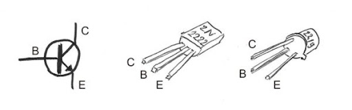

# Logique

## Histoire


En 1703, [Gottfried Wilhelm Leibniz](https://fr.wikipedia.org/wiki/Gottfried_Wilhelm_Leibniz) fut le premier occidental à formaliser un
système d’opérations à partir de 0 et de 1, le binaire, dans son article ”Explication de l’Arithmétique Binaire”. On retrouve des traces de précédentes tentatives en Chine dans le [Yi Jing](https://fr.wikipedia.org/wiki/Yi_Jing), le livre des mutations, au 9ème siècle avant notre ère. 


Les nombres binaires étaient au centre de la théologie de Leibniz. Il croyait que les nombres binaires étaient symboliques de l’idée chrétienne de creatio ex ni-hilo ou de création à partir de rien. Leibniz essayait de trouver un système qui convertisse les déclarations verbales de la logique en un système purement mathématique.


A partir de 1847, [George Boole](https://fr.wikipedia.org/wiki/George_Boole) propose un mode de calcul permettant de
traduire des raisonnements logiques par des opérations mathématiques.
Il créé ainsi une branche des mathématiques qui définit des opérations dans
un ensemble qui ne contient que 2 éléments.


En 1938, [Claude Shannon](https://fr.wikipedia.org/wiki/Claude_Shannon) prouve que des circuits électroniques peuvent résoudre tous les problèmes que la logique de Boole peut résoudre.


Avec les travaux d'[Alan Turing](https://fr.wikipedia.org/wiki/Alan_Turing) de 1936, ceci constitue le fondement de ce qui deviendra l’informatique.

## Les booléens

Les booléens sont au nombre de 2 : au choix, ${Vrain, Faux}$ ou ${0, 1}$.

On peut utiliser l’une ou l’autre des représentations, c’est justement le principe de modélisation.

D’ailleurs, en python, ces 2 opérations valent True:

```python
0 == False
1 == True
```

## Les opérateurs logiques

### ET
**Répond à la question ”Est-ce que les 2 sont vrais ?”**

Exemple : Pour qu'une lampe s'allume dans un circuit de sécurité, il faut que l'interrupteur ET la porte soient fermés.

Si l'interrupteur est ON (fermé) ET la porte est fermée, alors la lampe s'allume.

Si l’un des deux (ou les deux) est ouvert, la lampe reste éteinte.


### OU (inclusif)
**Répond à la question ”Est-ce qu’au moins un des deux est vrai ?”**

Pour qu'une alarme se déclenche, il suffit que l’une des conditions suivantes soit vraie : une fenêtre OU une porte est ouverte.
Si la fenêtre est ouverte, l’alarme sonne.
Si la porte est ouverte, l’alarme sonne.
Si les deux sont ouvertes, l’alarme sonne également.
Si les deux sont fermées, l’alarme ne sonne pas.

### NON
**Répond à la question ”Est-ce que c’est Faux ?”**

Imaginons une porte avec un voyant lumineux.
Si la porte est fermée, le voyant lumineux est éteint.
Si la porte est ouverte, le voyant lumineux s’allume.
En logique, cela revient à dire : si la porte est NON fermée, alors le voyant est allumé.


### OU EXCLUSIF
**Répond à la question ”Est-ce que les deux sont différents?”**

Imaginons deux interrupteurs pour une lampe : un interrupteur à l’entrée et un autre près du lit. La lampe s’allume seulement si les interrupteurs ne sont pas dans la même position.

- Si les deux interrupteurs sont en position OFF ou les deux en position ON, la lampe reste éteinte.
- Si un interrupteur est ON et l’autre est OFF, alors la lampe s’allume.


Il existe d'autres opérateurs, mais qui peuvent être construits à partir des précédents. D'ailleurs, il ne suffit que de 2 opérateurs pour construire tous les autres.

## Tables de vérité

Dans une table de vérité, on énumère toutes les combinaisons possibles de vrais et de faux avec les variables en entrée (ici a et b), puis on répond à la question posée.

### Table NON

"NON a" renvoie le "contraire" de a.

| a   | $\bar{a}$ |
| --- | --------- |
| 0   | 1         |
| 1   | 0         |

### Table ET
La table de vérité donne toutes les possibilités de résultats.

$a.b$ ne répond Vrai que lorsque les deux sont vrais.

| $a$ | $b$ | $a.b$ |
| --- | --- | ----- |
| 0   | 0   | 0     |
| 0   | 1   | 0     |
| 1   | 0   | 0     |
| 1   | 1   | 1     |

### Table OU

| $a$ | $b$ | $a+b$ |
| --- | --- | ----- |
| 0   | 0   | 0     |
| 0   | 1   | 1     |
| 1   | 0   | 1     |
| 1   | 1   | 1     |


### Table OU EXCLUSIF

$a\oplus b$ n'est vrai que lorsque les deux sont différents.

| $a$ | $b$ | $a\oplus b$ |
| --- | --- | ----------- |
| 0   | 0   | 0           |
| 0   | 1   | 1           |
| 1   | 0   | 1           |
| 1   | 1   | 0           |


### Tables de vérité d'expressions

Lorsqu'on demande d'établir la table de vérité d'une expression booléenne, on commence par écrire toutes les combinaisons possibles de 0 et de 1, puis on décompose l'expression pour trouver progressivement le résultat.

 Afin de montrer que deux expressions logiques sont équivalentes, on peut dresser la table de l'une et de l'autre, et conclure selon qu'elles ont la même table de vérité ou non.

!!! question "Lois de de Morgan"
    1- Dresser la table de vérité de $\overline{a+b}$ ainsi que de  $\bar{a}.\bar{b}$

    | $a$ | $b$ | $a+b$                            | $\color{red}\overline{a+b}$      | $\bar{a}$                        | $\bar{b}$                        | $\color{red}\bar{a}.\bar{b}$     |
    | --- | --- | -------------------------------- | -------------------------------- | -------------------------------- | -------------------------------- | -------------------------------- |
    | 0   | 0   | <input type="text" class="bin"/> | <input type="text" class="bin"/> | <input type="text" class="bin"/> | <input type="text" class="bin"/> | <input type="text" class="bin"/> |
    | 0   | 1   | <input type="text" class="bin"/> | <input type="text" class="bin"/> | <input type="text" class="bin"/> | <input type="text" class="bin"/> | <input type="text" class="bin"/> |
    | 1   | 0   | <input type="text" class="bin"/> | <input type="text" class="bin"/> | <input type="text" class="bin"/> | <input type="text" class="bin"/> | <input type="text" class="bin"/> |
    | 1   | 1   | <input type="text" class="bin"/> | <input type="text" class="bin"/> | <input type="text" class="bin"/> | <input type="text" class="bin"/> | <input type="text" class="bin"/> |
    
    2- Conclure sur une égalité
    3- Montrer que  $\overline{a.b} = \bar{a}+\bar{b}$

    Ces égalités à connaître sont connues sous le nom de lois de de Morgan


## Un peu d'électronique

### Le transistor

Le fonctionnement d'un ordinateur réside presque essentiellement sur un composant inventé en 1947 et qui ne cesse de se perfectionner et de se miniaturiser encore aujourd'hui: le transistor.

Il existe des transistors de diverses technologies. Ici je vous présente le PNP.

C'est un composant électronique doté de 3 pattes:

- (C) Le collecteur
- (B) La base
- L'émetteur
\end{itemize}

Voici son symbole électrique et ce à quoi ça ressemble:


L'objet n'est pas ici d'être expert en transistors mais de saisir un de ses usages fondamentaux: \textbf{L'interrupteur commandé}.

Si la tension à la base n’est pas suffisamment forte, le courant entre le collecteur et l’émetteur est coupé.

### Une opération logique avec des transistors : ET


La LED ne s’allumera que si la tension est suffisante à la base de Q1 et de Q2. Si l’une ou l’autre des bases n’est pas alimentée, le courant est coupé et la LED s’éteint.


# Portes et Circuits logiques

Le circuit électtronique précédent se résume entièrement à la porte logique ET suivante, suivie des représentations d'autres portes.


!!! question "Interrupteurs et lampe"
    On donne le circuit logique suivant avec les interrupteurs a (en haut) et b (en bas). L'interrupteur est à 1 s'il est fermé.

    

    On note la lampe S. La lampe est à 1 si elle est allumée.

    - Exprimez S en fonction de a et de b.
    - Etudiez la table de vérité de S
    - Proposez une simplification drastique de ce circuit.


!!! question "Porte NAND"
    La porte NAND réalise l'opération NON(A ET B), i.e. $\overline{a.b}$

    - Dressez la table de vérité de la porte NAND 

    Voici son comment elle est représentée sur un circuit: 
    
    


!!! question "Turing Complete"
    Ces exercices sont les premiers niveaux d'un jeu nommé "[turing complete](https://store.steampowered.com/app/1444480/Turing_Complete/)". Ce jeu, partant de la simple porte NAND, vous emmène jsuqu'à construire un ordinateur entier.

    Au début des exercices, seule la porte NAND est utilisable. A chaque fois que vous arrivez à créer une nouvelle porte, elle devient utilisable.

    Pour chacun des exercices, réaliser ce qui est demandé dans l'interface ci-dessous et reportez la question et une image de la solution dans un document word.

    - Créer une porte NOT. Seule porte autorisée: NAND
    - Créer une porte AND
    - Créer une porte OR
    - Créer une porte NOR
    - Créer une porte XOR

    Pourquoi appelle-t-on une porte NAND une porte universelle?

```{.logic showonly="in out nand not and or nor xor" style="height: auto;width: auto;" mode="design"}

{ 
v: 6,
components: {
    out0: {type: 'out', pos: [415, 145], id: 0},
    in0: {type: 'in', pos: [275, 145], id: 1, val: 1},
}
}
```

## Circuit demi-additionneur

Ce circuit prend 2 bits en entrée et les additionne, comme s'il s'agissait d'entiers binaires dont on **pose l'addition**.

Le circuit prend en entrée deux bits $a$ et $b$. Il renvoie la somme $S$, ainsi que la retenue $C_{out}$

Ainsi, on peut directement construire la table de vérité du circuit résultant:

| $a$ | $b$ | $S$ | $C_{out}$ | Commentaire           |
| --- | --- | --- | ------- | --------------------- |
| 0   | 0   | 0   | 0       | 0+0=0 et je retiens 0 |
| 0   | 1   | 1   | 0       | 0+1=1 et je retiens 0 |
| 1   | 0   | 1   | 0       | 1+0=1 et je retiens 0 |
| 1   | 1   | 0   | 1       | 1+1=0 et je retiens 1 |

- En observant la colonne $s$, on reconnaît la table de vérité de la porte XOR.
- En observant la colonne $C_{out}$, on reconnaît la table de vérité de la porte AND.

!!! question ""
    Réalisez le circuit demi-additionneur dans l'interface et ajoutez le à votre document word.

## Circuit additionneur complet (Full Adder)

Le circuite additionneur prend en entrée deux bits $a$ et $b$ ainsi qu'une retenue $C_{in}$.

Il émet 2 informations en sortie, la somme obtenue $S$, ainsi que la retenue $C_{out}$


!!! question "Exercice"
    - Complétez la table de vérité suivante pour l'additionneur complet. Vous pouvez la compléter ci-dessous et la copier/coller dans votre document.

    | $a$ | $b$ | $C_{in}$ | $S$                  | $C_{out}$            | Commentaire             |
    | --- | --- | -------- | -------------------- | -------------------- | ----------------------- |
    | 0   | 0   | 0        | 0                    | 0                    | 0+0+0=0 et je retiens 0 |
    | 0   | 0   | 1        | <input type="text" class="bin"/> | <input type="text" class="bin"/> | <input type="text"/>    |
    | 0   | 1   | 0        | <input type="text" class="bin"/> | <input type="text" class="bin"/> | <input type="text"/>    |
    | 0   | 1   | 1        | <input type="text" class="bin"/> | <input type="text" class="bin"/> | <input type="text"/>    |
    | 1   | 0   | 0        | <input type="text" class="bin"/> | <input type="text" class="bin"/> | <input type="text"/>    |
    | 1   | 0   | 1        | <input type="text" class="bin"/> | <input type="text" class="bin"/> | <input type="text"/>    |
    | 1   | 1   | 0        | <input type="text" class="bin"/> | <input type="text" class="bin"/> | <input type="text"/>    |
    | 1   | 1   | 1        | <input type="text" class="bin"/> | <input type="text" class="bin"/> | <input type="text"/>    |

    - Montrer que $S = a \oplus b \oplus C_{in}$
    - Montrer que $C_{out} = (a \oplus b) . C_{in} + a . b$
    - Réalisez alors le circuit de l'additionneur complet et ajoutez le à votre document word.

