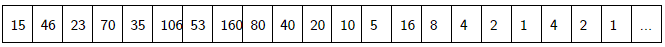

# Exercices Algorithmique


## Accumulation - types primitifs

!!! example "Mode opératoire"
    - Créez un fichier exos_accumulation.py

    !!! danger "Attention"
        En informatique, on ne met **jamais** d'espace ni de caractère spécial (accents, etc) dans un nom de fichier ou de répertoire.

    Pour chacun de ces exercices, il s'agit :
    
    - d'initialiser une variable résultat
    - de le remplir à l'aide d'un parcours d'itérable
    - de renvoyer le résultat

    Cette manière de faire est extrêmement fréquente et constitue la base de ce que vous devez savoir faire en algorithmique. On dit qu'on accumule progressivement dans le résultat afin de pouvoir le renvoyer.
    La première étape est toujours de bien modéliser le problème en écrivant une signature de fonction appropriée, avec des noms de fonction et de paramètres choisis judicieusement pour qu'ils soient à la fois évocateurs de ce qu'ils représentent, ni trop courts, ni trop longs.

    La première chose à considérer lorsqu'on travaille sur une variable est toujours: "de quelle type est-elle?" La réponse nous informe sur ce qu'on peut faire ou pas avec cette variable d'après le cours. Ca devient naturel et instantané avec de la pratique, mais pour l'instant, vous devez faire l'effort d'y penser.

    Toute fonction devra être testée.


!!! question "Somme des entiers" 
    Écrire et tester une fonction qui renvoie la somme des nombres entiers de 1 jusque n.

!!! question "Produit des entiers > 0" 
    Écrire et tester une fonction qui renvoie le produit des nombres entiers de 1 jusque n.

    On appelle ce nombre $n!$ qui se lit "n factorielle", avec $0! = 1$

!!! question "Nombre de voyelles"
    Écrire une fonction qui lit une chaîne de caractères et affiche le nombre de voyelles présentes dans cette chaîne.

!!! question "Inverser"
    Ecrire une fonction qui renvoie les caractères d'une chaîne de caractères dans l'autre sens. inverser("banane") renvoie "enanab".

!!! question "1 sur 2"
    Ecrire une fonction qui prend une chaîne de caractère en paramètre. Elle renvoie une chaîne de caractères où seulement 1 caractère sur 2 est présent.

!!! question "contient"
    Ecrire une fonction qui renvoie True si une chaîne contient un caractère, False sinon. On n'utilisera pas l'opérateur `in`.

!!! question "Nombre d'occurences"
    Écrire une fonction qui prend en paramètres une chaîne de caractère et un caractère et renvoie le nombre de fois où le caractère apparaît dans la chaîne de caractère.

!!! question "Take"
    Ecrire une fonction qui renvoie les n premiers caractères d'une chaîne de caractères. Si n est supérieur au nombre de caractères, renvoyer la chaîne de caractères entière.

!!! question "Drop"
    Ecrire une fonction qui renvoie une chaîne amputée de ses n premiers caractères. Si n est supérieur au nombre de caractère, renvoyer la chaîne vide.

## Listes

!!! question "Somme"
    Ecrire et tester une fonction `somme` qui prend en paramètres une liste de floats et qui renvoie leur somme.


!!! question "Moyenne"
    Ecrire et tester une fonction `moyenne` qui prend en paramètres ue liste de floats et qui renvoie leur moyenne.


!!! question "Minimum"
    Ecrire et tester une fonction `minimum` qui prend en paramètres une liste d'entiers et qui renvoie le minimum.

    Il faut initialiser le minimum au premier élément de la liste, et pour chaque élément parcouru, mettre à jour le minimum si c'est nécessaire.


!!! question "Maximum"
    Ecrire et tester une fonction `maximum` qui prend en paramètres une liste d'entiers et qui renvoie le minimum, sur le même principe.

!!! question "Indice Minimum"
    Ecrire et tester une fonction `i_minimum` qui prend en paramètres une liste d'entiers et qui renvoie l'index du minimum.

    Il faut initialiser le minimum au premier élément de la liste, et pour chaque élément parcouru, mettre à jour le minimum si c'est nécessaire.

!!! question "Indice Minimum à partir de"
    Ecrire et tester une fonction `i_minimum_partiel` qui prend en paramètres une liste d'entiers et un indice i_dep et qui renvoie l'index du minimum à partir de l'indice i_dep.


!!! question "Tri"
    Le problème du tri est fondamental en informatique. Beaucoup d'algorithmes commencent par trier les données afin de pouvoir utiliser des techniques efficaces.

    Si on ne précise pas l'ordre du tri, on parle de tri par ordre croissant.

    Une liste est triée si chaque élément est plus grand que le precedent.

    Ecrire et tester une fonction `est_triee(lst: list[int]) -> bool` qui prend en paramètres une liste et qui renvoie True si la liste est triée, False sinon.

!!! question "Echanger"
    Ecrire et tester une fonction `echange(lst: list[int], i: int, j: int)` qui prend en paramètres une liste et deux indices et qui echange les valeurs des deux indices.


!!! question "Suite de syracuse"
    On part d'un nombre entier $a>0$.
    Si $a$ est pair, on le divise par 2 pour obtenir la prochaine valeur
    Si $a$ est impair, on le multiplie par 3 et on ajoute 1 pour obtenir la prochaine valeur.

    Voici les différentes valeurs prises, en prenant au départ $a=15$

    

    - Écrire la suite de nombres correspondante pour $a=7$.

    - Écrire une fonction `syracuse(a: int, n: int)` qui affiche les n premiers nombres de la suite pour le nombre de départ a.

    - Modifier la fonction pour qu'elle renvoie la liste des n premiers nombres de la suite.

    - Modifier la fonction en `syracuse(a: int)-> list[int]` pour qu'elle s'arrête d'alimenter la liste résultat dès que la nouvelle valeur est 1. Testez pour a=15 et a=7. Les questions suivantes portent sur cette suite générée se terminant par 1.

    Pour un nombre de départ a, on appelle "temps de vol" de la suite l'indice du dernier élément de la liste.
    
    - Quel est le temps de vol pour $a=15$? Pour $a=7$?

    On appelle altitude maximum de la suite la valeur maximum de la suite d'entier.
    
    - Quelle est l'altitude pour $a=15$? Pour $a = 7$?
    - Écrire les fonctions `temps_de_vol(a: int) -> int` et `altitude_max(a: int) -> int`.

    Recherche: 
    
    - Qu'est-ce que la conjecture de Collatz? A-t-elle été prouvée?
    - Qui est Paul Erdős? 
    - Il a prononcé une phrase célèbre sur la conjecture de Collatz. Laquelle?


!!! question "Recherche sur le tri"
    A l'aide des fonctions `i_miniminium_partiel` et `echanger`, imaginer une fonction `tri_selection(lst: list[int])` qui trie en place une liste dans l'ordre croissant.
    
    ```python
    def tri_selection(lst: list[int]):
        for i in range(0, len(lst)-1):
            ...
            ...
    ```

    - Etudier ce qu'il se passe si on essaye de trier la liste vide
    - Etudier ce qu'il se passe si on essaye de trier une liste à 1 élément
    

!!! question "Compression par différence"
    Le codage par différence (delta encoding en anglais) permet de compresser un tableau de données en indiquant pour chaque donnée, sa différence avec la précédente (plutôt que la donnée elle-même). On se retrouve alors avec un tableau de données assez petites nécessitant moins de place en mémoire. Cette méthode se révèle efficace lorsque les valeurs consécutives sont proches.

    Programmer la fonction `compresse` qui prend en paramètre un tableau non vide de nombres entiers et qui renvoie un tableau contenant les valeurs entières compressées à l’aide cette technique.

    Exemples:

    ```python
    >>> compresse([1000, 800, 802, 1000, 1003])
    [1000, -200, 2, 198, 3]
    >>> compresse([42])
    [42] 
    ```

!!! question "Décompression"
    Ecrivez une fonction `decompresse` qui décompresse un tableau de données compressée par la méthode précédente

    Exemples :

    ```python
    >>> decompresse([1000, -200, 2, 198, 3])
    [1000, 800, 802, 1000, 1003]
    
    >>> decompresse([42])
    [42] 
    ```

!!! question "ADN"
    On donne la séquence de nuléotide d'un brin de l'ADN sous la forme d'une chaîne de caractères.
    Ecrivez une fonction `complementaire` qui renvoie la sequence du brin complementaire sachant que:

    - le complementaire de A est T
    - le complementaire de G est C
    - le complementaire de T est A
    - le complementaire de C est G
    
    Exemple:

    ```python
    >>>complementaire("ATTTCCGGTAAACATGT")
    'TAAAGGCCATTTGTACA'
    ```


## Dictionnaires

# Traitement des données en table

!!! hint "Exercices"

    Pour chacun d'exercices suivant, on attend qu'une fonction soit écrite et testée.


!!! question "Notes d'une classe"


    Un dictionnaire notes contient les noms des élèves en clés et leurs moyennes en valeurs.

    ```python
        notes = {'Alice': 15, 'Bob': 12, 'Clara': 17, 'David': 10}
    ```

    1. Écrire une fonction `rapport_moyenne` qui prend en paramètre un dictionnaire et affiche la moyenne de chaque élève sous la forme : "Alice a une moyenne de 15.". Ajouter un commentaire selon la moyenne : "Excellent" pour une moyenne ≥ 16, "Bien" pour une moyenne entre 12 et 15 inclus, et "À améliorer" pour une moyenne < 12.

    2. Écrire une fonction ajouter_eleve(notes: dict, nom: str, moyenne: float) qui ajoute un nouvel élève au dictionnaire.

    3. Écrire une fonction modifier_moyenne(notes: dict, nom: str, nouvelle_moyenne: float) qui modifie la moyenne d'un élève.

    4. Écrire une fonction `eleves_mention(notes: dict, seuil: float) -> list[str]` qui renvoie la liste des élèves ayant une moyenne ≥ seuil.


!!! question "Gestion des bibliothèques"

    Un dictionnaire bibliotheques contient plusieurs bibliothèques.

    ```python
        bibliotheques = {
            'biblio1': {'nom': 'Bibliothèque Centrale', 'ville': 'Paris', 'livres': 30000},
            'biblio2': {'nom': 'Médiathèque', 'ville': 'Lyon', 'livres': 15000},
            'biblio3': {'nom': 'Bibliothèque Universitaire', 'ville': 'Marseille', 'livres': 50000}
        }
    ```

    1. Écrire une fonction afficher_bibliotheques qui affiche les informations sous la forme : "Bibliothèque Centrale à Paris : 30000 livres.".

    2. Écrire une fonction ajouter_bibliotheque qui ajoute une nouvelle bibliothèque au dictionnaire.

    3. Écrire une fonction plus_grande_bibliotheque qui renvoie la bibliothèque ayant le plus de livres.

    4. Écrire une fonction total_livres qui calcule et renvoie le nombre total de livres.


!!! question "Gestion d'employés"

    Un dictionnaire employes contient les informations des employés.

    ```python
        employes = {
            'emp1': {'nom': 'Alice', 'poste': 'Développeur', 'salaire': 3500},
            'emp2': {'nom': 'Bob', 'poste': 'Designer', 'salaire': 3000},
            'emp3': {'nom': 'Clara', 'poste': 'Chef de projet', 'salaire': 5000}
        }
    ```

    1. Écrire une fonction afficher_employes qui affiche les informations sous la forme : "Alice est Développeur et gagne 3500 euros.".

    2. Écrire une fonction ajouter_employe qui ajoute un nouvel employé au dictionnaire.

    3. Écrire une fonction augmenter_salaires qui augmente tous les salaires d'un pourcentage donné en paramètres.

    4. Écrire une fonction employe_salaire_max qui renvoie l'employé ayant le salaire le plus élevé.


!!! question "Analyse de performances d'athlètes"
    Un dictionnaire athletes permet de suivre les performances.

    ```python
        athletes = {
            'Pierre': {'sport': 'marathon', 'temps': [2.15, 2.18, 2.16]},
            'Sophie': {'sport': 'marathon', 'temps': [2.20, 2.22, 2.19]}
        }
    ```


    Écrire les fonctions suivantes :
    
    1. calculer_moyenne_performances qui calcule la moyenne des performances
    2. meilleur_temps qui trouve l'athlète avec le meilleur temps pour un sport donné
    3. progression_athlete qui calcule la progression entre les performances
    4. ajouter_performance qui ajoute une nouvelle performance

!!! question "Voitures - compréhension"

    ```python
    voitures = [
        {"marque": "Toyota", "modele": "Corolla", "annee": 2020, "kilometrage": 20000},
        {"marque": "Ford", "modele": "Mustang", "annee": 1968, "kilometrage": 120000},
        {"marque": "Tesla", "modele": "Model 3", "annee": 2021, "kilometrage": 15000},
        {"marque": "Renault", "modele": "Clio", "annee": 2019, "kilometrage": 40000},
        {"marque": "BMW", "modele": "X5", "annee": 2022, "kilometrage": 10000},
    ]
    ```

    0. Quel est le type de la variable voitures?
    1. Combien y-a-t-il de voitures?
    2. Donner la liste des marques.
    3. Donner la liste des voitures (`list[dict]`), mais seulement avec la marque et le modèle.
    4. Quelles sont les voitures ayant un kilométrage inférieur à 25000 km?
    5. Ecrire une fonction `get_marque(voiture: dict) -> str` qui renvoie la marque d'une voiture.
    6. Décrire, après l'avoir testé, ce que fait l'instruction `sorted(voitures, key=get_marque)`
    7. Ecrire une fonction `get_annee(voiture: dict) -> int` qui renvoie l'année d'une voiture.
    8. Décrire, après l'avoir testé, ce que fait l'instruction `min(voitures, key=get_annee)`
    9. Quelle est la voiture ayant le plus grand kilométrage?
    10. Trier les voitures en fonction de leur kilométrage.
