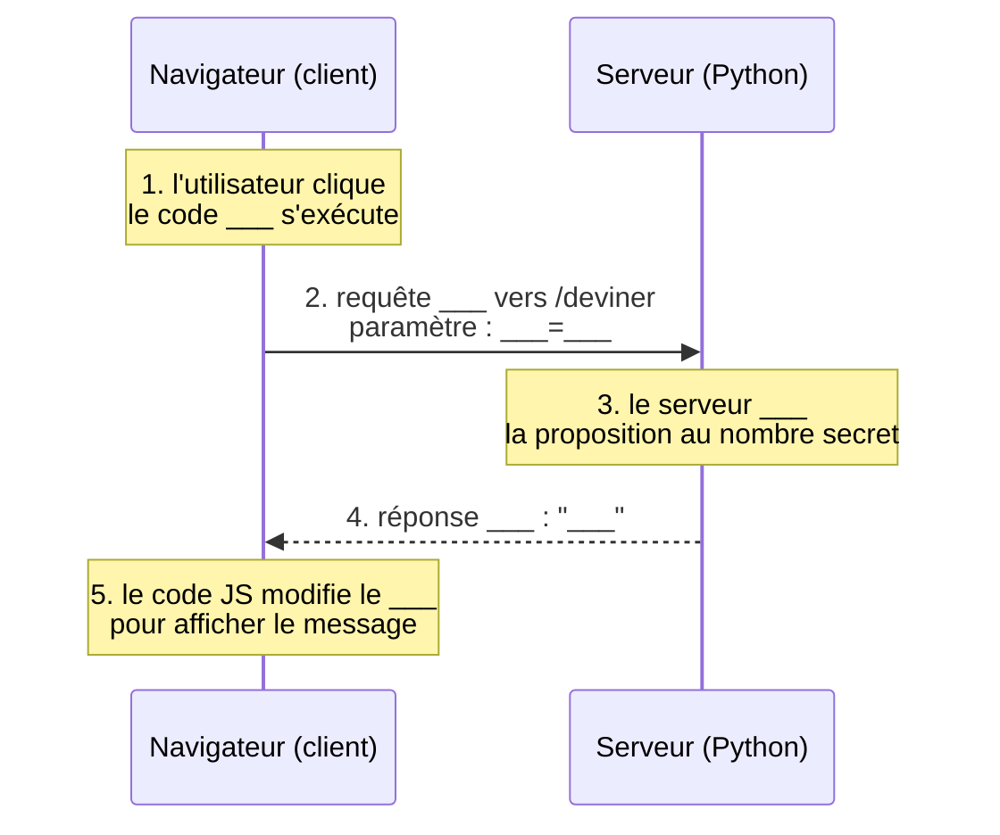

# Devine mon nombre - Client, serveur et HTTP

## Objectifs

- Distinguer ce qui s'exécute côté client (navigateur) et côté serveur
- Observer et analyser des requêtes HTTP avec les outils de développement
- Comprendre ce qui est mémorisé côté client et ce qui l'est côté serveur
- Comparer les méthodes GET et POST et savoir quand les utiliser
- Comprendre pourquoi HTTPS est nécessaire pour protéger des données sensibles

---

## Mise en place

### Structure des fichiers

Crée le dossier suivant dans ton espace de travail :

```
devine/
├── serveur.py
└── static/
    └── index.html
```

### serveur.py

```python
from flask import Flask, request, jsonify, send_from_directory
import random

app = Flask(__name__)  # ne pas chercher à comprendre cette ligne pour l'instant

NOMBRE_SECRET = random.randint(1, 100)
tentatives = 0

@app.route("/")
def accueil():
    return send_from_directory("static", "index.html")

@app.route("/deviner")
def deviner():
    global tentatives
    proposition = request.args.get("proposition", "")

    if not proposition.isdigit():
        return jsonify({"resultat": "erreur", "message": "Entre un nombre entier."})

    proposition = int(proposition)
    tentatives += 1

    if proposition < NOMBRE_SECRET:
        message = "Trop petit !"
    elif proposition > NOMBRE_SECRET:
        message = "Trop grand !"
    else:
        message = f"Gagne en {tentatives} tentatives !"

    return jsonify({"resultat": message, "tentatives": tentatives})

@app.route("/inscription", methods=["POST"])
def inscription():
    pseudo = request.form.get("pseudo")
    mdp = request.form.get("mot_de_passe")
    return f"<p>Recu : pseudo={pseudo}, mot_de_passe={mdp}</p>"

app.run(debug=True)
```

### static/index.html

```html
<!DOCTYPE html>
<html lang="fr">
<head>
  <meta charset="UTF-8">
  <title>Devine mon nombre</title>
</head>
<body>
  <h1>Devine le nombre (entre 1 et 100)</h1>

  <input type="number" id="proposition" min="1" max="100" placeholder="Ton nombre">
  <button id="btn">Deviner</button>

  <p id="resultat"></p>
  <p id="historique"></p>

  <h2>Creer un compte (simulation)</h2>
  <form action="/inscription" method="POST">
    <input type="text" name="pseudo" placeholder="Pseudo">
    <input type="password" name="mot_de_passe" placeholder="Mot de passe">
    <button type="submit">S'inscrire</button>
  </form>

  <script>
    const historique = [];  // memorise cote client

    document.getElementById("btn").addEventListener("click", function () {
      const valeur = document.getElementById("proposition").value;

      fetch("/deviner?proposition=" + valeur)
        .then(function (reponse) { return reponse.json(); })
        .then(function (donnees) {
          document.getElementById("resultat").textContent = donnees.resultat;
          historique.push(valeur);
          document.getElementById("historique").textContent =
            "Tentatives : " + historique.join(", ");
        });
    });
  </script>
</body>
</html>
```

### Lancer le serveur

```bash
pip install flask
python serveur.py
```

Ouvre ensuite `http://localhost:5000` dans ton navigateur, puis ouvre les outils de développement (F12) et place-toi sur l'onglet **Réseau**.

---

## Partie 1 - Observer les échanges entre client et serveur

Joue quelques tours : entre des nombres et clique sur « Deviner ».

!!! question "Q1"
    Dans l'onglet Réseau, clique sur une des requêtes qui apparait. Recopie l'URL complète de la requête.

??? warning "Correction"
    L'URL ressemble à `http://localhost:5000/deviner?proposition=42`. Elle pointe vers la route `/deviner` du serveur Flask avec le paramètre transmis dans l'URL.

!!! question "Q2"
    Comment s'appelle la partie de l'URL qui commence par `?` ? Quel est le nom du paramètre transmis ? Quelle est sa valeur ?

??? warning "Correction"
    Cette partie s'appelle la **chaîne de requête** (query string). Le paramètre se nomme `proposition` et sa valeur est le nombre saisi par l'utilisateur (ex. `42`).

!!! question "Q3"
    Quelle méthode HTTP est utilisée ? (cherche dans les en-têtes de la requête)

??? warning "Correction"
    La méthode est **GET**. C'est celle utilisée par `fetch` sans option supplémentaire, et celle par défaut des liens et formulaires simples.

!!! question "Q4"
    Clique sur l'onglet **Aperçu** ou **Réponse** de cette requête. Que contient la réponse du serveur ? Sous quel format ?

??? warning "Correction"
    La réponse est au format **JSON**, par exemple `{"resultat": "Trop petit !", "tentatives": 1}`. C'est un format texte structuré, lisible par le JavaScript côté client.

---

## Partie 2 - Client ou serveur ?

!!! question "Q5"
    Complète le tableau suivant :

    | Action | Côté client ou côté serveur ? |
    |--------|-------------------------------|
    | Afficher le message « Trop petit ! » dans la page | |
    | Comparer la proposition au nombre secret | |
    | Compter le nombre de tentatives | |
    | Mettre à jour la liste des tentatives affichée | |

??? warning "Correction"
    | Action | Côté client ou côté serveur ? |
    |--------|-------------------------------|
    | Afficher le message « Trop petit ! » dans la page | **Client** (le JS modifie le DOM) |
    | Comparer la proposition au nombre secret | **Serveur** (code Python dans `deviner()`) |
    | Compter le nombre de tentatives | **Serveur** (variable `tentatives` dans `serveur.py`) |
    | Mettre à jour la liste des tentatives affichée | **Client** (le JS met à jour `#historique`) |

!!! question "Q6"
    Ouvre le fichier `index.html` et repère le tableau `historique` dans le code JavaScript.

    - Est-ce que ce tableau est envoyé au serveur à chaque requête ?
    - Est-ce que le serveur connait la liste de tes tentatives ?
    - Où est-il mémorisé ?

??? warning "Correction"
    Non, `historique` n'est jamais transmis dans la requête `fetch`. Le serveur ne connait pas cette liste. Elle est mémorisée uniquement **dans le navigateur** (en mémoire JavaScript), et disparait si on recharge la page.

!!! question "Q7"
    Ouvre le fichier `serveur.py` et repère la variable `tentatives`.

    - À quel moment est-elle modifiée ?
    - Que se passe-t-il si tu fermes et relances le serveur en cours de partie ?
    - Que se passe-t-il si deux élèves jouent en même temps sur le même serveur ?

??? warning "Correction"
    `tentatives` est incrémentée à chaque appel à la route `/deviner`. Si le serveur redémarre, la variable est réinitialisée à 0 car elle n'est pas persistée (pas de fichier, pas de base de données). Si deux élèves jouent simultanément, ils partagent le même compteur : les tentatives de l'un s'ajoutent à celles de l'autre, ce qui est un problème de conception.

---

## Partie 3 - Modifier le comportement côté client

Ouvre `index.html` dans un éditeur de texte.

!!! question "Q8"
    Repère la ligne suivante :

    ```javascript
    document.getElementById("btn").addEventListener("click", function () {
    ```

    Que se passe-t-il quand l'utilisateur clique sur le bouton ? Dans quel ordre les actions sont-elles exécutées ?

??? warning "Correction"
    Le navigateur déclenche la fonction associée à l'événement `"click"`. Dans l'ordre : (1) lecture de la valeur saisie, (2) envoi d'une requête HTTP GET vers le serveur, (3) réception de la réponse JSON, (4) mise à jour de l'affichage et de l'historique. Les étapes 2 à 4 sont asynchrones (`fetch` + `.then`).

!!! question "Q9"
    Ajoute la ligne suivante juste après l'accolade ouvrante de la fonction :

    ```javascript
    console.log("Clic detecte, valeur = " + valeur);
    ```

    Recharge la page, joue un tour, puis ouvre l'onglet **Console** des outils de développement. Que vois-tu ? Sur quelle machine ce code s'est-il exécuté ?

??? warning "Correction"
    On voit le message s'afficher dans la console du navigateur. Ce code s'est exécuté **côté client**, dans le navigateur, et non sur le serveur. Le serveur n'a aucune connaissance de cet affichage.

!!! question "Q10"
    Modifie la requête pour envoyer la valeur `999` quel que soit ce que l'utilisateur a tapé. Comment le serveur réagit-il ? Que cela montre-t-il sur la confiance qu'on peut accorder aux données reçues côté serveur ?

??? warning "Correction"
    Le serveur reçoit `999` et répond « Trop grand ! » sans erreur. Cela montre que **le serveur ne peut jamais faire confiance aux données envoyées par le client** : n'importe qui peut fabriquer une requête avec n'importe quelle valeur. Toute validation importante doit donc être faite côté serveur.

---

## Partie 4 - GET ou POST ? Confidentialité et chiffrement

Consulte le formulaire d'inscription en bas de la page.

!!! question "Q11"
    Remplis le formulaire avec un pseudo et un mot de passe fictifs, puis clique sur « S'inscrire ». Dans l'onglet Réseau, la requête utilise-t-elle GET ou POST ?

??? warning "Correction"
    La requête utilise **POST**, comme indiqué par l'attribut `method="POST"` du formulaire.

!!! question "Q12"
    Le mot de passe apparait-il dans l'URL ? Où peut-on le trouver malgré tout dans les outils de développement ?

??? warning "Correction"
    Non, le mot de passe n'apparait pas dans l'URL. Il est transmis dans le **corps** (body) de la requête POST. On peut le voir dans l'onglet Réseau > onglet **Charge utile** (Payload) ou **Corps de la requête**.

!!! question "Q13"
    Modifie temporairement le formulaire pour passer en `method="GET"`. Que se passe-t-il avec le mot de passe dans l'URL ? Pourquoi est-ce problématique ?

??? warning "Correction"
    Le mot de passe apparait en clair dans l'URL : `?pseudo=alice&mot_de_passe=1234`. C'est problématique car l'URL est visible dans la barre d'adresse, enregistrée dans l'historique du navigateur, et potentiellement journalisée par des serveurs intermédiaires (proxies, logs).

!!! question "Q14"
    L'adresse du serveur commence par `http://`. Est-ce que POST suffit à protéger le mot de passe d'un attaquant qui intercepterait le trafic réseau ? Justifie.

??? warning "Correction"
    Non. Avec HTTP (sans S), **toutes les données sont transmises en clair**, y compris le corps d'une requête POST. Un attaquant qui intercepte le trafic (attaque de type « man in the middle ») peut lire le mot de passe. POST cache le mot de passe de l'URL, mais ne le chiffre pas.

!!! question "Q15"
    Quelle modification de l'adresse indiquerait que la transmission est chiffrée ? Comment le navigateur le signale-t-il visuellement ?

??? warning "Correction"
    L'adresse commencerait par **`https://`**. Le navigateur affiche un **cadenas** à gauche de la barre d'adresse. HTTPS chiffre l'ensemble de la communication grâce au protocole TLS, rendant les données illisibles pour un attaquant qui intercepterait le trafic.

---

## Bilan - Schéma à compléter

Complète le schéma suivant. Remplace chaque `___` par le terme qui convient.



??? warning "Correction"
    ```mermaid
    sequenceDiagram
        participant N as Navigateur (client)
        participant S as Serveur (Python)

        Note over N: 1. l'utilisateur clique<br/>le code JavaScript s'exécute
        N->>S: 2. requête GET vers /deviner<br/>paramètre : proposition=42
        Note over S: 3. le serveur compare<br/>la proposition au nombre secret
        S-->>N: 4. réponse JSON : "Trop petit !"
        Note over N: 5. le code JS modifie le DOM<br/>pour afficher le message
    ```

---

## Pour aller plus loin

!!! question "Extension 1"
    Comment empêcher un utilisateur de tricher en envoyant `999` depuis la console du navigateur ?

??? warning "Correction"
    Il faut valider côté serveur que la valeur est dans l'intervalle [1, 100]. Le client ne peut pas être considéré comme fiable.

!!! question "Extension 2"
    Que faudrait-il changer si on voulait que chaque élève joue avec son propre nombre secret, indépendamment des autres ?

??? warning "Correction"
    Il faudrait associer un nombre secret à chaque session utilisateur. Flask gère cela avec les **sessions** (un cookie chiffré côté client qui identifie la session). Le nombre secret serait alors stocké dans `session["nombre_secret"]` plutôt que dans une variable globale.

!!! question "Extension 3"
    Cherche ce qu'est un **cookie**. Comment pourrait-il résoudre le problème de la question précédente ?

??? warning "Correction"
    Un cookie est un petit fichier stocké par le navigateur et retransmis automatiquement au serveur à chaque requête. Flask peut stocker un identifiant de session dans un cookie, ce qui permet au serveur de retrouver les données propres à chaque utilisateur (ici, son nombre secret et son compteur de tentatives).
