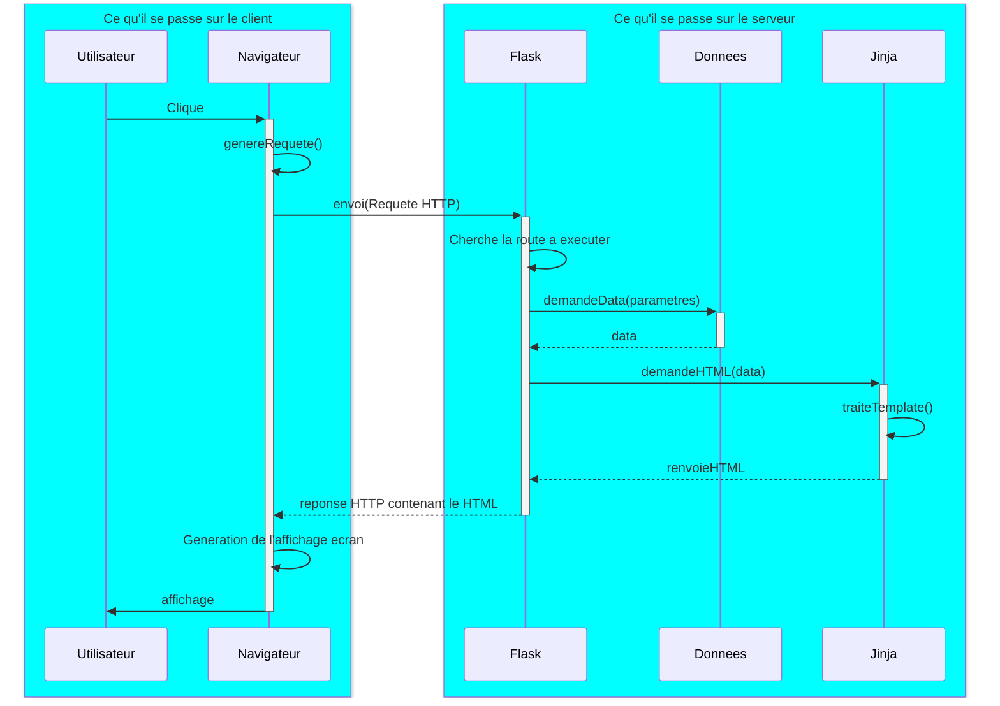

# Projet IMDB - Application Flask MVC

L'application Flask qui vous a été transmise permet de consulter une base de données IMDB (films et acteurs) stockée dans PostgreSQL.

!!! hint "C'est dur au debut"
    Il est normal de trouver cette activite dure au debut, car il faut penser a plein de choses en meme temps.
    Moyennant une implication constante, vous passerez un cap, non seulement dans la comprehension des concepts, mais encore mieux, dans leur assimilation perenne.

    Les explications techniques sont volontairement legeres, afin de ne pas alourdir l'acces a la comprehension globale (le point de cette activite).

!!! danger "Je ne veux pas voir de cosmetique"
    L'application utilise deja Bulma CSS pour l'apparence. Ne perdez pas de temps a modifier le style, concentrez-vous sur la logique metier.

## Architecture MVC

L'application suit une architecture **Modele-Vue-Controleur** :

```
imdb/
├── app.py                      # Point d'entree Flask
├── database.py                 # Connexion PostgreSQL (pool)
├── modele.py                   # Modele : dataclasses (Acteur, Film...)
├── controlers/
│   └── acteurs_controler.py    # Controleur : gere les routes
├── services/
│   └── acteurs_db.py           # Service : requetes SQL
└── templates/
    ├── squelette.html.j2       # Vue : template de base
    ├── liste_acteurs.html.j2   # Vue : liste des acteurs
    └── detail_acteur.html.j2   # Vue : detail d'un acteur
```

| Couche | Fichier(s) | Role |
|--------|-----------|------|
| **Modele** | `modele.py` | Definit les structures de donnees (dataclasses) |
| **Vue** | `templates/*.j2` | Genere le HTML a partir des donnees |
| **Controleur** | `controlers/*.py` | Recoit les requetes, orchestre modele et vue |
| **Service** | `services/*.py` | Accede a la base de donnees |

---

## Client vs Serveur : Qui fait quoi ?

C'est **fondamental** de comprendre ce qui s'execute ou.

### Ce qui s'execute sur le SERVEUR (Python/Flask)

- Le code Python (`app.py`, `controlers/`, `services/`)
- Les requetes SQL vers PostgreSQL
- Le rendu des templates Jinja (generation du HTML)
- La logique metier (calculs, validations...)

### Ce qui s'execute dans le NAVIGATEUR (client)

- L'affichage du HTML recu
- L'execution du JavaScript (menu burger)
- Les styles CSS (Bulma)
- Les interactions utilisateur (clics, formulaires)

!!! warning "Piege classique"
    Jinja (`{{ variable }}`, ``) s'execute **sur le serveur**, pas dans le navigateur !
    Quand le navigateur recoit la page, tout le code Jinja a deja ete remplace par du HTML pur.

---

## Diagramme de sequence

Voici ce qu'il se passe quand un utilisateur clique sur un lien :



---

## Les fichiers cles

### 1. `app.py` - Point d'entree

```python
from flask import Flask
from controlers.acteurs_controler import acteurs_bp

app = Flask(__name__)
app.register_blueprint(acteurs_bp, url_prefix='/acteurs')

@app.route('/')
def index():
    return flask.redirect(flask.url_for('acteurs_bp.liste_acteurs'))
```

Le `register_blueprint` connecte le controleur des acteurs avec le prefixe `/acteurs`.
Ainsi, la route `/` du blueprint devient `/acteurs/`.

### 2. `controlers/acteurs_controler.py` - Le controleur

```python
@acteurs_bp.route('/<string:nconst>', methods=['GET'])
def detail_acteur(nconst: str):
    # 1. Demander les donnees au service
    acteur = svc.get_acteur(nconst)
    films = svc.get_films_acteur(nconst)

    # 2. Generer le HTML avec le template
    return render_template('detail_acteur.html.j2',
                          acteur=acteur,
                          films=films)
```

Le controleur :

1. Recoit la requete HTTP
2. Extrait les parametres (ici `nconst` depuis l'URL)
3. Appelle le service pour obtenir les donnees
4. Passe les donnees au template pour generer le HTML

### 3. `services/acteurs_db.py` - Le service

```python
def get_acteur(nconst: str) -> Acteur | None:
    with database.get_connection() as conn:
        with conn.cursor() as cur:
            cur.execute("""
                SELECT nconst, primary_name, birth_year, death_year
                FROM name
                WHERE nconst = %s
            """, (nconst,))
            row = cur.fetchone()
            if row is None:
                return None
            return Acteur(row[0], row[1], row[2], row[3])
```

Le service :

1. Ouvre une connexion a la base de donnees
2. Execute une requete SQL parametree (securisee contre l'injection SQL)
3. Transforme le resultat en objet Python (dataclass)

### 4. `templates/detail_acteur.html.j2` - La vue

```html


{{ acteur.primary_name }}


<h1>{{ acteur.primary_name }}</h1>


    <p>{{ film.primary_title }} ({{ film.start_year }})</p>


```

Le template Jinja :

- `` : herite d'un template parent
- `{{ variable }}` : affiche une valeur
- `` : boucle sur un itérable
- `` : condition

---

## Demarrer l'application

1. Configurer le fichier `.env` avec vos identifiants PostgreSQL
2. Installer les dependances : `uv add flask psycopg[binary] psycopg-pool python-dotenv`
3. Lancer : `flask run --debug`
4. Ouvrir http://127.0.0.1:5000

---

## Exercices de prise en main

!!! tip "Methode"
    Pour chaque exercice :

    1. Identifiez quel(s) fichier(s) modifier
    2. Faites la modification minimale
    3. Testez immediatement dans le navigateur
    4. Commitez si ca fonctionne

### Exercice 1 : Modifier un texte

!!! question "Changer le titre de la page d'accueil"
    Dans la liste des acteurs, le titre affiche "Liste des acteurs".

    **Mission** : Changez ce titre en "Acteurs et actrices IMDB"

    **Indice** : Regardez dans `templates/liste_acteurs.html.j2`

??? success "Solution"
    Dans `templates/liste_acteurs.html.j2`, ligne 8 :
    ```html
    <h1 class="title is-2">Acteurs et actrices IMDB</h1>
    ```

### Exercice 2 : Ajouter une colonne

!!! question "Afficher la duree de vie"
    Dans le tableau de la liste des acteurs, on voit l'annee de naissance et l'annee de deces.

    **Mission** : Ajoutez une colonne "Age" qui affiche :

    - L'age au deces si l'acteur est decede
    - Rien sinon

    **Indice** : C'est un calcul Jinja `{{ acteur.death_year - acteur.birth_year }}`

??? success "Solution"
    Dans `templates/liste_acteurs.html.j2` :

    1. Ajoutez l'en-tete de colonne :
    ```html
    <th>Age au deces</th>
    ```

    2. Ajoutez la cellule dans la boucle :
    ```html
    <td>
        
            {{ acteur.death_year - acteur.birth_year }} ans
        
            -
        
    </td>
    ```

### Exercice 3 : Comprendre le chemin des donnees

!!! question "Tracez le parcours d'une requete"
    Quand vous accedez a `/acteurs/nm0000001` :

    1. Quel fichier recoit la requete en premier ?
    2. Quelle fonction du controleur est appelee ?
    3. Quelle(s) fonction(s) du service sont appelees ?
    4. Quel template genere le HTML ?

??? success "Solution"
    1. `app.py` recoit la requete, reconnait le prefixe `/acteurs` et la transmet au blueprint
    2. `detail_acteur(nconst)` dans `acteurs_controler.py`
    3. `get_acteur()`, `get_films_acteur()`, `get_professions_acteur()` dans `acteurs_db.py`
    4. `detail_acteur.html.j2`

### Exercice 4 : Modifier le nombre de resultats par page

!!! question "Changer la pagination"
    Par defaut, la liste affiche 50 acteurs par page.

    **Mission** : Passez a 20 acteurs par page.

    **Indice** : Cherchez la variable `limit` dans le controleur.

??? success "Solution"
    Dans `controlers/acteurs_controler.py`, fonction `liste_acteurs()` :
    ```python
    limit = 20  # etait 50
    ```

### Exercice 5 : Ajouter une information

!!! question "Afficher le nombre de films dans la liste"
    Dans la liste des acteurs, on ne voit que le nom et les dates.

    **Mission** : Ajoutez une colonne "Nb films" qui affiche le nombre de films de chaque acteur.

    **Attention** : Cet exercice necessite de modifier plusieurs fichiers !

??? success "Solution"

    1. **Modifier le service** (`services/acteurs_db.py`) - ajouter une fonction :
    ```python
    def count_films_acteur(nconst: str) -> int:
        with database.get_connection() as conn:
            with conn.cursor() as cur:
                cur.execute("""
                    SELECT COUNT(*) FROM principal WHERE nconst = %s
                """, (nconst,))
                return cur.fetchone()[0]
    ```

    2. **Modifier le controleur** pour enrichir les donnees...
       Ou mieux : modifier la requete SQL pour inclure le count directement !

    C'est plus complexe. La vraie solution serait de modifier `get_all_acteurs()`
    pour faire une jointure avec COUNT.

---

## Mission finale : Creer une page de recherche de films

Maintenant que vous avez compris l'architecture, votre mission est de creer une fonctionnalite complete : **la recherche et l'affichage des films**.

### Objectif

Creer deux pages :

1. **Liste/Recherche de films** (`/films/`) : affiche les films avec un champ de recherche
2. **Detail d'un film** (`/films/<tconst>`) : affiche les informations d'un film et son casting

### Etapes guidees

#### Etape 1 : Creer le service `services/films_db.py`

Creez un nouveau fichier avec les fonctions :

```python
import database
from modele import Film, Principal, Acteur

def get_all_films(page: int = 1, limit: int = 50) -> list[Film]:
    """Retourne une liste paginee de films"""
    # A completer : similaire a get_all_acteurs

def count_films() -> int:
    """Retourne le nombre total de films"""
    # A completer

def search_films(search: str, page: int = 1, limit: int = 50) -> list[Film]:
    """Recherche des films par titre"""
    # A completer

def count_films_search(search: str) -> int:
    """Compte les films correspondant a la recherche"""
    # A completer

def get_film(tconst: str) -> Film | None:
    """Retourne un film par son ID"""
    # A completer

def get_acteurs_film(tconst: str) -> list[tuple[Acteur, Principal]]:
    """Retourne les acteurs d'un film avec leur role"""
    # A completer : similaire a get_films_acteur mais inverse
```

!!! tip "Tables utiles"
    - `title` : contient les films (tconst, primary_title, start_year, ...)
    - `principal` : table de liaison entre films et acteurs
    - `name` : contient les acteurs

#### Etape 2 : Creer le controleur `controlers/films_controler.py`

```python
from flask import Blueprint, request, render_template, abort
import services.films_db as svc

films_bp = Blueprint('films_bp', __name__)

@films_bp.route('/', methods=['GET'])
def liste_films():
    """Liste paginee des films avec recherche"""
    # A completer : similaire a liste_acteurs

@films_bp.route('/<string:tconst>', methods=['GET'])
def detail_film(tconst: str):
    """Detail d'un film"""
    # A completer : similaire a detail_acteur
```

#### Etape 3 : Enregistrer le blueprint dans `app.py`

```python
from controlers.films_controler import films_bp

app.register_blueprint(films_bp, url_prefix='/films')
```

#### Etape 4 : Creer les templates

- `templates/liste_films.html.j2` : inspirez-vous de `liste_acteurs.html.j2`
- `templates/detail_film.html.j2` : inspirez-vous de `detail_acteur.html.j2`

### Criteres de reussite

- [ ] La page `/films/` affiche une liste de films paginee
- [ ] La recherche par titre fonctionne
- [ ] Cliquer sur un film affiche sa page de detail
- [ ] La page de detail affiche : titre, annee, type, duree, et liste des acteurs
- [ ] Cliquer sur un acteur dans le detail d'un film mene a sa page de detail

### Bonus

- [ ] Ajouter un lien vers la fiche IMDB officielle : `https://www.imdb.com/title/{tconst}`
- [ ] Afficher la note du film si disponible (table `rating`)
- [ ] Filtrer par type de film (movie, tvSeries, etc.)
- [ ] Dans le detail d'un acteur, rendre les titres de films cliquables vers `/films/<tconst>`

---

## Rappel : Structure de la base de donnees

| Table | Description | Colonnes principales |
|-------|-------------|---------------------|
| `name` | Acteurs/realisateurs | nconst, primary_name, birth_year, death_year |
| `title` | Films/series | tconst, primary_title, title_type, start_year, runtime_minutes |
| `principal` | Liaisons film-acteur | tconst, nconst, category, characters |
| `rating` | Notes des films | tconst, average_rating, num_votes |
| `genre` | Genres | genre_id, name |
| `title_genre` | Liaison film-genre | tconst, genre_id |
