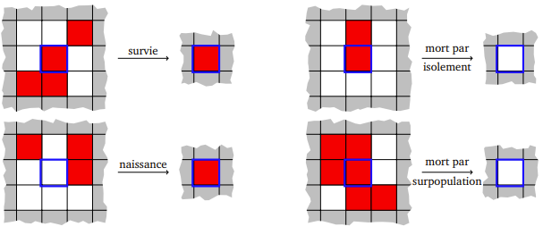
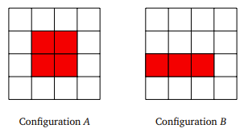

# The Game Of Life


Un [automate cellulaire](https://fr.wikipedia.org/wiki/Automate_cellulaire) est constitué d’une grille régulière de cellules étant chacune dans un état (parmi un nombre fini d’états possibles), et d’une règle d’évolution locale et synchrone : à chaque étape de temps (discret), l’état de chaque cellule est mis à jour en fonction de l’état de ses voisines (et du sien).

!!! tip Pourquoi?
    Pourquoi ça intéresse certains scientifiques? Parce qu'ils cherchent à savoir comment des structures parfois très complexes émergent d'un système de règles extrêmement simples. On dit qu'ils travaillent sur l'émergence. Ca en intéresse d'autres juste parce qu'ils trouvent ça fascinant.

Le mathématicien [John Conway](https://fr.wikipedia.org/wiki/John_Horton_Conway) a défini en 1970 un automate cellulaire particulier qu’il a nommé « jeu de la vie ». 

Il s’agit d’un automate dont la grille est une grille bi-dimensionnelle infinie, et chaque cellule peut prendre deux états 0 ou 1 (qu’on appelle habituellement « état mort » et « état vivant »). Les voisines d’une cellule sont les huit cellules qui l’entourent.

Qui de mieux que John Conway pour vous présenter son jeu:

<iframe width="560" height="315" src="https://www.youtube.com/embed/E8kUJL04ELA?si=Sm7eEEVPcFfKCNii" title="YouTube video player" frameborder="0" allow="accelerometer; autoplay; clipboard-write; encrypted-media; gyroscope; picture-in-picture; web-share" referrerpolicy="strict-origin-when-cross-origin" allowfullscreen></iframe>


!!! tip La règle
    - Une cellule vivante au temps t meurt au temps t + 1 si elle n’est entourée que de 0 ou 1 cellule vivante (isolement), ou si elle est entourée d’au moins 4 cellules vivantes (surpopulation). Elle survit dans les autres cas.
    - Une cellule morte au temps t devient vivante au temps t + 1 si elle est entourée d’exactement 3 cellules vivantes (naissance). Elle reste morte sinon.

    Ces règles sont illustrées par la figure suivante.

    


## Simulation du jeu de la vie

Pour pouvoir représenter de manière finie le jeu de la vie, on modifie son comportement pour en faire un [tore](https://fr.wikipedia.org/wiki/Tore)

Au lieu d’être une grille infinie, c’est une grille k × k dont la colonne de gauche est voisine de la colonne de droite, et la ligne du haut voisine de la ligne du bas. De cette manière, la grille n’a pas de bord et toute cellule possède exactement 8 voisines. On peut représenter une grille par une matrice (tableau bi-dimensionnel) de taille $k×k$, où 0 représente l’état mort et 1 l’état vivant. La représentation de la grille en Python sera une liste de listes. La numérotation des lignes et des colonnes de la matrice ira de 0 à (k − 1).


!!! question "Représentation de la grille"
    1. On considère une grille de taille 4. Donner la représentation matricielle des deux configurations suivantes, et donner les configurations obtenues au temps t + 1 et t + 2 pour chacune. Que remarque-t-on ?

        

    2. Dans la grille de taille 4, quelles sont les coordonnées des cellules voisines de (1, 1) ? Et celles des voisines de (0, 3) ?

    3. Complétez les fonctions creer_grille et draw afin d'afficher une grille.

        ```python
        import pyxel as px

        VIVANTE = 1
        MORTE = 0
        TAILLE = 5

        type grille = list[list[int]]

        def creer_grille(k: int) -> grille:
            '''Renvoie une grille de taille k construite aléatoirement'''
            pass

        def update():
            '''Remplace la grille par la prochaine grille'''
            global g
            pass

        def draw():
            '''Dessine la grille'''
            global g
            pass
        
        px.init(TAILLE, TAILLE, title="Game Of Life")
        g = creer_grille(TAILLE)
        px.run(update, draw)
        ```

!!! question "Évolution de la grille"

    L'objectif ici est de ne pas s'attaquer directement à la création de la prochaine grille, mais de se constituer des outils élémentaires qui vont nous permettre progressivement d'atteindre notre but.

    1. Donnez la matrice des nombres de voisines de la grille donnée dans le code. Donner l'état suivant de la grille donnée dans le code. Cette grille pourra vous servir de test pour vos fonctions.
    2. Ecrire une fonction `est_vivante(i: int, j: int, g: grille) -> bool`
    3. Écrire les fonctions `ind_suiv` et `ind_prec` prenant en paramètre un indice de ligne ou de colonne et renvoient l’indice de la ligne ou colonne suivante (resp. précédente) dans la grille. Attention, il faut tenir compte du caractère torique de la grille.
    4. Écrire une fonction `nb_voisines_vivantes(i: int, j: int, g: grille)-> int` qui prend en entrée une grille et une cellule de la grille représentée par ses coordonnées $(i, j)$, et renvoie le nombre de cellules vivantes autour de la cellule $(i,j)$.
    
    5. Écrire une fonction `etat_suivant(i: int, j: int, g: grille) -> int` qui renvoie le prochain état de la cellule $(i,j)$ en fonction des règles du jeu.
    
    6. Écrire une fonction `grille_suivante(g:grille) -> grille` qui prend en entrée une grille et renvoie la prochaine grille à afficher. Cette fonction devra faire une ligne (en compréhension).

!!! tip "Calculabilité"
    Le jeu de la vie est Turing-Complet. Tout algorithme peut y être implémenté (ça peut se démontrer par exemple en exhibant en son sein une porte ET et une porte NON). Par conséquent, il est impossible de prédire le comportement asymptotique de toute grille donnée. 

    <iframe width="560" height="315" src="https://www.youtube.com/embed/WfuhbI8HE7s?si=dFeIVhBW4wGLYFQ6" title="YouTube video player" frameborder="0" allow="accelerometer; autoplay; clipboard-write; encrypted-media; gyroscope; picture-in-picture; web-share" referrerpolicy="strict-origin-when-cross-origin" allowfullscreen></iframe>