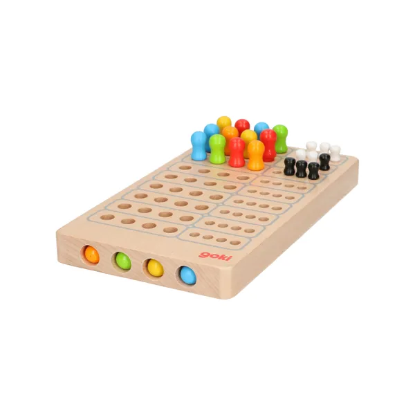

# MasterMind

# Prélude

Se familiariser avec les règles du mastermind.

# Modélisation

On utilise une chaîne de caractères pour représenter les couleurs à deviner.
Sur l'image suivante, "OVJB" est la séquence de couleurs à trouver.

!!! question Initialisation
    Ecrire une fonction `genere_sequence(n: int, couleurs: str) -> str` qui renvoie une séquence de n couleurs aléatoirement choisies parmi les couleurs contenues dans la chaîne de caractères couleurs.

!!! question Affichage
    Ecrire une fonction `affiche_sequence(s: str)` qui affiche la séquence s dans le terminal.
    On pourra utiliser le module colorama afin de permettre un affichage coloré dans le terminal.

!!! question Comparaison
    Ecrire une fonction `compare_sequences(s1: str, s2: str) -> str`.
    Cette fonction renvoie une str contenant le nombre de couleurs correctement placées et le nombre de couleurs mal placées.
    Par exemple, si `s1 = "OVJB"` et que `s2 = "VOJA"` alors la fonction renvoie "21", à savoir 2 mal placés et 1 correctement placé.

!!! question Tour de jeu
    Ecrire une fonction `tour_de_jeu(s: str)` qui demande une séquence au joueur pour la séquence à deviner `s` et qui renvoie la str renvoyée par `compare_sequences`.

!!! question Le jeu entier
    En vous inspirant de la boucle principale du pendu, complétez le jeu de mastermind.
