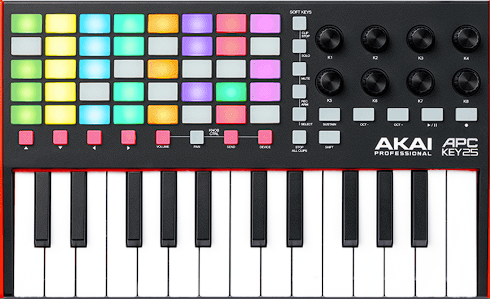
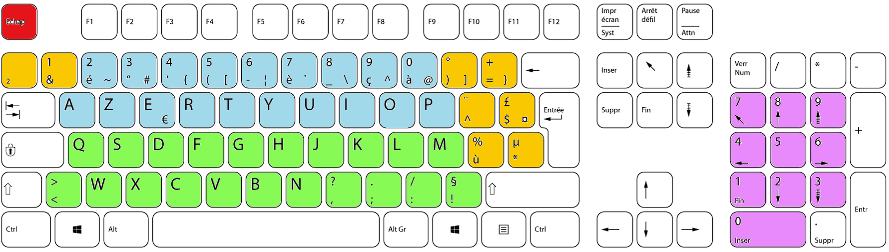
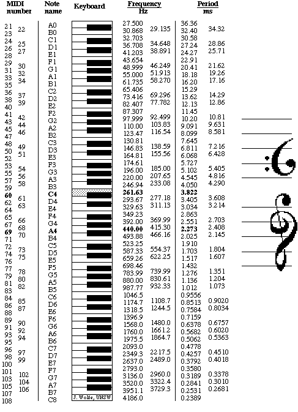
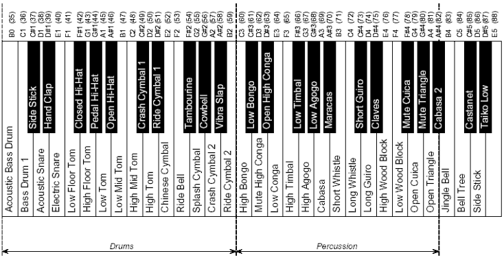

# Créer un clavier musical



## Objectif:

- Apprendre à gérer les évènements utilisateurs pour construire une interface homme/machine.
- Utiliser des modules.
- Utiliser des variables globales. 
- Utiliser des dictionnaires.
- Découvrir que même la musique a un standard de représentation informatique mondial, le MIDI.

## Un peu de théorie

Kurt Gödel a montré qu’il est possible d’associer à toute formule, à tout énoncé, voire à toute démonstration, un nombre entier unique. L’argument repose sur le fait que tout symbole et toute suite de symboles peuvent être encodés numériquement (par exemple sous forme binaire), permettant ainsi de « traduire » n’importe quel objet formel en un entier.

En informatique, tout objet manipulable (texte, image, son, vidéo, programme, etc.) est de fait une suite finie de bits.

Or, une suite finie de bits peut être vue comme la représentation binaire d’un entier naturel.

**Tout objet formel est représentable par un entier naturel. 
C'est un principe fondamental et omniprésent de la science informatique.**

## Le MIDI

La norme MIDI (Musical Instrument Digital Interface) est un protocole de communication entre instruments électroniques, ordinateurs, logiciels de musique, etc.

Au lieu d’envoyer une représentationn d'ondes sonores, les instruments MIDI envoient des messages (ex. : « Note ON », « Note OFF », « Program Change », etc.) qui décrivent quelle note jouer, à quel moment, avec quelle intensité, et une kyrielle d'autres paramètres encore.

Par exemple, un message « Note ON » se compose de trois octets :

- L’identifiant du message et du canal (un nombre),
- Le numéro de la note (un nombre, de 0 à 127),
- La vélocité (un nombre, de 0 à 127).

Ainsi, même pour décrire la durée, la hauteur d’une note ou le changement d’instrument, tout se fait par des nombres (généralement compris entre 0 et 127 dans le MIDI basique)

Ces messages seront interprétés au final par un synthétiseur de sons qui dispose d'une banque de sons, où chaque instrument a été échantilloné pour produire les sons voulus au gré des messages reçus.

Certains instruments disposent d'un synthétiseur intégré. C'est le cas des claviers numériques du type clavinova, par exemple, mais le principe est le même. Parmis moultes configurations techniques possibles, sur une scène de concert **de haut niveau technique**, le musicien qui joue du synthétiseur peut n'envoyer que des signaux MIDI à la régie. La régie, elle, peut aussi envoyer des messages MIDI à son instrument (pour déclencher des séquences automatiques, changer la configuration à la place du musicien), et la génération du son se fait en régie avec ce qu'on appelle un rack de sons. Le musicien peut alors entendre le son produit grâce aux wedges (oreillettes ou haut parleur de scène). Nous touchons ici à ce qui est un métier en soi.

---

## Setup python


Dans votre environnement conda:
```bash
conda install mido pygame
pip install pynput pyttsx3
```

- installer pygame permet de s'affranchir de pas mal de configuration MIDI sur l'ordinateur.

- mido permet à python de connaître et de donner à l'utilisateur la possibilité de manipuler de la musique selon le standard MIDI.

- pynput sert à capturer les évènements utilisateurs (clavier et souris)

- pyttsx3 est un module de synthèse vocale.


## Setup VSCode

Mise en place des fichiers:
Vous avez à disposition 3 fichiers:

- evenements.py
    - Ce fichier contient des fonctions pour écouter les évènements du clavier.
- midiutils.py
    - Ce fichier contient des fonctions pour jouer de la musique.
- synthese.py
    - Ce fichier sert à faire de la synthèse de... 🤔

!!! question "Actions"
    - Créez un répertoire projet_musique dans votre répertoire NSI
    - Mettez-y les trois fichiers python. **Il ne faut pas les modifier**
    - Ouvrez le répertoire du projet dans VSCode
    - Créez-y un fichier clavier.py . Ce qui est demandé se fera dans ce fichier.
    - Ouvrez le dans VSCode.

## Code de départ

Voici le code initial du fichier clavier.py que vous venez de créer.
Il ne permet pas encore de produire de la musique, juste de gérer les évènements clavier/souris.

```python
import evenements
import logging
from logging import info

def appuie_touche(key: evenements.Key):
    info(f'Touche {repr(key.char)} appuyée')

def relache_touche(key: evenements.Key):
    info(f'Touche {key} relâchée')

def click(x: int, y: int, bouton: evenements.Button, etat: bool):
    if bouton == evenements.Button.left:
        info(f"{x=}, {y=}, {bouton=}, {etat=}")
    elif bouton == evenements.Button.right:
        info("click droit")
    elif bouton == evenements.Button.middle:
        info("molette")

def bouge(x,y):
    # pass veut dire: "ne rien faire".
    pass

def main():
    """ Fonction principale 
    Python reste à cette ligne jusqu'à la fin du programme.
    On indique à python qu'il faut exécuter:
    - appuie_touche lorsqu'une touche est appuyée
    - relache_touche lorsqu'une touche est relachée
    - click quand un bouton de souris est cliquée
    - bouge lorsque la souris est bougée.
    """
    evenements.demarre_listeners(appuie_touche, relache_touche, click, bouge, None)

if __name__ == "__main__":
    logging.basicConfig(level=logging.INFO)
    #Pour supprimer les infos de log dans la console, vous pouvez utiliser NOTSET à la place de INFO.
    #Pour voir des informations supplémentaires de log dans la console, vous pouvez utiliser DEBUG à la place de INFO.
    
    main()
```

!!! question "Exercices"
    - Trouvez un moyen d'afficher "click gauche" lorsqu'on clique sur le bouton gauche de la souris.
    - Trouvez un moyen d'afficher les coordonnées de la souris lorsqu'on la bouge.

## Cours

!!! abstract "Modules"
    Quand on `import evenements`, python va voir s'il existe un fichier qui s'appelle evenements.py dans le répertoire. Oui, on en a mis un. Elle va donc rendre accessible à votre programme toutes les fonctions et les variables contenues dedans.
    Par exemple, maintenant qu'on a importé le module evenements, on peut accéder à sa fonction demarre_listeners en écrivant `evenements.demarre_listeners(....)`

!!! abstract "Listeners - programmation évènementielle"
    Un écouteur d'évènement (on dira listener) est une boucle infinie qui vérifie qu'un événement se produit. Quand l'événement écouté se produit, alors la boucle lance la fonction associée, qu'on appelle un **callback**. 

    On peut écouter les événements se produisant sur les périphériques de l'ordinateur: l'écran tactile, la souris, le clavier...

    L'événement peut être un clic souris, le mouvement de la souris, une touche du clavier enfoncée, relâchée, la modification d'un fichier sur le disque dur, le branchement d'un matériel USB...

    **A vous de décider du contenu de vos callback en fonction du comportement que **vous** désirez quand un utilisateur déclenche un évènement.

!!! question "Exercice"
    Modifiez le callback appuie_touche pour que, lorsqu'on enfonce la touche "s", le programme affiche "Exercice réussi :)"

A partir de maintenant, vous avez presque tout ce qu'il vous faut pour écrire une application d'espionnage répandue qu'on appelle un keylogger. Il ne vous manque plus qu'à savoir communiquer avec des périphériques de stockage ou transfert de données. **MAIS Se rend coupable de l’infraction prévue à l’article 323-1 du code pénal la personne qui, sachant qu’elle n’y est pas autorisée, accède à l’insu des victimes, à un système de traitement automatisé de donnée. La cour de cassation fait explicitement référence à des keyloggers dans des arrêts. Les peines sont très lourdes étant donné les conséquences (industrialisation de récupération de mots de passes (bancaires...), porte ouverte à l'usurpation d'identité, atteinte à la vie privée... florilège).**

## Jouer des notes de musique

Le module midiutils comporte des fonctions Midi (Musical Instrument Digital Interface, standard international en musique) qui permettent (entre autre) de jouer des notes de musique, et d'arrêter des notes de musique. Comme lorsqu'on appuie sur une touche de piano (Message MIDI note_on) et qu'on relâche une touche de piano (Message MIDI note_off).

Les numéros MIDI d'instruments sont disponibles en annexe. Les numéros MIDI des notes de musique sont en annexe.

Vous pouvez, grâce à un booléen, dire que vous voulez jouer une percussion, auquel cas, les notes à jouer/relâcher pour les diverses percussions sont aussi en annexe.


!!! question "Adaptation du code"
    
    Modifiez la fonction main ainsi.

    ```python
    def main():
        midiutils.debut_environnement_sonore()
        # Démarrage de la boucle principale
        evenements.demarre_listeners(appuie_touche, relache_touche, click, bouge, None)
        # Sortie de la boucle principale
        midiutils.fin_environnement_sonore()
    ```

    Lancez le programme. Il vous demande de choisir quel synthétiseur utiliser s'il en existe plusieurs. Choisissez celui de windows le cas échéant.

!!! question "Prise en main"
    Apportez des modifications au bon endroit du code pour que:

    - lorsqu'on appuie sur la touche "a", la note LA 440 soit joué.
    - lorsqu'on relâche la touche "a", cette même note soit relâchée.
    - lorsqu'on appuie sur la touche "<", une percussion précise soit jouée (de votre choix).
    - lorsqu'on relâche la touche "<", cette même percussion est relâchée.

## Créer un clavier complet

### Objectif
Transformer votre clavier en instrument.

### Spécifications fonctionnelles

Chaque partie de votre clavier doit être séparé sur ce mode:



- Les touches bleues servent à jouer des percussions.
- Les touches vertes servent à jouer un instrument particulier.
- 2 touches oranges servent à changer d'instrument (instrument suivant, instrument précédent).
- 2 touches oranges servent à modifier la vélocité (+, -).
- Une touche orange sert à jouer une mélodie stockée dans une liste.
- Le mouvement de la souris sert à modifier le pitchwheel

Si vous n'avez pas de clavier avec pavé numérique chez vous, ne faites pas le bloc rose. Il est cependant intéressant à faire dans le sens où il va vous obliger à fouiller un peu sur la façon dont sont représentées ces touches.

### Spécifications techniques

- Vous devrez associer à des touches du clavier un numéro de note.
    - A cette fin, vous travaillerez avec des dictionnaires en variables globales, un pour chaque bloc de touches.

- Vous aurez un numéro d' `instrument_courant` en variable globale.

- Utiliser la fonction "dire" du module

## Annexes
### Notes MIDI



### Percussions MIDI



### Instruments MIDI

!!! warning "Attention"
    Les numéros que vous voyez sont ceux que les musiciens voient dans leurs outils. Dans le code, la numérotation commence à 0, pas à 1.

| Numéro | Instrument GM (en français)                |
|-------:|:-------------------------------------------|
| 1      | Piano acoustique (grand)                   |
| 2      | Piano acoustique brillant                  |
| 3      | Piano électrique (grand)                   |
| 4      | Piano bar (honky-tonk)                     |
| 5      | Piano électrique 1                         |
| 6      | Piano électrique 2                         |
| 7      | Clavecin                                   |
| 8      | Clavinet                                   |
| 9      | Célesta                                    |
| 10     | Glockenspiel                               |
| 11     | Boîte à musique                            |
| 12     | Vibraphone                                 |
| 13     | Marimba                                    |
| 14     | Xylophone                                  |
| 15     | Cloches tubulaires                         |
| 16     | Dulcimer                                   |
| 17     | Orgue à tirettes                           |
| 18     | Orgue percussif                            |
| 19     | Orgue rock                                 |
| 20     | Orgue d’église                             |
| 21     | Orgue à anche                              |
| 22     | Accordéon                                  |
| 23     | Harmonica                                  |
| 24     | Accordéon tango                            |
| 25     | Guitare acoustique (cordes nylon)          |
| 26     | Guitare acoustique (cordes acier)          |
| 27     | Guitare électrique (jazz)                  |
| 28     | Guitare électrique (clean)                 |
| 29     | Guitare électrique (étouffée)              |
| 30     | Guitare saturée (overdriven)               |
| 31     | Guitare distorsion                         |
| 32     | Harmoniques de guitare                     |
| 33     | Basse acoustique                           |
| 34     | Basse électrique (doigt)                   |
| 35     | Basse électrique (médiator)                |
| 36     | Basse sans frette (fretless)               |
| 37     | Slap basse 1                               |
| 38     | Slap basse 2                               |
| 39     | Basse synthé 1                             |
| 40     | Basse synthé 2                             |
| 41     | Violon                                     |
| 42     | Alto                                       |
| 43     | Violoncelle                                |
| 44     | Contrebasse                                |
| 45     | Cordes tremolo                             |
| 46     | Cordes pizzicato                           |
| 47     | Harpe orchestrale                          |
| 48     | Timbales                                   |
| 49     | Ensemble de cordes 1                       |
| 50     | Ensemble de cordes 2                       |
| 51     | Cordes synthétiques 1                      |
| 52     | Cordes synthétiques 2                      |
| 53     | Chœur « Aahs »                             |
| 54     | Voix « Oohs »                              |
| 55     | Voix synthétique                           |
| 56     | Coup d’orchestre                           |
| 57     | Trompette                                  |
| 58     | Trombone                                   |
| 59     | Tuba                                       |
| 60     | Trompette bouchée                          |
| 61     | Cor d’harmonie                             |
| 62     | Section de cuivres                         |
| 63     | Cuivres synthétiques 1                     |
| 64     | Cuivres synthétiques 2                     |
| 65     | Saxophone soprano                          |
| 66     | Saxophone alto                             |
| 67     | Saxophone ténor                            |
| 68     | Saxophone baryton                          |
| 69     | Hautbois                                   |
| 70     | Cor anglais                                |
| 71     | Basson                                     |
| 72     | Clarinette                                 |
| 73     | Piccolo                                    |
| 74     | Flûte                                      |
| 75     | Flûte à bec                                |
| 76     | Flûte de Pan                               |
| 77     | Bouteille soufflée (blown bottle)          |
| 78     | Shakuhachi                                 |
| 79     | Sifflet                                    |
| 80     | Ocarina                                    |
| 81     | Lead 1 (carré)                             |
| 82     | Lead 2 (dent de scie)                      |
| 83     | Lead 3 (calliope)                          |
| 84     | Lead 4 (chiff)                             |
| 85     | Lead 5 (charang)                           |
| 86     | Lead 6 (voix)                              |
| 87     | Lead 7 (quintes)                           |
| 88     | Lead 8 (basse + lead)                      |
| 89     | Pad 1 (new age)                            |
| 90     | Pad 2 (chaud)                              |
| 91     | Pad 3 (polysynthé)                         |
| 92     | Pad 4 (chœur)                              |
| 93     | Pad 5 (archet)                             |
| 94     | Pad 6 (métallique)                         |
| 95     | Pad 7 (halo)                               |
| 96     | Pad 8 (balayage)                           |
| 97     | FX 1 (pluie)                               |
| 98     | FX 2 (bande-son)                           |
| 99     | FX 3 (cristal)                             |
| 100    | FX 4 (atmosphère)                          |
| 101    | FX 5 (brillance)                           |
| 102    | FX 6 (gobelins)                            |
| 103    | FX 7 (échos)                               |
| 104    | FX 8 (science-fiction)                     |
| 105    | Sitar                                      |
| 106    | Banjo                                      |
| 107    | Shamisen                                   |
| 108    | Koto                                       |
| 109    | Kalimba                                    |
| 110    | Cornemuse                                  |
| 111    | Vièle (fiddle)                             |
| 112    | Shanai                                     |
| 113    | Grelots (Tinkle Bell)                      |
| 114    | Agogo                                      |
| 115    | Steel Drums (tambours métalliques)         |
| 116    | Woodblock (bloc de bois)                   |
| 117    | Tambour taiko                              |
| 118    | Tom mélodique                              |
| 119    | Tambour synthétique                        |
| 120    | Cymbale inversée                           |
| 121    | Bruit de frettes de guitare                |
| 122    | Bruit de souffle                           |
| 123    | Bruit de bord de mer                       |
| 124    | Chant d’oiseau                             |
| 125    | Sonnerie de téléphone                      |
| 126    | Hélicoptère                                |
| 127    | Applaudissements                           |
| 128    | Coup de feu                                |

