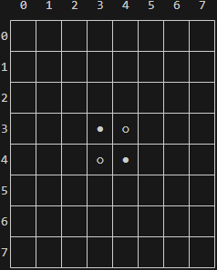
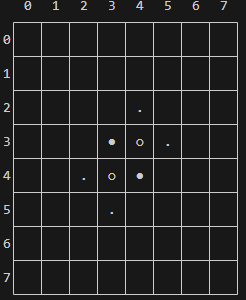

# Othello

Il s'agit ici de construire un jeu d'Othello, ou Reversi.

Je vous laisse vous documenter sur ce jeu et y jouer afin de vous en approprier les règles.

# Code python de départ

```python
VIDE = 0
BLANC = 1   # joueur 1
NOIR = 2    # joueur 2

type grille = list[list[int]]
type coup = tuple[int, int]

def autre(joueur: int) -> int:
    """
    Retourne l'autre joueur
    """
    assert joueur in (1,2), "Seuls les joueurs 1 et 2 sont possibles"
    return 3-joueur

def peut_jouer(c: coup, joueur: int, g: grille) -> bool:
    """Cette fonction a besoin d'exister pour l'affichage.
    Vous l'écrirez en chemin """
    return False

def show(joueur: int, g: grille):
    """
    Affiche la grille g, le joueur allant jouer étant donné
    """
    print( "".join(f"   {j}" for j in range(8)))
    print(" ┌───"+ 7*"┬───" +"┐")
    for i in range(8):
        print(f"{i}│", end="")
        for j in range(8):
            if g[i][j]==NOIR:
                print(" ○ ", end="│")
            elif g[i][j]==BLANC:
                print(" ● ", end="│")
            elif peut_jouer((i,j), joueur, g):
                print(" . ", end="│")
            else:
                print("   ", end="│")
        print()
        if i == 7:
            print(" └───"+ 7*"┴───" +"┘")
        else:
            print(" ├───"+ 7*"┼───" +"┤")
    print(f"C'est le tour du joueur {joueur}")

```

# Ecriture progressive des fonctions nécessaires

!!! question "1. Poser un pion"
    Ecrire `poser_pion(c: coup, joueur: int, g: grille)`

    Cette fonction modifie en place la grille g sachant que le joueur donné a joué le coup c. Trivial


!!! question "2. Créer la grille"
    Ecrire `creer_grille() -> grille`

    Cette fonction initialise la grille à un début de partie.

    `show(1, creer_grille())` doit afficher ceci:

    


!!! question "3. Pouvoir jouer"
    Ecrire `peut_jouer(c: coup, joueur: int, g: grille) -> bool`

    Cette fonction touche au coeur du fonctionnement du jeu.
    Le joueur peut jouer si lorsqu'il joue le coup c, il peut capturer d'autres pions. On pourra procéder **pour chaque direction** à partir du coup joué.

    Lorsque la fonction sera correcte, l'affichage devra ressembler à ça:

    

    Les petits points sont les endroits ou le joueur peut jouer.

!!! question "4. Coups possibles"
    Ecrire `coups_possibles(joueur: int, g: grille) -> tuple[coup,...]`

    En utilisant la fonction précédente, écrire une fonction qui renvoie tous
    les coups possibles pour le joueur sur la grille.

!!! question "5. Score"
    Ecrire `get_score(g: grille) -> tuple[int, int]`

    Cette fonction renvoie le score des blanc et celui des noirs sur la grille.
    Le score se calcule ainsi: 1 point par pion présent.

!!! question "6. Jouer un coup"
    Ecrire `jouer_coup(c: coup, joueur: int, g: grille) -> grille`

    Cette fonction est la pierre angulaire du jeu.

    Elle ne modifie pas g, mais renvoie une **copie** modifiée de g où le joueur a joué le coup c.

    Il faut:

    1. Poser le pion
    2. Retourner tous les pions qu'il est possible de retourner.

    Le retournement n'est qu'une adaptation de l'algorithme qui détermine si on peut jouer.

!!! question "7. Game Over"
    Ecrire `is_game_over(g: grille) -> bool`

    Le jeu est terminé si ni les blanc, ni les noirs ne peuvent jouer.


# Boucle principale

!!! question "8. Partie à 2 joueurs humains"
    Ecrire `partie2j()` qui est la boucle principale pour la partie à 2 joueurs humains.
    Les humains entrent les coordonnées de la grille qu'ils souhaitent jouer dans la console.
    On adoptera ce format d'entrée utilisateur:
    
    - Si l'humain entre `46`, c'est qu'il veut jouer le coup `(4,6)`

    Vous blinderez la vérification de ce qu'entre l'utilisateur afin qu'on ne puisse pas rentrer n'importe quoi.

# IHM

!!! question "9. Peintres en pixels"
    Donnez à ce jeu l'interface graphique de votre choix. (Flet par exemple)

# Stratégie

!!! question "10. Stratégie"
    Réfléchissez à une stratégie pour gagner à ce jeu.

    Je propose de réfléchir à quelles cases il est important d'occuper, ou de ne pas occuper.

    On peut aussi déterminer des phases de jeu, et ajuster en conséquence au cours de la partie.

# IA

!!! question "11. Pour la suite"
    Ecrire `grilles_possibles(joueur: int, g: grille) -> list[tuple[grille,coup]]`

    Cette fonction renvoie la liste des grilles issues de chaque coup possible du joueur, chacune accompagnée du coup en question.

    En compréhension, cette fonction fait une ligne.


!!! hint ":fire::fire::fire: Intelligence artificielle :fire::fire::fire:"
    Il s'agit dans un premier temps de se renseigner sur l'algorithme du minimax. C'est l'algorithme à la base de deep blue, qui a battu Kasparov aux échecs.

    Il faut donc chercher des sites qui en parlent, demander à chat gpt, regarder des vidéos youtube (ne surtout pas avoir peur de l'anglais). C'est souvent à travers la diversification des sources d'information qu'on finit par se faire une bonne idée de quelque chose.

    Othello est un jeu à 2 joueurs:

    - non-coopératif  (les joueurs ne coopèrent pas)
    - synchrone (Les joueurs jouent alternativement)
    - à information complète (Les joueurs connaissent l'état du jeu à tout moment, il n'y a rien de caché ou d'aléatoire)
    - à nombre fini de stratégies pures (à chaque tour, un joueur a un ensemble limité de coups possibles, et bien que le nombre de combinaisons de coups  soit très élevé, il reste fini)
    - à somme nulle (le gain d'un joueur est exactement compensé par la perte de l'autre, La somme des scores des deux joueurs est toujours égale au nombre total de pions sur le plateau)

    Votre travail sur la stratégie doit vous permettre de dégager une heuristique. Ce travail est en soi une vraie problématique qui peut être présentée en grand oral.

    Vous pouvez, à l'issue de vos recherches, l'implémenter en python.
    
    J'accompagnerai ceux qui souhaitent réaliser cette implémentation.