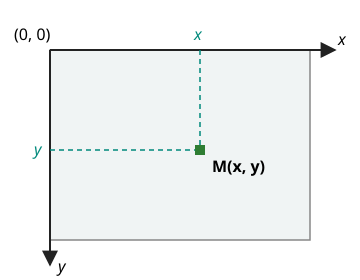

# Introduction à pyxel - Sans POO

!!! info "Setup"
    Dans le terminal, télécharge le module pyxel :

    ```bash
    uv add pyxel
    ```

Tu vas découvrir les bases de la création d'un jeu.

L'objectif est de créer un pixel capable de se dessiner et de se déplacer en fonction de son vecteur directeur (dx, dy).

!!! info "Rappel : se déplacer selon un vecteur"
    L'écran est un repère. Le pixel est un **point** de coordonnées $(x, y)$, et son vecteur directeur $\vec{u}\,(dx, dy)$ dit de combien il se déplace **à chaque frame**.

    Une frame, c'est une addition : le point $M(x, y)$ devient $M'(x + dx,\ y + dy)$.

    **Attention, le repère de l'écran n'est pas celui du cours de maths.** L'origine $(0, 0)$ est **en haut à gauche**, et $y$ augmente **vers le bas**.

    

!!! question "Calculer avant de coder"
    Le pixel est en $(15, 15)$ et son vecteur est $(2, -1)$.

    1. Où est-il après **3 frames** ? Écris le calcul, pas seulement le résultat.
    2. À l'écran, il part vers la droite et vers le haut, ou vers la droite et vers le bas ?
    3. Quel vecteur faut-il pour qu'il monte tout droit ?
    4. Le jeu tourne à 10 frames par seconde avec le vecteur $(1, 0)$. De combien de pixels avance-t-il en une seconde ?

    ??? success "Réponses"
        1. $(15 + 3 \times 2,\ 15 + 3 \times (-1)) = (21, 12)$
        2. Vers la droite et vers le **haut** : $y$ diminue.
        3. $(0, -1)$
        4. $10 \times 1 = 10$ pixels. La vitesse dépend du vecteur **et** du nombre de frames par seconde. C'est ce que montre l'exercice 2.


```python
import pyxel as px

# -- CONSTANTES
W: int = 30   # Largeur
H: int = 30   # Hauteur


# -- Etat du jeu --
x: float        # Coordonnée x du pyxel
y: float        # Coordonnée y du pyxel 
dx: float       # Déplacement en x
dy: float       # déplacement en y
color: int    # Couleur


# -- Initialisation de l'état du jeu -- 

def reinit() -> None:
    """
    Initialise un pixel vert avec une position centrale et un vecteur directeur nul.
    """
    global x, y, dx, dy, color
    x = px.width/2 
    y = px.height/2
    dx = 0
    dy = 0
    color = px.COLOR_GREEN


# -- Mise à jour régulière de l'état du jeu ---

def update() -> None:
    """
    Gère les événements utilisateur pour déplacer le pixel.
    Cette fonction est automatiquement appelée en boucle par pyxel.
    """
    global x, y, dx, dy, color

    # Déplacement du pixel selon son vecteur directeur
    x = ...
    y = ...

    # Modification du vecteur directeur selon les touches fléchées
    if px.btn(px.KEY_RIGHT):
        dx = ...
        dy = ...
    elif ...
    ...


# -- Dessin régulier de l'état du jeu à l'écran ---

def draw() -> None:
    """
    Dessine le pixel sur l'écran.
    """
    global x, y, dx, dy, color
    px.cls(px.COLOR_BLACK)          # Efface l'écran
    px.pset(int(x), int(y), color)  # Dessine le pixel


# 1. Démarrer le moteur de jeu en 10 FPS
px.init(H, W, title="Pixel en Mouvement", fps = 10)
# 2. Initialiser les variables du jeu
reinit()
# 3. Lancer le jeu
px.run(update, draw)

# Cette dernière instruction lance une boucle infinie,
# qui appelle update, puis draw, de manière régulière, à chaque Frame (ici 10 fois par seconde)
```

!!! question "Avant tout : qui appelle `update` ?"
    Tu écris `update` et `draw`, et **tu ne les appelles jamais**. Tu donnes leurs noms à `px.run`, et c'est le moteur qui les rappelle, indéfiniment, plusieurs fois par seconde. Jusqu'ici, tout ce que tu écrivais s'exécutait dans l'ordre où tu l'avais écrit. Ici, le contrôle appartient à pyxel.

    Tu n'as pas besoin d'avoir complété `update` pour la suite. Il suffit de savoir ce qu'elle fait, **dans cet ordre** : elle déplace le pixel de son vecteur, puis elle change le vecteur si une flèche est pressée.

    Déroule **trois frames à la main**, en supposant qu'on appuie sur la flèche droite pendant la deuxième et qu'on la relâche ensuite.

    | frame | ce que fait `update` | état après `update` | ce que dessine `draw` |
    |---|---|---|---|
    | 1 | | | |
    | 2 | | | |
    | 3 | | | |

    ??? note "À ouvrir une fois les trois lignes remplies"
        | frame | ce que fait `update` | état après `update` | ce que dessine `draw` |
        |---|---|---|---|
        | 1 | aucune touche | `x=15 y=15 dx=0 dy=0` | un pixel en (15, 15) |
        | 2 | flèche droite pressée : `dx` devient 1 | `x=15 y=15 dx=1 dy=0` | un pixel en (15, 15) |
        | 3 | aucune touche : `x` avance de `dx` | `x=16 y=15 dx=1 dy=0` | un pixel en (16, 15) |

        Deux questions, et elles ne sont pas rhétoriques.

        1. Combien de fois `update` a-t-elle été appelée, et **par qui** ?
        2. Pourquoi le pixel n'a-t-il **pas bougé** à la frame 2, alors qu'on appuyait sur la touche ?

        La seconde est la source d'erreur numéro un de cette activité : **changer le vecteur** et **changer la position** sont deux choses différentes, et elles ne se produisent pas à la même frame.

!!! question "Exercices de base"

    1. Complète la fonction update. Teste.
    2. Modifie le framerate. Teste.
    3. Si ça n'est pas déjà fait, modifie la fonction update pour que le pixel s'arrête lorsqu'on lâche les touches.
    4. Le pixel ne doit pas bouger s'il va dépasser de l'écran.
        - Modifie la fonction update pour tenir compte de cette information. 
    5. Espace torique: Un pixel peut maintenant dépasser un bord mais il réapparaît au bord opposé (ce qui fait de l'espace de jeu un espace sans bord)
        - Modifie la fonction update pour tenir compte de cette information. On s'intéressera à l'opérateur modulo. La modification doit être minime.


!!! question "Remplacer un pixel par un sprite"
    1. Télécharge le fichier 2.pyxres sur [le site de la nuit du code](https://depot.nuitducode.net)
        - Il s'agit d'un fichier contenant des ressources visuelles et sonores.
        - Place-le **dans le même répertoire** que ton fichier python.
        - Pyxel vient avec un éditeur de ressources. Pour visualiser les ressources du jeu, exécute la commande suivante dans un terminal:
            `pyxel edit <répertoire>/2.pyxres`
        - N'hésite pas à bidouiller, tu ne peux rien casser, au pire tu pourras retélécharger le fichier.
    2. A la place d'un simple pixel, on veut maintenant utiliser un sprite
        - Pour le faire, il faut d'abord charger ce fichier dans le code **juste avant de démarrer le jeu**:
            `px.load("<répertoire>/2.pyxres")`
        - Ensuite il faut dessiner le sprite que tu auras choisi au lieu de simplement remplir un pixel. Il n'y a qu'une ligne de code à modifier. Je te laisse la trouver en explorant la [documentation de pyxel](https://github.com/kitao/pyxel/blob/main/docs/README.fr.md).
            - remarque: Tu auras nécessairement besoin d'augmenter la hauteur et la largeur de ta fenêtre (H et W), ce qui réduira la taille des "pixels".

