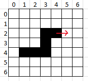

# Snake

L'objectif est de créer un jeu de snake minimaliste en exploitant la **file construite avec deux piles** dans le cours sur les files.

Les bases de la modélisation et de l'implémentation d'un jeu sont aussi abordées.

## Modélisation

Un snake est une File de Coordonnées entières.

Cette file, c'est **exactement** celle que tu viens de construire avec deux piles : le snake en est la mise à l'épreuve. Faire avancer le serpent, c'est `enfiler` une nouvelle tête puis `defiler` la queue. Pour le dessiner ou détecter une collision, on parcourt la file avec `elements`, sans la détruire.




Par exemple, dans cette grille, voici l'état du snake:

```
> (4, 2), (3, 2), (3, 3), (3, 4), (2, 4), (1, 4) >
```

La flèche rouge représente le vecteur directeur du snake. Ici, `direction = (1, 0)`. On avance de 1 en x et de 0 en y.

!!! question "Exercices d'appropriation de la modélisation"
    1. Écrire l'état du snake lorsqu'il aura avancé d'une case
        - Quelles primitives de file as-tu utilisées ?
    2. Écrire l'état du snake lorsqu'il aura avancé d'une case avec une pomme en (5,2)
        - Quelles primitives de file as-tu utilisées ?
    3. Lorsque le snake `avance`, donne la ou les conditions pour que le jeu soit terminé (`gameover = True`)
    4. Écrire les différentes valeurs du vecteur directeur selon qu'on avance en haut, à gauche, en bas, ou à droite.

Voici le code de départ du snake


```python
from structures.lineaires import file
import random
import pyxel     # uv add pyxel

type Coord = tuple[int, int]   # Une coordonnée est un tuple constitué de deux ints
type Snake = file.File[Coord]  # Un snake est une file de coordonnées

# --- Constantes ---
W, H = 20, 20       # Largeur et Hauteur de la grille
STEP_FRAMES = 4     # Vitesse (Mise à jour toutes les 4 frames)


# --- État global --- Déclaration de toutes les variables --- 
serpent: Snake                  # File de coordonnées
tete: Coord                     # Tete du serpent
queue_supprimee: Coord | None   # Dernière queue du serpent supprimée
direction: Coord                # vecteur de déplacement du serpent
pomme: Coord                    # coordonnée de la pomme
score: int                      # score de l'utilisateur
game_over: bool                 # indicateur de game over
frames: int                     # compteur de frames (augmente de 1 dès que update est appelé)

# --- Initialisation ---
def reinit() -> None:
    """
    Initialisation de TOUTES les variables globales
    """
    global serpent, tete, direction, score, game_over, frames, queue_supprimee
    serpent = ...
    tete = ...
    ...........  # Initialiser le serpent avec sa tete
    direction = ......   # droite
    score = ......
    game_over = ......
    frames = 0    # Ne t'occupe pas de ça pour le moment
    queue_supprimee = ....
    # Il faut aussi spawner une pomme
    # on le fera grâce à une fonction spécifique qu'il faudra appeler ici
```


!!! question "Deux fonctions outils, testables sans lancer le jeu"
    Ces deux fonctions ne dessinent rien et ne touchent à aucune variable globale : elles se testent donc **immédiatement**, avec `python -m doctest`, sans ouvrir de fenêtre. Écris-les en premier.

    ```python
    def prochaine_tete(tete: Coord, direction: Coord) -> Coord:
        """
        Coordonnée de la case suivante, sans toucher au serpent.

        >>> prochaine_tete((4, 2), (1, 0))
        (5, 2)
        >>> prochaine_tete((4, 2), (0, -1))
        (4, 1)
        >>> prochaine_tete((0, 5), (-1, 0))
        (-1, 5)
        """

    def case_libre(occupees: list[Coord]) -> Coord:
        """
        Une case de la grille au hasard, parmi celles qui ne sont pas occupées.

        >>> toutes = [(x, y) for x in range(W) for y in range(H)]
        >>> case_libre([c for c in toutes if c != (7, 3)])
        (7, 3)
        """
    ```

    Le second doctest mérite un mot : en n'offrant qu'**une seule** case libre, il rend déterministe une fonction qui tire au hasard. C'est une manière courante de tester l'aléatoire.

!!! question "Initialisation"
    - Compléter la fonction `reinit`.
    - Créer la fonction `spawn_pomme()`, qui appelle `case_libre` et modifie les coordonnées de la pomme.

!!! question "Avancer, le point dur du projet"
    Cette fonction porte à elle seule la difficulté du snake. Prends-la séparément, et **après** avoir répondu aux exercices d'appropriation ci-dessus.

    ```python
    def avancer() -> None:
        """
        Fait avancer le serpent d'une case dans la direction courante.

        Enfile la nouvelle tête. Défile la queue, SAUF si le serpent vient de
        manger la pomme, auquel cas il grandit d'une case.
        """
    ```

    Les deux cas de la docstring correspondent exactement aux exercices 1 et 2 d'appropriation : tu as déjà écrit sur papier ce que la fonction doit produire.

    ??? tip "Indice léger"
        Vos exercices sur papier disent quelles primitives utiliser, et dans quel ordre. Reste une question : qu'est-ce qui change entre le cas ordinaire et le cas de la pomme ?

    ??? tip "Indice plus précis"
        Une seule opération diffère entre les deux cas : le `defiler`. Avancer sans manger, c'est enfiler **et** défiler, donc une longueur constante. Manger, c'est enfiler **sans** défiler, donc une longueur qui augmente de un. `queue_supprimee` sert à mémoriser ce qui a été défilé, pour le dessin.

    ??? question "Avant d'ouvrir la solution"
        En une phrase, sur ton cahier : qu'est-ce que l'indice t'a appris sur ce qui n'allait pas dans **ton** code ?

    ??? success "Solution"
        ```python
        def avancer() -> None:
            global serpent, tete, pomme, score, queue_supprimee
            tete = prochaine_tete(tete, direction)
            file.enfiler(tete, serpent)
            if tete == pomme:
                score = score + 1
                queue_supprimee = None
                spawn_pomme()
            else:
                queue_supprimee = file.defiler(serpent)
        ```

        Remarque que `avancer` ne dessine rien et ne teste aucune collision : elle ne fait qu'avancer. C'est ce qui la rend lisible, et c'est aussi ce qui rendrait `prochaine_tete` testable si on l'avait écrite ainsi dès le début.

Comme beaucoup de moteurs de jeu, pyxel va appeler automatiquement à chaque frame 2 fonctions à la suite:

1. une fonction `update()`, chargée de:
    - Récupérer l'interaction utilisateur.
    - Mettre à jour l'état du jeu en conséquence.
2. PUIS une fonction `draw()`, chargée de dessiner l'état du jeu.

Voici comment se lancera notre jeu (**fin du fichier**):

```python

# -- Mise à jour régulière de l'état --
def update() -> None:
    """
    Appelée automatiquement par pyxel.
    si on appuie sur <R>, on réinitialise
    Si on appuie sur <Q, Z, S, D>, on met à jour la direction
    On avance
    """
    ...

# -- Dessin régulier après mise à jour --
def draw() -> None:
    """
    Appelée automatiquement par pyxel.
    Dessine le snake à l'écran.
    La seule fonction pyxel nécessaire est pset
    """
    ...


# -- Lancement --

def lancer_jeu() -> None:
    # Initialiser pyxel, le moteur graphique
    pyxel.init(W, H, title="Snake")
    # Initialisaer l'état du jeu
    reinit()
    # lancer la boucle d'appels permanents à update puis draw
    pyxel.run(update, draw)  


lancer_jeu()
```

!!! question "Amélioration"
    Pour l'instant on ne peut pas écrire sur l'écran, les pyxels sont trop gros.

    - Modifier la fonction draw en considérant que chaque coordonnée du snake correspond en réalité à un carré de 10x10 pixels
        - `W, H = 200, 200`
        - `TAILLE_CASE = 10`
    - Modifier la fonction draw afin qu'un bandeau reste libre en haut afin d'afficher le score.

!!! question "Bonus : faire passer `draw` en temps constant"
    Dans la version de base, `draw` parcourt toute la file à chaque image pour redessiner le serpent entier. C'est correct, et c'est ce qu'il faut écrire en premier : on n'optimise pas un dessin avant que le jeu marche.

    Mais remarque ce qui change vraiment d'une image à l'autre : **une case s'allume**, la nouvelle tête, et **une case s'éteint**, la queue qui vient d'être défilée. Deux cases. Le reste de l'écran est déjà correct.

    D'où l'idée : **ne pas effacer l'écran**, et ne redessiner que ces deux cases.

    - la queue retirée, en **couleur de fond** ;
    - la nouvelle tête, en **couleur du serpent**.

    C'est très exactement pour cela que `queue_supprimee` existe dans le squelette : `avancer` y mémorise ce qu'elle a défilé, pour que `draw` sache quoi effacer.

    ??? tip "Indice 1 : par où commencer"
        Cherche l'appel qui efface l'écran à chaque image et supprime-le de `draw`. Il faudra alors effacer **une seule fois**, au moment de `reinit`, sinon la partie commence sur les restes de la précédente.

    ??? tip "Indice 2 : le cas où rien n'est effacé"
        Quand le serpent mange, `avancer` enfile **sans** défiler : il n'y a pas de queue retirée, et `queue_supprimee` vaut `None`. Ton `draw` doit traiter ce cas, sinon il effacera n'importe quoi.

    ??? tip "Indice 3 : ce qu'on oublie presque toujours"
        La pomme. Elle n'est plus redessinée à chaque image, donc il faut l'allumer **au moment où elle apparaît**, et pas ailleurs.

    ??? note "En une phrase, sur ton cahier"
        Avant d'ouvrir la correction : combien d'opérations fait ton nouveau `draw`, et de quoi ce nombre dépend-il ? C'est cette phrase qui compte, pas le code.

    ??? success "Correction"
        ```python
        def draw() -> None:
            """Ne redessine que ce qui a changé : la queue retirée, puis la nouvelle tête."""
            if queue_supprimee is not None:
                pyxel.pset(queue_supprimee[0], queue_supprimee[1], COULEUR_FOND)
            pyxel.pset(tete[0], tete[1], COULEUR_SERPENT)
        ```

        Deux `pset`, quelle que soit la longueur du serpent : `draw` est en **`O(1)`**, alors qu'il était en `O(n)`.

    ??? warning "Ce que ce bonus t'apprend, et qui dépasse le dessin"
        Ta file est faite de deux piles, et son `defiler` est annoncé en `O(1)` **amorti** : chaque élément ne bascule qu'une fois de `entree` vers `sortie` au cours de sa vie.

        Or `elements` **vide** la file puis la **reconstruit**. Tout se retrouve dans `entree`, et le `defiler` suivant doit **tout rebasculer**. En appelant `elements` à chaque image, la version de base remettait donc l'amortissement à zéro à chaque image, et annulait l'avantage des deux piles.

        Comptage des opérations élémentaires **sur la file** (empiler, dépiler, décalages) sur cent images, avec un serpent de 400 cases. Les deux `pset` du bonus n'y figurent pas : ils ne touchent pas la file, et ils sont deux quoi qu'il arrive.

        | | file à tableau | file à deux piles |
        |---|---|---|
        | version de base (`elements` à chaque image) | 80 600 | 240 700, soit **3 fois plus** |
        | avec ce bonus (plus d'`elements` dans `draw`) | 40 600 | 1 001, soit **40 fois moins** |

        **Sois honnête sur ce que tu verras : rien.** Sur une grille de 20 par 20, à sept mises à jour par seconde, les deux versions sont aussi fluides l'une que l'autre, et aucun œil ne les départage. Le gain ne se voit pas, il **se compte**.

        C'est le vrai enseignement de ce bonus : **l'avantage d'une structure de données dépend de la façon dont on s'en sert.** Une complexité ne s'énonce jamais dans l'absolu, toujours pour un motif d'usage donné. Retiens ça, c'est ce qui distingue quelqu'un qui connaît le nom des structures de quelqu'un qui sait en choisir une.

