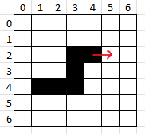

# Snake

L'objectif est de créer un jeu de snake minimaliste en exploitant la structure de file.

Les bases de la modélisation et de l'implémentation d'un jeu sont aussi abordées.

## Modélisation

Un snake est une File de Coordonnées entières.




Par exemple, dans cette grille, voici l'état du snake:

```
> (4, 2), (3, 2), (3, 3), (3, 4), (2, 4), (1, 4) >
```

La flèche rouge représente le vecteur directeur du snake. Ici, `direction = (1, 0)`. On avance de 1 en x et de 0 en y.

!!! question "Exercices d'appropriation de la modélisation"
    1. Ecrire l'état du snake lorsqu'il aura avancé d'une case
        - Quelles primitives de file avez vous utilisé?
    2. Ecrire l'état du snake lorsqu'il aura avancé d'une case avec une pomme en (5,2)
        - Quelles primitives de file avez-vous utilisé?
    3. Lorsque le snake `avance`, donnez la ou les conditions pour que le jeu soit terminé (`gameover = True`)
    3. Ecrire les différentes valeurs du vecteur directeur selon qu'on avance en haut, à gauche, en bas, ou à droite.

Voici le code de départ du snake


```python
from structures.lineaires import file
import random
import pyxel     # uv add pyxel

type Coord = tuple[int, int]   # Une coordonnée est un tuple constitué de deux ints
type Snake = file.File[Coord]  # Un snake est une file de coordonnées

# --- Constantes ---
W, H = 20, 20       # Largeur et Hauteur de la grille
STEP_FRAMES = 4     # Vitesse (Mise à jour toutes les 4 frames)


# --- État global --- Déclaration de toutes les variables --- 
serpent: Snake                  # File de coordonnées
tete: Coord                     # Tete du serpent
queue_supprimee: Coord | None   # Dernière queue du serpent supprimée
direction: Coord                # vecteur de déplacement du serpent
pomme: Coord                    # coordonnée de la pomme
score: int                      # score de l'utilisateur
game_over: bool                 # indicateur de game over
frames: int                     # compteur de frames (augmente de 1 dès que update est appelé)

# --- Initialisation ---
def reinit():
    """
    Initialisation de TOUTES les variables globales
    """
    global serpent, tete, direction, score, game_over, frames, queue_supprimee
    serpent = ...
    tete = ...
    ...........  # Initialiser le serpent avec sa tete
    direction = ......   # droite
    score = ......
    game_over = ......
    frames = 0    # Ne vous souciez pas de ça pour le moment
    queue_supprimee = ....
    # Il faut aussi spawner une pomme
    # on le fera grâce à une fonction spécifique qu'il faudra appeler ici
```


!!! question "Initialisation"
    - Compléter la fonction reinit.
    - Créer la fonction `avancer()` qui permet d'avancer d'une case.
    - Créer la fonction `spawn_pomme()` qui permet de modifier les coordonnées de la pomme.

Comme beaucoup de moteurs de jeu, pyxel va appeler automatiquement à chaque frame 2 fonctions à la suite:

1. une fonction `update()`, chargée de:
    - Récupérer l'interaction utilisateur.
    - Mettre à jour l'état du jeu en conséquence.
2. PUIS une fonction `draw()`, chargée de dessiner l'état du jeu.

Voici comment se lancera notre jeu (**fin du fichier**):

```python

# -- Mise à jour régulière de l'état --
def update():
    """
    Appelée automatiquement par pyxel.
    si on appuie sur <R>, on réinitialise
    Si on appuie sur <Q, Z, S, D>, on met à jour la direction
    On avance
    """
    ...

# -- Dessin régulier après mise à jour --
def draw():
    """
    Appelée automatiquement par pyxel.
    Dessine le snake à l'écran.
    La seule fonction pyxel nécessaire est pset
    """


# -- Lancement --

def lancer_jeu():
    # Initialiser pyxel, le moteur graphique
    pyxel.init(W, H, title="Snake")
    # Initialisaer l'état du jeu
    reinit()
    # lancer la boucle d'appels permanents à update puis draw
    pyxel.run(update, draw)  


lancer_jeu()
```

!!! question "Amélioration"
    Pour l'instant on ne peut pas écrire sur l'écran, les pyxels sont trop gros.

    - Modifier la fonction draw en considérant que chaque coordonnée du snake correspond en réalité à un carré de 10x10 pixels
        - `W, H = 200, 200`
        - `TAILLE_CASE = 10`
    - Modifier la fonction draw afin qu'un bandeau reste libre en haut afin d'afficher le score.

