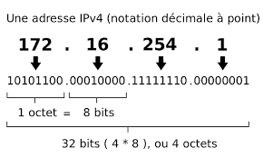

# Adressage IP

!!! abstract "Adresses IP"
    Une adresse IP est constituée de 4 octets, donc de 32 bits et est accompagnée d'un masque qui découpe cette adresse en 2 parties, la **partie réseau** et la **partie hôte** ou "interface". 

    

    **TOUTES LES IP D'UN RESEAU ont la même partie réseau et le même masque**

    
    il existe 2 manières _équivalentes_ de considérer ce masque.
    
    - Soit considère que ce masque est un entier. C'est le nombre de bits à gauche qui déterminent l'adresse réseau.
    
    Prenons l'adresse IP 192.168.1.12 avec le masque 24.
    
    Ceci signifie que la partie réseau est constituée des 24 bits de gauche, soit des 3 premiers octets dont la représentation en base 10 est 192.168.1


    - Soit le masque a une forme "Adresse IP". Pour le masque n, c'est n fois 1 suivis de 0. Donc pour un masque 24, c'est:
    11111111.11111111.11111111.0000000
    Soit 255.255.255.0
    Pour un masque 20, c'est 11111111.11111111.11110000.00000000 , soit 255.255.240.0. 

    **2 adresses ne sont pas affectables sur un réseau**:

    - **L'adresse de broadcast**. Elle sert à envoyer un message à toutes les machines du réseau. Elle est composée de la partie hôte et d'une partie interface uniquement composée de 1. Ainsi, pour notre exemple, il s'agit de 198.168.1.255

    - **L'adresse du réseau**. Elle ne représente aucune machine. La partie interface n'est composée que de 0. ainsi, pour notre exemple, il s'agit de 192.168.1.0

    !!! question question + cours
        Voici l'IP d'interfaces de machines de 2 réseaux :
        - 192.168.23.34/24
        - 192.168.154.16/20

        Pour chacune de ces machines, calculer:
        - L'adresse du réseau correspondant
        - L'adresse de broadcast
        - Le nombre d'interfaces de machines qu'on peut connecter au maximum sur ce réseau
        - L'IP minimum attribuable
        - L'IP maximum attribuable

        Vous pouvez vérifier vos résultats dans MSYS2 grâce au script perl ipcalc.pl

        1. Téléchargez le script dans MSYS2. 
        `wget https://gist.githubusercontent.com/mathewpeterson/2303195/raw/ipcalc.pl`
        2. Rendez ce fichier exécutable
        3. Vérifiez une IP ainsi: `./ipcalc.pl 192.168.23.23/24`
        
        Vous pouvez vous entraîner avec des IP/masques que vous inventez grâce à ce script.

## Analyse de la sortie d'ipcalc

En bleu, vous voyez les adresse IP au faormat décimal pointé, et juste à côté en format machine, en binaire pointé.


```bash
./ipcalc.pl 192.168.23.34/24
```

<pre>
<!-- Version 0.34 6/19/2001 -->

Address:   <font color="#0000ff">192.168.23.34         <font color="#000000"><font color="#909090">11000000.10101000.00010111 .00100010<font color="#000000"><br>Netmask:   <font color="#0000ff">255.255.255.0 == 24   <font color="#000000"><font color="#ff0000">11111111.11111111.11111111 .00000000<font color="#000000"><br>Wildcard:  <font color="#0000ff">0.0.0.255             <font color="#000000"><font color="#909090">00000000.00000000.00000000 .11111111<font color="#000000"><br>=>
Network:   <font color="#0000ff">192.168.23.0/24       <font color="#000000"><font color="#009900">110<font color="#909090">00000.10101000.00010111 .00000000<font color="#000000"> (<font color="#009900">Class C<font color="#000000">)<br>Broadcast: <font color="#0000ff">192.168.23.255        <font color="#000000"><font color="#909090">11000000.10101000.00010111 .11111111<font color="#000000"><br>HostMin:   <font color="#0000ff">192.168.23.1          <font color="#000000"><font color="#909090">11000000.10101000.00010111 .00000001<font color="#000000"><br>HostMax:   <font color="#0000ff">192.168.23.254        <font color="#000000"><font color="#909090">11000000.10101000.00010111 .11111110<font color="#000000"><br>Hosts/Net: <font color="#0000ff">254                   <font color="#000000">(<a href="http://www.ietf.org/rfc/rfc1918.txt">Private Internet</a>)
</pre>

On remarque que (bitwise):

$Wildcard = ! Netmask$ 

Wildcard est le complément à 1 du masque

$Network = Address \text{ \& } Netmask$ 

L'adresse réseau est le ET logique entre l'adresse IP et le masque.

$Broadcast = Network \text{ | } WildCard$

L'adresse de diffusion est le OU logique entre l'adresse réseau et le wilcard.

$HostMin=Network+1$

L'adresse la plus petite d'une interface ne peut pas être celle du réseau. c'est la suivante.

$HostMax=Broadcast-1$

L'adresse la plus grande d'une interface ne peut pas être celle du broadcast, c'est celle qui précède.

On peut avoir 254 adresses IP correspondant à des interfaces sur ce réseau, car il y a 8 bits de libres sur la partie hôte. Sur 8 bits, on peut écrire $2^8=256$ nombres, mais il faut enlever 0 et 255 qui ne sont pas attribuables. On peut donc attribuer $256-2=254$ adresses IP.


!!! question "Réseau"

    On considère le réseau suivant. Chaque interface d'un routeur inerve un réseau spécifique.

    


    Les adresses indiquées sont les adresses réseau indiquées au format CIDR (IP + masque entier).

    - Donnez une adresse valide à chaque portable ainsi qu'à chaque interface réseau des routeurs.
    - Combien de machines peut-on connecter au réseau déservi par l'interface eth0 du routeur A?