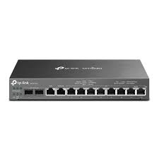
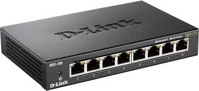

# Réseaux

## Adressage IP

!!! abstract "Adresses IP"
    Une adresse IP est constituée de 4 octets, donc de 32 bits et est accompagnée d'un masque qui découpe cette adresse en 2 parties, la **partie réseau** et la **partie hôte** ou "interface". **Une adresse IP est unique dans un réseau**.

    

    **TOUTES LES IP D'UN RESEAU ont la même partie réseau et le même masque**

    
    il existe 2 manières _équivalentes_ de considérer ce masque.
    
    - Soit considère que ce masque est un entier. C'est le nombre de bits à gauche qui déterminent l'adresse réseau. On appelle ça la notation CIDR
    
    Prenons l'adresse IP 192.168.1.12 avec le masque 24.
    
    Ceci signifie que la partie réseau est constituée des 24 bits de gauche, soit des 3 premiers octets dont la représentation en base 10 est 192.168.1


    - Soit le masque a une forme "Adresse IP". Pour le masque n, c'est n fois 1 suivis de 0. Donc pour un masque 24, c'est:
    11111111.11111111.11111111.0000000
    Soit 255.255.255.0
    Pour un masque 20, c'est 11111111.11111111.11110000.00000000 , soit 255.255.240.0. 

    **2 adresses ne sont pas affectables sur un réseau**:

    - **L'adresse de broadcast**. Elle sert à envoyer un message à toutes les machines du réseau. Elle est composée de la partie hôte et d'une partie interface uniquement composée de 1. Ainsi, pour notre exemple, il s'agit de 198.168.1.255

    - **L'adresse du réseau**. Elle ne représente aucune machine. La partie interface n'est composée que de 0. ainsi, pour notre exemple, il s'agit de 192.168.1.0


## Outil IPCALC
    
Vous pouvez analyser des adresses IP dans MSYS2 grâce au script perl `ipcalc.pl`

1. Téléchargez le script dans MSYS2. 
`wget https://gist.githubusercontent.com/mathewpeterson/2303195/raw/ipcalc.pl`
2. Rendez ce fichier exécutable
3. Vérifiez une IP ainsi: `./ipcalc.pl 192.168.23.23/24`

Vous pouvez vous entraîner avec des IP/masques que vous inventez grâce à ce script.


## Analyse de la sortie d'ipcalc

En bleu, vous voyez les adresse IP au faormat décimal pointé, et juste à côté en format machine, en binaire pointé.


```bash
./ipcalc.pl 192.168.23.34/24
```

<pre>
<!-- Version 0.34 6/19/2001 -->

Address:   <font color="#0000ff">192.168.23.34         <font color="#000000"><font color="#909090">11000000.10101000.00010111 .00100010<font color="#000000"><br>Netmask:   <font color="#0000ff">255.255.255.0 == 24   <font color="#000000"><font color="#ff0000">11111111.11111111.11111111 .00000000<font color="#000000"><br>Wildcard:  <font color="#0000ff">0.0.0.255             <font color="#000000"><font color="#909090">00000000.00000000.00000000 .11111111<font color="#000000"><br>
Network:   <font color="#0000ff">192.168.23.0/24       <font color="#000000"><font color="#009900">110<font color="#909090">00000.10101000.00010111 .00000000<font color="#000000"> (<font color="#009900">Class C<font color="#000000">)<br>Broadcast: <font color="#0000ff">192.168.23.255        <font color="#000000"><font color="#909090">11000000.10101000.00010111 .11111111<font color="#000000"><br>HostMin:   <font color="#0000ff">192.168.23.1          <font color="#000000"><font color="#909090">11000000.10101000.00010111 .00000001<font color="#000000"><br>HostMax:   <font color="#0000ff">192.168.23.254        <font color="#000000"><font color="#909090">11000000.10101000.00010111 .11111110<font color="#000000"><br>Hosts/Net: <font color="#0000ff">254                   <font color="#000000">(<a href="http://www.ietf.org/rfc/rfc1918.txt">Private Internet</a>)
</pre>

On remarque que (bitwise):

$Wildcard = ! Netmask$

Wildcard est le complément à 1 du masque

$Network = Address \text{ \& } Netmask$ 

L'adresse réseau est le ET logique entre l'adresse IP et le masque.

$Broadcast = Network \text{ | } WildCard$

L'adresse de diffusion est le OU logique entre l'adresse réseau et le wilcard.

$HostMin=Network+1$

L'adresse la plus petite d'une interface ne peut pas être celle du réseau. c'est la suivante.

$HostMax=Broadcast-1$

L'adresse la plus grande d'une interface ne peut pas être celle du broadcast, c'est celle qui précède.

On peut avoir 254 adresses IP correspondant à des interfaces sur ce réseau, car il y a 8 bits de libres sur la partie hôte. Sur 8 bits, on peut écrire $2^8=256$ nombres, mais il faut enlever 0 et 255 qui ne sont pas attribuables. On peut donc attribuer $256-2=254$ adresses IP.

## Analyse de l'adresse IP 192.168.154.16  masque 20

#### Conversion en bits:

Par divisions par 2 successives, $\overline{192}^{10}=\overline{11000000}^{2}$

En faisant pareil pour les autres, l'adresse IP est

$$11000000.10101000.10011010.00010000$$

#### Le masque est 
$11111111.11111111.11110000.00000000$ soit 255.255.240.0

#### L'adresse réseau est constituée des 20 premiers bits de l'adresse IP, suivis de 0
$11000000.10101000.10010000.00000000$ soit 192.168.144.0

#### L'adresse de broadcast est constituée des 20 premiers bits de l'adresse IP, suivis de 1

$11000000.10101000.10011111.11111111$ soit 192.168.159.255

#### L'IP la plus petite qu'on peut attribuer est l'adresse réseau plus 1
$11000000.10101000.10010000.00000001$ soit 192.168.144.1

#### L'IP la plus grande qu'on peut attribuer est l'adresse broadcast moins 1 
$11000000.10101000.10011111.11111110$ soit 192.168.159.254

#### Nombre d'interfaces possibles sur le réseau
(par abus de langage, nombre de machines)
Un masque 20 laisse 12 bits de libres pour constituer les ip du réseau. On aura donc $2^{12}$ ip possibles.
Cependant, on ne peut attribuer ni l'IP de broadcast, ni l'IP du réseau. Ce qui nous laisse avec $2^{12}-2=4094$ IP attribuables sur le réseau 192.168.144.0/24

!!! question "Exercice"
    Analysez ces 2 IP :

    - 192.168.1.16/24
    - 192.168.154.16/20

    Pour chacune de ces machines, calculer:

    - L'adresse du réseau correspondant
    - L'adresse de broadcast
    - Le nombre d'interfaces de machines qu'on peut connecter au maximum sur ce réseau
    - L'IP minimum attribuable
    - L'IP maximum attribuable


!!! abstract "Routeur"

    Un routeur est un ordinateur spécialisé. Son rôle est de **relier plusieurs réseaux distincts** et d'acheminer les paquets entre eux.

    Une interface est ce qui connecte physiquement une machine à un réseau (dites vous que c'est une prise ethernet). Par définition, il est donc nécessaire d’avoir au minimum deux interfaces réseau dans un routeur. Sinon il n'a pas de réseaux à relier.

    Il lit l’adresse de destination dans l’en‑tête IP transmise dans une requête, consulte sa table de routage puis transmet le paquet par l’interface qui mène vers sa prochaine destination.

    Un routeur possède plusieurs interfaces qui correspondent à autant de réseaux qu'il relie.

    Ci-dessous, on voit un routeur avec 10 interfaces ethernet. Chacune de ces interfaces a une adresse IP différente dans le réseau qu'elle inerve.
    Par exemple, si le réseeu de la dernière prise est 192.168.0.0/16, on pourra donner à cette interface l'adresse 192.168.0.253 (on prend souvent 253 pour pouvoir numéroter les PC à partir de 1)

    

    Une machine doit connaître l'adresse de l'interface du routeur lui correspondant. En effet, elle doit passer par le routeur pour émettre des requêtes à l'extérieur du réseau. On appelle cette adresse IP la passerelle par défaut. C'est l'IP de l'interface du routeur que voit la machine.


!!! abstract "Switch (commutateur Ethernet)"
    C'est une machine dont le rôle est de connecter plusieurs équipements **au sein d’un même réseau local** et de faire transiter les trames entre eux.

    

    Ici, on voit un switch capable de relier 8 équipements. Les interfaces ne possèdent pas d'adresse IP.

    TODO: table adresses MAC

!!! question "Exercice"

    On considère le réseau suivant. Chaque interface d'un routeur inerve un réseau spécifique.

    


    Les adresses indiquées sont les adresses réseau indiquées au format CIDR (IP + masque entier).

    - Donnez une adresse valide à chaque portable ainsi qu'à chaque interface réseau des routeurs.
    - Indiquez la passerelle par défaut de chacun des ordinateurs
    - Combien de machines peut-on connecter au réseau déservi par l'interface eth0 du routeur A?

!!! question "Exo Bac"
    

    1. Les machines du réseau local L1 indiquent un masque de sous réseau sur 24
    bits en notation CIDR, soit 255.255.255.0 en notation décimale pointée.
    Donner le masque de sous réseau en notation décimale pointée des machines
    du réseau L2 (masque de sous réseau de 16 bits).
    2. Donner l’adresse du réseau L2.
    3. Donner l’adresse de diffusion du réseau L2.
    4. Donner le nombre maximum de machines pouvant être connectées au réseau L2.

!!! question "Réseau d'un lycée (Bac)"
    Dans un lycée, le réseau contient plusieurs sous-réseaux : pédagogie (noté P),
    administration (noté AD), vie_scolaire (noté VS).

    1. L’adresse IP du réseau pédagogie est 110.217.50.0 et on utilise le masque de
    sous-réseau 255.255.255.0 (i.e. les trois premiers octets sont réservés au
    réseau).
    Déterminer le nombre de machines que l’on peut brancher au maximum sur le
    réseau pédagogie (remarque : l’adresse IP 110.217.50.255 est réservée : c’est
    l’adresse de diffusion).
    2. Déterminer l’écriture binaire du nombre 217.
    3. Déterminer l’écriture décimale du nombre binaire 110010.
    On scinde finalement le réseau pédagogie en deux sous-réseaux pédagogie 1 (noté
    P1) et pédagogie 2 (noté P2) et on utilise le masque de sous-réseau 255.255.255.0
    pour les deux.
    Les adresses IP de ces deux sous-réseaux sont :
        - 110.217.50.0 pour le réseau pédagogie 1
        - 110.217.52.0 pour le réseau pédagogie 2
    4. Indiquer, en justifiant, si une machine ayant l’adresse IP 110.217.53.22 fait
    partie du réseau pédagogie 2 ou non.